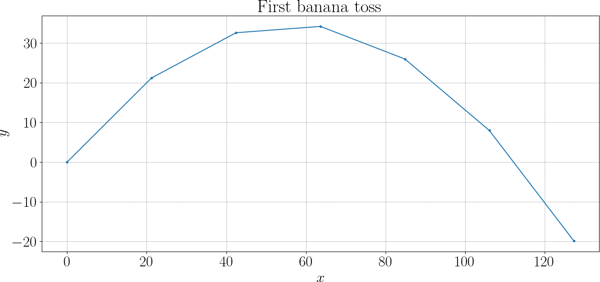
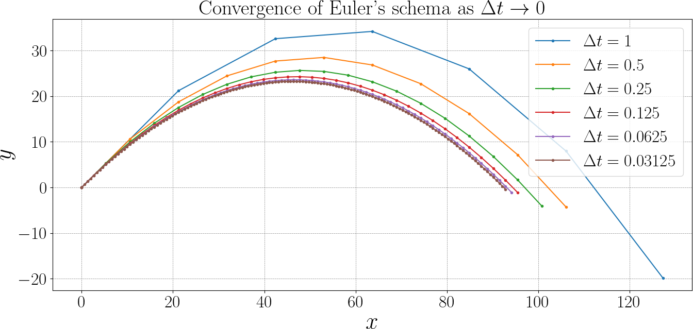
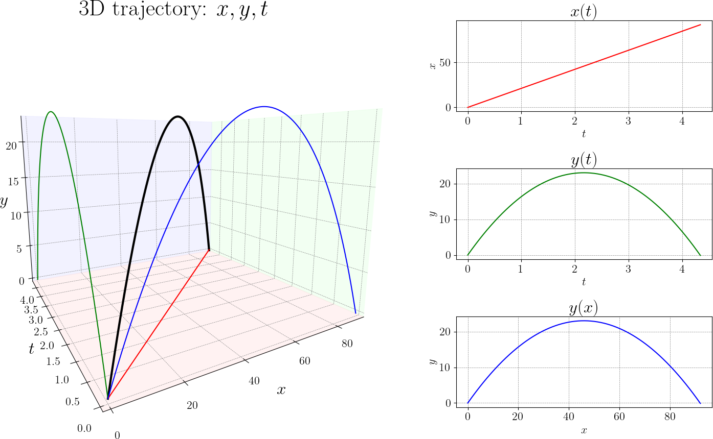

# Euler method

Let us consider a very simple 1D problem: starting from the origin $x = 0$, we are heading to the right with some speed $v$.
A very natural first question is: where will I be after one second?
If the velocity were constant, the answer would be simple: position is just “speed times time.”

Let us apply the reasoning to our gorillas.
Place the gorilla at the origin $(0,0)$, and imagine that it tosses a banana with some known initial speed and direction.
In two dimensions, this motion naturally splits into two independent directions.
The horizontal motion only depends on the horizontal component of the velocity, while the vertical motion depends on the vertical component.
This separation is important: gravity affects only the vertical direction, leaving the horizontal motion unchanged.

With this in mind, we can describe the motion step by step.
Over the first second, the projectile moves according to its initial velocity.
Then gravity slightly reduces the vertical velocity.
Over the next second, the projectile again moves using this updated velocity, and so on.
By repeating this simple reasoning we build the entire trajectory as a sequence of points in time.

```py
import numpy as np

g     = -9.81 # gravity, m/s^2
speed = 30    # initial speed (m/s)
angle = 45    # launch angle in degrees

x, y = 0, 0   # current state
vx, vy = speed * np.cos(angle * np.pi/180), \
         speed * np.sin(angle * np.pi/180)

dt = 1
while y >= 0:
    x += dt * vx
    y += dt * vy
    vy += g * dt

```




Although this description is approximate, refining the time step will gradually reveal the smooth parabolic path familiar from physics.




We have a projectile starting at $(x_0, y_0) = (0,0)$, with initial velocity $(v_{x,0}, v_{y,0})$, under constant gravity $g$ acting downward. No air resistance.

The ODEs are:

$$
\frac{dx}{dt} = v_x, \quad \frac{dy}{dt} = v_y, \quad \frac{dv_x}{dt} = 0, \quad \frac{dv_y}{dt} = g
$$

---

### 2. Euler integration scheme

With a time step $\Delta t$, the Euler update rules are:

$$
\begin{align*}
x_{i+1} & = x_i + v_{x,i}~\Delta t\\
y_{i+1} & = y_i + v_{y,i}~\Delta t\\
v_{x,i+1} & = v_{x,i} \\
v_{y,i+1} & = v_{y,i} + g~\Delta t
\end{align*}
$$

---


Let’s write the explicit formula for $x_i$ and $y_i$.

Let $t := i \Delta t$. Then

$$
\begin{align*}
x(t) &= \sum_{k=0}^{i-1} v_{x,k}~\Delta t = v_{x,0} \sum_{k=0}^{i-1} \Delta t = v_{x,0}~i ~\Delta t = v_{x,0}~t\\
y(t) & = \sum_{k=0}^{i-1} v_{y,k}~\Delta t= \sum_{k=0}^{i-1} (v_{y,0} + k~g~\Delta t)~\Delta t = \\
&= \left(v_{y,0}\sum_{k=0}^{i-1}1  + g \Delta t \sum_{k=0}^{i-1} k \right)\Delta t =\\
&= v_{y,0} i \Delta t + g (\Delta t)^2 \frac{(i-1)~i}{2} = \\
& = v_{y,0} t + g (\Delta t)^2 \frac{(t/\Delta t)(t/\Delta t - 1)}{2} =\\
& = v_{y,0} t + g\frac{t (t - \Delta t)}{2}
\end{align*}
$$

As $\Delta t \to 0$:

$$
y(t) \to  v_{y,0}~t + g \frac{t^2}{2} 
$$



