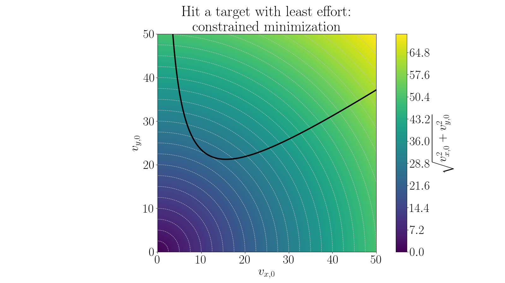

# The Lazy Ape

Until now, the problem has always been framed in terms of performance: how far the banana goes, how accurately it lands, how well it matches observations.
In this chapter, the objective changes.
The banana must pass through a specific target point $(x^*,y^*)$.  This requirement is non-negotiable.

A throw is fully characterized by two numbers $v_{x,0}$ and $v_{y,0}$.
Among all throws that satisfy the constraint, the ape wants the least effort possible.

Effort is measured by the magnitude of the initial velocity:

$$
E(v_{x,0},v_{y,0}) := \sqrt{v_{x,0}^2 + v_{y,0}^2}
$$

This is no longer a “throw farther” problem.  It is a problem of doing just enough.

Without any constraints, every $(v_{x,0},v_{y,0})$  pair defines a trajectory.
The requirement that the banana must pass through the point $(x^*,y^*)$ drastically reduces this freedom.
If we scan many throws and mark those that succeed, a geometric structure appears.
The set of admissible initial velocities forms a curve in the $(v_{x,0},v_{y,0})$ plane.
Each point on this curve corresponds to:

* a different trajectory,
* a different flight time,
* a different distribution of horizontal and vertical effort.

But all satisfy the same physical requirement: passing through the target.
This visualization is crucial: it turns an abstract constraint into something concrete.

Here the black line shows all the trajectories that pass through the point $(x^*, y^*)$.
The color plot shows the effort for each throw. It is just a radial plot showing the distance to the origin.
Therefore, the least effort throw satisfying the constraint is the point on the black curve closest to the origin.

## Reduction to 1D

Directly searching in two dimensions would be expensive and unnecessary.
The key observation is that the constraint couples $v_{x,0}$ and $v_{y,0}$.
If $v_{x,0}$ is fixed, the trajectory’s horizontal motion is determined.
Only the vertical motion remains adjustable.

This allows the problem to be decomposed:

* Choose a value of $v_{x,0}$
* Find the value of $v_{y,0}$ that makes the banana pass through $(x^*,y^*)$.

This second step is no longer an optimization problem, it is a root-finding problem.

## Ground truth

First we can eliminate the impact time using kinematics.

$$
x^* = v_x t \quad\Rightarrow\quad t = \frac{x^*}{v_x}
$$

Insert this immediately into vertical motion:

$$
y^* = v_y t - \tfrac12 g t^2
= v_y \frac{x^*}{v_x} - \frac{g}{2} \left(\frac{x^*}{v_x}\right)^2.
$$

Solve **explicitly for (v_y)**:

$$
\boxed{ v_y(v_x)
=
\frac{y^*}{x^*} v_x
+
\frac{g x^*}{2 v_x}
}
$$

Reduce the problem to one dimension

$$
E = v_x^2
+
\left(
\frac{y^*}{x^*} v_x
+
\frac{g x^*}{2 v_x}
\right)^2.
$$

Differentiate $E(v_x)$ with respect to $v_x$, set to zero, and simplify.
After cancellation, one obtains:

$$
v_x^4 = \frac{g^2 x^{*4}}{4 (x^{*2} + y^{*2})}.
$$

Hence

$$
\boxed{v_x^* = x^* \sqrt{\frac{g}{2 \sqrt{x^{*2} + y^{*2}}}} }
$$

Substitute back into the constraint to obtain $v_y^*$:

$$
\boxed{
v_y^* = y^* \sqrt{\frac{g}{2 \sqrt{x^{*2} + y^{*2}}}}
+
\sqrt{\frac{g \sqrt{x^{*2} + y^{*2}}}{2}}
}
$$

This is the **least-effort velocity**, obtained *without ever optimizing over time*.

## Unconstrained optimization

### Deliverables

* Optimal initial velocity using 1D reduction (bisection inside a ternary search):
    * Energy plot
    * Minimum value
* Unconstrained optimization energy plot
* Discussion (no coding): will the unconstrained optimization produce the same result?

--8<-- "comments.html"
