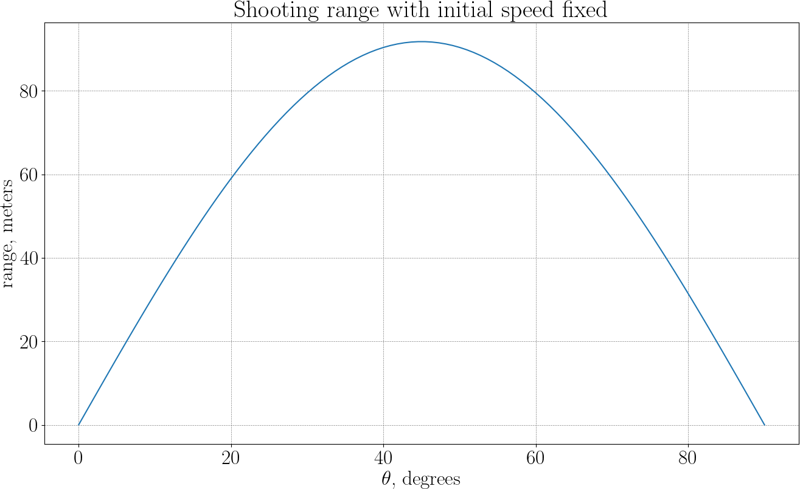

# The Ape Throws Farther

Up to this point, the simulation has been used to predict what happens given a throw.
In this chapter, the direction is reversed: the throw itself becomes the unknown.
The question is simple to state:

— If the initial speed is fixed, which launch angle makes the banana land the farthest?

While the problem has an analytical solution, the idea is to find the answer entirely from numerical simulation.
This way, we can check the closed-form solution to assess our results.

## From simulation to objective function

The initial speed $v_0$ is fixed, only the direction of the throw is allowed to vary.
This reduces the problem to a single parameter: the launch angle $\theta$.
For any given angle the banana is simulated forward in time, detecting the landing point.
Thus, range depends on $\theta$. We want to solve the following problem:

$$
\max_\theta\, \text{range}(\theta)
$$

The physics is hidden inside the simulation.
The optimization algorithm only sees inputs and outputs.
Several properties are worth observing:

* The objective function is smooth but, since we consider the simulation as a black-box, we do not have acces to an analytical expression.
* Objective function's shape can be discovered numerically.
* Each evaluation is expensive: it requires a full simulation.

This is a typical situation in scientific computing: simple variables, complex evaluations.

## Grid (exhaustive) search

A grid search is the most direct way to solve an optimization problem when the objective function can be evaluated but not easily analyzed.
The idea is to replace a continuous set of possibilities by a finite, discrete set, evaluate the objective at each of these points, and keep the best result.
Here is the plot of the simulated distance versus the launch angle:

In the banana-throwing problem, this means choosing a collection of launch angles spread over a given interval ($0°$ to $90°$), running the simulation for each angle, and recording the resulting range.

Conceptually, nothing is hidden: every candidate is tested in exactly the same way, and the outcome depends only on how finely the interval is sampled.
Here are the bananas the ape had to throw to make the above graph:

## Ternary search

A ternary search takes advantage of additional structure in the objective function.
It applies when the function to be maximized has a single peak over the interval of interest.
Such a function is called [unimodal](https://en.wikipedia.org/wiki/Unimodality): it increases up to one maximum and then decreases, with no secondary local maxima.

Ternary search exploits unimodality by repeatedly shrinking the interval in which the maximum can lie.
Here is the core idea: suppose the maximum lies somewhere in an interval $[a,b]$.
Choose two interior points $m_1$ and $m_2$ such that

$$
m_1 = a + \frac{b-a}{3}, \qquad
m_2 = b - \frac{b-a}{3}.
$$

Evaluate the objective function $f$ at these two points.

* If $f(m_1) < f(m_2)$, the maximum must lie in $[m_1, b]$.
* If $f(m_1) > f(m_2)$, the maximum must lie in $[a, m_2]$.
* If they are equal, the maximum lies between $m_1$ and $m_2$.

In all cases, the interval containing the maximum becomes smaller. Repeating this process drives the interval toward the true optimum.

Unlike grid search, ternary search does not aim to sample the function everywhere.
Instead, it concentrates evaluations where the maximum must be, progressively narrowing down its location.
This makes it far more efficient when each function evaluation is costly, as is the case when the objective is produced by a full numerical simulation.

If the function is not unimodal, i.e. if it has multiple local maxima, the logic of discarding one third of the interval breaks down.
In that case, ternary search may converge to the wrong point or fail entirely.

## Ground truth

To assess our results, let us derive the ground truth (analytical) solution for the problem.
We fix the initial velocity $v_0$, and optimize for the launch angle $\theta$.
The banana lands when $y(t)=0$ (with $t>0$):

$$
v_0 \sin \theta\,\, t + \tfrac12 g t^2 = 0,
$$

therefore the time of flight can be found as

$$
t = -\frac{2 v_0 \sin \theta}{g}.
$$

Now we can deduce the horizontal range:

$$
x(t) = v_0\cos\theta\,\, t = -\frac{2 v_0^2 \sin \theta\cos\theta}{g} = -\frac{2 v_0^2 \sin (2\theta)}{g}.
$$

The maximum of $\sin(2\theta)$ is $1$, attained at $90°$, so the optimal launch angle is $\theta = 45°$.

## Deliverables

* Range vs angle plot
* Optimal angle using grid search
* Optimal angle using ternary search
* Discussion points:
    * speed
    * precision / certification
    * what if a function to optimize was not unimodal?

