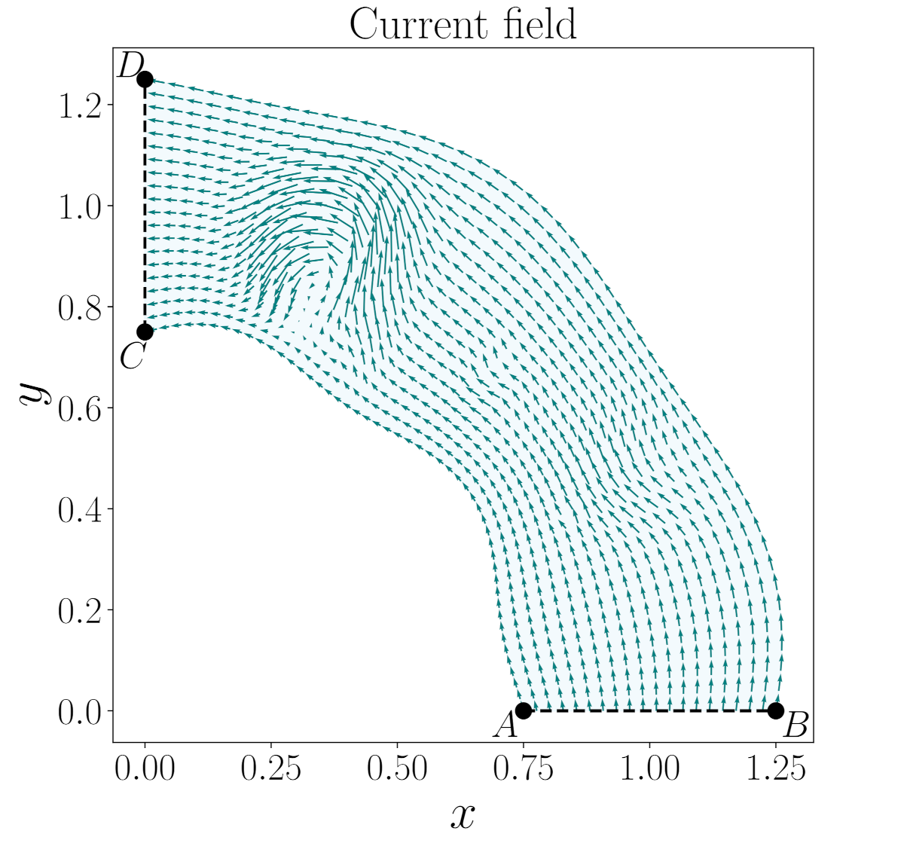

# Petit bateau sur un ruisseau

On considère un ruisseau représenté dans le plan par un domaine du repère orthonormé $(O,x,y)$, les distances s'y mesurent en *toises*.
Deux ponts traversent ce ruisseau ; ils sont modélisés par les segments $[AB]$ et $[CD]$ définis par :

$$
A = \left(\tfrac{3}{4},0\right) \qquad B = \left(\tfrac{5}{4},0\right) \qquad C = \left(0,\tfrac{3}{4}\right) \qquad D = \left(0,\tfrac{5}{4}\right).
$$

Sur chacun des deux ponts se tient un garçon, Arthur et Basile. Ils s’amusent à déposer un petit bateau à la surface de l’eau et observent sa trajectoire sous l’effet du courant du ruisseau.

On suppose connue une fonction $\texttt{current}(x,y)$ qui, à tout point $(x,y)$ du plan, associe le vecteur vitesse du courant en ce point (celui-ci étant nul en dehors du ruisseau).

## Problème posé

Étant donnée la position de Basile sur le pont $[CD]$, décrite par ses coordonnées $(x_B, y_B)$, on souhaite déterminer la position d'Arthur sur le pont $[AB]$, décrite par $(x_A, y_A)$,
telle que le petit bateau lâché en $(x_A, y_A)$ soit transporté par le courant et arrive à la position $(x_B, y_B)$ avec une précision d'une ligne (pour rappel, il y a 864 lignes dans une toise).

## Questions

1. Modéliser mathématiquement la trajectoire du bateau à l’aide d’une équation différentielle dépendant de la fonction $\texttt{current}(x,y)$.
2. Formuler précisément le problème de recherche de $(x_A, y_A)$ comme un problème de recherche de racine.
3. Proposer une méthode numérique aisi que son implémentation permettant de déterminer la position recherchée sur le segment $[AB]$.

On veillera à expliciter clairement les hypothèses de modélisation ainsi que les choix numériques effectués.

