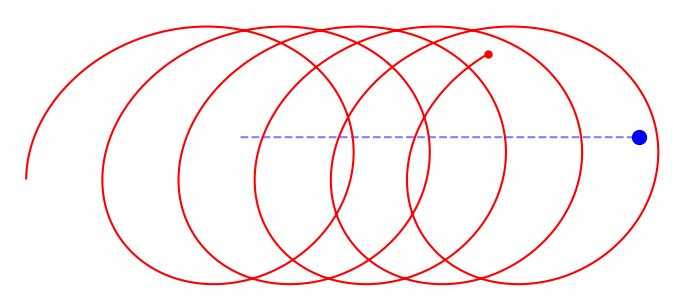

# Mécanique céleste

## Contexte

On s'intéresse au mouvement d'un vaisseau spatial évoluant dans le voisinage d'une planète. Afin de simplifier l'étude, on suppose que la planète est suffisamment massive pour que sa trajectoire ne soit pas affectée par la présence du vaisseau. Son mouvement est donc considéré comme connu et imposé : elle se déplace à vitesse constante selon une trajectoire rectiligne. Le vaisseau, en revanche, est soumis à l'attraction gravitationnelle exercée par la planète. L'objectif de cet exercice est d'étudier numériquement les trajectoires obtenues, puis de déterminer comment utiliser l'assistance gravitationnelle de la planète afin d'augmenter la vitesse du vaisseau.

## Partie I : Analyse du programme

Le fichier Python [fourni](slingshot/slingshot.py) anime le mouvement d'une planète et d'un vaisseau spatial dans le plan.
Le programme utilise actuellement un schéma d'Euler explicite avec un pas de temps constant $\Delta t = 10^{-5}$.

Identifier dans le programme les variables représentant :

- la position de la planète ;
- la vitesse de la planète ;
- la position du vaisseau ;
- la vitesse du vaisseau.

Montrer que la planète ainsi que le vaisseau suivent un mouvement rectiligne uniforme.

## Partie II : Mise en orbite du vaisseau

On souhaite désormais que le vaisseau soit attiré par la planète.
On note $\vec{x}_s$ la position du vaisseau et $\vec{x}_p$ la position de la planète.
Le vecteur reliant le vaisseau à la planète est $\vec{r} = \vec{x}_p-\vec{x}_s$.
Le vaisseau est soumis à l'accélération gravitationnelle $G\frac{\vec r}{|\vec r|^3}$.

Adapter le programme fourni afin d'intégrer ces équations par la méthode d'Euler explicite.

## Partie III : Extraction du simulateur

Pour pouvoir réaliser des études paramétriques, on souhaite séparer la simulation de l'animation.
On fixe désormais la vitesse initiale du vaisseau, et la seule variable du contrôle est la direction de lancement.
Implementez une méthode d'optimisation de votre choix pour trouver la direction qui maximise la vitesse maximale atteinte par le vaisseau.
Expliquer physiquement pourquoi certaines directions de lancement permettent un gain de vitesse plus important que d'autres.

## Partie IV : Bonus

On suppose maintenant que la vitesse initiale du vaisseau est inférieure à la vitesse de libération.

Après une assistance gravitationnelle, le vaisseau peut néanmoins acquérir suffisamment d'énergie pour s'échapper définitivement.
Proposer un critère numérique permettant de déterminer automatiquement si le vaisseau s'est échappé du système planétaire.

Justifier soigneusement votre réponse.

