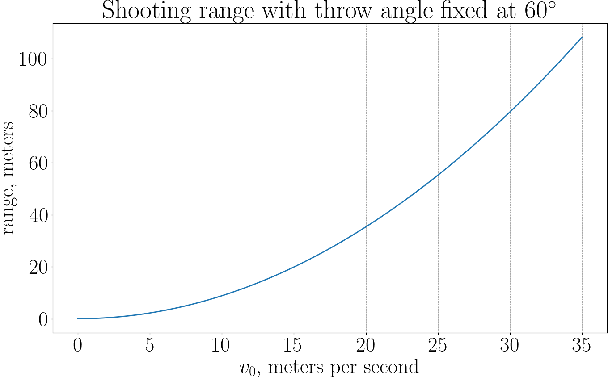
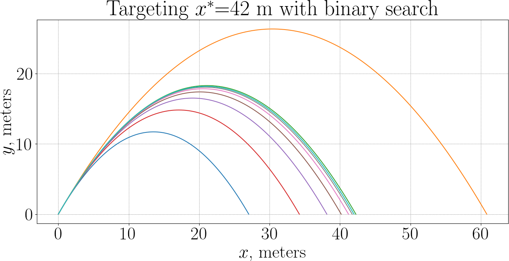
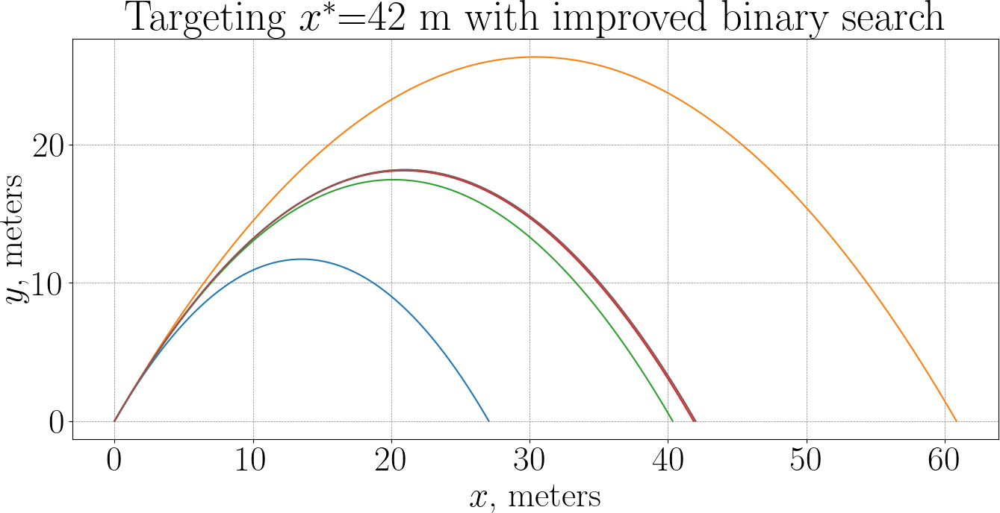
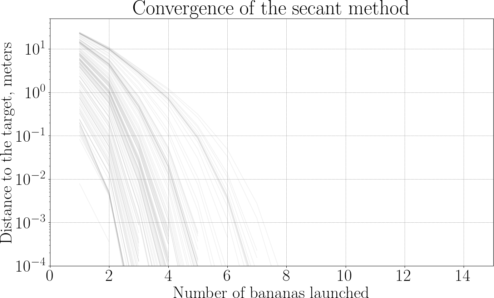

# The Ape Hits a Target

Up to now, the ape has been throwing bananas and asking:

— Given a throw, where does the banana land?

In this chapter, the direction is reversed: the throw itself becomes the unknown. The question is simple to state:

— Given a target position $x^\star$ on the ground, how should the ape throw the banana to hit it?

To keep things simple (and realistic for a lazy ape):

- the launch angle $\theta$ is fixed,
- the launch speed $v_0$ the only unknown,
- as before, the banana starts at the origin, gravity acts vertically with acceleration $g$, air resistance is ignored.

In the previous chapter, we learned how to simulate the motion of a banana using a time-stepping scheme and how to detect the moment when the banana hits the ground.
This required careful handling of two distinct ingredients:

* A numerical integration scheme (explicit Euler)
* An event detection mechanism to stop the simulation at the correct physical time.

In the present problem, the ape is not interested in the entire flight of the banana.
Only one number matters, namely, the horizontal position of the banana when it hits the ground.
Let us call it "$\text{range}$".

We formalize this as a numerical black box:

$$
\text{range}(v_0) := \text{horizontal position where the banana hits the ground}.
$$

Our goal is now crystal clear:
Find $v_0$ such that $\text{range}(v_0)=x^\star$.
Equivalently, define $f(v_0):=\text{range}(v_0)−x^\star$, and look for a root of $f$.

Each failed throw costs a banana.
Bananas cost time, effort, and dignity.
The ape wants to hit the target using as few bananas as possible!

---

## Closed-form solution (for later validation)

Before going fully numerical, let’s derive the analytical solution — not to use it, but to check our results afterward.

With initial speed $v_0$ and fixed angle $\theta$, the motion is:

$$
\begin{aligned}
x(t) &= v_0 \cos\theta \; t, \\
y(t) &= v_0 \sin\theta \; t + \tfrac{1}{2} g t^2.
\end{aligned}
$$

The banana hits the ground when $y(t)=0$ (excluding $t=0$):

$$
t_{\text{impact}} = -\frac{2 v_0 \sin\theta}{g}.
$$

The corresponding range is:

$$
\text{range}(v_0) = x(t_{\text{impact}}) = -v_0 \cos\theta \cdot \frac{2 v_0 \sin\theta}{g} = -\frac{v_0^2}{g} \sin 2\theta.
$$

To hit $x^\star$, we need:

$$
-\frac{v_0^2}{g} \sin(2\theta) = x^\star.
$$

Solving for $v_0$:

$$
\boxed{
v_0^\star
= \sqrt{-\frac{g\,x^\star}{\sin(2\theta)}}
}
\qquad (\text{assuming } \sin(2\theta) > 0).
$$

This is the exact answer — and our numerical method should converge to it.

---

## Range as a function of launch speed

Now forget the formula and think like a numerical ape.
Let’s plot the $\text{range}(v_0)$ function:



Graphically, we’re just finding where the curve crosses the horizontal line $x^\star$.
From physics (and confirmed numerically), we can observe three key facts:

1. $\text{range}(0) = 0$,
2. $\text{range}(v_0)$ increases monotonically,
3. the curve is well-behaved: it is smooth, and  small changes in $v_0$ produce small changes in range.

This means that the equation $\text{range}(v_0)=x^\star$ has one unique solution,
the function is regular enough for standard root-finding methods, numerical inversion is safe and robust.

---

## First weapon: bisection (a cautious ape)

The bisection method is the simplest and most reliable strategy the ape can use to hit the target.
It is slow, a bit stubborn, but impossible to fool, which makes it perfect as a first numerical method.

Recall that we define the function

$$
f(v_0) = \text{range}(v_0) - x^\star,
$$

where $v_0$ is the launch speed, $\text{range}(v_0)$ is obtained from a numerical simulation,
and $x^\star$ is the target position on the ground.

Hitting the target means solving:

$$
f(v_0) = 0.
$$

We assume:

* $f$ is continuous,
* $f(0) < 0$ (a very weak throw falls short),
* for large enough $v_0$, $f(v_0) > 0$  (the banana overshoots).

So the correct launch speed lies somewhere in between.

### Step 1: bracketing the solution

The ape starts by choosing two speeds $v_{\min}$ and $v_{\max}$,
such that:

$$
f(v_{\min}) < 0, \qquad f(v_{\max}) > 0.
$$

This means:

* a throw with speed $v_{\min}$ undershoots,
* a throw with speed $v_{\max}$ overshoots.

The ape now knows, with certainty, that the correct speed lies inside the interval $[v_{\min}, v_{\max}]$.
This step is crucial: **bisection never loses the target once it is bracketed.**


### Step 2: split the interval

The ape now takes the midpoint:

$$
v_{\text{mid}} := \frac{v_{\min} + v_{\max}}{2}.
$$

A banana is thrown with speed $v_{\text{mid}}$, and the simulation returns the landing position, hence the sign of $f(v_{\text{mid}})$.
Three outcomes are possible:

* $f(v_{\text{mid}}) = 0$: perfect hit (we are done),
* $f(v_{\text{mid}}) < 0$: the banana falls short,
* $f(v_{\text{mid}}) > 0$: the banana goes too far.

### Step 3: keep the correct half

Depending on the result, the ape updates the interval:

* If $f(v_{\text{mid}}) < 0$, the root lies in $[v_{\text{mid}}, v_{\max}]$,
  so we can update the interval: $v_{\min} \leftarrow v_{\text{mid}}$.

* If $f(v_{\text{mid}}) > 0$, the root lies in $[v_{\min}, v_{\text{mid}}]$,
  so we can update the interval: $v_{\max} \leftarrow v_{\text{mid}}$.

In both cases the new interval is half the size of the old one, and the root is still guaranteed to be inside.
The ape has learned something from the banana, and the uncertainty has been cut in half.

We can repeat the above procedure:

1. take the midpoint,
2. throw a banana,
3. keep the half that contains the target.

After $k$ iterations, the uncertainty on the launch speed satisfies:

$$
|v_0 - v_0^\star| \le \frac{v_{\max} - v_{\min}}{2^k}.
$$

This gives a very concrete stopping rule: stop when $v_{\max} - v_{\min}$ is small enough, or when the banana lands close enough to the target.

Here is an example plot of bananas launched to hit a target $x^\star=42$ m with the throw angle fixed to $\theta = 60^\circ$.
The ape spent 9 bananas to hit the target with $\pm 10$ cm of accuracy.



The power of bisection comes from two simple facts:

1. **Continuity**: the range changes continuously with the launch speed.
2. **Intermediate Value Theorem**: a continuous function that changes sign must cross zero.

No derivatives are needed, no clever guesses are required. No banana is ever wasted in the sense of losing the target. As long as the ape is patient, success is inevitable.

---

## Regula falsi: aiming smarter

The ape asks itself the question:

— If I know that one throw fell **just short** and another went **way too far**, why should I always try the midpoint?

The bisection method taught the ape an important lesson: as long as the target is bracketed, it cannot be lost.
But it also revealed a frustration: every new throw is made at the midpoint, even when previous bananas already showed **how far** the ape missed the target.
The regula falsi method (literally false position) keeps the same safety guarantee as bisection, but uses more information from each throw to make (hopefully) smarter choices.

The problem settings are unchanged, we work with the function

$$
f(v_0) = \text{range}(v_0) - x^\star,
$$

and we assume that we have two launch speeds $v_{\min}$ and $v_{\max}$ such that

$$
f(v_{\min}) < 0, \qquad f(v_{\max}) > 0.
$$

The key idea is to redefine how $v_{\text{mid}}$ is computed.
Bisection only looks at signs, while regula falsi uses more information per banana
by exploiting the actual values of $f$.
While $f$ is unknown in its whole, we do know values $f(v_{\min})$ and $f(v_{\max})$,
and we can approximate $f$ inbetween by a straight line.

If one throw misses the target by a lot and the other only by a little,
the straight line automatically biases the next guess toward the better side.

So, instead of throwing at the midpoint, the ape now does the following:

* plot the two known points $(v_{\min}, f(v_{\min}))$ and  $(v_{\max}, f(v_{\max}))$,
* approximate the unknown function $f$ by the straight line passing through them,
* choose the next throw where this line crosses zero.

Geometrically, we intersect the secant line with the horizontal axis.
The equation of the secant line is linear, and its zero can be computed explicitly:

$$
v_{\text{mid}}:=  v_{\min} - f(v_{\min}) \frac{v_{\max} - v_{\min}}{f(v_{\max}) - f(v_{\min})}
$$

This value replaces the midpoint used in bisection, so regula falsi is a natural evolution of bisection.
It never loses the target, but reuses information from past throws, making it (often) converger faster in practice.

Here is the same experiment as before: the ape hits a target $x^\star=42$ m with the throw angle fixed to $\theta = 60^\circ$.



Now the ape has spent 5 bananas only, almost half of 9 bananas it used with binary search!

A new thought boggles the mind of the restless ape:

— If I keep drawing secant lines anyway… do I really need to keep the interval?

---

## Secants: the ape is taking risks

---

## Newton: the ape learns calculus

---

## Order of convergence




---


<!--
Let $x_0,x_1,x_2\dots$ be a sequence which converges to $x^\star$ and $e_k:= |x_k - x^\star|$. If there exist $p$ and $r\neq 0$ such that 

$$
\lim\limits_{k\to\infty} \frac{e_{k+1}}{e_k^p} = r, 
$$

then $p$ is called the order of convergence and $r$ is the rate of convergence.
Intuitively, they can be understand by considering the amount of digits accurate per iteration

The number of correct digits in $x_n$ is related to the magnitude of the error, i.e.

$$
\text{Number of correct digits} \approx - \lg |x_k - x^\star|.
$$

Let’s analyze how the error changes from $x_k$ to $x_{k+1}$:

$$
e_{k+1} \approx e_k^p \cdot r
$$


Taking the base-10 logarithm:
$$
\lg e_{k+1} \approx p \lg e_k + \lg r
$$
This shows that the number of correct digits roughly multiplies by p per iteration.
Initially the rate of convergence matters the most when $\lg e_k$ is small, while for large $\lg e_k$ the order of convergence will matter more.


|           | Bisection | Regula falsi                  | Secant                   | Newton                   |
|---------- | :-------: | :---------------------------: | :----------------------: | :----------------------: |
| **Order** | $1$       | $1$                           | $\frac{1+\sqrt 5}{2}$    | $2$                      |
| **Rate**  | $\frac12$ | $-\frac{f''(x)}{2f'(x)}(x-z)$ | $-\frac{f''(x)}{2f'(x)}$ | $-\frac{f''(x)}{2f'(x)}$ |

$z$ denotes the second point used in the regula falsi.

Bisection is very easy to prove, since the interval always halves.
Midpoint $x_{k+1}$ of interval $(a_k, b_k)$ is an approximation of $x^\star$ with error

$$
|x_{k+1} - x^\star| \leq \frac12 (b_k - a_k) = 2^{-k-1}(b_0 - a_0).
$$

Then

$$
\lim\limits_{k\to\infty} \frac{e_{k+1}}{e_k^p} = \frac{2^{-k-1}(b_0 - a_0)}{\left(2^{-k}(b_0 - a_0)\right)^p} = \frac12 \left(\frac{2^k}{b_0 - a_0}\right)^{p-1}
$$

For this limit to exist and be finite, the exponent of 2 must vanish, i.e.

$$
p = 1,\qquad r = \frac12.
$$
-->

## Fast inverse square root


```C linenums="1"
float Q_rsqrt( float number ) {
	long i;
	float x2, y;
	const float threehalfs = 1.5F;
	x2 = number * 0.5F;
	y  = number;
	i  = * ( long * ) &y;                       // evil floating point bit level hacking
	i  = 0x5f3759df - ( i >> 1 );               // what the fuck?
	y  = * ( float * ) &i;
	y  = y * ( threehalfs - ( x2 * y * y ) );   // 1st iteration
//	y  = y * ( threehalfs - ( x2 * y * y ) );   // 2nd iteration, this can be removed
	return y;
}
```

<!--
## Deliverables


Let the error $e_k$ be 

$$
e_k := |x_k - x^\star|.
$$

Define $\delta_k$ as

$$
\delta_k := \frac{b_k - a_k}{2} - e_k
$$

Let us assume the root $x^\star$ never coincides with a midpoint $x_k$, i.e. $e_k>0$ for all $k$ (otherwise convergence is finite and the asymptotic question is moot).
It means that 

$$
\delta_k < \frac{b_k-a_k}{2} = \frac{b_0 - a_0}{2^{k+1}}.
$$


Thus:

$$
e_k = \frac{b_0-a_0}{2^{k+1}} - \delta_k,
\qquad
 \delta_k < \frac{b_0-a_0}{2^{k+1}}.
$$


Now form the ratio:

$$
\frac{e_{k+1}}{e_k} =
\frac{
\frac{b_0-a_0}{2^{k+2}} - \delta_{k+1}
}{
\frac{b_0-a_0}{2^{k+1}} - \delta_k
}
=
\frac12
\cdot
\frac{
1 - \frac{2^{k+2}}{b_0-a_0}\delta_{k+1}
}{
1 - \frac{2^{k+1}}{b_0-a_0}\delta_k
}.
$$


Now define:

$$
\varepsilon_k := \frac{2^{k+1}}{b_0-a_0}\delta_k \in (0,1).
$$

So:

$$
\frac{|e_{k+1}|}{|e_k|} = \frac12 \cdot \frac{1-\varepsilon_{k+1}}{1-\varepsilon_k}.
$$

---

-->

--8<-- "comments.html"
