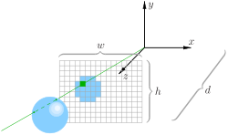
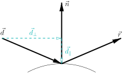

## Raytracing

-----------

## Ray-sphere intersection

We want the point $h$:

$$
\|\vec{oh}\| = \|\vec{op}\| - \|\vec{hp}\|,
$$

where $\|\vec{op}\| = \vec{d} \cdot \vec{oc}$ and $\|\vec{hp}\|^2 = \|\vec{ch}\|^2 - \|\vec{cp}\|^2$.

$\|\vec{ch}\|$ is the radius and $\|\vec{cp}\|^2 = \|\vec{oc}\|^2 - \|\vec{op}\|^2$.

Check whether $\|\vec{hp}\|^2$ is positive (the is an intersection between the straight line and the sphere)
and $\|\vec{oh}\|$ is positive (the is an intersection between the **ray** and the sphere).

-----------

## Ray — axis-aligned box intersection

$$
o_y + t\ \vec d_y = b_y, \quad \Rightarrow \quad t = (b_y - o_y) / \vec d_y
$$

$$
h = o + t\ \vec d
$$

Check whether $t$ is positive and $h$ belongs to the segment, i.e. $a_x < h_x < b_x$.

-----------

## Reflection

$$
\vec d = \vec d_\perp + \vec d_\|,
$$

where (assume unit $\vec n$)

$$
\vec d_\| = (\vec d \cdot \vec n)\ \vec n \quad\text{and}\quad \vec d_\perp = d - (\vec d \cdot \vec n)\ \vec n
$$

then $\vec r = \vec d_\perp - \vec d_\|$, or, equivalently,

$$
\vec r = \vec d - 2\ (\vec d \cdot \vec n)\ \vec n.
$$

