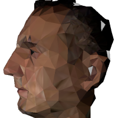
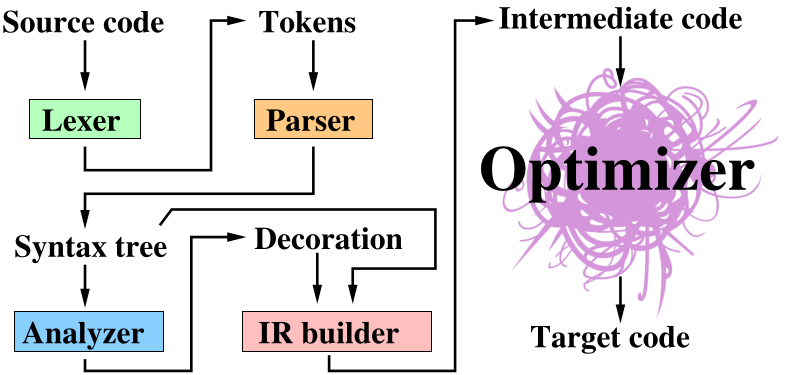
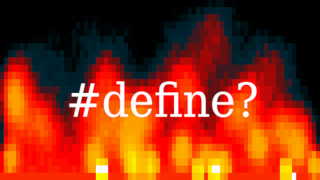

---
hide:
  - toc
---

<a href="https://github.com/ssloy">
 
https://github.com/ssloy</a>
 &nbsp 
<b>Dmitry V. Sokolov</b>,
 
LORIA, Université de Lorraine,   Campus Scientifique, BP 239,  54506 Vandoeuvre-les-Nancy Cedex,  France
 &nbsp 
dmitry.sokolov@univ-lorraine.fr 
+33 3.83.59.20.77
 

# Assorted writings

## [TinyRenderer: Software rendering in 500 lines of bare C++](tinyrenderer/index.md)

---

## [TinyCompiler: a compiler in a week-end](tinycompiler/index.md)

---

## [TinyOptimizer: an *optimizing* compiler challenge](tinyoptimizer/index.md)

---

## [Cursed fire or `#define` black magic](strange/cursed-fire.md)

