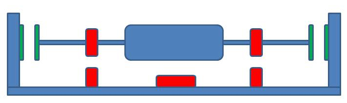
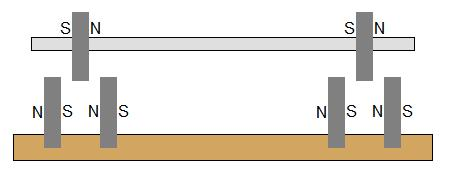
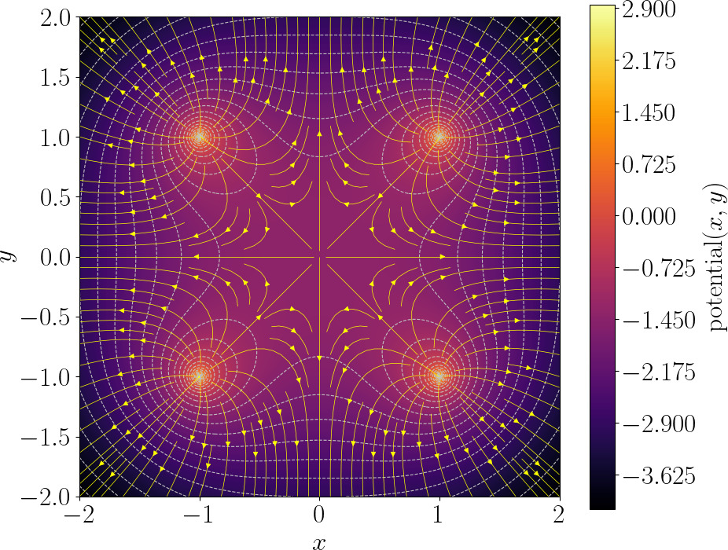
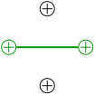
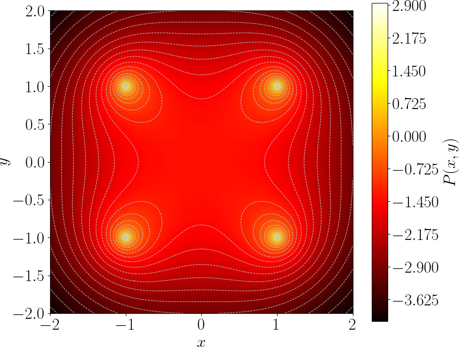

# Mendocino motor and Earnshaw's theorem

Do you know what a Mendocino motor is?
It is a sun-powered, magnetically-levitated demonstration motor - beautiful, simple, and educational.
Such a motor can be made with very basic tools, making it a really fun project for any hobbyist.


The rotor is mounted on extremely low-friction bearings: the original had a glass cylinder suspended on two needles, while modern versions have a magnetic suspension system.
The motor is brushless, with solar panels on the rotor that supply voltage to the coils wound on the rotor.
When light hits a solar cell, it powers one coil.
The powered coil interacts with the magnetic field from fixed external magnets, thus creating a torque.
The rotor rotates, and the solar cell moves away from the directed light, and another one takes its place.
This way, the rotor spins continuously as long as light is available.
An extremely elegant solution that anyone can easily make at home.
But let us focus on the magnetic suspension.

## Magnetic suspension puzzle

We place a pair of fixed magnets on the stator so that a magnet mounted on the rotor axis sits in a local minimum of the magnetic potential in the radial directions — it’s held firmly against sideways (radial) displacement.


Repeating that arrangement at both ends of the rotor produces radial confinement for the shaft, but the configuration is axially (longitudinally) unstable: the rotor is free to slide along the shaft direction.
Resting the shaft lightly against a vertical support supplies the missing axial support while keeping contact friction extremely small, so the assembly behaves as a very low-friction bearing.

**But why, then, do all Mendocino motors still include a tiny side support for the shaft?**
The side plate is somehow... inelegant, isn't it?
It's quite logical to want a rotor that floats completely in the air, without any kind of support.
Turns out, it is impossible, but I am not the only one wanting a fully magnetic suspension.
Let me, for example, quote this [forum](https://scienceforums.net/topic/87824-mendocino-motor/):

???+ quote "Quote #1"
    On a Mendocino Motor why does one side float free while the other has a tip to a wall? I know the question might sound trivial but I have worked up the idea why not use the same magnets used to levitate as a counter force on both sides of the shaft? I attached a very rough jpg of what I mean. the green magnets at the end of the shafts is what im referring to. is there some theory or law preventing this?
    

or another one:

???+ quote "Quote #2"
    What would happen if the base magnets were spaced and oriented like in this drawing? Would it give it stability in the axial plane, and do away with the mirror requirement?
    

In other words, people all over the world want to get rid of the side support.
I didn't do very well in school, and the impossibility of creating a fully magnetic suspension is not obvious to me either.
Over a cup of tea, I asked my colleagues this very question: “Why is it impossible, actually?” And you know, it wasn't obvious to him either!

No one on the above-mentioned forums really explained why it is impossible.
At best, they quoted some Earnshaw theorem, which is not very easy to digest.
It states the following:

???+ quote "Earnshaw's theorem"
    Any equilibrium configuration of point charges is unstable if nothing else acts on them except Coulomb's forces of attraction and repulsion.

Is that clear to you? It's not to me.
Let's say I can accept that we're talking about charged particles and not magnets.
But what's next?
Let us brainstorm with few thought experiments!

## First thought experiment

When something is unclear to me, I draw a picture.
For simplicity, let us start with 2D electrostatics.
Imagine four fixed unit charges at the corners of a square and a free charge in the center of the square.
Something like this:


Is it possible that the free charge is not in a state of stable equilibrium?
Intuitively, wherever the charge moves, it approaches one of the fixed charges, increasing the repulsive force!
Let's draw a map of the potential energy for the free charge.
My physics skills are shaky, so we'll draw on knowledge from [Wikipedia](https://en.wikipedia.org/wiki/Electric_potential).


???+ quote "Wikipedia quote"
    The electric (Coulomb) potential $f$ arising from a point charge, $q$, at a distance, $r$, from the location of $q$ is observed to be $f$

    $$
    f = k \frac q r,
    $$

    where $k$ is the permittivity of vacuum.

If your physics skills are somewhat comparable to mine (pretty low), then let us focus on the word "potential" first.
It comes from Latin *potentia*, meaning *power* or *capacity*.
In physics, it generally refers to a stored ability to do something, something that could be released or converted into motion/work.
Electrostatic potential $f$ measures the capacity of a point in space to give energy to a charge.
A higher potential means a charge placed there would have more energy.

Gravity is a great analogy because it’s familiar.
Let’s say a hill represents **gravitational potential**.
A ball on the hill has gravitational **potential energy** proportional to height.
The slope of the hill tells the ball which way it will roll: the steeper the slope, the stronger the force.
Note that the potential itself is a scalar quantity — it tells you “how much energy per unit particle is stored at this point,” not the force.
The force comes from the gradient of the potential: it is the slope of the “energy landscape.”

In my thought experiments, all coefficients are either zero or one.
Therefore, both the charge $q$ and the permittivity $k$ are unit.
That is, a single fixed charge creates a potential measured by the formula $f = 1/r$, where $r$ is the distance to the charge.

Let us use python to draw the map of the potential of our system made of four charges.
We can use following function to compute the electric potential of a point $(x,y)$ due to a single charge located at the point $(a,b)$:

```python
def f(a, b, x, y): # electric potential due to a point charge located at a,b
    return 1 / np.hypot(x - a, y - b)
```

To compute the electric potential of the system, it suffices to sum four point charge potentials:

```python
def F(x, y):       # electric potential due to 4 point charges
    return f( 1,  1, x, y) + \
           f(-1,  1, x, y) + \
           f( 1, -1, x, y) + \
           f(-1, -1, x, y)
```

Finally, all we need to do is to plot the the scalar field $F$:

```python
import numpy as np
import matplotlib.pyplot as plt
X, Y = np.meshgrid(np.linspace(-2, 2, 300),
                   np.linspace(-2, 2, 300))
plt.contourf(X, Y, np.clip(F(X, Y), None, 5))
plt.show()
```

And here is the plot. Note that I have clamped $F$ to remove the points where the potential goes to infinity:


The scalar field $F$ can be seen as a height map, a bird's-eye view of a landscape.
The dashed lines show the isolines of the elevation, and the yellow arrows indicate the direction of the steepest descent.

Clearly, in the center of the plot there is a basin of attraction, a zone with only incoming yellow arrows.
If we move slightly our free charge from the center, its energy will increase, so it will return to the center.
Therefore, this is a stable equilibrium.

Did Earnshaw lie? No, he did not. The problem is that I drew the picture poorly, I made a mistake. And many people would make the same mistake as I did (I have checked it).
Pause for a second, think about where I went wrong.

## First experiment corrected

In this case, the error lies in the fact that in 2D, a fixed charge creates a potential measured by the formula $f = -\log r$, where $r$ is the distance to the charge, and not $1/r$.
The Coulomb's formula $f = 1/r$ is derived for 3D.
Take my word for it for a moment and allow me to modify the Coulomb's formula.
Then the correct code will look like this (check the highlighted line):


```python linenums="1"  hl_lines="2"
def f(a, b, x, y): # electric potential due to a point charge located at a,b
    return -np.log(np.hypot(x - a, y - b))

def F(x, y):       # electric potential due to 4 point charges
    return f( 1,  1, x, y) + \
           f(-1,  1, x, y) + \
           f( 1, -1, x, y) + \
           f(-1, -1, x, y)

import numpy as np
import matplotlib.pyplot as plt
X, Y = np.meshgrid(np.linspace(-2, 2, 300),
                   np.linspace(-2, 2, 300))
plt.contourf(X, Y, np.clip(F(X, Y), None, 5))
plt.show()
```

Check the result, there are no local minima on the map.
The origin is a saddle point, i.e., a point of **unstable** equilibrium.
As soon as the free charge shifts even a micron away from the origin, it will inevitably drift out of the square, accelerating more and more.




## What happened to the electric potential formula?

When I encountered a clear contradiction with Earnshaw's theorem, I realized that I had made a mistake somewhere and began the debugging.
At some point I saw that I had no other option as to read about Maxwell's equations.
School physics class were long forgotten, and I never had to deal with them again at university or later in life.

It turns out that the subject is not that hard, especially if we are only interested in electrostatics!
For the big picture intuition, you can think of the electric field like a flowing fluid:

* Field lines (shown in yellow arrows) are water streams
* A charge is a source/sink that creates or absorbs flow
* Potential = height of a landscape; water flows downhill

Four our case, we need two (out of four) Maxwell's equations.

#### Faraday: no swirling, only gradient flow

[Faraday says](https://en.wikipedia.org/wiki/Faraday%27s_law_of_induction) changing magnetic fields create vortices in the electric field.
But in electrostatics nothing changes in time, so no vortices exist.
That means the “water” never swirls in circles — it only flows because gravity pulls it downward on a landscape (check the yellow arrows).

Mathematically, for any zero-curl (irrotational) vector field $\vec E$, there exists (in any simply connected neighborhood) a scalar potential $f$ such that $\vec E = - \nabla f$.
To sum up, Faraday said that the for the static case the
electric field (the yellow lines) can be found as the downhill direction of potential landscape.


#### Gauss: conservation law

This is a local conservation law.
[It states](https://en.wikipedia.org/wiki/Gauss%27s_law) that if there is no charge inside a region, then the total electric flux through the boundary of the region is zero.

If you imagine the field as water flow, then enclosing a charge is like enclosing a faucet: there is net flow out of the surface.
A positive charge is a fountain, a negative charge is a drain.
Zero charge in a region tells that there is no net flow through the boundary: What flows in must flow out (no accumulation).

Mathematically, we say that at any point the [divergence](https://en.wikipedia.org/wiki/Divergence) of the electric field is equal to the charge at this point:

$$
\nabla \cdot \vec{E} = q
$$

#### Combine both laws

Let us plug $\vec E = -\nabla f$ into Gauss's law:

$$
\nabla \cdot \vec E = \nabla \cdot (-\nabla f) = -\Delta f = q.
$$

So, $\Delta f = -q$, which is [Poisson's equation](https://en.wikipedia.org/wiki/Poisson%27s_equation).
If the region considered contains no free charge, $q=0$. Then Poisson reduces to $\Delta f = 0$, 
which is [Laplace's equation](https://en.wikipedia.org/wiki/Laplace%27s_equation). Functions satisfying $\Delta f = 0$ are called harmonic.
Therefore the electrostatic potential is harmonic wherever there is no charge.

It turns out that in 2D, function $\frac{1}{r}$ is not harmonic (it has non-zero Laplacian).
To derive proper potential function, we need to solve the Laplace's equation.
Here you can see the derivation details:

??? spoiler "2D electric potential due to a point charge"
    In 2D, $\Delta f(r) = f''(r) + \frac1r f'(r)$, therefore $\Delta f = 0$ becomes

    $$
    f''(r) + \frac{1}{r} f'(r) = 0.
    $$

    To solve it, we can rewrite left part in “derivative of a product” form:

    $$
    f''(r) + \frac{1}{r} f'(r) = \frac{1}{r} \big( r f'(r) \big)'.
    $$

    So the ODE becomes

    $$
    \frac{1}{r} (r f'(r))' = 0 \quad\Rightarrow\quad (r f'(r))' = 0.
    $$

    Then to recover $f$ it suffices to integrate the equation twice:

    $$
    \begin{align}
    (r f'(r))' = 0 \quad&\Rightarrow\quad r f'(r) = A,\\
    f'(r) = \frac{A}{r} \quad&\Rightarrow\quad  \boxed{f(r) = A \ln r + B},
    \end{align}
    $$

    here $A$ and $B$ are constants.

As a sanity check, we can also see if we get the Coulomb's potential for the 3D case (yes, we do):


??? spoiler "Derivation of Coulomb's law in 3D"
    The 3D Laplace equation for a radial function $f(r)$ is

    $$
    \Delta f = f''(r) + \frac{2}{r} f'(r) = 0, \quad r>0.
    $$

    Note the constant 2 appearing in the 3D version, if you are curious where it comes from, check the text under the spoiler.

    ??? spoiler "Laplacian for radial functions for arbitrary dimenensions"
        Let $\vec{x}=(x_1,\dots,x_n)$. Set $r:=|\vec x|$.
        Then the gradient  $\nabla f$ can be written as:

        $$
           \nabla f = f'(r)\,\nabla r = f'(r)\,\frac{\vec{x}}{r} = f'(r)\,\hat{\vec r},
        $$

        where $\hat{\vec r}=\vec{x}/r$ is the radial unit vector.
        Laplacian is divergence of the gradient:

        $$
           \Delta f = \nabla\cdot\Big(f'(r)\,\hat{\vec r}\Big).
        $$

        Use product rule:

        $$
           \nabla\cdot\Big(f'(r)\,\hat{\vec r}\Big) = f''(r)\,\hat{\vec r}\cdot\nabla r + f'(r)\,\nabla\cdot\hat{\vec r}.
        $$

        But $\hat{\vec r}\cdot\nabla r = \dfrac{\vec{x}}{r}\cdot\dfrac{\vec{x}}{r}=1$, so the first term is $f''(r)$.
        For the second term we can note that the divergence of the radial unit vector in $n$ dimensions is
        $\nabla\cdot\hat{\mathbf r}=\frac{n-1}{r}$. Combining both, we obtain

        $$
           \boxed{\Delta f = f''(r) + f'(r)\frac{n-1}{r}}.
        $$

    As before, we rewrite the left part in “derivative of a product” form:

    $$
    f''(r) + \frac{2}{r} f'(r) = \frac{1}{r^2} \big( r^2 f'(r) \big)'.
    $$

    $$
    \begin{align}
    (r^2 f'(r))' = 0 \quad&\Rightarrow\quad r^2 f'(r) = A,\\
    f'(r) = \frac{A}{r^2} \quad&\Rightarrow\quad \boxed{f(r) = \frac{A}{r} + B},
    \end{align}
    $$

    where $A$ and $B$ are constants.
    To sum up, we Coulomb's electric potential due to a point charge is indeed derived from Laplace's equation.


### Back to the error I made

If we use the Coulomb $1/r$ formula in a 2D space, this corresponds to a situation where we actually have 3 dimensions, but the motion of charges is restricted along one axis by some external mechanism.
In that case, it is obvious that a stable configuration can be created.
For example, take a cardboard tube, place it vertically, and put a magnet at the bottom.
Then place another magnet inside the tube above it.
This upper magnet will be in equilibrium: the tube prevents horizontal motion (effectively constraining the system to one dimension), and along the vertical direction the gravitational force is balanced by the magnetic repulsion.

Earnshaw’s theorem must be applied either together with the Coulomb law in 3D, or in a space of any dimension, but using the correct potential for that dimension.
By “correct” I mean the potential that actually follows from Maxwell’s equations in that given number of dimensions.

## Earnshaw's theorem

Let us sum up what we have learned from Maxwell's laws: in a region without charge, the electric potential $f$ satisfies Laplace’s equation $\Delta f = 0$.
Such functions are called **harmonic**, and harmonic functions obey a crucial property: they cannot have any local maxima or minima inside the region, only on the boundary.
Physically this means the potential is shaped like a perfectly stretched elastic sheet — no bumps or wells can form away from the boundary of the sheet.

A free charge placed in an electrostatic field would sit at a point where the electric force vanishes, i.e. in a point where its potential energy has a (local) minimum.
But since the potential of an electrostatic field has no local minima, a result, the potential energy of a single particle has no local minima either.
Therefore, static electric fields cannot trap a charged particle in stable equilibrium.

Congratulations, we have just proven Earnshaw's theorem for a single charged particle.
But what about more complex systems?
My colleagues have suggested me another thought experiment.

Let's fix two charges and create a moving body consisting of a weightless, inextensible rod with charges at both ends:



Intuitively, if we move the stick slightly to the left or right, one end will approach the fixed charges, and they will repel it, returning the stick to its original position.
Where's the catch?
Let's draw the electrostatic potential of two fixed charges:

```python
def F(x, y):       # electric potential due to 2 point charges
    return f(0,  2, x, y) + \
           f(0, -2, x, y)
```


How can we draw the potential energy of our stick charged at both ends?
The electric potential $F(r)$ is a property on the field itself and represents the potential energy per unit charge available at each point in space.
When you place a charge $q$ in that field, the actual potential energy it has is simply $P(\vec x) = q\,F(\vec x)$.
Recall that in my thought experiments all coefficients are either 1 or 0, so for a single charge the electric potential landscape and the potential energy the charge are pretty much the same thing.

For a system of two charges it changes a bit.
If two point charges $q_1,q_2$ are held at fixed positions $\vec x_1, \vec x_2$ (by a rigid rod), and there is an *external* electrostatic potential $F$, the total electrostatic potential energy of the system of the two charges is

$$
P(\vec x_1, \vec x_2)=q_1\,F(\vec x_1)+q_2\,F(\vec x_2).
$$

Basically, the potential energy of the stick is the sum of the potential energies of its charges
(note that I ignore the mutual Coulomb energy of the two charges because of the rod).

The stick has three degrees of freedom (two for translation and one for rotation), so the full graph would be hard to plot.
For simplicity I ignore rotations and allow translations only.
Let us draw the potential energy of the stick that cannot rotate (here I chose its center as the reference point):

```python
def P(x,y):
    return F(x + 2,y) + \
           F(x - 2,y)
```

And here is its plot:



So, the energy of the stick has four peaks (each of the two ends of the stick hits each of the two charges).
As expected, the stick won't want to move horizontally. It will run away vertically!

It is to be expected, since the total energy of the system is the sum of potential energies of each charge.
We know that the potential energy of each charge is harmonic.
But the sum of two harmonics is also harmohic...
That is, potential energy of any charged body (not just our stick!) cannot have local minima in a constant electric field!

## Conclusion

The mental picture most people have of magnetic and electric fields is often misleading, especially if they have not worked closely with physics.
Our intuition tends to imagine stable energy minima, little “valleys” where objects naturally settle.
Unfortunately, real electromagnetic fields rarely behave this way, and it turns out to be surprisingly difficult to build something like a Mendocino motor without side support.

So what loopholes might remain?
Earnshaw’s theorem (to the extent that we even apply it to permanent magnets) applies only to systems of stationary permanent magnets.

1. **Moving or rotating bodies:** Earnshaw excludes dynamics entirely. The classic example is the [levitron](https://en.wikipedia.org/wiki/Levitron).
2. **Dynamic fields:** time-varying magnetic fields are not covered by Earnshaw’s theorem.
3. **Diamagnetism and superconductivity:** these involve induced currents or quantum effects that fall outside the theorem’s assumptions.

So the hope is not lost.
Yes, using any of these ideas will ruin the beautiful simplicity of the original Mendocino motor, but the spectacle of something floating freely in mid-air would overshadow everything else!

As a historical sidenote: arguments related to Earnshaw’s theorem played a role in showing that a purely electrostatic model of matter cannot explain the stability of atoms, ruling out the early idea of matter made of static charges held in place.
This helped motivate the transition to the planetary ([Rutherford–Bohr](https://en.wikipedia.org/wiki/Bohr_model)) model and, ultimately, quantum mechanics.

--8<-- "comments.html"
