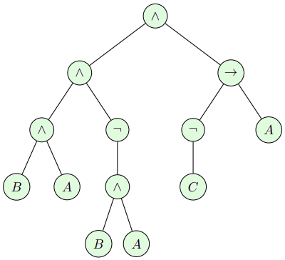
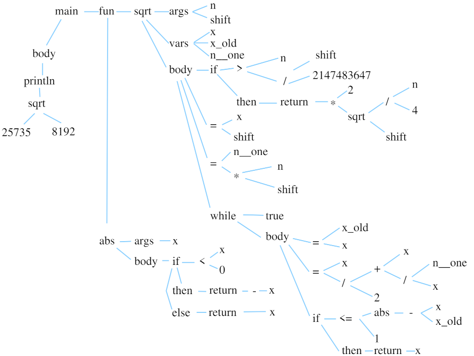

# Abstract syntax trees

## Introduction
Я пролистал некоторое количество лекций по компиляции, и практически все они начинаются с лексера и парсера.
Я же предлагаю подождать с этим до следующего раза, а для начала задаться вопросом, каким именно объектом мы хотим манипулировать.

На вход у нас будет кусок текста (просто длинная строка), на выход мы тоже должны выдать кусок текста.
И между этими текстами должна сохраниться какая-то сущность, смысл.
Нам нужен способ этот самый смысл выразить, уходя от голого текста, с которым работать крайне неудобно.

Неотъемлемой частью любого (императивного? пуристы, поправьте меня) языка программирования являются выражения, как арифметические, так и логические.
Пионером извлечения смысла из записи выражений был [Ян Лукасевич](https://en.wikipedia.org/wiki/Jan_%C5%81ukasiewicz),
который знаменит, помимо прочего, своей [обратной польской записью](https://en.wikipedia.org/wiki/Reverse_Polish_notation).
Например, рассмотрим булевское выражение в [инфиксной записи](https://en.wikipedia.org/wiki/Infix_notation):

$$
((B\wedge A)\wedge(\neg(B\wedge A))) \wedge ((\neg C) \rightarrow A)
$$

Для вычисления выражения мы должны произвести операции в определённом порядке, который соответствует следующему дереву:



Для того, чтобы вычислить значение в узле дерева, мы должны оценить всех его потомков.
То есть, в нашем вычислителе нам нужно уметь выделять память для хранения промежуточных результатов.
На обычных калькуляторах для этого часто используются кнопки = (для получения промежуточного результата) и m+ (для сохранения его в память).
Ян Лукасевич предложил использовать стек, и каждый раз, вычисляя значение в узле, просто брать выражения с верхушки стека, что соответствует обходу нашего дерева в глубину.
В нашем примере мы кладём на стек $A$, затем $C$.
Операция $\neg$ унарная, поэтому берём со стека только один элемент, оцениваем его, и кладём результат на стек.
В данный момент на стеке у нас два элемента, $A$ и $\neg C$, поэтому бинарная операция $\rightarrow$ их возьмёт оба и превратит в один результат на стеке $((\neg C)\rightarrow A)$.
Если мы продолжим обход дерева в глубину, то все узлы будут посещены в следующем порядке:

$$
A C \neg \rightarrow A B \wedge \neg A B \wedge \wedge \wedge
$$

Эта строка - наше изначальное выражение, переписанное из инфиксной нотации в обратную польскую запись.
По факту, мы имеем две записи одного и того же алгоритма на двух разных языках, а дерево помогает не отвлекаться на языковые трудности, а работать со смыслом.

Разрешу себе отвечься: польская (постфиксная) запись позволяет избавиться от скобок в записи и от использования кнопки '=' на калькуляторе, что изрядно укорачивало программы для этих калькуляторов.
В СССР были широко распространены программируемые калькуляторы [МК-61](https://en.wikipedia.org/wiki/Elektronika_MK-61) и [МК-52](https://en.wikipedia.org/wiki/Elektronika_MK-52), не имевшие кнопки равенства.
Как же я упивался своим могуществом в младших классах, притащив в школу калькулятор, которым никто кроме меня не мог воспользоваться! :)

В начале 80х годов Hewlett-Packard рекламировала свой знаменитый [HP-12C](https://en.wikipedia.org/wiki/HP-12C) вот такой картинкой:


Поиграю в Капитана Очевидность: перечёркнутый знак равенства тут обыгрывается одновременно как калькулятор, на котором нет кнопки '=', а также как то, что компании нет равных.
И лично я получаю дополнительное извращённое удовольствие от ношения футболки с таким принтом в 20х годах XXIго века, хотя и не люблю быть ходячим рекламным биллбордом.
Но количество едких комментариев от непонимающих окружающих перевешивает все моральные неудобства от рекламы на пузе :)

Шутки в сторону, обратная польская запись - это просто линейная запись синтаксического дерева выражения, которое и есть суть, смысл.

## Подопытный кролик
Сегодня мы будем работать вот с таким кодом, который вычисляет $\sqrt\pi$, который хранится как число с фиксированной точкой.

```cpp linenums="1"
--8<-- "parser/sqrt-before.wend"
```

### Представление вещественных чисел при помощи целочисленных переменных
В качестве лирического отступления давайте разберёмся в том, что делает наша программа-пример.
Я не стал добавлять в wend ни стандартной плавающей точки ieee754, ни позитов.
Это сделать несложно, но раздует компилятор, а я хочу, чтобы он был как можно более компактным.
Двух разных типов (`bool` и `int`) мне вполне хватит для того, чтобы показать, как работает проверка типов.

Что же делать, если мне хочется уметь работать с вещественными числами?
Мои 32-битные переменные хоть и называются целочисленными, но на самом деле я их могу интерпретировать вообще как хочу.
Давайте представим, что я хочу хранить число $\pi$ с точностью до четвёртого знака после запятой.
Если я умножу $\pi$ на $10^5$ , то получу 31415.9265(...).
То есть, я могу написать в коде `p = 31415; print p/10000; print "."; print p%10000;`, и получу на экране заветное 3.1415.

Идея очень простая: мы выбираем некий множитель $m$, и для представления нужного числа (в данном случае $\pi$) мы храним целую часть числителя дроби $(\pi*m)/m$.
Размер числа $m$ нам даёт фиксированную точность представления вещественного числа.
Исторически чаще всего выбирают в качестве множителя степени двойки, поскольку можно заменить (когда-то) дорогие операции деления и нахождения остатка от деления на дешёвые сдвиг и побитовое "И".
Например, если $m$ выбрано равным $2^31$, то можно хранить числа от -1 до 1 с шагом примерно $4,7*10^{-10}$; а если $m$ выбрано равным $2^{10}$,
то можно представлять числа от -2'097'152 до 2'097'151 с шагом 0,0009765625.

Давайте представим, что у меня есть переменная `p`, в которой хранятся 32 вот таких бита: `00000000000000000110010010000111`.
Если я сделаю `print p;`, то получу на экране 25735.
Однако же в я хочу интепретировать как целое число только старшие 19 битов, а вот младшие 13 - это дробная часть.
Если я сделаю `print p/8192; print "."; print ((p%8192)*10000)/8192;`, то получу на экране 3.1414, то есть, число $\pi$ с точностью в 13 битов после запятой, что чуть-чуть грубее одной десятитысячной.

Сложение и вычитание чисел с фиксированной точкой выполняются с помощью целочисленной арифметики при условии, что экспоненты левого и правого операндов одинаковы.
Если у нас есть два числа $p$ и $q$ с фиксированной точкой одинаковой точности и их соответствующее целочисленное представление $p*m$ и $q*m$,
то сумма их представлений $p*m+q*m$ является представлением суммы самих чисел $p+q$, поскольку $p*m/m + q*m/m = (p+q)*m/m$.
С разностью то же самое.
С умножением, однако, нужно чуть поработать: $(p*m) * (q*m) = p*q*m^2$, поэтому для представления числа $p*q$ с точностью $m$ нужно поделить на $m$ произведение представлений $p*m$ и $q*m$.

### Вычисление квадратного корня методом Ньютона
Моя программа-пример вычисляет квадратный корень из $\pi$ с точностью до 13 битов.
Сам алгоритм очень простой: если мы хотим извлечь корень $x = \sqrt{a}$ для какого-то положительно числа $a$,
то мы можем использовать итеративный метод: выберем произвольное число $x_1$ (например 1) и определим последовательность

$$
x_{n+1} = \frac12\left(x_n + \frac{a}{x_n}\right).
$$

Интуитивно это вполне очевидно: если $x_n$ слишком большой ($x_n>\sqrt a$) , то $a/x_n$ будет слишком маленьким ($a/x_n < \sqrt a$) , и их среднее арифметическое $x_{n+1}$ будет ближе к $a$.
Этот алгоритм был известен ещё в Вавилоне больше трёх тысяч лет назад: знаменитая табличка YBC7289 содержит значение $\sqrt 2$ с точностью до шести знаков.
Три тысячи лет спустя было обнаружено, что этот алгоритм эквивалентен методу Ньютона нахождения корня уравнения $f(x) = x^2 - a$:
имея приближение корня $x_{n}$, мы можем приблизить функцию $f$ её касательной при помощи разложения в ряд Тейлора первой степени $f(x_n) + f'(x_n)(x-x_n)$, 
приравнять эту функцию нулю и получить улучшенное приближение корня $x_{n+1}= x_n - \frac{f(x_n)}{f'(x_n)}$, выведя ровно Вавилонскую формулу.

Единственное, что осталось понять, так это когда нам нужно остановиться.
В моём коде я останавливаюсь тогда, когда новое приближение просто равно предыдущему.
Ффух, математика закончилась, извините, но я не мог не объяснить, что и как делает тестовая программа.
Я выбрал именно этот пример, поскольку он достаточно короткий, но при этом использует все инструкции моего языка wend.

## AST for the sqrt()

Давайте нарисуем синтаксическое дерево нашей программы.
Корнем дерева является точка входа, функция `main()`.
Как-то так выглядит полное дерево:



У `main` есть две вложенные функции, которые являются потомками списка функций `fun`, а также список инструкций `body`.
Нужно понимать, что это дерево выражает структуру программы, но не само её выполнение:
в отличие от предыдущего примера, для вычисления значения в узле `println` нам может понадобиться сделать несколько рекурсивных вызовов оценки соседнего узла `sqrt`,
однако это дерево является абстракцией, которую мы строим из текста программы на *wend*,
и из которой можно сгенерировать программы на различных языках.
Сегодня я напишу код, который переводит это дерево в код на питоне.

Всё, у меня уже нестерпимо чешутся руки, столько разговоров, и ни одной строчки кода, которую можно выполнить! Давайте исправлять ситуацию.
Посмотрите внимательно на дерево: мы можем воплотить эту абстракцию в код с узлами трёх основных типов, а именно:

1. объявления функций
2. инструкции
3. выражения

Давайте создадим модуль `syntree.py`, который будет исключительно хранить данные, никакой логики в нём не будет.
Тогда класс объявления функции может выглядеть как-то так:

```py
class Function:
    def __init__(self, name, args, var, fun, body, deco=None):
        self.name = name       # function name, string
        self.args = args       # function arguments, list of tuples (name, type)
        self.var  = var        # local variables, list of tuples (name, type)
        self.fun  = fun        # nested functions, list of Function nodes
        self.body = body       # function body, list of statement nodes (Print/Return/Assign/While/IfThenElse/FunCall)
        self.deco = deco or {} # decoration dictionary to be filled by the parser (line number) and by the semantic analyzer (return type, scope id etc)
```

В нём есть поле имени функции, списка аргументов, локальных переменных, вложенных функций и список инструкций, составляющий тело функции.
Я ещё добавил дополнительный словарь `deco`, в который буду совать всякую не очень интересную информацию типа номера строки в файле, чтобы обработчик ошибок ругался не очень уж непонятными словами.
Но это будет сильно позже, пока что это будет пустой словарь.

Ровно таким же образом я написал классы инструкций `Print`, `Return`, `Assign`, `While`, `IfThenElse`, а также выражений `ArithOp`, `LogicOp`, `Integer`, `Boolean`, `String`, `Var` и `FunCall`.
Всё, больше ничего для компилятора wend не нужно!
Код модуля содержит 64 строчки, и я не буду его тут приводить полностью, поскольку в нём нет вообще никакой логики, это чисто хранилище.
Он больше не должен изменяться до самого конца (ну, по крайней мере, если у меня не совсем кривые руки :) )
Исходник [доступен на гитхабе](https://github.com/ssloy/tinycompiler/blob/main/syntree.py).

А вот теперь давайте писать интересный код. Созадим синтаксическое дерево из нашего примера:

??? example "AST created manually"
    ```py
    abs_fun = Function('abs',       # function name
        [('x', {'type':Type.INT})], # one integer argument
        [],                         # no local variables
        [],                         # no nested functions
        [                           # function body
            IfThenElse(
                LogicOp('<', Var('x'), Integer(0)),           # if x < 0
                [Return(ArithOp('-', Integer(0), Var('x')))], # then return 0-x
                [Return(Var('x'))])                           # else return x
        ],
        {'type':Type.INT})          # return type

    sqrt_fun = Function('sqrt',                                      # function name
        [('n', {'type':Type.INT}), ('shift', {'type':Type.INT})],    # input fixed-point number (two integer variables)
        [
            ('x', {'type':Type.INT}),                                # three local integer variables
            ('x_old', {'type':Type.INT}),
            ('n_one', {'type':Type.INT})
        ],
        [],                                                         # no nested functions
        [                                                           # function body
            IfThenElse(
                LogicOp('>', Var('n'), ArithOp('/', Integer(2147483647), Var('shift'))),             # if n > 65535
                [Return(ArithOp('*', Integer(2),                    #    return 2*sqrt(n/4)
                        FunCall('sqrt', [ArithOp('/', Var('n'), Integer(4)), Var('shift')])))],
                []),                                                # no else statements
            Assign('x', Var('shift')),                              # x = shift
            Assign('n_one', ArithOp('*', Var('n'), Var('shift'))),  # n_one = n*shift
            While(Boolean(True), [                                  # while true
                Assign('x_old', Var('x')),                          #     x_old = x
                Assign('x',                                         #     x = (x + n_one / x) / 2
                    ArithOp('/',
                        ArithOp('+',
                            Var('x'),
                            ArithOp('/', Var('n_one'), Var('x'))),
                        Integer(2))),
                IfThenElse(                                         #     if abs(x-x_old) <= 1
                    LogicOp('<=',
                        FunCall('abs', [ArithOp('-', Var('x'), Var('x_old'))]),
                        Integer(1)),
                    [Return(Var('x'))],                             #        return x
                    []),                                            #     no else statements
            ]),
        ],
        {'type':Type.INT})                                          # return type

    main_fun = Function('main', # function name
        [],                     # no arguments
        [],                     # no local variables
        [sqrt_fun, abs_fun],    # two nested functions
        [Print(                 # println sqrt(25735, 8192);
            FunCall('sqrt', [Integer(25735), Integer(8192)]),
            True)
        ],
        {'type':Type.VOID})     # return type
    ```


О том, как создавать такое дерево из текста исходника автоматически, мы поговорим в следующий раз.
А пока что сравните этот код с рисунком дерева.
Внимательный читатель заметит некоторые несоответствия, например, унарная операция -x у меня представляется как бинарная операция 0-x, но это, как говорится, детали реализации:
программист на *wend* должен иметь возможность написать -x, а уж как это выражение превращается в бинарный узел в синтаксическом дереве внутри компилятора - не его забота.

Для полноты картины я засунул в словари украшений нашей новогодней ёлки тип переменных и возврата функции, но на данном этапе я не буду его использовать,
поскольку питон имеет динамическую типизацию, и вывод типов и их проверка будут меня волновать сильно позже.


## От синтаксического дерева к коду на питоне
Конечный код может быть сгенерирован одним простым обходом нашего синтаксического дерева в глубину.
Наример, если мы посетили узел `Assign`, он гарантированно имеет только два потомка: узел `Var`, который представляет собой переменную, в которую мы записываем,
и один из узлов-выражений `ArithOp`, `LogicOp`, `Integer`, `Boolean`, `Var` и `FunCall`.
Обратите внимание, что что узел `Var` сам является выражением (мы же можем присвоить значение другой переменной?).
Впрочем, как вы могли заметить, я не упарывался по иерархии классов, и никакого наследования у меня нет в принципе, деление на выражения и инструкции весьма условно.

Возвращаясь к генерации кода во время посещения узла инструкции `Assign`, этот узел синтаксического дерева содержит два потомка: строку `Assign.name` и ссылку на другой узел-выражение `Assign.expr`.
Мой код компилятора выглядит следующим образом:

```py
def stat(n):
    [...]
    if isinstance(n, Assign):
        return '%s = %s\n' % (n.name, expr(n.expr))
    [...]
```


То есть, мы генерируем код типа `x = src`, где `src` - это код выражения, сгенерированный вызовом функции `expr(n.expr)`.
[Полный исходник генератора кода](https://github.com/ssloy/tinycompiler/blob/main/transpy_naive.py) из синтаксического дерева можно найти на гитхабе, там всего 50 строчек.
[Натравив наш недокомпилятор](https://github.com/ssloy/tinycompiler/blob/main/tests/test_syntree.py) на вручную построенное синтаксическое дерево, получим следующий результат:


```py
def main():
    def sqrt(n, shift):
            x = None
            x_old = None
            n_one = None

            if (n) > ((2147483647)/(shift)):
                    return (2) * (sqrt((n) // (4), shift))
            else:
                    pass

            x = shift
            n_one = (n) * (shift)
            while True:
                    x_old = x
                    x = ((x) + ((n_one) // (x))) // (2)
                    if (abs((x) - (x_old))) <= (1):
                            return x
                    else:
                            pass
    def abs(x):
            if (x) < (0):
                    return (0) - (x)
            else:
                    return x

    print(sqrt(25735, 8192), end='\n')
```

При запуске этого файла на экране выведется 14519, что является представлением числа $\sqrt\pi$ с точностью до 13 битов после запятой!
Про вывод 3.1414 вместо 14519 мы поговорим в следующий раз, поскольку неохота мне больше строить синтаксические деревья вручную.
Так что тема следующего разговора - парсинг исходников.


--8<-- "comments.html"
