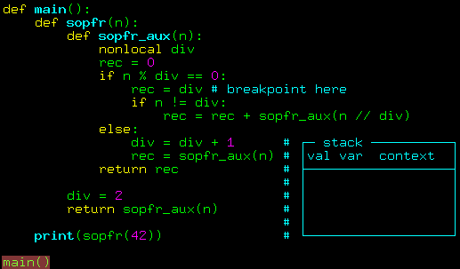

# Displays
## Introduction

Вопрос из области ненормального программирования: насколько сложные программы вы сможете написать на питоне, не пользуясь в принципе переменными (а также агрументами функций),
за исключением пары глобальных массивов?
Правильный ответ: да любой сложности.
Если что-то можно сделать на ассемблере, то уж на питоне и подавно!

Продолжаем разговор о минималистичном компиляторе, который вполне реально написать за выходные.
Задачей стоит транслировать код из придуманного мной языка в x86 ассемблер.
Несмотря на то, что целевым языком является ассемблер, я не мазохист, и пришёл к этому постепенно.
Сначала я транслировал код в питон, и постепенно урезал функционал целевого языка, пока не остался голый ассемблер.
Тема сегодняшнего разговора: генерация кода на питоне без использования переменных.


## Рекурсия для самых маленьких
Факториал целого положительного числа $n$ - это произведение всех положительных целых чисел, меньших или равных $n$.
Например, факториал числа 7 равен $7*6*5*4*3*2*1$, что равняется 5040.
Факториал числа $n$ записывается как $n!$, и задача его вычисления сводится очевидным образом к вычислению $(n-1)!$, а именно, $n! = n * (n - 1)!$

Сама собой напрашивается рекурсивная имплементация:

```py
ssloy@khronos:~$ python3 <<<'
def factorial(n):
    result = 1
    if n > 1:
        result = n * factorial(n-1)
    return result

print(factorial(7))
'
5040
```

С подобного кода зачастую начинают знакомство с программированием, но обычно оставляют за скобками объяснение того, как непосредственно машина его выполняет.
Основным инструментом в таком коде является вызов функции, но как он работает?

Типовой (не единственно возможный, именно типовой) механизм реализации вызова функции основан на сохранении аргументов и локальных переменных функции на стеке и выглядит следующим образом:

1. В точке вызова на стек помещаются параметры, передаваемые функции (+ обычно номер инструкции, на которую нужно вернуться после завершения работы функции).
2. Вызываемая функция в ходе работы кладёт на стек собственные локальные переменные.
3. По завершении вычислений функция очищает стек от своих локальных переменных, записывает результат (обычно в один из регистров процессора).
4. Команда возврата из функции считывает из стека адрес возврата и выполняет переход по этому адресу.
Либо непосредственно перед, либо сразу после возврата из функции стек очищается от аргументов функции.

Нетрудно видеть, что необходимость расширения стека диктуется требованием восстановления состояния вызывающего экземпляра функции (то есть её параметров, локальных данных и адреса возврата) после завершения вызванной функции.

Таким образом, при каждом рекурсивном вызове функции создаётся новый набор её параметров и локальных переменных, который вместе с адресом возврата размещается на стеке.
Чтобы не быть голословным и не теоретизировать лишку, давайте добавим одну строчку интроспекции в наш код с факториалом:

```py
ssloy@khronos:~$ python3 <<<'
import inspect

def factorial(n):
    result = 1
    # вот эту строчку я добавил:
    print("instances of n:", [frame[0].f_locals["n"] for frame in reversed(inspect.stack()[:-1])])
    if n > 1:
        result = n * factorial(n-1)
    return result

print(factorial(7))
'
instances of n: [7]
instances of n: [7, 6]
instances of n: [7, 6, 5]
instances of n: [7, 6, 5, 4]
instances of n: [7, 6, 5, 4, 3]
instances of n: [7, 6, 5, 4, 3, 2]
instances of n: [7, 6, 5, 4, 3, 2, 1]
5040
```

При каждом вызове `factorial(n)` добавленная мной строчка проходит по стеку, и выводит на экран все экземпляры переменной `n`, что находит.
Для вычисления 7! функция `factorial(n)` вызывается 7 раз, и нетрудно видеть, что в какой-то момент машина хранит все 7 экземпляров переменной.
Разумеется, для переменной `result` ровно такая же картина.

## Основная мысль этой статьи
Питон делает за нас массу работы, но это не значит, что без его помощи нам не обойтись.
Ассемблер не даёт роскоши автоматической передачи аргументов, надо руками работать со стеком.
Я предлагаю по-прежнему использовать питон в качестве целевого языка, но урезать используемые возможности до уровня ассемблера: по факту мы будем писать на ассемблере, но с синтаксисом питона.
У такого подхода два преимущества:

1. Мы не обязаны строго следовать всем ограничениям сразу.
Например, я могу ограничить возможности передачи аргументов функциям, но не обязан сразу прыгать в мир с четырьмя регистрами.
Я вполне могу пользоваться питоновским разборщиком выражений, написав комфортное мне `5//-3`, если такое потребуется, вместо километровой портянки инициализации всех нужных регистров с требуемыми флагами.
Таким образом, я могу в любой момент иметь работающий компилятор, и допиливать его по кусочкам.

2. Кроме того, мы не обязаны прыгать с головой в не очень дружелюбный для новичков мир, в котором зачастую даже примитивный print() не работает, а уж как работают дебагеры - это отдельная песня.
Мы можем использовать любимый освоенный IDE, ставить точки останова, выводить на экран что угодно и комфортно изменять руками сгенерированный код, чтобы понять, что же в нём пошло не так.

Мы не обязаны пользоваться встроенным стеком питона, можно сэмулировать его работу при помощи самописного стека.
Давайте заведём глобальный массив `stack`, и будем в нём хранить аргументы и локальные переменные функций.
Тогда вычисление факториала можно переписать (руками!) следующим образом:

```py
ssloy@khronos:~$ python3 <<<'
def factorial():                             # n is stack[-1]
    stack.append(1)
    if stack[-2] > 1:                        # n is stack[-2], result is stack[-1]
        stack.append(stack[-2]-1)
        stack[-2] = stack[-3] * factorial()  # n is stack[-3], result is stack[-2]
        stack.pop()
    return stack.pop()

stack = []
stack.append(7)
print(factorial())
stack.pop()
'
5040
```

В этом коде мы больше не пользуемся в принципе переменными питона за исключением одного-единственного массива `stack`.
Эта программа очень похожа на то, что я хочу получить автоматически при помощи моего компилятора, и переход от предыдущей к этой и есть основная мысль статьи.
Отставьте свою чашку с чаем, посмотрите на код внимательно, если нужно, нарисуйте стек на листочке.

Я написал код руками, и мне не очень нравится, что я был должен вручную отслеживать положение переменных в стеке.
Для того, чтобы обратиться к одной и той же переменной n, я был вынужден вызывать три разных выражения `stack[-1]`, `stack[-2]` и `stack[-3]`.
Это не очень хорошо, нужно найти более дубовый способ.
Самое время вспомнить про таблицы символов из [прошлой статьи](symtable.md).

## Подопытный кролик

Давайте отложим факториал и рассмотрим простейший нетривиальный пример c несколькими разными вызовами функций.
Слева вы видите исходный код на wend, справа его трансляция в питон при помощи [версии v0.0.3](https://github.com/ssloy/tinycompiler/releases/tag/v0.0.3) моего компилятора.
Именно она была описана в [прошлой статье про таблицы символов](symtable.py).
Текущая задача - переписать правую часть руками без использования переменных, практически так же, как я сделал с факториалом.

[](display/sopfr1.png)

Если вдруг код на картинке слишком ломает глаза, давайте я его дам прямым текстом:

??? example "sopfr.wend"
    ```cpp linenums="1"
    --8<-- "display/sopfr.wend"
    ```

??? example "sopfr.py"
    ```py linenums="1"
    --8<-- "display/sopfr.py"
    ```

Данная программа считает для данного числа сумму его простых множителей.
Например, $20 = 5*2*2$, так что $\mathrm{sopfr}(20) = 2 + 2 + 5 = 9$.
Эту функцию часто называют [целочисленным логарифмом](https://oeis.org/A001414), что неудивительно, поскольку вполне очевидно, что $\mathrm{sopfr}(a * b) = \mathrm{sopfr}(a) + \mathrm{sopfr}(b)$.
Математики довольно активно изучают свойства этой функции, но это несколько выходит за рамки нашего обсуждения :)

В данном коде мне интересно несколько вещей:

1. У нас есть три вложенных области видимости.
2. У нас есть функции с разным количеством аргументов и разным количеством локальных функций.
3. У нас есть обращение к **нелокальной** переменной `div` из функции `sopfr_aux`.

Последнее представляет особый интерес.
Давайте вспомним, что в последнем примере с факториалом мне приходилось руками отслеживать положение локальных переменных на стеке, размер которого менялся.
Это неприятно, но совсем нестрашно, поскольку все изменения стека внутри одной функции известны во время компиляции: сначала я обращаюсь к переменной `n` как `stack[-1]`,
а после добавления локальной переменной `result` стек вырос, и `n` стал предпоследним элементом `stack[-2]`.
А что делать, кода стек меняется в рантайме? А ведь это происходит крайне регулярно.

## Упражнение 1
Давайте вернёмся к нашему подопытному кролику вычисления `sopfr(n)`. Поставим точку останова на строке `rec = div`:


42 раскладывается на множители 2, 3, 7, то есть, интерпретатор должен пройти через эту строчку трижды.
Возьмите листочек и карандаш, и нарисуйте состояние стека в каждый из трёх раз (меня интересуют только переменные, всякие адреса ни к чему).

Давайте я помогу с первой точкой останова.
Функция `main()` на стек кладёт 42, и это соответствует переменной `n` в функции `sopfr(n)`.
Она, в свою очередь, кладёт 2 на стек (переменная `div`), и затем снова кладёт 42 (аргумент функции `sopfr_aux(n)`).
Ну а `sopfr_aux` создаёт локальную переменную `rec`, положив на стек 0, и доходит до точки останова, поскольку 42 делится на 2.
Таким образом, когда мы дойдём в первый раз до точки останова, стек будет выглядеть следующим образом: [42,2,42,0].
Вот небольшая анимация процесса:



Теперь же оторвитесь от статьи, и попробуйте нарисовать стек для второй и третьей точки останова.
Задача тривиальная, но готов спорить, что многие ошибутся.
Если кто ошибся - отписывайтесь в комменты, не стесняйтесь :)

??? question
    

Не удивляйтесь, это совершенно нормальный ответ, вот я добавил самую малость интроспекции кода для проверки результата:

??? example "Proof"
    ```py
    ssloy@khronos:~$ python3 <<<'
    import inspect

    def main():
        def sopfr(n):
            def sopfr_aux(n):
                nonlocal div
                rec = 0
                if n % div == 0:
                    # breakpoint, print stack
                    var = {"main":[], "sopfr":["n","div"], "sopfr_aux":["n","rec"]}
                    print([frame[0].f_locals[name] for frame in reversed(inspect.stack()[:-1]) for name in var[frame[3]]])
                    rec = div
                    if n != div:
                        rec = rec + sopfr_aux(n // div)
                else:
                    div = div + 1
                    rec = sopfr_aux(n)
                return rec

            div = 2
            return sopfr_aux(n)

        print(sopfr(42))

    main()
    '
    [42, 2, 42, 0]
    [42, 3, 42, 2, 21, 0, 21, 0]
    [42, 7, 42, 2, 21, 0, 21, 3, 7, 0, 7, 0, 7, 0, 7, 0, 7, 0]
    12
    ```

# Таблицы символов спешат на помощь
Когда я переписывал на ассемблерном питоне факториал, я обращался к переменным просто по сдвигу от вершины стека, и уже даже для локальных переменных этот сдвиг был разным, но хотя бы был известен в compile time.
А тут всё сильно иначе.
Дойдя до нашей точки останова, мы захотим записать `div` в `rec`: одна переменная локальная, а вторая нелокальная, и она закопана очень глубоко по стеку; при этом глубина неизвестна во время компиляции.
С другой стороны... Давайте посмотрим, как выглядит таблица символов для нашей программы:


У нас есть три вложенных области видимости переменных: `main`, `sopfr`, `sopfr_aux`.

В функции `main` переменных нет, в `sopfr` есть две целочисленные переменные `n` и `div`, а в `sopfr_aux` есть две целочисленные переменные `n` и `rec`.

До сих пор мой компилятор обращался к переменным по их имени, теперь же пора их пронумеровать и про идентификаторы забыть.
Вот [diff коммита](https://github.com/ssloy/tinycompiler/commit/0c3ba224d7e1200b0fb15166a48c6af7ac003e70#diff-b60626824b61e9cb42755e5894e5b70f529425116f6c93e40d785f6f31754ffe),
в котором я просто добавил счётчики областей видимости и переменных внутри каждой области.
По факту, в таблицу символов я добавил вот эти фиолетовые циферки:


Теперь, когда я захочу обратиться к переменной `div`, мне не нужен её идентификатор, мне достаточно знать, что это переменная с индексом 1 в области видимости 1, то есть для идентификации мне хватит пары чисел.
Теперь у нас есть всё необходимое для того, чтобы избавиться от переменных и для `sopfr`, который изрядно сложнее факториала.
Напоминаю, что я по-прежнему пишу код руками, мне это нужно для того, чтобы понять, как будет работать мой компилятор.

Вот код картинкой:

[](display/sopfr2.png)

И он же текстом:

??? example "sopfr-no-variables.py"
    ```py
    ssloy@khronos:~$ python3 <<<'
    def main():
        def sopfr():
            def sopfr_aux():
                global display,stack,eax
                stack += [None]*1        # allocate memory for one local variable rec
                stack += [display[2]]    # save old frame pointer
                display[2] = len(stack)-3 # frame pointer for sopfr_aux()
                stack[display[2]+1] = 0   # rec = 0

                if stack[display[2]+0] % stack[display[1]+1] == 0:  # if n % div == 0
                    print(display,stack)  # BREAKPOINT!
                    stack[display[2]+1] = stack[display[1]+1]       # rec = div
                    if  stack[display[2]+0] != stack[display[1]+1]: # if n != div
                        stack += [stack[display[2]+0]//stack[display[1]+1]] # push n/div ┐
                        sopfr_aux()                                         #            > sopfr_aux(n/div)
                        del stack[-1:]                                      #  pop n/div ┘
                        stack[display[2]+1] = stack[display[2]+1] + eax
                else:
                    stack[display[1]+1] = stack[display[1]+1] + 1
                    stack +=[stack[display[2]+0]] # push n  ┐
                    sopfr_aux()                   #         > sopfr_aux(n) call
                    del stack[-1:]                #  pop n  ┘
                    stack[display[2]+1] = eax

                eax = stack[display[2]+1]
                display[2] = stack.pop()  # restore frame pointer
                del stack[-1:]            # remove rec from stack

            global display,stack,eax
            stack += [None]*1         # allocate memory for one local variable div
            stack += [display[1]]     # save old frame pointer
            display[1] = len(stack)-3 # frame pointer for sopfr()
            stack[display[1]+1] = 2   # div = 2
            stack += [stack[display[1]+0]] # push n ┐
            sopfr_aux()                    #        > sopfr_aux(n)
            del stack[-1:]                 #  pop n ┘
            display[1] = stack.pop()  # restore frame pointer
            del stack[-1:]            # remove div from stack

        global display,stack,eax
        stack += [None]*0           # no local variables
        stack += [display[0]]       # save old frame pointer
        display[0] = len(stack)-1   # frame pointer for main()
        stack += [42]               # push 42 ┐
        sopfr()                     #         > sopfr(42)
        del stack[-1:]              #  pop 42 ┘
        print(eax)
        display[0] = stack.pop()    # restore frame pointer

    display = [ None ]*3 # uninitialized frame pointers
    stack   = []         # empty stack
    eax     = None       # registers
    main()
    '
    [0, 1, 4] [None, 42, 2, None, 42, 0, None]
    [0, 1, 10] [None, 42, 3, None, 42, 2, None, 21, 0, 4, 21, 0, 7]
    [0, 1, 25] [None, 42, 7, None, 42, 2, None, 21, 0, 4, 21, 3, 7, 7, 0, 10, 7, 0, 13, 7, 0, 16, 7, 0, 19, 7, 0, 22]
    12
    ```

На первый взгляд пугающе, но на самом деле ничего сложного.
Давайте разберём, что тут происходит.
Перво-наперво смотрим на то, что у нас добавилось глобальных переменных.
Теперь у нас есть не только `stack`, но также появились массив `display` и переменная `eax`.
Стек своей роли не менял, переменная `eax` эмулирует регистр процессора, и согласно договорённости о вызовах функций для x86, я буду класть в этот "регистр" возвращаемое значение функций.

А вот с глобальным массивом `display` интереснее.
Обратите внимание, что он непустой.
Этот массив не будет менять своего размера, количество его ячеек равно количеству разных областей видимости в нашей таблице символов, в данном случае 3.
Смысл в том, что при вызове каждой функции мы будем записывать в соответствующую ячейку индекс вершины стека,
что позволит нам обратиться к переменной `div` как `stack[display[1]+1]`, а к переменной `rec` как `stack[display[2]+1]`.
Эта техника убирает наглухо зависимость от рантайма, каждая переменная всегда идентифицируется одной и той же, постоянной парой чисел, которую мы просто берём из таблицы символов.
Разумеется, при вызове функции нам нужно будет сохранить (на стек, куда же ещё) старое значение `display`, а по завершении его восстановить.

Таким образом, тело любой функции с `nlocals` локальных переменных и `nargs` параметров у нас будет выглядеть следующим образом:

```py
def foo():
  global display,stack,eax
  stack += [None]*nlocals                     # reserve place for local variables
  stack += [display[scope]]                   # save old frame pointer
  display[scope] = len(stack)-nlocals-nargs-1 # set new frame pointer for foo()
  ...                                         # function body
  display[scope] = stack.pop()                # restore old frame pointer
  eax = ...                                   # return value
  if nlocals>0:                               # remove local variables from stack
    del stack[-nlocals:]
```

Ну а вызов такой функции будет выглядеть очень просто:

1. положить на стек `nargs` значений,
2. вызвать функцию,
3. удалить со стека `nargs` значений.

Я не просто так остановился на `sopfr`, я потратил целый день на то, чтобы выбрать пример.
Он хорош тем, что у него есть целых три разных функции, у которых разное количество параметров, разное количество локальных переменных, и даже есть нелокальная переменная.
Таким образом, у него есть три тела функции, и даже ещё больше разных вызовов, что позволяет увидеть, что оформляются они абсолютно одинаково и исключительно при помощи информации, доступной из таблицы символов.

## Упражнение 2
Код мы переписали, но структура-то его не изменилась.
Давайте оставим точку останова ровно там же, где и раньше, и в качестве упражнения отрисуем состояние `display` и `stack` все три раза.
Сейчас я прятать результат не буду, всё равно сходу стрелочки не запомните.
Не смотрите особо на ответ, нарисуйте стек по-честному, оно поможет понять, что и в какой момент мы сохраняем.

Ответ:

[](display/exercise2.png)

## Финишная прямая: оценка значений выражений
Осталось совсем немного до ассемблерного питона.
Финальный штрих - это оценка значений выражений.
Давайте представим, что у нас есть вот такая программа:

```cpp
fun main() {
  var a:int;
  var b:int;
  [...]
  a+b*2
  [...]
}
```

Тогда в нашей таблице символов у нас будет одна область видимости переменных с идентификатором 0, и внутри у неё будут две переменных с идентификаторами 0 и 1, соответственно.
В данный момент меня интересует, как посчитать выражение `a+b*2`.

В ассемблере оно будет выглядеть как-то так (напоминаю, что в GNU ассемблере операторы имеют вид `op src dst`):

```asm
mov display+0, %eax  # найти фрейм функции main
mov -1(%eax), %ebx   # положить значение b в регистр ebx
mov -0(%eax), %eax   # положить значение a в регистр eax
imul 2, %ebx         # ebx = 2 * ebx
add %ebx, %eax       # eax = eax + ebx
```

Всё бы хорошо, но вот только тут мне пришлось хитрить: для того, чтобы положить `b` в `ebx`, мне нужно испортить значение `eax`, так что сначала я читал аргумент `b`, и только потом `a`.
А ещё я хитро положил результат `2*ebx` назад в `ebx`...
А ещё надо помнить, что регистров очень мало, и на выражение `a + b * 2 - foo(c - 3, d + 10*d, bar(a/4))` регистров не хватит гарантированно.

Ну да не беда.
Давайте вспомним, что мы пишем компилятор, и что парсер нам построил синтаксическое дерево выражения, которое выглядит следующим образом:


Тогда мы можем сгенерировать код оценки значения выражения при помощи обхода дерева в глубину, используя стек для хранения промежуточных выражений.
Представьте, что мы договоримся об очень простой вещи: каждый узел выражения сохраняет своё значение в одном и том же регистре,
например, `%eax` (кстати, вызов функции - это тоже выражение, и в примере с `sopfr` вызов функции именно что сохранял свой результат в `%eax`).

И тогда единственная (рекурсивная) операция оценки выражения может выглядеть следующим образом (для простоты я говорю здесь только о бинарных операциях типа арифметических):

```asm
оценить левое выражение (результат сохранён в %eax)
push(%eax)
оценить правое выражение (результат сохранён в %eax)
переложить %eax в %ebx
%eax = pop()
%eax = операция над %eax и %ebx
```

Используя такой подход, выражение `a+2*b` может быть оценено следущим псевдокодом:

```asm
положить a в %eax                       \
push(%eax)                               |
положить 2 в %eax      \                 |
push(%eax)              |                |
положить b в %eax       | 2*b сохранено  | a + 2*b сохранено
переложить %eax в %ebx  |    в %eax      |    в %eax
%eax = pop()            |                |
%eax = %eax * %ebx     /                 |
переложить %eax в %ebx                   |
%eax = pop()                             |
%eax = %eax + %ebx                      /
```

Обратите внимание, что код явно неоптимален, очень легко можно сэкономить много чего (собственно, ассемблерный код, который я привёл ранее, сильно проще и не использует стека).
Но на данном этапе меня оптимизация не интересует в принципе.
Мне нужно найти общий паттерн оценки выражений, и, похоже, он найден!
Об оптимизирующем компиляторе мы поговорим в отдельный раз.

Зато такой подход имеет неоспоримое преимущество: он использует только два регистра и стек, больше ему ничего не нужно!
Так что finishing touch над нашей `sopfr`: все выражения оцениваются в регистр `eax`.
Я по-прежнему написал код руками, но опять же, исключительно для проверки работоспособности подхода.
Узрите же питонассемблерный код!

[](display/sopfr3.png)

И он же текстом:

??? example "fully castrated python"
    ```py
    ssloy@khronos:~$ python3 <<<'
    def main():
        def sopfr():
            def sopfr_aux():
                global display,stack,eax,ebx
                stack += [None]*1         # allocate memory for one local variable rec
                stack += [display[2]]     # save old frame pointer
                display[2] = len(stack)-3 # frame pointer for sopfr_aux()
                eax = 0
                stack[display[2]+1] = eax # rec = 0

                eax = stack[display[2]+0] # n
                stack += [eax]            # stash left argument
                eax = stack[display[1]+1] # div
                ebx = eax                 # right argument
                eax = stack.pop()         # recall left arg
                eax = eax % ebx           # n % div
                stack += [eax]            # stash left argument
                eax = 0
                ebx = eax                 # right argument
                eax = stack.pop()         # recall left arg
                eax = eax == ebx          # n % div == 0
                if eax:  # if n % div == 0
                    print(display,stack)  # BREAKPOINT!
                    eax = stack[display[1]+1] # div
                    stack[display[2]+1] = eax # rec = div
                    eax = stack[display[2]+0] # n
                    stack += [eax]            # stash left argument
                    eax = stack[display[1]+1] # div
                    ebx = eax                 # right argument
                    eax = stack.pop()         # recall left arg
                    eax = eax != ebx          # n != div
                    if eax: # if n != div
                        eax = stack[display[2]+1] # rec
                        stack += [eax]            # stash left argument
                        eax = stack[display[2]+0] # n
                        stack += [eax]            # stash left argument
                        eax = stack[display[1]+1] # div
                        ebx = eax                 # right argument
                        eax = stack.pop()         # recall left arg
                        eax = eax // ebx          # n/div      ┐
                        stack += [eax]            #            │ sopfr_aux(n/div)
                        sopfr_aux()               #            │
                        del stack[-1:]            #  pop n/div ┘
                        ebx = eax                 # right argument
                        eax = stack.pop()         # recall left arg
                        eax = eax + ebx           # rec + sopfr_aux(n/div)
                        stack[display[2]+1] = eax # rec = rec + sopfr_aux(n/div)
                else:
                    eax = stack[display[1]+1] # div
                    stack += [eax]            # stash left argument
                    eax = 1
                    ebx = eax                 # right argument
                    eax = stack.pop()         # recall left arg
                    eax = eax + ebx           # div + 1
                    stack[display[1]+1] = eax # div = div + 1
                    eax = stack[display[2]+0] # push n ┐
                    stack +=[eax]             #        │ sopfr_aux(n) call
                    sopfr_aux()               #        │
                    del stack[-1:]            #  pop n ┘
                    stack[display[2]+1] = eax

                eax = stack[display[2]+1]
                display[2] = stack.pop()  # restore frame pointer
                del stack[-1:]            # remove rec from stack

            global display,stack,eax,ebx
            stack += [None]*1         # allocate memory for one local variable div
            stack += [display[1]]     # save old frame pointer
            display[1] = len(stack)-3 # frame pointer for sopfr()
            eax = 2
            stack[display[1]+1] = eax # div = 2
            eax = stack[display[1]+0] # push n ┐
            stack += [eax]            #        │ sopfr_aux(n)
            sopfr_aux()               #        │
            del stack[-1:]            #  pop n ┘
            display[1] = stack.pop()  # restore frame pointer
            del stack[-1:]            # remove div from stack

        global display,stack,eax,ebx
        stack += [None]*0           # no local variables
        stack += [display[0]]       # save old frame pointer
        display[0] = len(stack)-1   # frame pointer for main()
        eax = 42                    # push 42 ┐
        stack += [eax]              #         │ sopfr(42)
        sopfr()                     #         │
        del stack[-1:]              #  pop 42 ┘
        print(eax)
        display[0] = stack.pop()    # restore frame pointer

    display = [ None ]*3 # uninitialized frame pointers
    stack   = []         # empty stack
    eax,ebx = None,None  # registers
    main()
    '
    [0, 1, 4] [None, 42, 2, None, 42, 0, None]
    [0, 1, 11] [None, 42, 3, None, 42, 2, None, 2, 21, 0, 4, 21, 0, 8]
    [0, 1, 27] [None, 42, 7, None, 42, 2, None, 2, 21, 0, 4, 21, 3, 8, 3, 7, 0, 11, 7, 0, 15, 7, 0, 18, 7, 0, 21, 7, 0, 24]
    12
    ```


## Подводим итог
Повторюсь, что важно в этом коде, так это повторяемость одних и тех же паттернов тела функции, вызова функции и оценки значения выражений,
они в принципе не требуют работы головного мозга, всё пишется исключительно при помощи спинного, что отлично подходит для автоматизации процесса.

[Вот здесь](https://github.com/ssloy/tinycompiler/commit/0c3ba224d7e1200b0fb15166a48c6af7ac003e70) можно посмотреть на все изменения в репозитории с предыдущего релиза, их совсем немного.
Версия компилятора для тестирования - [v0.0.4](https://github.com/ssloy/tinycompiler/releases/tag/v0.0.4).

В итоге мы (почти) не пользуемся ничем от питона, что не умеет ассемблер напрямую.
Практически единственное, что нужно для генерации ассемблерного кода - это поменять трафарет, через который мы пишем код.
В следующий как раз об этом и поговорим!


--8<-- "comments.html"
