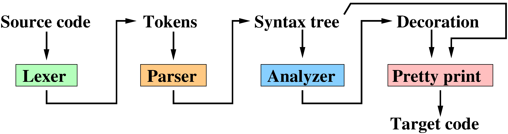
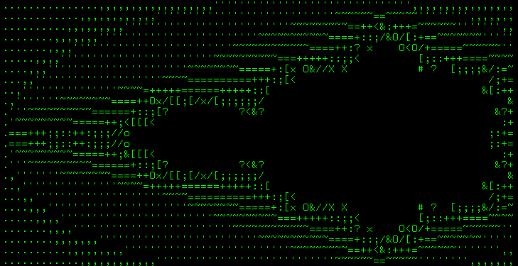
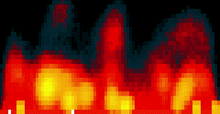
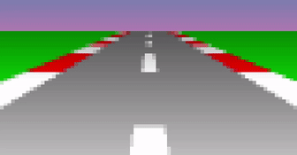

# TinyCompiler: a compiler in a week-end
## Introduction


Have you ever wondered how a compiler works, but you never found courage to find out?
Then this series of articles is for you.
I have never had the chance to look under the hood either, but one week-end I have decided to to write a translator from the esoteric programming language *wend* (short for week-end),
which I just invented myself, into regular GNU assembly.
The goal is to keep the code as tiny as possible, 500-ish lines of python sounds great.
The main [repository lives on github](https://github.com/ssloy/tinycompiler) (don't forget to check out other [tiny* repositories](https://github.com/ssloy) in my profile).

**Spoiler alert:** I am currently working on a [tinyoptimizer](https://github.com/ssloy/tinyoptimizer), a minimalist **optimizing** compiler.

So behold, here is a program that uses virtually all concepts in *wend*:
??? example "Fixed-point square root"
    ```cpp linenums="1"
    --8<-- "home/sqrt.wend"
    ```

Since I am interested in a compiler, the language being implemented is of no importance.
I am not trying to invent yet another C++ killer, that is not the point.
*Wend* is a simple language similar to C or Java, but with far less features.
*Wend* is strongly typed, with no pointers, arrays, closures, dynamic memory allocation, garbage collector or parallel computations.
It supports nested functions and function overloading, a bare minimum for the first dive into compiler theory.

By the way, I have spent a lot more time on writing test programs than on the compiler itself :)

## Graphics!
It is so dull to compute Fibonacci numbers, so here are more eyecandy examples for the compiler, check [test-programs/gfx/*.wend](https://github.com/ssloy/tinycompiler/tree/main/test-programs/gfx) files.

### Mandelbrot set


### Zero-player breakout game
<!--
<video width="320" autoplay="" loop="" muted="" controls=""><source src="home/breakout.mp4" type="video/mp4"></source></video>
-->


### Fire
<!--
<video width="320" autoplay="" loop="" muted="" controls=""><source src="home/fire.mp4" type="video/mp4"></source></video>
-->


### Sunset race
<!--
<video width="320" autoplay="" loop="" muted="" controls=""><source src="home/sunset-race.mp4" type="video/mp4"></source></video>
-->



