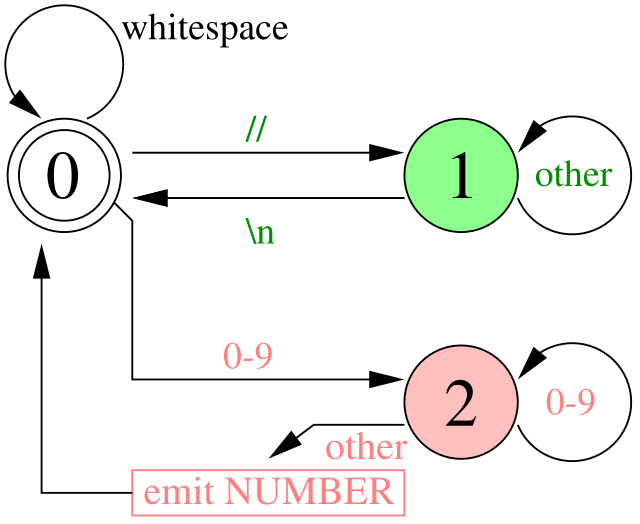
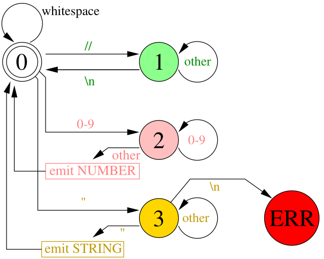
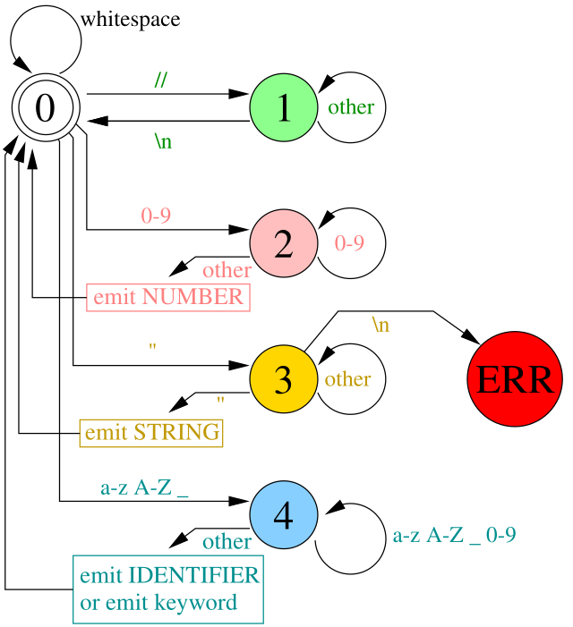
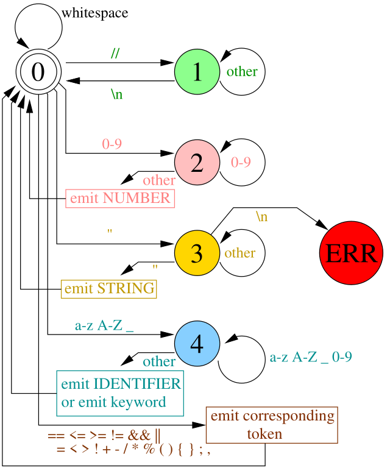

# Homemade lexer

Традиционно парсинг разделяется на два этапа: этап лексического, а затем синтаксического анализа.
На самом деле обе эти стадии являются синтаксическими анализаторами, просто на разном уровне.
Они принимают на вход список символов и создают структуру более высокого уровня.

Такое разделение полезно, потому что работа лексера проще, чем работа парсера.
Лексер просто превращает бессмысленную строку в плоский список таких вещей, как «числовой литерал», «строковый литерал», «идентификатор» или «оператор»,
и может делать такие вещи, как распознавание ключевых слов и отбрасывание пробельных символов.
Формально лексер распознает некоторый набор регулярных языков, то есть, таких языков, которые можно разобрать за один прямой проход
без возврата назад по тексту и без запоминания информации.
Это позволяет сделать очень эффективный разбор: мы просматриваем только по одному байту за раз, чтобы принять решение, и все решения можно упаковать в конечный автомат.

На синтаксический анализатор ложится гораздо более сложная задача - превратить поток лексем, созданный лексером, в дерево разбора, представляющее структуру разобранного языка.
Разделение лексера и парсера позволяет последнему работать с более упорядоченным и содержательным материалом, нежели исходный текст.

В целом, создание лексера - на удивление простая задача, эта статья будет короткой :)
Единственное, что код не очень приятный для чтения, поэтому я начну с самой простой его версии, и буду его постепенно расширять.

## Распознаём числа

Давайте представим, что у нас есть есть вот такой исходный файл:
```
0 // this is a comment to ignore by the lexer
1337
```

А нам нужно его превратить в более осмысленные лексемы
```
[
    INTEGER(0),
    INTEGER(1337)
]
```
Как это сделать?
Как я и сказал, мы превратим исходник в поток символов, а затем будем их один за одним обрабатывать.
Принятием всех решений у меня будет заниматься вот такой конечный автомат с тремя состояниями:



Состояние 0 является начальным, оно соответствует поиску начала новой лексемы.
Пока мы в нём находимся, мы просто игнорируем все пробелы, табуляции и переносы строк, что нам приходят из исходного файла.
Как только мы увидели два слеша, мы переходим в состояние 1, которое соответствует сканированию строкового комментария.
В этом состоянии мы игнорируем все символы помимо переноса строки, при котором возвращаемся в состояние 0.

Если же мы, будучи в состоянии 0, встретим цифру, то немедленно переходим в состояние 2, соответствующее сканированию числовой лексемы.
При любом символе, отличающемся от цифры, мы возвращаемся в состояние 0.
Я забыл нарисовать на этом рисунке, но когда мы находимся в состоянии поиска новой лексемы, то любой входящий текст кроме цифр, пробелов или пары слешей, должен вызывать лексическую ошибку.

Вот реализация подобного лексера:

??? example "Comments and integer tokens"
    ```py linenums="1"
    --8<-- "lexer/lexer0.py"
    ```

## Строки
Для распознавания строк достаточно добавить состояние 3, в которое мы переходим по встреченной кавычке, и из которого по встреченной же кавычке мы выходим.
Если же до второй кавычки нам встретился перенос строки, то это лексическая ошибка.



??? example "String tokens"
    ```py linenums="1" hl_lines="19-20 30-35 45"
    --8<-- "lexer/lexer1.py"
    ```

## Идентификаторы и ключевые слова
Усложняем задачу, добавляем разбор идентификаторов переменных и ключевых слов.
Я хочу, чтобы `_identifier` был разобран как `ID(_identifier)`, а `while` был опознан как ключевое слово, и чтобы была выдана лексема `WHILE`.
На самом деле, само по себе лексическое правило разбора для них одно и тоже, просто перед выдачей лексемы мы проверяем, не входит ли текст в список зарезервированных слов.
Вот у нас добавляется состояние 4, в которое мы заходим либо по подчёркиванию, либо по букве, и дальше всё как обычно:


??? example "Identifiers and reserved words"
    ```py linenums="1" hl_lines="9 22-23 40-49 61-63"
    --8<-- "lexer/lexer2.py"
    ```

## Одно- и двухбуквенные лексемы
Ну и напоследок мне осталась всякая мелочь типа знаков арифметических операций, сравнения и тому подобного.
Если разбираемый кусок состоит из максимум двух символов, то я даже отдельного состояния в своём автомате на это заводить не хочу, проверю, не выходя из состояния 0:



Вот полный код лексера для *wend*, который заменил лексер SLY:

??? example "Operators"
    ```py linenums="1" hl_lines="10-11 27-31 71-72"
    --8<-- "lexer/lexer3.py"
    ```
