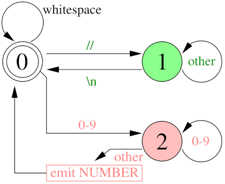

# DIY lexer

As I said before, the separation of the syntax analysis into lexer and parser allows the latter to work with more organized and meaningful material than the source text.
But at the same time, both lexer and parser are syntactic analyzers, just working at a different level.
They take a list of characters as input and create a higher-level structure.

The lexer works with regular languages, which are languages that can be recognized in one linear pass through the text without going back and storing complex information about previous characters.
This approach makes analysis predictable and efficient: at any given time, the lexer makes a decision by looking only at the current character (or a small fixed buffer of characters).
Because of this, lexing can be implemented using a finite state machine, where each state determines what to do when the next symbol is encountered, without the need to store additional context.

Overall, creating a lexer is a surprisingly simple task, this article will be short :)
The only thing is that the code is not very pleasant to read, so I will start with the simplest version of it, and will expand it gradually.

## Recognizing numbers

Let us suppose we have following source file:
```
0 // this is a comment to ignore by the lexer
1337
```

We need to convert it into the following tokens:
```
[
    INTEGER(0),
    INTEGER(1337)
]
```
How do we do that?
As I said, we will turn the source into a stream of characters, and then process them one by one.
I will make all the decisions with this finite state machine made of three states:



State 0 is the initial state, in this state we are looking for the beginning of a new token.
While in state 0, we simply ignore all spaces, tabs and line breaks that come from the source file.
As soon as we see two slashes, we move to state 1, which corresponds to scanning a string comment.
In this state, we ignore all characters other than the line break, which returns us to the state 0.

If, while in state 0, we encounter a digit, we immediately go to the state 2, which corresponds to scanning a numeric token.
At any character other than a digit, we return to state 0.
I forgot to draw in this figure, but, while in state 0, we encounter any incoming character other than digits, spaces, or a pair of slashes, this should cause a lexical error.

Here is an implementation of such a lexer:

??? example "Comments and integer tokens"
    ```py linenums="1"
    --8<-- "lexer/lexer0.py"
    ```

## Strings

To recognize strings, it is enough to add state 3, to which we move by the quotation mark, and from which we exit by the second quotation mark.
If we encounter a line break before the second quote, it is a lexical error.


??? example "String tokens"
    ```py linenums="1" hl_lines="19-20 30-35 45"
    --8<-- "lexer/lexer1.py"
    ```

## Identifiers and keywords
Let us add parsing of variable identifiers and keywords.
I want `_identifier` to be parsed as `ID(_identifier)`, and `while` to be recognized as a keyword, with token `WHILE` to be emitted.
In fact, both are recognized by the same state of the automaton,
but before issuing the token we check whether the text is in the list of  reserved words.

We enter to the state 4 by encountering either and underscore character or a letter, and then it's business as usual:


??? example "Identifiers and reserved words"
    ```py linenums="1" hl_lines="9 22-23 40-49 61-63"
    --8<-- "lexer/lexer2.py"
    ```

## One- and two-character lexemes
Finally, we need all the little things like arithmetic operation signs, comparisons and so on.
If the text to be recognized consists of two characters max,
I don't even bother to create a separate state,
I am issuing the tokens directly from the state 0:


Here is the full lexer code for *wend*, which replaced the SLY lexer:

??? example "Operators"
    ```py linenums="1" hl_lines="10-11 27-31 71-72"
    --8<-- "lexer/lexer3.py"
    ```

--8<-- "comments.html"
