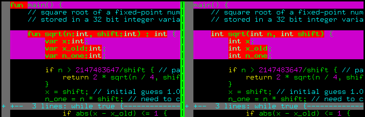
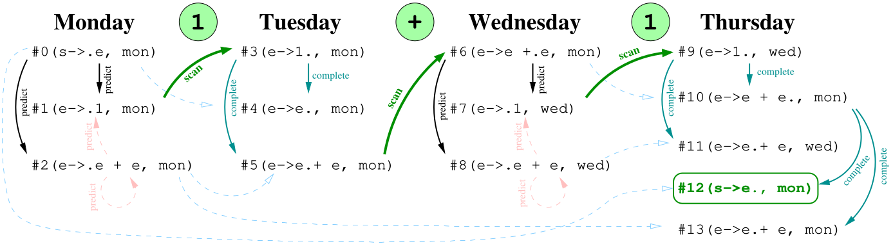

# Homemade parser

Initially, when I decided to write a compiler in a weekend, I decided there was no point in fiddling around and used a third-party lexical / syntax analyzer.
My choice fell on [SLY](https://github.com/dabeaz/sly), a rather well-known library.
And indeed, a couple of hours of work and my compiler perfectly built syntax trees from source code on *wend*.
I tried to look under the hood, struggled with lots of technical terms (LL(1), LR, LALR(1) and so on), and decided that parsing is not for me, I have little interest in the theory of formal languages.
However, in the end it turned out that a basic parser is not so difficult and I rolled up my sleeves.

I was mainly motivated by two things:

* The lack of third-party dependencies is great!
* Unpleasant *wend* syntax.

And the second point irritated me the most.
I wanted a language with a C-like syntax, but I couldn't come up with a grammar for it that SLY could parse.
Here's an illustration:



On the left is the syntax I was forced to use, on the right is the syntax I wanted.
As I understand it, SLY uses an algorithm to parse LALR(1) grammars, which means that the parser has to decide the grammar rule to use,
by looking just one token ahead.

This creates a lot of problems. Imagine a stream of tokens comes in `TYPE(int) ID(sqrt) ...` - is it a variable declaration or a function declaration?
To decide, we need at least a third token.
SLY was giving me errors, I was getting annoyed. Probably, it is possible to get out of it, but I was not very interested in it, so I quit.

Then one day I came across a description of the Earley parser. And it turned out that it is a very curious thing, extremely primitive in implementation if you don't chase performance.
And Earley parser can parse **any context-independent grammars, including ambiguous ones**.

So let's go, shall we? In parsing, our task is to:

1. to recognize whether a sequence of tokens is syntactically correct, i.e., conforms to the grammar of our language.
2. if there are no syntax errors, to build an appropriate abstract syntactic tree.

We will return to the second point later, let's focus on the first one first.

## Parsing 1+1 by hand

For now, let's forget the lexer, and work with character streams and grammar rules by hand.
Let's assume that we have only two terminal characters 1 and +.
Let's start with the simplest grammar, such as this one:

$$
\begin{align}
    s &\rightarrow e\\
    e &\rightarrow 1\\
    e &\rightarrow e+e
\end{align}
$$

Here I have two nonterminal symbols: `s`, the initial symbol of the grammar, and `e`, a nonterminal denoting an arithmetic expression.
This grammar can generate sequences of symbols of the form 1, 1+1, 1+1+1+1, etc.
Note that it is ambiguous: 1+1+1+1 can be parsed as (1+1)+1, or as 1+(1+1).
Usually ambiguous grammars are avoided, but I chose this example to show that Earley parser can handle it.

Now imagine that the sequence whose syntactic correctness we need to check, arrives in the mail at **one character per day**.
This is a realistic assumption, lexers do not produce an array of tokens all at once, but rather send them one at a time.
This means that until we run out of incoming mail, we will have a list of simple tasks for each day.
**In each task we will process only one character of a grammar rule**.
Having processed one symbol, we close the task (but we can open another one).

In our case, while no letter has arrived yet, we can queue a task that allows us to get a nonterminal `s`.
I will write this task as `#0(s->.e, mon)`.
The task number is preceded by the hash sign, then comes the grammar rule to be processed with a marker indicating which symbol of the rule we will process today.
Finally, at the end there is a timestamp indicating the date when we started processing this rule.

When processing each task, we have only three cases:

1. expected symbol (the one after the dot) is a terminal.
2. the expected symbol is a non-terminal
3. There is no expected symbol, the marker is at the end of the grammar rule.

Let's figure out as the play goes on what to do in each of the three cases.

### Monday, symbol 1 arrives.
Worklist at the beginning of the day: `#0(s->.e, mon)`.

1. Take the only task `#0` to recognize the rule `(s->.e, mon)`.
In this task, the character to be processed is the nonterminal `e`.
Let us try to predict how we might obtain it.
We can iterate through the grammar rules, and find those which produce the nonterminal `e`.
Then we can create two new tasks to the worklist:
`#1(e->.1, mon)` and `#2(e->.e + e, mon)`. Close the current task.


2. Go to the next task at hand,`#1(e->.1, mon)`.
Here, the expected symbol (the one right after the marker) is the terminal that matches the one we got in the mail, yay!
The next symbol won't arrive until Tuesday, so we put `#3(e->1., Mon)` in the worklist for Tuesday, notice that we just advance the marker position.

3. Take the task `#2(e->.e + e, mon)`. In this task the expected symbol is the nonterminal `e`, but we have already inserted its production rules
in today's worklist.  Therefore, we skip the task to avoid getting into an infinite loop.

No more job for today, let's go to drink tea.

List of tasks processed for the day: `#0(s->.e, mon)`, `#1(e->.1, mon)`, `#2(e->.e + e, mon)`.

### Tuesday, the + symbol arrives.
Worklist at the beginning of the day: `#3(e->1., mon)`.

1. Let's take the only task so far, `#3(e->1., mon)`, it has a marker at the end, which means we've reached the end of the grammatical rule of the non-terminal `e`.
The timestamp of the task is Monday, so let's run through the Monday worklist and look for those tasks in which `e` comes right after the marker, and these are the tasks
`#0(e->.e, mon)` and `#2(e->.e + e, mon)`.
We queue `#4(s->e., mon)` and `#5(e->e.+e, mon)` to worklist for today. Close `#3`.

2. Go to `#4(s->e., mon)`. Here, the marker is again at the end of the rule, which means that we have reached the end of the grammatical rule of the nonterminal `s`.
On Monday we had no tasks where `s` was the expected symbol, we close `#4`.

3. Take `#5(e->e.+e, mon)`. In it, the expected symbol is the terminal `+`, which matches the symbol we got in the mail, yay!
The next symbol won't come until Wednesday, so we put `#6(e->e+.e., mon)` on the worklist for Wednesday. Tasks for the day are done, let's go for a cuppa.

List of tasks processed for the day: `#3(e->1., mon)`, `#4(e->e., mon)`, `#5(e->e.+ e, mon)`.

### Wednesday, character 1 arrives
Worklist at the beginning of the day: `#6(e->e+.e, mon)`.

1. Take the only task `#6(e->e+.e, mon)`. The expected symbol is the non-terminal `e`, append to the worklist `#7(e->.1, wed)` and `#8(e->.e + e, wed)`.
Note that the timestamp here is Wednesday, not Monday as before.
Recall that this timestamp marks the moment when we started processing a particular grammar rule.

2. Moving on to `#7(e->.1, wed)`. The expected symbol is terminal `1`, which matches the one that arrived in the mail, yay! Queue `#9(e->1., wed)` for Thursday.

3. Moving on to `#8(e->.e + e, wed)`. The expected symbol is the non-terminal `e`, and we have already added matching tasks today when we were processing the task `#6`.
Therefore, we skip `#8` to avoid getting into an infinite loop.  The tasks for the day are over, let's go drink tea.

The list of tasks processed during the day: `#6(e->e +.e, mon)`, `#7(e->.1, wed)`, `#8(e->.e +.e, wed)`.

### Thursday, nothing arrives.
Worklist to start the day: `#9(e->1., wed)`.

The post office says there will be no more incoming mail.

1. Take the only task `#9(e->1., wed)`. No characters are expected in it, because the marker is at the very end of the grammar rule for the nonterminal `e`.
Let us iterate through Wednesday worklist, looking for tasks with `e` as the expected symbol.
The tasks `#6(e->e +.e, mon)` and `#8(e->.e + e, wed)` fit the description.
We schedule `#10(e->e+e., mon)` and `#11(e->e.+e, wed)`, and close `#9`.

2. Moving on to `#10(e->e->e+e., mon)`, this is again a completed grammar rule for the non-terminal `e`.
We run through Monday's worklist, looking for tasks where `e` was expected.
These are `#0(s->.e, mon)` and `#2(e->.e + e, mon)`, so let us queue `#12(s->e., mon)` and `#13(e->e. + e, mon)`, and close `#10`.

3. Take `#11(e->e.+ e, wed)`. Here, the expected character is the terminal `+`, and the post office told us there would be no new characters. We close `#11`.

4. Taking `#12(s->e., mon)`, we see the completed grammar rule for `s`. There was no tasks on Monday where `s` was expected, we close `#12`.

5. We take the last task `#13(e->e. + e, mon)`, it expects a terminal symbol, but we have no more incoming mail, close `#13`.

List of tasks processed during the day: `#9(e->1., wed)`, `#10(e->e. + e., mon)`, `#11(e->e.+ e, wed)`, `#12(s->e., mon)`, `#13(e->e.+ e, mon)`.

### Friday, nothing's coming in
Worklist for the day: it's Friday, what worklist?!

Let's make sure that in the Thursday's worklist we have a completed rule corresponding to the initial nonterminal `s`, which started on Monday.
Yay, there is such a rule, it is `#12(s->e., mon)`! Let's report success and go have a beer.

Let me summarize all the above in the workflow chart:

[](parser/earley.png)

It has arrows indicating which task spawned which one.
The pink dotted arrows show the tasks that we **didn't** create to avoid infinite loops.

As I said before, we only have three options when processing each task:

1. **The expected symbol is a terminal.** Compare the expected symbol with the one that came in in the mail. If they match, queue a new task for **tomorrow**, draw a green arrow.

2. **The expected symbol is a non-temrinal.** Try to predict how this non-terminal might be produced. Add as many tasks as there are corresponding grammar rules, draw black arrows.

3. **There is no expected symbol,** the marker is at the end of the grammatical rule.
That is, we have finished processing this rule, and the input sequence of characters corresponds to some non-terminal.
We check the worklist history, looking for the tasks  where the non-terminal was the expected symbol.
Then we open new tasks by advancing the marker past the non-terminal.
Here we draw blue arrows, they always come in pairs: the solid one comes from the task currently being processed, and the dotted one 
indicates the one old task where we advance the marker.

Note that in the above procedure we didn't store the arrows themselves anywhere, we just used the worklists without any links between them.
We don't even need the task number, the only thing we need is the index of the grammar rule, the marker position and the timestamp.

## Formalization and implementation
The Earley parser processes one input character at a time.
For each input position $j \in [0\dots n]$, it builds a set of $J_j$ pairs, called Earley items.
Each Earley item is of the form $(\alpha \rightarrow \beta.\gamma,k)$. The first part of the item is a grammar rule $\alpha\rightarrow\beta\gamma$.
The rule has a marker (the dot) located somewhere in the right side.
The dot indicates which part of this producing rule has already been processed.
The second part of the pair is the index $k$, the number of tokens encountered before we started processing of the nonterminal $\alpha$.

In code, the pair can be represented as a `Task` class storing three integer indices.

```py
class Task:
    def __init__(self, rule, dot, start):
        self.rule  = rule  # index of the parse rule in the grammar
        self.dot   = dot   # index of next symbol in the rule (dot position)
        self.start = start # we saw this many tokens when we started the rule
```

The algorithm starts with a set $J_0$ consisting of a single pair $(s'\rightarrow .s, 0)$, where $s$ is the initial symbol of the grammar,
and $s'$ is a new artificial symbol introduced to simplify the presentation (just so that the producing rule contains only one non-terminal).
In code, the sets can be represented this way:

```py
    worklists = [ [ Task(0,0,0) ] ]
```

Here the `worklists` will contain all sets $\{J_j\}_{j=0}^n$.
The algorithm successfully parses a sequence of $n$ input tokens $t_0t_1\dots t_{n-1}$ if the pair $(s'\rightarrow s., 0)$ is in set $J_n$, otherwise it reports an error.

The algorithm works as follows: one by one, for each index $j \in [0\dots n]$, we apply the following three rules modifying the worklists, until none of the rules has an effect:

* **SCAN:** If the set $J_j$ contains a pair $(\alpha\rightarrow\beta . t \gamma, k)$, where $t$ matches the current input symbol $t_j$,
then the pair $(\alpha\rightarrow\beta t . \gamma, k)$ is added to $J_{j+1}$.
Note that this rule does not modify the set $J_j$ itself, and it is the only rule that modifies $J_{j+1}$.

* **PREDICT:** If the set $J_j$ contains a pair $(\alpha\rightarrow \beta . c \gamma, k)$, where $c$ is a nonterminal symbol,
then for all grammar rules of the form $c\rightarrow \delta$ the pair $(c\rightarrow .\delta, j)$ is added to $J_j$.
Note the change in the timestamp. Also note that prediction steps can trigger other prediction steps if $\delta$ starts with a non-terminal.

* **COMPLETE:** If the set $J_j$ contains a pair with a completed rule $(c\rightarrow\alpha., k)$,
then for every pair of the form $(\beta\rightarrow\gamma . c\delta, l)$ in set $J_k$, a pair $(\beta\rightarrow\gamma c .\delta, l)$ is added to $J_j$.

The strength of the Earley parser is that it processes several predictions and even completions in parallel.
Erroneous predictions actually die out, because at some point they result in terminals incompatible with the input tokens encountered.

??? example "Earley recognizer"
    ```py linenums="1"
    --8<-- "parser/parser.py"
    ```

This code reports a successful recognition of the 1+1 sequence and prints the worklists for the week.
Compare it with the graph drawn above, they should match.

```
[[(s->.e, mon), (e->.1, mon), (e->.e + e, mon)],
 [(e->1., mon), (s->e., mon), (e->e.+ e, mon)],
 [(e->e +.e, mon), (e->.1, wed), (e->.e + e, wed)],
 [(e->1., wed), (e->e + e., mon), (e->e.+ e, wed), (s->e., mon), (e->e.+ e, mon)]]
```

The above code only gives a binary answer whether the input sequence of tokens corresponds to a given grammar.
So how do we actually build a syntax tree?
Well, we have a graph (in my drawing it corresponds to the arrows drawn with solid lines).
It suffices to trace the path from the initial node to the final one.
Solid blue lines corresponding to the COMPLETE action, match to the nodes of a syntax tree to create.
In this example, there are three of them, so the syntax tree will consist of three nodes, a root + and two leaf nodes 1 and 1.

In my parser, I didn't bother with finding a path through the graph (although it is quite possible),
I just stored a link to the predecessor node, thus obtaining a linked list from the end node to the start node.

You can see the code [in the repository](https://github.com/ssloy/tinycompiler/blob/main/parser.py).

## Afterword
With careful implementation, Earley parser runs in $O(n^3)$ worst-case time, for unambiguous grammars it can run in $O(n^2)$.
On LL and LR grammars, the Earley parser can even run in linear.
John Aycock and Nigel Horspool in their paper ``Practical Earley Parsing'' report that they managed to roughly match
the performance of the Bison LALR parser (their Earley Parser is 50% slower).
This is pretty impressive considering the features Earley parsers have to offer.
In my compiler, I've noticed a performance degradation when moving away from SLY to my own parser, but compile times are still acceptable.

One last thing worth mentioning: operator precedence.
When I used SLY, I mixed all the arithmetic operations into the grammar, and just told the library to deal with the priority itself:

??? example "SLY operator precedence"
    ```py
    precedence = ( # arithmetic operators take precedence over logical operators
         ('left', PLUS, MINUS),
         ('left', TIMES, DIVIDE, MOD),
         ('right', UMINUS), # unary operators
         ('right', UPLUS)
    )

    [...]

    @_('expr PLUS expr',
       'expr MINUS expr',
       'expr TIMES expr',
       'expr DIVIDE expr',
       'expr MOD expr')
    def expr(self, p):
        return ArithOp(p[1], p.expr0, p.expr1, {'lineno':p.lineno})
    ```

This trick won't work here, but it's not a big deal.
The precedence of the operators can be handled in the grammar.
Here is an example of an unambiguous grammar that correctly implements the priority of arithmetic operations:

??? example "Precedence-aware grammar"
    ```py
    terminals = ['MINUS', 'PLUS', 'TIMES', 'DIVIDE', 'INTEGER', 'LPAREN', 'RPAREN']
    grammar = [['expression',   ['addend']                         ],
               ['addend',       ['term']                           ],
               ['addend',       ['addend', 'MINUS', 'term']        ],
               ['addend',       ['addend', 'PLUS', 'term']         ],
               ['term',         ['factor']                         ],
               ['term',         ['term', 'TIMES', 'factor']        ],
               ['term',         ['term', 'DIVIDE', 'factor']       ],
               ['factor',       ['atom']                           ],
               ['factor',       ['PLUS', 'atom']                   ],
               ['factor',       ['MINUS', 'atom']                  ],
               ['atom',         ['INTEGER']                        ],
               ['atom',         ['LPAREN', 'expression', 'RPAREN'] ]]
    ```
