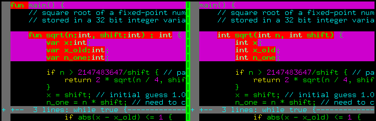

# Синтаксический анализатор Уорли

Изначально, когда я решил написать компилятор за выходные, я решил, что нет смысла заморачиваться, и использовал сторонний лексический / синтаксический анализатор.
Мой выбор пал на [SLY](https://github.com/dabeaz/sly), довольно известную библиотеку.
И действительно, пара часов работы, и мой компилятор прекрасно строил синтаксические деревья из исходного кода на *wend*.
Я пытался было заглянуть под капот, утонул в море технических терминов (LL(1), LR, LALR(1) и тому подобное), и решил, что парсинг своими руками - это не для меня, теория формальных языков меня слабо интересует.
Однако же в итоге выяснилось, что базовый синтаксический анализатор - это не так сложно, и я закатал рукава.

В основном меня на это мотивировало две вещи:

* Отсутствие сторонних зависимостей - это здорово!
* Неприятный синтаксис *wend*.

Причём второй пункт меня удручал больше всего. Я хотел язык с C-подобным синтаксисом, но так и не смог придумать под него грамматики, которую смог бы разобрать SLY.
Вот иллюстрация:



Слева тот синтаксис, который я был вынужден использовать, справа тот, который я хотел.
Насколько я понимаю, SLY использует алгоритм для разбора LALR(1) грамматик, а это означает, что парсер должен понимать, какую грамматическую конструкцию разбирает,
подглядывая всего лишь на одну лексему вперёд.
Это создаёт массу проблем. Представьте, что приходит поток лексем `TYPE(int) ID(sqrt) ...` - это объявление переменной или объявление функции?
Чтобы решить, нам нужна минимум третья лексема.
SLY на меня ругался, я раздражался и чесал затылок. Наверное, можно выкрутиться, но мне это было не очень интересно, и я плюнул.

И однажды наткнулся на описание синтаксического анализатора Уорли. И выяснилось, что это очень любопытная штука, крайне примитивная в реализации, если не гнаться за производительностью.
А ещё парсер Уорли может разбирать **любые контекстно-независимые грамматики, включая неоднозначные**.

Ну что, поехали? При синтаксическом анализе нашей задачей является:

1. распознать, является ли некая последовательность лексем синтаксически корректной, то есть, соответствующей грамматике нашего языка.
2. при отсутствии синтаксических ошибок построить соответствующее абстрактное синтаксическое дерево.

На втором пункте мы остановимся попозже, для начала сконцентрируемся на первом.

## Парсим 1+1 вручную

Пока что абстрагируемся от лексера, и просто вручную поработаем с потоками символов и грамматическими правилами.
Допустим, что у нас есть всего два терминальных символа 1 и +.
Рассмотрим для начала простейшую грамматику, например, такую:

$$
\begin{align}
    s &\rightarrow e\\
    e &\rightarrow 1\\
    e &\rightarrow e+e
\end{align}
$$

Тут у меня два нетерминальных символа: s, начальный символ грамматики, и e, нетерминал, обозначающий арифметическое выражение.
Эта грамматика может порождать последовательности символов вида 1, 1+1, 1+1+1 и т.д.
Обратите внимание, что она неоднозначна: 1+1+1 можно распарсить как (1+1)+1, а можно как 1+(1+1).
Обычно неодназначных грамматик пытаются избегать, но я специально выбрал этот пример, чтобы показать, что парсеру Уорли это не помеха.

А теперь представьте себе, что та последовательность, синтаксическую корректность которой нам нужно проверить,
прибывает по почте, причём **по одному символу в день**.
Это вполне реалистичная ситуация, когда лексер выдает не сразу массив лексем, а отправляет их по одной.

Это означает, что пока не кончатся входящие письма, у нас на каждый день будет формироваться какой-то список простеньких задач.
**В каждой задаче мы будем обрабатывать только один символ грамматического правила.**
Обработав один символ, мы задачу закрываем (но, правда, можем при этом открыть другую).

В нашем случае, пока ещё не прибыло ни одного письма, мы можем поставить в очередь задачу, позволяющую получить нетерминал `s`.
Я запишу эту задачу как `#0(s->.e, mon)`. За решёткой у меня стоит номер задачи, потом идёт обрабатываемое грамматическое правило с маркером, показывающим, какой символ правила мы будем сегодня обрабатывать.
Ну и в конце идёт метка даты, показывающей, когда мы начали обрабатывать это правило.

При обработке каждой задачи у нас есть только три варианта:

1. Ожидаемый символ - терминал.
2. Ожидаемый символ - нетерминал
3. Ожидаемого символа нет, маркер стоит в конце грамматического правила.

Давайте придумаем по ходу пьесы, что делать в каждом из трёх случаев.

### Понедельник, прибывает символ 1

Список задач на начало дня: `#0(s->.e, mon)`

1. Берём пока что единственную задачу `#0` распознать правило `(s->.e, mon)`.
В этой задаче обрабатываемый символ - это нетерминал `e`.
Давайте попробуем предсказать, каким образом мы его можем получить.
Смотрим в грамматику, и добавляем в список задач правила, позволяющие получить `e`: 
`#1(e->.1, mon)` и `#2(e->.e + e, mon)`. Закрываем текущую задачу.

2. Переходим к следующей задаче `#1(e->.1, mon)`. В ней ожидаемый символ (тот, что стоит сразу за маркером) - это терминал, который совпадает с тем, что нам прислали по почте, ура!
Следующий символ придёт только во вторник, поэтому ставим в список задач на вторник `#3(e->1., пн)`, обратите внимание, что мы просто передвинули маркер.

3. Берём задачу `#2(e->.e + e, mon)`. В ней ожидаемый символ - это нетерминал `e`, но правила, позволяющие его получить, мы уже сегодня в таски закидывали.
Посему задачу пропускаем, чтобы не попасть в бесконечный цикл.
Задачи на день закончились, идём пить чай.

Список обработанных за день задач: `#0(s->.e, mon)`, `#1(e->.1, mon)`, `#2(e->.e + e, mon)`.

### Вторник, прибывает символ +

Список задач на начало дня: `#3(e->1., mon)`

1. Берём пока что единственную задачу `#3(e->1., mon)`, в ней маркер стоит в конце задачи, а это значит, что мы дошли до конца грамматического правила нетерминала `e`.
Временная метка задачи - понедельник, поэтому пробегаем по списку задач понедельника, и ищем те задачи, в которых `e` идёт сразу за маркером, а это задачи 
`#0(e->.e, mon)` и `#2(e->.e + e, mon)`. Добавляем в список задач на сегодня `#4(s->e., mon)` и `#5(e->e.+e, mon)`. Закрываем `#3`.

2. Переходим к `#4(s->e., mon)`. В ней снова маркер стоит в конце задачи, а это значит, что мы дошли до конца грамматического правила нетерминала `s`.
В понедельник у нас не было задач, где `s` был ожидаемым символом, закрываем `#4`.

3. Берём `#5(e->e.+e, mon)`. В ней ожидаемый символ - это терминал `+`, который совпадаем с тем символом, что нам прислали по почте, ура!
Следующий символ придёт только среду, поэтому ставим в список задач на среду `#6(e->e+.e., пн)`. Задачи на день закончились, идём пить чай.

Список обработанных за день задач: `#3(e->1., mon)`, `#4(e->e., mon)`, `#5(e->e.+ e, mon)`.

### Среда, прибывает символ 1

Список задач на начало дня: `#6(e->e+.e, mon)`

1. Берём единственную задачу `#6(e->e+.e, mon)`. Ожидаемый символ - нетерминал `e`, закидываем в список задач `#7(e->.1, wed)` и `#8(e->.e + e, wed)`.
Обратите внимание, что метка времени - среда, а не понедельник как раньше. Напоминаю, что эта метка не вообще время, когда мы начали работать, а время, когда мы начали обрабатывать конкретное грамматическое правило.

2. Переходим к `#7(e->.1, wed)`. Ожидаемый символ - терминал `1`, который совпадает с тем, что прибыл по почте, ура! Закидываем в список задач на четверг `#9(e->1., wed)`.

3. Переходим к `#8(e->.e + e, wed)`. Ожидаемый символ - нетерминал `e`, и соответствующие таски мы сегодня уже добавляли при обработке задачи `#6`. 
Посему `#8` пропускаем, чтобы не попасть в бесконечный цикл.  Задачи на день закончились, идём пить чай.

Список обработанных за день задач: `#6(e->e +.e, mon)`, `#7(e->.1, wed)`, `#8(e->.e + e, wed)`.

### Четверг, не прибывает ничего

Список задач на начало дня: `#9(e->1., wed)`.

Почта говорит, что больше писем не будет.

1. Берём единственную задачу `#9(e->1., wed)`. В ней символов не ожидается, поскольку маркер стоит в самом конце грамматического правила нетерминала `e`.
Пробегаем по списку задач среды, и ищем те задачи, в которых ожидаемым символом является `e`, это были таски `#6(e->e +.e, mon)` и `#8(e->.e + e, wed)`.
Добавляем в список задач  `#10(e->e+e., mon)` и `#11(e->e.+e, wed)`, закрываем `#9`.

2. Берём `#10(e->e+e., mon)`, это опять оконченное грамматическое правило нетерминала `e`. Пробегаем по таскам понедельника, ищем задачи, где ожидался `e`.
Это `#0(s->.e, mon)` и `#2(e->.e + e, mon)`.
Ставми в очередь `#12(s->e., mon)` и `#13(e->e. + e, mon)`, закрываем `#10`.

3. Берём `#11(e->e.+e, wed)`. В неё ожидаемый символ - это терминал `+`, а почта нам сказала, что новых символов не будет. Закрываем `#11`.

4. Берём `#12(s->e., mon)`, оконченное грамматическое правило для `s`. В понедельник не было не одной задачи, где бы ожидался `s`, закрываем `#12`.

5. Берём последнюю задачу `#13(e->e. + e, mon)`, в ней опять ожидается терминал, которых больше не будет. закрываем `#13`.

Список обработанных за день задач: `#9(e->1., wed)`, `#10(e->e + e., mon)`, `#11(e->e.+ e, wed)`, `#12(s->e., mon)`, `#13(e->e.+ e, mon)`.

### Пятница, не прибывает ничего

Список задач на начало дня: сегодня ж пятница, какие ещё задачи?!

Убеждаемся, что в списке обработанных за четверг задач у нас есть оконченное правило, соответствующее начальному нетерминалу `s`,
обработка которого началась в понедельник. Такое есть, это `#12(s->e., mon)`. Рапортуем об удаче, идём пить пиво.

Давайте я нарисую график задач:
[](parser/earley.png)

В нём стрелочками указано, из какой задачи какая получилась.
Розовые пунктирные стрелки - это задачи, которые мы **не** добавили, чтобы избежать бесконечных циклов.

Как я уже говорил, при обработке каждой задачи у нас есть только три варианта:

1. **Ожидаемый символ - терминал.** Проверяем ожидаемый символ с тем, что пришёл, если совпадают, добавляем **на завтра** новую задачу, рисуем зелёную стрелочку.
2. **Ожидаемый символ - нетерминал.** Пытаемся предсказать, как этот нетерминал может получиться. Добавляем столько же задач, сколько есть соответствующих грамматических правил, рисуем чёрные стрелочки.
3. **Ожидаемого символа нет,** маркер стоит в конце грамматического правила.
То есть, мы закончили обработку этого правила, и входная последовательность символов соответствует какому-то нетерминалу.
Проверяем историю задач, и открываем новые таски для тех задач, где наш нетерминал был ожидаемым символом.
Рисуем голубые стрелочки, они всегда приходят парами: сплошная идёт из текущей обрабатываемой задачи, а пунктирная показывает, в каком правиле мы передвинули маркер.

Обратите внимание, что во всей вышеописанной процедуре сами стрелочки мы нигде не хранили, обходились только списком задач на день без связей между ними.
Даже номер задачи мне нигде не нужен, мне хватает только индекса грамматического правила, индекса маркера и временно́й метки.

## Формализуем подход и пишем код

Синтаксический анализатор Уорли обрабатывает по одному входному символу за раз.
Для каждой входной позиции $j \in [0\dots n]$ он строит набор пар $J_j$.
Каждая пара имеет вид $(\alpha \rightarrow \beta.\gamma, k)$. Первая часть элемента - это грамматическое правило $\alpha\rightarrow\beta\gamma$.
Правило имеет маркер (точку), расположенный в правой части.
Эта точка показывает, какая часть этого производящего правила была уже обработана.
Вторая часть пары это индекс $k$, количество лексем, прочитанных до начала разбора нетерминала $\alpha$.
В коде пару можно представить как класс `Task`, хранящий три целочисленных индекса.

```py
class Task:
    def __init__(self, rule, dot, start):
        self.rule  = rule  # index of the parse rule in the grammar
        self.dot   = dot   # index of next symbol in the rule (dot position)
        self.start = start # we saw this many tokens when we started the rule
```

Алгоритм начинает работу с множества $J_0$, состоящего из одной пары $(s'\rightarrow .s, 0)$, где $s$ - начальный символ грамматики, а $s'$ - новый искусственный символ, введенный для упрощения алгоритма (просто чтобы входное грамматическое правило содержало лишь один нетерминал).
В коде это можно представить подобным образом:
```py
    worklists = [ [ Task(0,0,0) ] ]
```
Тут список `worklists` будет содержать все наборы $\{J_j\}_{j=0}^n$. Алгоритм успешно разбирает последовательность из $n$ входных лексем $t_0t_1\dots t_{n-1}$, если пара $(s'\rightarrow s., 0)$ находится в множестве $J_n$, иначе же рапортует об ошибке.

Сам алгоритм выглядит следующим образом: поочерёдно, для каждого индекса $j \in [0\dots n]$, мы применяем следующие три правила, изменяющие множество $J_j$, до тех пор, пока ни одно из правил не будет иметь эффекта:

* **СРАВНЕНИЕ.** Если множество $J_j$ содержит пару $(\alpha\rightarrow\beta . t \gamma, k)$, где $t$ совпадает с текущим входным символом $t_j$, то пара $(\alpha\rightarrow\beta t . \gamma, k)$ добавляется в $J_{j+1}$.
Обратите внимание, что это правило не изменяет сам набор $J_j$, и это единственное правило, изменяющее $J_{j+1}$.

* **ПРЕДСКАЗАНИЕ.** Если множество $J_j$ содержит пару $(\alpha\rightarrow \beta . c \gamma, k)$, где $c$ - это нетерминальный символ,
то для всех правил грамматики вида $c\rightarrow \delta$ в $J_j$ добавляется пара $(c\rightarrow .\delta, j)$.
Обратите внимание на смену временно́й метки. Заодно заметим, что шаги предсказания могут вызывать другие шаги предсказания, если $\delta$ начинается с нетерминала.

* **ЗАВЕРШЕНИЕ.** Если множество $J_j$ содержит пару с завершенным правилом $(c\rightarrow\alpha., k)$, то для каждой пары вида $(\beta\rightarrow\gamma . c\delta, l)$ в множестве $J_k$, в $J_j$ добавляется пара $(\beta\rightarrow\gamma c .\delta, l)$.

Сила парсера Уорли заключается в том, что он параллельно обрабатывает несколько предсказаний и даже завершений.
Предсказания, которые не оправдались, фактически отмирают, потому что в какой-то момент они приводят к элементам, несовместимым со встреченными входными лексемами.

??? example "Earley recognizer"
    ```py linenums="1"
    --8<-- "parser/parser.py"
    ```

При запуске этого кода мы увидим рапорт об успешном распознавании последовательности 1+1, а заодно вот такой список обработанных за неделю задач.
Сравните его с нарисованным выше графиком, они должны совпадать.
```
[[(s->.e, mon), (e->.1, mon), (e->.e + e, mon)],
 [(e->1., mon), (s->e., mon), (e->e.+ e, mon)],
 [(e->e +.e, mon), (e->.1, wed), (e->.e + e, wed)],
 [(e->1., wed), (e->e + e., mon), (e->e.+ e, wed), (s->e., mon), (e->e.+ e, mon)]]
```

Вышеприведённый код даёт лишь бинарный ответ, соответствует ли входная последовательность лексем заданной грамматике.
Как же построить синтаксическое дерево?
У нас при разборе получился граф (на моём рисунке он соответствует стрелкам, нарисованным сплошными линиями).
Достаточно лишь проследить путь от начального узла до конечного, причём нас интересуют только сплошные голубые стрелки.
В данном примере их три, поэтому синтаксическое дерево будет состоять из трёх узлов, корня + и двух ветвей 1 и 1.

В моём парсере я не стал заморачиваться поиском пути через граф (хотя это вполне возможно),
а просто добавил в каждый узел ссылку на узел-предок, получая связный список от конечного узла до начального.
Код можно посмотреть [в репозитории](https://github.com/ssloy/tinycompiler/blob/main/parser.py).

## Послесловие

При тщательной реализации синтаксический анализатор Уорли работают за наихудшее время $O(n^3)$, для однозначных грамматик он может работать за $O(n^2)$.
На LL и LR-грамматиках парсер Уорли вовсе может работать за линейное время.
Джон Айкок и Найджел Хорспул в своей статье [Practical Earley Parsing] пишут, что умудрились добиться от техник Уорли производительности всего на 50% худшей, нежели у
LALR парсера Bison, что крайне впечатляет, учитывая, как расширяются возможности.
В моём компиляторе я заметил ухудшение производительности при уходе со SLY на мой собственный парсер, но время компиляции всё равно остаётся приемлемым.

Последнее, что стоит упомянуть при смене парсера, так это приоритет операций. Когда я использовал SLY, то в грамматике в одну кучу закинул всю арифметику, и просто сказал библиотеке самой разобраться с приоритетом:

??? example "SLY operator precedence"
    ```py
    precedence = ( # arithmetic operators take precedence over logical operators
         ('left', PLUS, MINUS),
         ('left', TIMES, DIVIDE, MOD),
         ('right', UMINUS), # unary operators
         ('right', UPLUS)
    )

    [...]

    @_('expr PLUS expr',
       'expr MINUS expr',
       'expr TIMES expr',
       'expr DIVIDE expr',
       'expr MOD expr')
    def expr(self, p):
        return ArithOp(p[1], p.expr0, p.expr1, {'lineno':p.lineno})
    ```

Тут такой фокус не пройдёт, но это совершенно не страшно. Весь приоритет операций можно запихнуть на уровень самой грамматики. Вот пример однозначной грамматики, корректно реализующей приоритет арифметических операций:

??? example "Precedence-aware grammar"
    ```py
    terminals = ['MINUS', 'PLUS', 'TIMES', 'DIVIDE', 'INTEGER', 'LPAREN', 'RPAREN']
    grammar = [['expression',   ['addend']                         ],
               ['addend',       ['term']                           ],
               ['addend',       ['addend', 'MINUS', 'term']        ],
               ['addend',       ['addend', 'PLUS', 'term']         ],
               ['term',         ['factor']                         ],
               ['term',         ['term', 'TIMES', 'factor']        ],
               ['term',         ['term', 'DIVIDE', 'factor']       ],
               ['factor',       ['atom']                           ],
               ['factor',       ['PLUS', 'atom']                   ],
               ['factor',       ['MINUS', 'atom']                  ],
               ['atom',         ['INTEGER']                        ],
               ['atom',         ['LPAREN', 'expression', 'RPAREN'] ]]
    ```
