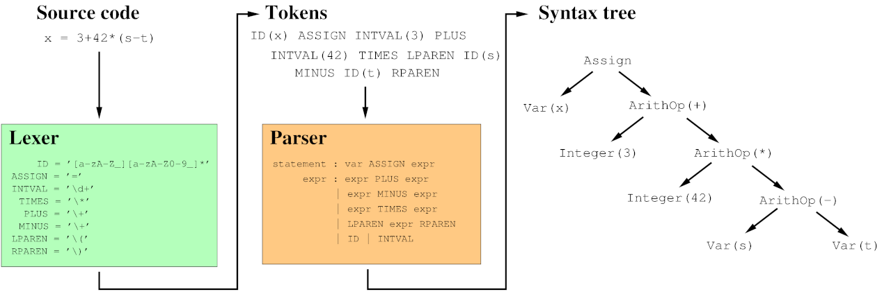
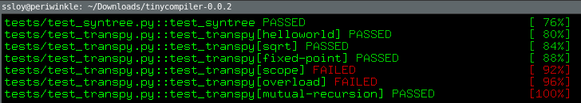
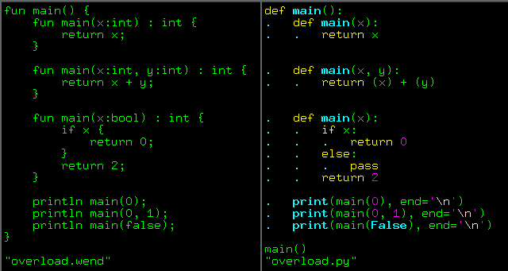
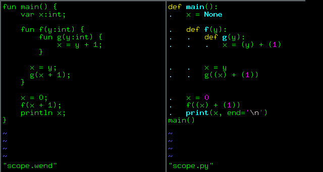
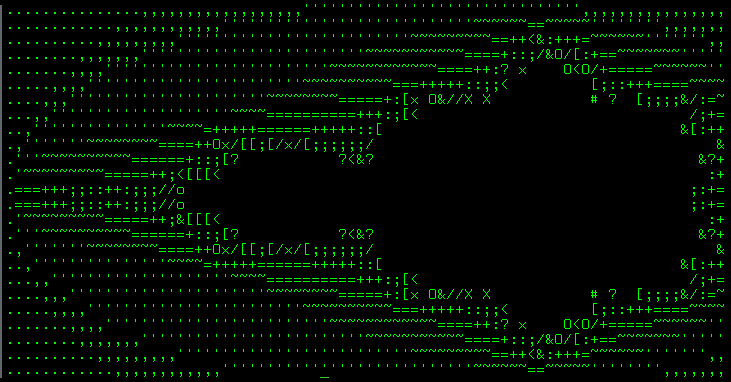

# SLY: lexer and parser
## Introduction

Традиционно парсинг разделяется на два этапа: этап лексического, а затем синтаксического анализа.
На самом деле обе эти стадии являются синтаксическими анализаторами, просто на разном уровне.
Они принимают на вход список символов и создают структуру более высокого уровня.

[](sly/parsing-primer.png)

Такое разделение полезно, потому что работа лексера проще, чем работа парсера.
Лексер просто превращает бессмысленную строку в плоский список таких вещей, как «числовой литерал», «строковый литерал», «идентификатор» или «оператор», и может делать такие вещи, как распознавание ключевых слов и отбрасывание пробельных символов.
Формально лексер распознает некоторый набор регулярных языков, то есть, таких языков, которые можно разобрать за один прямой проход без возврата назад по тексту и без запоминания информации.
Это позволяет сделать очень эффективный разбор: мы просматриваем только по одному байту за раз, чтобы принять решение, и все решения можно упаковать в конечный автомат.

На синтаксический анализатор ложится гораздо более сложная задача - превратить поток лексем, созданный лексером, в дерево разбора, представляющее структуру разобранного языка.
Разделение лексера и парсера позволяет последнему работать с более упорядоченным и содержательным материалом, нежели исходный текст.

В более сложных языках вполне могут быть циклы между парсером и лексером, но я на этом останавливаться не буду.
Ещё раз, наша задача - из исходного кода построить синтаксическое дерево, и для этого я буду пользоваться внешним инструментом,
которому задам набор лексических правил а также грамматику моего языка (начинка зелёной и оранжевой коробочек на рисунке).
Давайте рассмотрим обе коробочки подробнее.

## Лексический анализ
Лексический анализ - это процесс преобразования потока символов в последовательность лексем (токенов). Токен представляет собой строку с заданным значением, которая описывает ряд связанных лексем. Лексема - это последовательность символов, которая образует лексическую единицу в грамматике языка. Интуитивно ее можно рассматривать как "слово" в человеческом языке. Чтобы понять эти определения, давайте рассмотрим таблицу ниже:


| Лексемы                    | Тип лексемы                        | Семантическое значение       |
|----------------------------|-----------------------------------|------------------------------|
| if, while, fun, var, return, print | IF, WHILE, FUN, VAR, RETURN, PRINT | Зарезервированные слова     |
| i tmp for23               | ID                                | Идентификатор               |
| 13,27                     | INTVAL                            | Целочисленная константа     |
| (,{,}                     | LPAREN, BEGIN, END               | Символы                      |
| %, +, /, =                | MOD, PLUS, DIVIDE, ASSIGN        | Операторы                    |


Таким образом, лексер должен принимать поток символов из исходного кода и выдавать последовательность лексем. Например, рассмотрим следующий исходный код:

```cpp
a = 2;
```

Наш лексер должен выдать следующую последовательность лексем:

```cpp
ID(a) ASSIGN INTVAL(2) SEMICOLON
```

Обратите внимание, что внутри лексем спрятаны данные о них: тип лексемы и непосредственно содержание, мы же не должны потерять ни a, ни 2.
Мы просто разбили входной текст на слова, при этом присвоив каждому слову какой-то тип (например, в человеческом языке это может быть существительное, глагол).

Как же наш лексер может это сделать? Другими словами, как мы можем описать и распознать лексемы в языке программирования? Дайте-ка я процитирую коллегу Hadrien Titeux:
*"Parsing: what computer scientists solved 40 years ago, but you still can’t do it easily on your own."*


Лексемы описываются с помощью регулярных выражений и распознаются конечными автоматами.
Например, следующее регулярное выражение может использоваться для определения валидного идентификатора: `[a-zA-Z_][a-zA-Z0-9_]*`.
То есть, можно использовать букво-цифры и подчёркивание.
При этом первый символ не может быть цифрой, всё стандартно.
И тут мы сразу же врезаемся в

### Неоднозначности
Что делать, если мы столкнемся со следующим потоком символов?

```cpp
inta=0;
```

Это можно интерпретировать двояко, порождая разные потоки лексем:

```cpp
int | a | = | 0 | ;   => TYPE(int) ID(a) ASSIGN INTVAL(0) SEMICOLON
inta | = | 0 | ;     => ID(inta) ASSIGN INTVAL(0) SEMICOLON
```
Как наш лексер может решить, какие правила использовать (`ID` или `TYPE`)? Интуитивно понятное решение - использовать то правило, которое соответствует большему количеству символов в исходном коде.
В нашем случае будет использовано правило `ID`, потому что оно соответствует 4 символам (`inta`), в то время как правило `int` соответствует только 3 символам (`int`).
Однако есть и другой случай неоднозначности, который может обмануть наш лексер:

```cpp
int=0;
```

Какой поток лексем соответствует этому исходному коду?

```cpp
TYPE(int) ASSIGN INTVAL(0) SEMICOLON
```
или
```cpp
ID(int) ASSIGN INTVAL(0) SEMICOLON
```
Обратите внимание, что даже если приведенный выше код синтаксически неверен, в данный момент мы занимаемся лексическим анализом, а не синтаксическим,
поэтому даже не пытаемся проверять на этом этапе на синтаксические ошибки.
Чтобы решить эту проблему, мы будем использовать приоритет правил, то есть указывать, что определенное правило должно быть применено,
если два или более регулярных выражения совпадают с одинаковым количеством символов из строки.


## SLY: Lexer

Для простоты (см.
предыдущую картинку) я буду опираться на уже существующие инструменты для создания синтаксического дерева, а именно, на питоновскую библиотеку [SLY](https://github.com/dabeaz/sly).
Она сама по себе всего на пару тысяч строк, так что можно было бы для разбора *wend* сделать всё с нуля, но, пожалуй, ни к чему это.
Я свои лекции веду больше в область компиляции, а не в область формальных языков, так что позволю себе зависимость.

SLY предоставляет два отдельных класса Lexer и Parser.
Класс Lexer используется для разбиения входного текста на набор лексем, заданных набором правил регулярных выражений.
Класс Parser используется для распознавания синтаксиса языка, заданного в виде контекстно-свободной грамматики.
Эти два класса используются вместе для создания синтаксического анализатора.

Давайте начнём с лексера.
Описание лексических правил тривиально, поэтому я приведу их для всего моего языка целиком, а не буду строить постепенно, начиная с калькуляторов выражений:

??? example "WendLexer"
    ```py linenums="1"
    --8<-- "sly/lexer.py"
    ```

Для начала (строки 4-6) надо определить все возможные типы лексем (бонусное чтение: [почему не возникает NameError?](https://medium.com/@danieldng/learning-some-metaclass-magic-from-sly-8cceea1df1a6)).
Затем (строки 7-8) мы просим SLY игнорировать пробелы (мы же не в питоне, в конце-то концов!), и выкидывать до конца строки всё, что начинается с двух слешей.
А затем просто даём список всех регулярок, соответствующих каждой лексеме.

Обратите внимание: порядок этих регулярок важен.
В большой семье валенки одни, кто первый встал, того и сапоги.
Давайте для примера посмотрим на лексемы `NOT` и `NOTEQ`.
Нам необходимо правило `NOTEQ` обрабатывать раньше, нежели правило `NOT`, иначе последовательность символов `a != 0` разобъётся на лексемы `ID(a) NOT ASSIGN INTVAL(0)`, а не на требуемое `ID(a) NOTEQ INTVAL(0)`.

Второй важный момент - это то, что все зарезервированные слова wend являются валидными идентификаторами, и поскольку правило `ID` стоит самым первым, то таковыми и будут определены.
Можно было бы завести на них отдельные правила, но SLY предлагает механизм переназначения лексем, который я и использую (строки 36-47).

Собственно, и всё, больше ничего интересного в списке лексических правил нет.
Сам по себе лексер берёт эти правила, и создаёт конечный автомат, который и обрабатывает весь поток символов.

## SLY: Parser

Задача синтаксического анализатора - получить поток лексем и проверить, что лексемы образуют допустимое выражение в соответствии со спецификацией языка исходного кода.
Обычно это делается с помощью контекстно-свободной грамматики, которая рекурсивно определяет компоненты, из которых может состоять выражение, и порядок их появления.

Таким образом, синтаксический анализатор должен определить, принимает ли грамматика языка заданный поток лексем, затем построить синтаксическое дерево и передать его остальным частям компилятора.
Опять же, я не буду останавливаться на классификациях грамматик и алгоритмах обработки потока лексем, оставим для тех, кто хочет поговорить о теории формальных языков.
Единственное, что нам нужно знать, что мы пользуемся [самым простым](https://ru.wikipedia.org/wiki/LALR(1)) парсером и для принятия решения о том, что мы должны делать с лексемой, мы не имеем права смотреть дальше, чем на один токен вперёд.

Грамматика моего языка крайне примитивная, и написание соответствующих правил для парсера не должно составить никакого труда.
Давайте посмотрим на структуру кода, которого хватит для разбора выражения `x = 3+42*(s-t)` из картинки в начале статьи (та, что с оранжевой коробочкой):

??? example "Assign statement parser"
    ```py linenums="1"
    --8<-- "sly/parser-assign.py"
    ```

Мы наследуемся от класса `Parser`, и определяем грамматические правила.
У нас есть два нетерминальных символа: `statement`, соответствующий инструкции, и `expr`, соответствующий выражению.
Терминальных символов всего два: `INTVAL` и `ID`.

Если парсер увидит лексему `INTVAL` (строки 30-32), то он ничего дальше не смотрит, и создаёт объект (узел синтаксического дерева) класса `Integer`.
Если он видит лексему `ID` (строки 26-28), то создаёт узел синтаксического дерева класса `Var`.
Обратите внимание, что в обоих случаях вызывается функция `expr`, то есть, и целочисленная константа, и переменная у нас являются тривиальными выражениями.
Аналогично обрабатываются потоки лексем типа `ID(s) MINUS ID(t)` - парсер выдаёт узел синтаксического дерева типа `ArithOp` с двумя потомками `ID`, которые были найдены рекурсией в парсере.
Со скобками и другими арифметическими операциями, думаю, разберётесь :)

Единственное, на что следует обратить внимание, так это на приоритет операций, который я задал в строках 7-10.

Инструкция пока что у нас только одна, так что она может быть построена исключительно тогда, когда поток входных лексем имеет вид `ID ASSIGN expr SEMICOLON`,
где `expr` - это последовательность лексем, которая соответствует арифметическому выражению.
Надлежащее грамматическое правило и дано в строках 12-14, которые при соответствии такому потоку лексем создаёт узел синтаксического дерева класса `Assign`.

Если вам понятен этот код, то вот полный набор грамматических правил для wend, больше там нет никаких тонкостей, разве что превращение унарной операции `-x` в бинарную операцию `0-x`:


??? example "complete WendParser"
    ```py linenums="1"
    --8<-- "sly/parser-full.py"
    ```

## Testing time

Соответствующий код доступен по [тегу v0.0.2](https://github.com/ssloy/tinycompiler/releases/tag/v0.0.2) в репозитории, я больше не буду трогать ни парсер, ни лексер:
у нас есть прекрасный инструмент, позволяющий автоматически создавать синтаксические деревья из файлов исходников на wend.
Протестировать можно, просто запустив make test, и увидеть, что базовые тесты проходят, а вот на двух тестах компилятор ломается:



Я напомню, что пока что компилятор - это просто pretty print надстройка над лексером и парсером, пока что я выдаю питоновский код на выход.
Давайте поближе посмотрим на проваленные тесты, я даю бок-о-бок исходник wend и скомпилированный код на питоне:



Питон очень мощный язык, он умеет сильно больше wend, и мой pretty print просто тупо повторяет структуру исходника.
Единственное, чего не умеет питон - это из коробки перегружать функции, так что вполне очевидно, что ему не нравятся четыре разные функции main,
он даже компилироваться отказывается (я говорю про компиляцию питоновским интерпретатором выхода моего компилятора).

А вот тут несколько интереснее:



Этот питоновский код прекрасно компилируется, но в итоге на экран выводится 0, в то время как ожидаемый вывод моего кода 3.
И вот это - тема следующего разговора, а именно, области видимости переменных и таблицы символов.
То есть, мы перейдём от лексического и синтаксического анализа к семантическому.

Но давайте закончим на позитивной ноте, вот програма на *wend*, позволяющая отобразить множество Мандельброта:

??? example "Mandelbrot.wend"
    ```cpp linenums="1"
    --8<-- "sly/mandelbrot.wend"
    ```

А вот ещё раз результат его работы:



Мы начинаем встречать код на *wend*, для которого было бы очень уж громоздко строить синтаксические деревья вручную, так что парсер - это хорошо!

