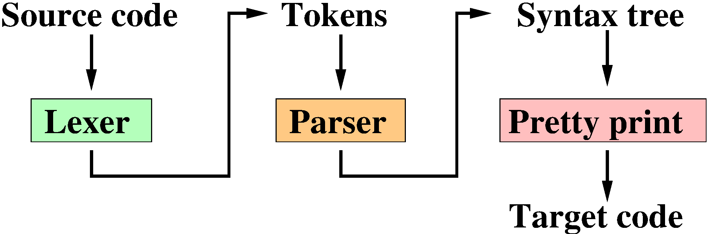
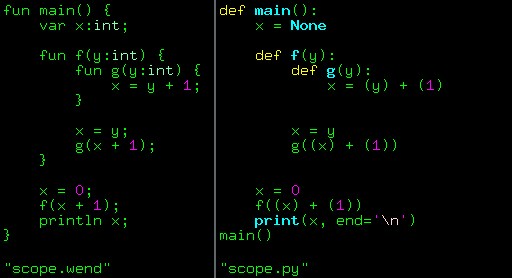
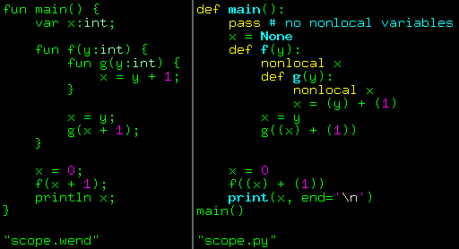
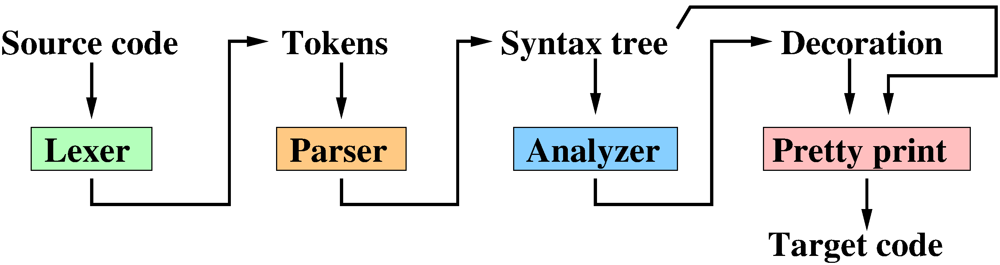
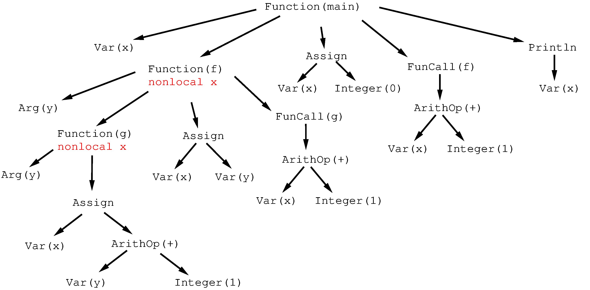
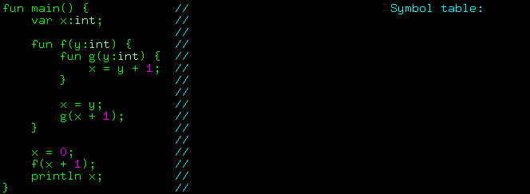
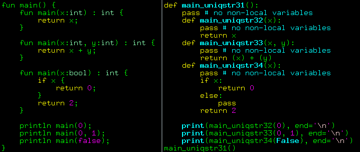

# Symbol tables: variable scopes and type checking

## Introduction
Продолжаем наш вечерний концерт по заявкам радиослушателей.
Тема сегодняшнего разговора - таблицы символов.
Напоминаю, что вообще целевым языком у меня является ассемблер, но пока что в качестве промежуточного результата я генерирую код на питоне.
На данный момент вся генерация кода - это просто pretty print надстройка над синтаксическим деревом.
Пока что процесс "компиляции" выглядит следующим образом:



Лексер превращает поток символов исходного кода в поток лексем, парсер их разбирает, строя синтаксическое дерево.
Ну а затем простым обходом дерева в глубину я выдаю код на целевом языке.
В простых случаях это неплохо работает, но в конце прошлой статьи я специально оставил пару случаев, в которых компилятор ломается.
Давайте вспомним один из них, слева исходник на wend, справа неверная трансляция в питон:



Я ожидаю, что код выведет на экран 3, в то время как питон мне показывает 0.
Почему? Давайте разбираться.
Для начала отложим wend в сторону и просто поговорим о питоне.

## Области видимости переменных в питоне
Никакой Америки я не открою, но я с удивлением для себя обнаружил, что изрядное количество людей не знает, как работает связывание переменных в этом языке.
Давайте рассмотрим простейший пример: у меня есть функция `foo()`, которая выводит на экран значение переменной `bar`, которая определена вне функции:

```py
ssloy@home:~$ python3 <<<'
def foo():
    print(bar)

bar = 0
foo()
print(bar)
'
0
0
```

Для наглядности я разом привожу и код, и результат его выполнения.
Вполне ожидаемо, что язык с неявным заданием переменных найдёт глобальную переменную `bar` и выведет на экран два нуля.
А что будет, если я попытаюсь не только вывести значение `bar`, но ещё и записать в неё единицу?

```py
ssloy@home:~$ python3 <<<'
def foo():
    print(bar)
    bar = 1

bar = 0
foo()
print(bar)
'
Traceback (most recent call last):
  File "<stdin>", line 7, in <module>
  File "<stdin>", line 3, in foo
UnboundLocalError: cannot access local variable 'bar' where it is not associated with a value
```

А случилась у нас ошибка.
Если же внутри функции переставить операции присваивания и вывода на экран, то всё прекрасно запускается, причём явно значение глобальной переменной `bar` не меняется:

```py hl_lines="3-4"
ssloy@home:~$ python3 <<<'
def foo():
    bar = 1
    print(bar)

bar = 0
foo()
print(bar)
'
1
0
```

Это совершенно не магия, это абсолютно нормально, и одновременно крайне контринтуитивно для новичков, пришедших в питон из языков с более строгим объявлением переменных.
Питон, как и большинство других языков, разделяет переменные на локальные и на глобальные, причём на чтение контекст глобальный, а на запись локальный.
Вот и получается, что если мы сначала попытаемся сделать `print(bar)`, а потом присвоить `bar = 1`, то питон знает, что `bar` - локальная переменная, но ещё не была инициализирована, и ломается.
Можно использовать слово `global`, чтобы явно указать, что `bar` должна быть глобальной переменной несмотря на то, что в неё идёт запись:

```py hl_lines="3"
ssloy@home:~$ python3 <<<'
def foo():
    global bar
    bar = 1
    print(bar)

bar = 0
foo()
print(bar)
'
1
1
```

Моя практика показывает, что обычно люди и ограничиваются двумя понятиями, глобальных и локальных переменных, забывая ещё про одно крайне любопытное ключевое слово `nonlocal`.
Давайте рассмотрим следующий пример кода:

```py
ssloy@home:~$ python3 <<<'
def counter():
    count = -1
    def increment():
        nonlocal count
        count += 1
        return count
    return increment

counter1 = counter()
counter2 = counter()

for _ in range(3):
    print("outer counter:", counter1())
    for _ in range(2):
        print("  inner counter:", counter2())
'
outer counter: 0
  inner counter: 0
  inner counter: 1
outer counter: 1
  inner counter: 2
  inner counter: 3
outer counter: 2
  inner counter: 4
  inner counter: 5
```

Здесь есть функция `counter()` со вложенной функцией `increment()`, при этом `increment()` ссылается на переменную `count`, которая не является ни локальной для `increment()`, ни глобальной.
Переменная `count` является локальной для функции `counter()`, и `increment()` ссылается на локальную переменную окружающего контекста.

Я создал два счётчика `counter1` и `counter2`, они могут считать независимо друг от друга, поскольку ссылаются на два разных экземпляра переменной `count`.
Эта магия называется [замыканием](https://en.wikipedia.org/wiki/Closure_(computer_programming)),
и это исключительно мощный инструмент, который использовать нужно, но осторожно, чтобы не ломать мозг тем, кто будет поддерживать ваш код :)

Возвращаясь к нашим баранам, вот так должен выглядеть корректный перевод с *wend* на питон, обратите внимание на появление двух строк с ключевым словом `nonlocal`:



Не торопитесь пролистывать, убедитесь, что понимаете, как выполняется код справа и зачем там `nonlocal`.

## Ёлочные игрушки
Теперь давайте разбираться, как научить компилятор добавлять подобную информацию. Нам нужно изменить процесс компиляции, добавив один этап семантического анализа, который будет вызван непосредственно после построения синтаксического дерева:



Парсер нам выращивает новогоднюю ёлку, а семантический анализатор развешивает на ней ёлочные игрушки (кстати, это не шутка, компиляторщики реально пользуются таким жаргоном).
Ну а дальше генерация кода на целевом языке идёт из украшенной ёлки.
Вот так выглядит синтаксическое дерево для нашего примера после прохода семантического анализатора:

[](symtable/decoration.png)

Обратите внимание на информацию, помеченную красным, она и была добавлена анализатором.
Самое удобное место для её хранения - это словарь `deco`, который я [предусмотрел](https://github.com/ssloy/tinycompiler/blob/818cd252d355d29832fbf0ff81f3851aa9f59ce7/syntree.py#L14) для каждого узла дерева.
Пока что я там хранил всякое типа номера строки в исходном файле для сигнализирования об ошибках, а теперь оно пригодится для семантического анализа.

Надеюсь, что в целом понятно, какую информацию нам нужно добавить дереву.
Но как именно это сделать? И тут приходят на помощь таблицы символов.

## Таблицы символов
Давайте я отрисую анимацию работы примитивного семантического анализатора:



Мне нужна структура данных, в которую я буду постепенно добавлять (и удалять!) информацию об областях видимости переменных.
Делать я это буду, обходя синтаксическое дерево в глубину.
Для компактности отображения в моей анимации нарисовано не само синтаксическое дерево, а исходный код, но надо понимать, что он к этому моменту давно выкинут, и работаю я с деревом.
Просто проход по строчкам исходного кода сильно легче нарисовать, а он в точности соответствует обходу синтаксического дерева в глубину.

В моём языке области видимости в точности соответствуют функциям, так что, начав с корня дерева, я открываю новую область видимости переменных: `push_scope(main)`.
Затем я добавляю в мою таблицу все локальные переменные: `add_var(x)`.
На моей анимации я отрисовал тип переменной, поскольку он всё равно маячит в коде, но на данный момент он мне не нужен, я на него буду смотреть когда-нибудь потом, когда займусь проверкой типов.

Следующий узел в моём синтаксическом дереве - вложенная функция `f`.
Открываем новую область видимости, создавая вложенную таблицу: `push_scope(f)`, и добавляем в неё все локальные переменные, тут только один аргумент `add_var(y)`.
Аналогично происходит и с функцией `g`: `push_scope(g)`, `add_var(y)`.

И вот тут самое интересное: мы встречаемся с узлом `Assign`, который соответствует строчке `x = y + 1`.
В нашем синтаксическом дереве о переменной `x` мы знаем только её идентификатор, просто строку, ничего больше.
Давайте узнаем о ней побольше: `find_var(x)`.
Мы знаем, что находимся на третьем уровне вложенности, поэтому давайте посмотрим, есть ли в текущей области видимости запись о `x`? Нет, нету.
На втором уровне? Тоже нет.
На третьем? Есть, нашлась! Таким образом, мы можем сказать второму и третьему блоку видимости, что в них используется нелокальная переменная `x`.

А заодно (задел на будущее) мы нашли тип переменной, и сейчас можно проверить, совпадает ли тип переменной в инструкции присваивания: мы знаем, что справа стоит `ArithOp`, он обязан быть целочисленным.
Если `x` имеет другой тип, самое время свалиться с ошибкой.

Мы разобрались с функциональностью таблицы символов, давайте перейдём к реализации.
Я сделал крайне примитивно:

```py
class SymbolTable():
    def __init__(self):
        self.variables = [{}]     # stack of variable symbol tables
        self.ret_stack = [ None ] # stack of enclosing function symbols, useful for return statements

    def add_var(self, name, deco):
        if name in self.variables[-1]:
            raise Exception('Double declaration of the variable %s' % name)
        self.variables[-1][name] = deco

    def push_scope(self, deco):
        self.variables.append({})
        self.ret_stack.append(deco)

    def pop_scope(self):
        self.variables.pop()
        self.ret_stack.pop()

    def find_var(self, name):
        for i in reversed(range(len(self.variables))):
            if name in self.variables[i]:
                return self.variables[i][name]
        raise Exception('No declaration for the variable %s' % name)
```

Я храню вложенные области видимости как список словарей, ключами которых являются идентификаторы, а значениями - украшение `deco` соответствующего узла синтаксического дерева (в `deco` хранится тип переменной).
При входе в область видимости я добавляю словарь (`push_scope`), при выходе удаляю (`pop_scope`).
Ну и параллельно я храню такой же список украшений из узлов-функций, что позволит синтаксическому анализатору добавить в дерево информацию о нелокальных переменных.

Вот так выглядит код семантического анализатора, это просто примитивный обход дерева в глубину, который делает запросы к таблице символов каждый раз, как встречает какую-нибудь переменную:

??? example "Semantic analyzier"
    ```py
    from syntree import *
    from symtable import *

    def build_symtable(ast):
        if not isinstance(ast, Function) or ast.name != 'main' or ast.deco['type'] != Type.VOID or len(ast.args)>0:
            raise Exception('Cannot find a valid entry point')
        symtable = SymbolTable()
        process_scope(ast, symtable)

    def process_scope(fun, symtable):
        fun.deco['nonlocal'] = set() # set of nonlocal variable names in the function body, used in "readable" python transpilation only
        symtable.push_scope(fun.deco)
        for v in fun.args: # process function arguments
            symtable.add_var(*v)
        for v in fun.var:  # process local variables
            symtable.add_var(*v)
        for f in fun.fun:  # then process nested function bodies
            process_scope(f, symtable)
        for s in fun.body: # process the list of statements
            process_stat(s, symtable)
        symtable.pop_scope()

    def process_stat(n, symtable): # process "statement" syntax tree nodes
        if isinstance(n, Print):
            process_expr(n.expr, symtable)
        elif isinstance(n, Return):
            if n.expr is None: return
            process_expr(n.expr, symtable)
        elif isinstance(n, Assign):
            process_expr(n.expr, symtable)
            deco = symtable.find_var(n.name)
            update_nonlocals(n.name, symtable) # used in "readable" python transpilation only
        elif isinstance(n, FunCall): # no type checking is necessary
            process_expr(n, symtable)
        elif isinstance(n, While):
            process_expr(n.expr, symtable)
            for s in n.body:
                process_stat(s, symtable)
        elif isinstance(n, IfThenElse):
            process_expr(n.expr, symtable)
            for s in n.ibody + n.ebody:
                process_stat(s, symtable)
        else:
            raise Exception('Unknown statement type')

    def process_expr(n, symtable): # process "expression" syntax tree nodes
        if isinstance(n, ArithOp):
            process_expr(n.left,  symtable)
            process_expr(n.right, symtable)
        elif isinstance(n, LogicOp):
            process_expr(n.left,  symtable)
            process_expr(n.right, symtable)
        elif isinstance(n, Integer):
            pass
        elif isinstance(n, Boolean):
            pass
        elif isinstance(n, Var):
            deco = symtable.find_var(n.name)
            update_nonlocals(n.name, symtable) # used in "readable" python transpilation only
        elif isinstance(n, FunCall):
            for s in n.args:
                process_expr(s, symtable)
        elif isinstance(n, String):
            pass
        else:
            raise Exception('Unknown expression type', n)

    def update_nonlocals(var, symtable):                    # add the variable name to the set of nonlocals
        for i in reversed(range(len(symtable.variables))):  # for all the enclosing scopes until we find the instance
            if var in symtable.variables[i]: break          # used in "readable" python transpilation only
            symtable.ret_stack[i]['nonlocal'].add(var)
    ```

Рабочий коммит [доступен здесь](https://github.com/ssloy/tinycompiler/commit/922b28d33e3681763fd92a79e31b332d1ba9accc), теперь [scope.wend](https://github.com/ssloy/tinycompiler/blob/main/test-data/scope.wend) компилируется корректно!

##Проверка типов и перегрузка функций

Мы уже встретились с рудиментарной проверкой типов переменных, но для полной картины мира нам нужно ещё добавить в таблицу символов функции, ведь когда мы встречаемся с вызовом `f(x+1)`,
то мы не знаем ничего про тип, возвращаемый `f`, потому что узел дерева `FunCall` хранит только идентификатор `f`, ничего больше.
Всё крайне тривиально: параллельно списку словарей символов переменных давайте заведём список словарей символов функций, и будем их добавлять перед открытием соответствующей области видимости.

В словаре переменных ключом являлся идентификатор переменной, с функциями самую малость сложнее: я хочу уметь перегружать функции, поэтому идентификатор не является уникальным ключом.
Не страшно, я в качестве ключа буду хранить сигнатуру функции, которая является простым кортежем (идентификатор, список типов аргументов).

Я добавил десяток строчек в модуль symtable.py и накидал исключений при несоотвествии типов в семантический анализатор analyzer.py,
[смотрите на изменения в коде](https://github.com/ssloy/tinycompiler/commit/827f652ee9ec21a2f490a3a3d269b768e98f01cb#diff-b60626824b61e9cb42755e5894e5b70f529425116f6c93e40d785f6f31754ffe).

[Последним штрихом я добавил](https://github.com/ssloy/tinycompiler/commit/2bc3ba0b3e40a5cfea9eeefd67e9b469d22eaa50) перегрузку функций:
для этого мне достаточно к имени функции приклеить уникальный суффикс, и вуаля, у нас есть полностью корректно работающий компилятор из wend в python!



Текущий код брать по тегу [v0.0.3](https://github.com/ssloy/tinycompiler/releases/tag/v0.0.3).

## В следующем выпуске

В этот раз мы починили компилятор, использовав ключевое слово `nonlocal`.
Но давайте не будем терять из виду то, что вообще-то целевым языком является не питон, а ассемблер, а он про замыкания не знает уж точно ничего!
Поэтому в следующий раз мы поговорим про генерацию кода по-прежнему на питоне, но в принципе без использования переменных внутри функций.
У меня будут только четыре глобальных переменных, и помимо них никакой другой использовать нельзя: я буду эмулировать регистры и стек.
И вот тут выдаваемый код по-настоящему потеряет читаемость, так что, снявши голову, по волосам не плачут, можно уже и ассемблер генерировать :)

