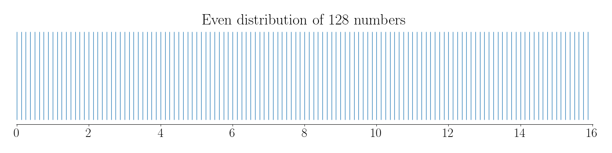
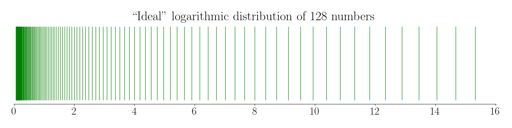
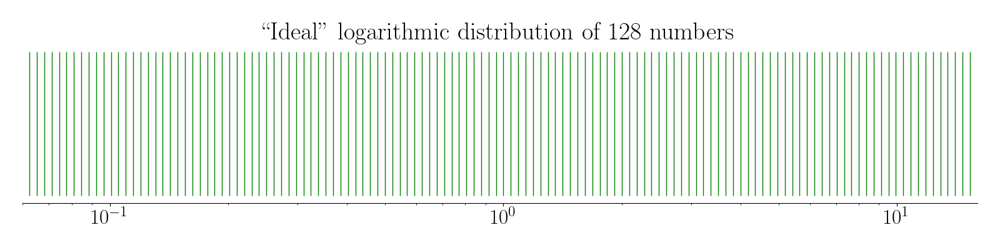
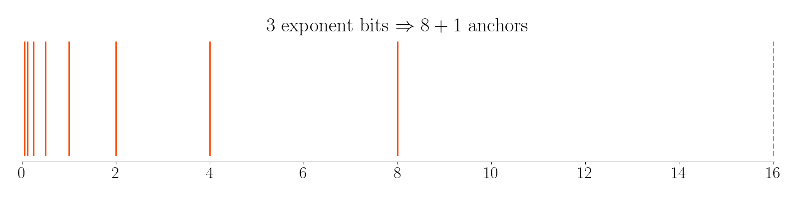
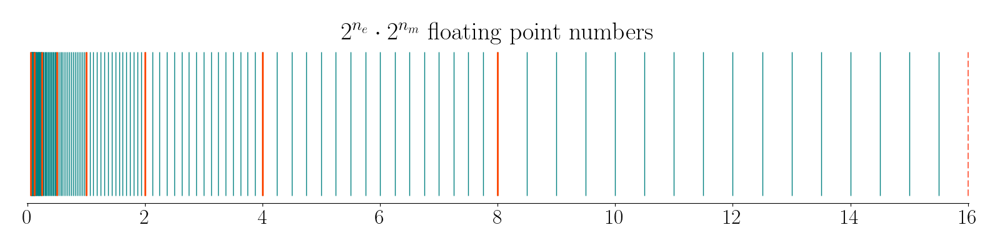
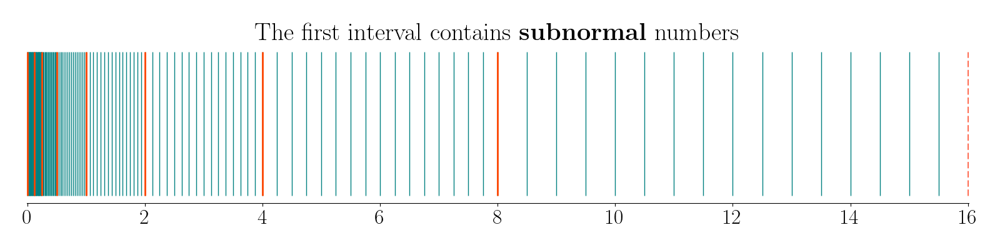

# Computers and numbers

## Why reals are hard

Let us talk about numbers and computers.
First of all, there are three most common families of numbers we are dealing with: integer, rational and real numbers.
Computers can manipulate integers perfectly, rationals with effort, and reals only in dreams. Most reals cannot even be named by any algorithm, and the few that can still collapse to approximations when stored in finite memory.
Let me elaborate.

### Integers: computers’ natural language

Computers are digital machines. Inside the hardware, everything is stored in binary: strings of 0s and 1s.
This makes integers (whole numbers) the most natural fit.

A 32-bit register can hold exactly $2^{32}$ different patterns of 0s and 1s; it is common to interpret them as integers from $0$ to $4\ 294\ 967\ 295$ (unsigned), or from $-2\ 147\ 483\ 648$ to $2\ 147\ 483\ 647$ (signed).
Arithmetic on integers (addition, subtraction, multiplication, division) is exact, as long as the result fits in the chosen bit width.
So computers are great at integers: representation is exact, arithmetic is reliable, and all values in the range are covered.

### Rational numbers: manageable with two integers

A rational number is a ratio of two integers, like $\frac34$ or $-\frac{22}7$.
Computers can store this exactly by keeping an integer numerator and integer denominator.
This is sometimes called a fractional representation.
For example, in Python, the `fractions.Fraction` class does exactly this.
Arithmetic works, but denominators may grow very large, making computations slower.
So, representing rationals is possible and exact, but less efficient.
Computers can handle it, though it is not what hardware is optimized for.

### Real numbers: the impossible dream

Real numbers include all rationals plus all irrationals — like $\sqrt{2}$ and $\pi$.
Most real numbers cannot be described exactly with a finite sequence of digits, but even that is not the biggest problem.
The real problem is that there are **a lot of real numbers**.
Forget about computers for a moment, let us talk about math on paper.

#### Computable reals: a tiny subset

Let us say that a real number is **computable** if there exists an algorithm that, given $n$, outputs the $n$-th digit of the number.
Examples are numerous, we know formulas to compute digits of $\pi$, $\sqrt 2$, $e$ and many others.
Let us focus on the word **algorithm**.
In our context, an algorithm is a textual description (in fact, a computer program) telling us how to compute the $n$-th digit of some number.
The set of texts (computer programs) is **countable**: there are only finitely many programs of length 1, finitely many of length 2, and so on.

The set of real numbers $\mathbb R$, however, is **uncountable** ([Cantor’s diagonal argument](https://en.wikipedia.org/wiki/Cantor%27s_diagonal_argument)).
Uncountable sets are "bigger" that countable sets, therefore most real numbers cannot even be described by any program — they are **incomputable**.
Although there are infinitely many computable reals, they form a countable set — a drop in the ocean compared to all reals.

#### Storage limits: finite precision

Even for computable numbers, if we want to store the number itself, and not just the algorithm to compute it, we have a problem.
A real number may have infinitely many digits, while computers can only store finitely many bits at once.
Therefore, computers cannot represent even computable real numbers exactly, we need some sort of approximation.

Putting it together: most real numbers are incomputable — no algorithm can generate them.
Of the computable reals, computers can only hold a finite precision approximation.
This means the “continuum” of real numbers is **forever beyond reach** of finite digital machines.

In practice, numerical computation is built on the illusion of reals: we pretend to work with reals (solving equations, integrating, simulating physics),
but everything is grounded in a finite lattice of floating-point approximations.
The success of scientific computing rests on the fact that this illusion is often “good enough” — relative errors are kept small, and algorithms are stable.

## Approximations and errors

So we want to represent real numbers on a computer, but only have a finite number of bit patterns.
Suppose we want to represent numbers between 0 and 16, and we have 7 bits to represent any number, therefore we have a budget of $2^7 = 128$ numbers in total.

### Fixed-point numbers

If $m$ is the unsigned int interpretation of a 7-bit pattern, $m$ varies from 0 to 127.
This unsigned int can be used to represent the fractional number $\frac m8$, let us plot all 128 of them:

[](computers-and-numbers/fixed-point.png)

In fact, we have evenly distributed 128 numbers across the range.
These rational numbers are called fixed-point because the denominator stays the same for all the range.
Let us consider, say, $m=125$. The bit pattern for m is `1111101`, since $125_{10} = 1111101_2$.
Dividing by 8 corresponds to shifting the binary point three times to the left, therefore $\frac{125}{8}_{10} = 1111.101_2$.
The position of the point is the same for all the numbers we represent, hence **fixed point** representation.

### Approximation errors

Fixed-point numbers offer the best possible **absolute error** of approximation. Let us define the notion:
if you want to represent some real number $x$, but the computer stores an approximation $\tilde x,$ then the absolute error is

$$
\text{absolute error} := |x - \tilde{x}|.
$$

Say, we want to represent the real number $0.1$ with our 7 bit fixed-point numbers.
The closest number we have is $\frac{10}{8} = 0.125$.
Therefore, we commited a 0.025 error.

Often what matters is how big the error is compared to the size of the number.
Let us define the notion of **relative error**:

$$
\text{relative error} := \frac{|x - \tilde{x}|}{|x|}.
$$

Let us illustrate the difference between the two:

* If $x=1000$ and $\tilde x = 1000.1$, then absolute error = 0.1, but relative error = 0.1 / 1000 = 0.0001 (very small, good).
* If $x=0.01$ and $\tilde x = 0.0101$, then absolute error is very small (0.0001), but relative error = 0.0001 / 0.01 = 0.01. That is 1% error, not great.

There are two natural goals that arise when representing real numbers on a computer:

* Cover a huge dynamic range: from tiny numbers like $10^{-30}$ to to huge numbers like $10^{30}$.
* Give decent precision everywhere: the numbers should be relatively close to the true reals.

If we used fixed-point, the numbers are evenly spaced. That’s great for precision but terrible for range: you can’t represent both 
$10^{-30}$ and $10^{30}$ unless you use thousands of bits.

So, instead, the idea is to use a logarithmic distribution of numbers:

[](computers-and-numbers/ideal-distribution.png)

The numbers are evenly distributed in log-scale:

[](computers-and-numbers/ideal-distribution2.png)

We have as much numbers between 0.1 and 1, as between 1 and 10.
This way, we get uniform relative precision, not uniform absolute precision.
This matches many real-world problems where we care about significant digits, not absolute spacing.

Obviously, the more bits we have to represent a number, the bigger range we can cover.
IEEE [single precision floating point](https://en.wikipedia.org/wiki/Single-precision_floating-point_format) numbers can go up to $10^{38}$.
If we have $m\in[0\dots 127]$ as in the pevious example, then we can use $2^{-4 + m/16}$
as the representation of real numbers in the $[0,16]$ range, that is exactly what is plotted in the above "ideal" graphs.

??? bug "Spoiler"
    An attentive reader might notice that my numbers do not start from zero, but this is a minor detail that I'll cover later.

This representation would be ideal if our only goal was to approximate reals with uniform relative error.
There are quite a few problems though.

Let us test a simple addition in this representation. Given two integers $a$ and $b$ representing $2^{-4 + a/16}$ and $2^{-4 + b/16}$ correspondingly,
we need to find $c$ such that
$$
2^{-4 + a/16} + 2^{-4 + b/16} = 2^{-4 + c/16}.
$$
This is a gnarly equation to solve, especially knowing that the exponents are fractional.
Even a simple addition of two numbers kills efficiency.

A pure log encoding cannot store integers exactly, except for powers of 2, whereas floating point preserves exact integers up to a certain size (all integers up to $2^{24}$ fit exactly in a float32).
    This is essential in many algorithms (indexing arrays, loop counters, geometry with small integers).

### Floating point numbers

The idea behind floating point is to mimic the logarithmic scale, but without the disadvantages of the pure log encoding:
we want them to be efficient to manipulate on digital machines.
In my opinion, the best way to understand floating point numbers is to craft the representation from scratch.

In our example, we have a budget of 7 bits total to represent a number.
We will use them to store two integer numbers: $e$ (exponent) and $m$ (mantissa).
It is up to us to decide how many bits we reserve for $e$, so let us say that we use $0<n_e<7$ bits for the exponent
and $n_m:=7-n_e$ bits for the mantissa.

If we interpret $n_e$ bits as a signed int, then under the most common two's complement interpretation, $e \in [-2^{n_e-1} \dots 2^{n_e-1}-1]$.
If $n_e = 3$, then $e$ can take $2^3=8$ values from $-4$ to $3$.
Let us plot all $8$ values $2^e$ and in addition one more value $2^{2^{n_e-1}}$ (dashed):

[](computers-and-numbers/anchors.png)

Here is a bit of python I used to plot these numbers:
```py
anchors = []
for e in range(-2**(n_e-1), 2**(n_e-1)+1):
    anchors.append(2**e)
```

These are special numbers picked from the ideal log-distributed law.
These 9 anchors allow us to split the range into 8 disjoint intervals that we will populate with the rest of the numbers we have.
In this example $n_m = 4$ bits, so the unsigned int $m$ can take $2^4 = 16$ possible values.
For each value of the exponent $e$, we will evenly spread $16$ numbers in the corresponding interval.
Therefore, we will have $8\cdot 16 = 128$ numbers in total, perfectly fitting into 7 bits of budget.

Here is a bit of python that generates all the numbers:
```py
for i in range(len(anchors)-1): # for each interval
    for m in range(2**n_m):     # populate it with 2**n_m numbers
        v = anchors[i] + m/2**n_m * (anchors[i+1]-anchors[i])
        numbers.append(v)
```

And here is the corresponding plot of the numbers:

[](computers-and-numbers/floats.png)

As you can see, all our numbers are in fact a linear interpolation between the anchors.
It means that for each interval, all the numbers inside are evenly spaced,
i.e. all the numbers have a fixed binary point.
But the point shifts one position for adjacent intervals, hence the name **floating** point.

There is one last point to cover: the very first anchor is equal to $2^{-2^{n_e-1}}$,
therefore zero is not in our numbers, and this is pretty annoying.
We will do a dirty hack: we manually override the first anchor to $0$:

```py
anchors = [ 0 ]
for e in range(-2**(n_e-1)+1, 2**(n_e-1)+1):
    anchors.append(2**e)
```

And the rest of the numbers are still defined as a linear interpolation between the anchors.
In fact, we have only hacked the first interval, and the numbers in this interval are usually called **subnormal** (we'll encounter the name and its etymology later on).
Behold, here are our 128 floats in all the glory:

[](computers-and-numbers/subnormal.png)

The anchors are powers of 2, therefore integer numbers can be exactly represented.
As for the efficiency of arithmetics, it is exactly the point of this tutorial: I want to show how we can manipulate floating point numbers with integer arithmetics only.


