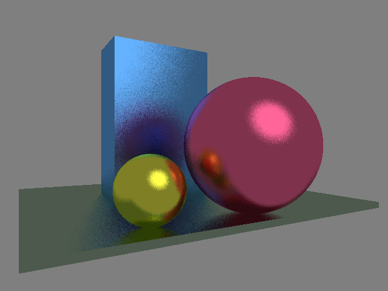

# TinyFloat - the most unoptimized soft float library

##**N.B.: Under construction!**

## Someone is wrong on the internet!

Recently, I needed to emulate floating point operations using only integer arithmetic, since floats were unavailable.
I went online to look for a ready-made library and almost drowned.
Not only did I not find what I was looking for, but I also discovered that someone on the internet was wrong. :)

It turns out that forums are full of people who don't fully understand how computers manipulate numbers.
For example, I pulled the above meme from Reddit (it was me who crossed it out).
Someone was so scared of the terrible rounding errors of floating point numbers that he even made a funny picture.
The only problem is that **0.5 + 0.5 is exactly equal to 1.0**.

So, I decided to roll up my sleeves and reinvent the wheel.
That is, to write the most unoptimized C++ library for emulating IEEE754 32-bit floating-point numbers using only 32-bit integer arithmetic.
The library will fit into a few hundred lines of code and will not contain any bit hacking.
The task is to write understandable code, not fast code.
And at the same time, to document it thoroughly in a series of articles.

So, let's talk about numbers and computers.

## Why reinvent the wheel?

A year ago, I set myself the task of writing a [simple but fully functional compiler](/tinycompiler) for a C-like language I had just invented over the weekend.
Writing it was not difficult (see the corresponding series of articles), but describing it is more challenging.
A good description requires colorful examples. I'm allergic to illustrations involving Fibonacci numbers.
How many times can you do that?!

Since my language is extremely primitive, I need simple examples, but ones that are as more "wow" as possible.
Ray tracing and demoscene are perfect for this.
Here is the result of [one of the examples](https://github.com/ssloy/tinycompiler/blob/main/test-programs/gfx/raytracer.wend) written in my language:

The problem with it was that I needed floating point numbers for ray tracing, and my language doesn't have any other types besides Boolean and 32-bit integers.

There are many libraries on the internet from which I could extract the necessary pieces, such as [Berkeley Softfloat](https://github.com/ssloy/tinycompiler/blob/main/test-programs/gfx/raytracer.wend).
The problem is that they are all designed for execution speed, and almost all of them go beyond 32-bit computations, and I only have 32-bit numbers :(

So, I decided to write a very small C++ library that manipulates only `int32_t` and focuses on code readability rather than execution speed.
The main goal is to educate people.
It pains me to see how many myths and superstitions have grown up around the simplest `float`.

## Myths and superstitions

Here are some of the myths I am fighting against:

* **“All decimal fractions are inaccurately represented in floating point”:** both 0.5 and 1.0 can be accurately represented in IEEE754 binary format. Thus, the sum is exactly 1.0.

    

    Indeed, most decimal fractions, such as 0.1, are not accurately represented with a floating point:

    

    But at the same time:

    

* **“Never compare floating points using ==”:** too strong. As we have just seen, comparing floating point numbers using == is perfectly acceptable in some cases. The real rule is: avoid == if the values have gone through complex computations where rounding may differ.

    Do not rely on algebraic laws (associativity, distributivity) to hold exactly. As a consequence, avoid using == for floating-point numbers when the results are obtained from non-trivial computations.

    

    But at the same time:

    

* **“Floating point is random/unreliable”:** floating point arithmetic is deterministic and follows strict IEEE754 rules. Results may be unexpected, but they are not arbitrary.

    The IEEE standard requires that all implementations must produce exact, bit-for-bit results for **EVERY** operation for which the result can be represented, and the closest possible value for the rest.

So, buckle up! Let us first talk about computers and numbers.

--8<-- "comments.html"

