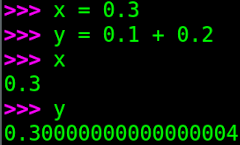

# The problem you didn't even know you had

How should the result of dividing `3.0` by `10.0` be displayed on a screen?
How many digits should be printed if the user hasn’t specified a precision?
Chances are, you didn’t even know that printing floating-point numbers is a *hard problem* — hard enough that dozens of research papers have been written about it.
In fact, it is one of the trickiest parts of floating-point support in a language runtime.


## Three major problems

Spoiler alert: in my implementation I’ll deliberately sidestep the hardest parts,
but let’s see what makes this problem so challenging.

### Problem #1: just enough digits

Notice that I wrote the numbers `3.0` and `10.0` in decimal (base 10), because that’s the notation we humans use.
But most decimal fractions don’t have an exact binary representation:

$$
0.3_{10} = 0.0100110011001100110011001100\dots_2.
$$

This binary fraction is infinite, the pattern `0011` repeats forever.
So when we write `x = 0.3`, the variable `x` actually stores the **nearest representable** floating-point number.

For example, in Python, floating point is double precision (64 bits).
So `x` really stores `0.299999999999999988897769753748434595763683319091796875`.

You can check it yourself:

```python
from decimal import Decimal
x = 0.3
print(Decimal(x))
```

If we create a second variable `y = 0.1 + 0.2`, the value stored is: `0.3000000000000000444089209850062616169452667236328125`.

```python
from decimal import Decimal
y = 0.1 + 0.2
print(Decimal(y))
```

It’s not surprising that `x` and `y` differ: `y` has accumulated three approximation errors—one for each operand and another from the addition:

1. `0.1` is rounded to `0.1000000000000000055511151231257827021181583404541015625`
2. `0.2` is rounded to `0.200000000000000011102230246251565404236316680908203125`
3. Their sum introduces another rounding error.

Now the question: how should we print `x` and `y`? Let us see how python does it:



The first requirement is **round-trip safety**:
whatever decimal string we output, converting it back must recover *exactly* the same binary float.

* If the system prints too many digits, the extra digits may just be “garbage” noise from binary rounding.

    Even if `x` equals `0.299999999999999988897769753748434595763683319091796875`, it is not necessary to print all the 54 digits after the decimal point.
    We actually wanted to store `0.3`, so the 54 digits are in fact numerical garbage.
    A simple `0.3` suffices to identify the value of `x`, even if `x` is not equal to $0.3$.

* If the system prints **too few digits**, the result is incorrect in a stricter sense: converting back to binary might give a *different* float.  

  For instance, the shortest decimal that uniquely identifies `y` is `0.30000000000000004`.  
  Printing only `0.3` would be wrong, because `0.3` round-trips to a different binary value.

So the rule is:  
**Print the shortest decimal string that (a) round-trips exactly, and (b) has no unnecessary extra digits.**


### Problem #2: speed


The naïve way to find the shortest output is to generate far more digits than necessary, then repeatedly round and test until the shortest string that round-trips is found.
This works, but it is painfully inefficient.

That’s why specialized algorithms exist:

* Dragon4 (classic, accurate, but complex)  
* Grisu3, Errol3, Ryu (newer, faster, provably minimal)

These algorithms are among the most intricate parts of language runtimes (C, Java, Python, JavaScript, etc.).  
Moreover, performance is tightly linked with the next difficulty.


### Problem #3: just the *right* digits


Conceptually, to generate the correct decimal digits we want to express the float as a rational number:

$$
\frac{\text{integer numerator}}{\text{power of two}}
$$

But floating point has huge dynamic range.
The largest finite `double` is greater than $10^{308}$. That number has 308 decimal digits, far beyond what even a 128-bit integer can hold ($10^{38}$ max).
So we need **high-precision arithmetic (bignums)** to do the exact division without overflow.

Modern algorithms like Ryu and Grisu cleverly avoid *most* bignum work: they generate digits quickly with 64/128-bit integer arithmetic, and fall back to bignums only in rare cases (boundary checks, tricky edge cases).
This achieves both correctness (round-trip safety) and speed.

## Printing the exact stored value


That said, for *my* needs, I don’t care about shortest strings or speed.
Instead, I want to print the **exact stored value** of a float.
Why? Because I’m writing a soft-float library, and being able to see exact values makes debugging far easier.

Note that even if most decimal fractions cannot be represented exactly in binary, every finite binary fraction *does* have a finite decimal expansion.
So printing the exact value is always possible.

More than a decade ago, [Bruce Dawson](https://randomascii.wordpress.com/2012/03/08/float-precisionfrom-zero-to-100-digits-2/) published a [C++ implementation](https://www.cygnus-software.com/ftp_pub/printfullfloats.zip) that prints the exact stored value of a float.
His method used only `int32_t` arithmetic for single-precision, but relied on a rudimentary bignum implementation for decimal conversion (via repeated division-by-10).

That’s technically sound, but I want something simpler and more transparent.

### Float7 class

I want a dumb, short and foolproof code. I do not want to debug division/remainder computations on bignums.
If you like dumb code, let us revisit our toy 7-bit unsigned float we have built in the previous chapter:

```py linenums="1" hl_lines="11"
n_e = 3
n_m = 7-n_e

anchors = [ 0 ]
for e in range(-2**(n_e-1)+1, 2**(n_e-1)+1): # prepare 2**n_e intervals
    anchors.append(2**e)

numbers = []
for i in range(len(anchors)-1): # for each interval
    for m in range(2**n_m):     # populate with 2**n_m numbers
        v = anchors[i] + m/2**n_m * (anchors[i+1]-anchors[i])
        numbers.append(v)
print(numbers)
```

This splits the range $[0,16)$ into 8 intervals, each filled with 16 uniformly spaced numbers.  
Altogether we have 128 values.

```
[0.0, 0.0078125, 0.015625, 0.0234375, 0.03125, 0.0390625, 0.046875, 0.0546875, 0.0625, 0.0703125, 0.078125, 0.0859375, 0.09375, 0.1015625, 0.109375, 0.1171875, 0.125, 0.1328125, 0.140625, 0.1484375, 0.15625, 0.1640625, 0.171875, 0.1796875, 0.1875, 0.1953125, 0.203125, 0.2109375, 0.21875, 0.2265625, 0.234375, 0.2421875, 0.25, 0.265625, 0.28125, 0.296875, 0.3125, 0.328125, 0.34375, 0.359375, 0.375, 0.390625, 0.40625, 0.421875, 0.4375, 0.453125, 0.46875, 0.484375, 0.5, 0.53125, 0.5625, 0.59375, 0.625, 0.65625, 0.6875, 0.71875, 0.75, 0.78125, 0.8125, 0.84375, 0.875, 0.90625, 0.9375, 0.96875, 1.0, 1.0625, 1.125, 1.1875, 1.25, 1.3125, 1.375, 1.4375, 1.5, 1.5625, 1.625, 1.6875, 1.75, 1.8125, 1.875, 1.9375, 2.0, 2.125, 2.25, 2.375, 2.5, 2.625, 2.75, 2.875, 3.0, 3.125, 3.25, 3.375, 3.5, 3.625, 3.75, 3.875, 4.0, 4.25, 4.5, 4.75, 5.0, 5.25, 5.5, 5.75, 6.0, 6.25, 6.5, 6.75, 7.0, 7.25, 7.5, 7.75, 8.0, 8.5, 9.0, 9.5, 10.0, 10.5, 11.0, 11.5, 12.0, 12.5, 13.0, 13.5, 14.0, 14.5, 15.0, 15.5]
```

We have 128 numbers $v_{e,m}$ indexed by 8 values of $e\in[-4\dots 3]$ and 16 values of $m\in[0\dots 15]$.
Let us plug in explicitly the values of the anchors into the line 11 of the above python snippet.
This way, we can write the general formula:

$$
v_{e,m} = \left\{
\begin{array}{lll}
0 + \frac{m}{2^{n_m}}\left(2^{e+1} - 0\right) & = m \cdot 2^{e+1-n_m} \quad & \text{if}~e= -2^{n_e-1}\\
 2^e + \frac{m}{2^{n_m}}\left(2^{e+1} - 2^e\right) & = (m+2^{n_m}) \cdot 2^{e-n_m}  & \text{otherwise}
\end{array}
\right.
$$

This reflects the distinction between **subnormals** (first case) and **normals** (second case).
Therefore, we can rewrite the above snippet in the following form:
```py linenums="1" hl_lines="5 7"
numbers = []
for e in range(-2**(n_e-1), 2**(n_e-1)):
    for m in range(2**n_m):
        if e == -2**(n_e-1):
            e += 1          # subnormal number
        else:
            m += 2**n_m     # normal number
        v = m * 2**(e-n_m)
        numbers.append(v)
print(numbers)
```

Note the lines 5 and 7: 

* we increment $e\leftarrow e+1$ if the number is subnormal,
* and we add $2^{n_m}$ to $m$ if the number is normal $m\leftarrow m+2^{n_m}$.

This way, we have a unique formula for the final number we generate in the line 9.
In fact, this really means that despite that we actually store $n_m$ bits of $m$ in memory,
it is a $(n_m+1)$-bit unsigned number.
The extra 5th bit of our `Float7` is not stored explicitly, it is "hidden" and can be recovered from the value of `e`.

It is also means that mantissa $m$ encodes a fixed-point number with 1 bit for the integer part and $2^{n_m}$ bits for the fraction.
Therefore, $\frac m {2^{n_m}} \in [0, 2)$.
Multiplying it by $2^e$ we make the point float by $e$ binary places.

Instead of enumerating all possible floats, let us create a class `Float7` to represent a single value:

```py linenums="1"
class Float7:
    def __init__(self, uint7):
        self.e = uint7 // 16 - 4
        self.m = uint7 %  16
        if self.e == -4:
            self.e += 1  # if subnormal, increment the exponent, the hidden bit = 0
        else:
            self.m += 16 # if normal, recover the hidden bit = 1

    def __float__(self):
        return self.m * 2**(self.e-4)

print(float(Float7(93)))
```

The constructor (line 7) takes a 7-bit pattern and splits it into the exponent $e$ and mantissa $m$, recovering the hidden bit.
The `__float__()` operator casts our custom class to native python floats.
Finally, the code prints the 93th floating point:

```
3.625
```

Just in case, let us check the computations:

$93_{10} = 101\ 1101_2$

The constructor receives `101` and `1101` bit patterns for the exponent and mantissa.
[Offset binary interpretation](https://en.wikipedia.org/wiki/Signed_number_representations) tells us that `101` is interpreted as $1_{10}$:

$e = \left\lfloor\frac{93}{16}\right\rfloor-4 = 1$

The number is normal, therefore we must recover the hidden bit 1 for the mantissa:

$m = (93 \mod 16) + 16 = 29$

Finally, the `__float__()` cast gives us `3.625` as it should:

$29 \cdot 2^{1-4} = 3.625$


### Column addition

Now to the printing part. As we saw, each individual float can be seen as a fixed-point number within the corresponding interval.
It is therefore possible to find the common denominator for all the floats.
It turns out that our `Float7` can be represented as a fixed-point number with 4 bits in the integer part and 7 bits in the fractional part, which we can summarize as Q4.7 format.
We can determine this by noting that a float’s mantissa is a Q1.4 fixed-point number.
The maximum float exponent is 3, which is equivalent to shifting the mantissa left 3 positions.
The minimum float exponent is -3, which is equivalent to shifting the mantissa right 3 positions.
Those shift amounts of our Q1.4 mantissa mean that all floats can fit into a Q4.7 fixed-point number, for a total of 11 bits.

??? tip "A side note"
    We can represent all unsigned `float32` values including subnormals, using a 277-bit fixed point format Q128.149. 277-bit is a hell of a number, and most often bignums are used to manipulate it.
    I want to avoid altogether all arithmetic on such big numbers.

All we need to do is create this number, by pasting the mantissa into the correct location, and then convert the large fixed-point number to decimal.
Let us consider the example from the previous python snippet.

$$
m = 29_{10} = 11101_2
$$

The mantissa stores a Q1.4 fixed-point number $1.1101_2$. The exponent $e=1$ tells us that we need to shift the radix dot to the right 1 place,
therefore the represented number is $v = 11.101_2$.
We can copy-paste this pattern into the Q4.7 fixed-point number `0011.1010000`.
Let us call the bit pattern $b = \{0,0,1,1,1,0,1,0,0,0,0\}$, where $b_i$ stands for the i-th bit.

The value of $v$ can be computed as a sum of the bit pattern times corresponding powers of two:

$$
v = \sum_{i=0}^{10} b_i\ 2^{i-7}
$$

We can recover its decimal representation by doing the stuff we loved in the primary school - the column addition:

```
     0.0078125  * 0
   + 0.0156250  * 0
   + 0.0312500  * 0
   + 0.0625000  * 0
   + 0.1250000  * 1
   + 0.2500000  * 0
   + 0.5000000  * 1
   + 1.0000000  * 1
   + 2.0000000  * 1
   + 4.0000000  * 0
     8.0000000  * 0
   = ---------
     3.6250000
```

Yay, $v$ is indeed $3.625_{10}$!
To sum up, I want to avoid arithmetic operations on bignums by explicitly storing the decimal representation of the powers of two involved in our Q4.7 fixed-point number.
Then a simple column addition does the job.

Check the complete code:

```py linenums="1" hl_lines="14"
class Float7:
    def __init__(self, uint7):
        self.e = uint7 // 16 - 4
        self.m = uint7 %  16
        if self.e == -4:
            self.e += 1  # if subnormal, increment the exponent, the hidden bit = 0
        else:
            self.m += 16 # if normal, recover the hidden bit = 1

    def __float__(self):
        return self.m * 2**(self.e-4)

    def __str__(self):
        return str(Q4_7(self.e + 3, self.m))

class Q4_7:  # 11-bit number with 4 bits in the integer part and 7 in the fraction
    digits = [
        [5,0,0,0,0,0,0,0,0,0,0], # constant array, 11 powers of 2 in base 10
        [2,5,0,0,0,0,0,0,0,0,0],
        [1,2,5,0,0,0,0,0,0,0,0],
        [8,6,2,5,0,0,0,0,0,0,0],
        [7,5,1,2,5,0,0,0,0,0,0],
        [0,1,3,6,2,5,0,0,0,0,0],
        [0,0,0,0,1,2,5,0,0,0,0], # the decimal dot is here
        [0,0,0,0,0,0,0,1,2,4,8],
        [0,0,0,0,0,0,0,0,0,0,0]  # zero padding to avoid extra logic in line 41
    ]

    def __init__(self, offset, uint5):
        self.number = [ 0 ]*11   # 11-bit number, binary expansion of uint5 * 2**offset
        while uint5 > 0:
            self.number[offset] = uint5 % 2
            uint5 //= 2
            offset += 1

    def __str__(self):
        string = ''
        carry = 0
        for position in range(9):             # loop from the least significant digit to the most significant
            total = sum(bit * dgt for bit, dgt in zip(self.number, self.digits[position])) # sum of 11 digits
            digit = str((total + carry) % 10) # current digit to output
            carry = (total + carry)//10
            string = digit + string
            if position==6:                   # decimal dot position
                string = '.' + string
        return string
print(Float7(93))
```

Line 14 pastes the bit pattern in the correct place of the 11-bit fixed point number `Q4_7`.
Then the string cast `__str__()` in lines 36-46 does just the column addition over 11 powers of two stored in the `digits` array.
It is simple as that. Here is the result:

```
03.6250000
```

Strip leading and trailing zeros and we are done.

## Conclusion

We’ve seen that printing floats is a surprisingly deep problem.
While production languages use sophisticated algorithms (Ryu, Grisu, Dragon4), for debugging soft-float implementations we can cheat:
represent values in fixed-point, pre-store decimal expansions, and use simple column addition.

Next time, we’ll move on to adding two floating-point numbers. Stay tuned!


--8<-- "comments.html"
