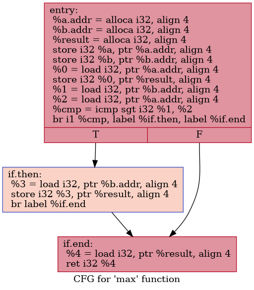
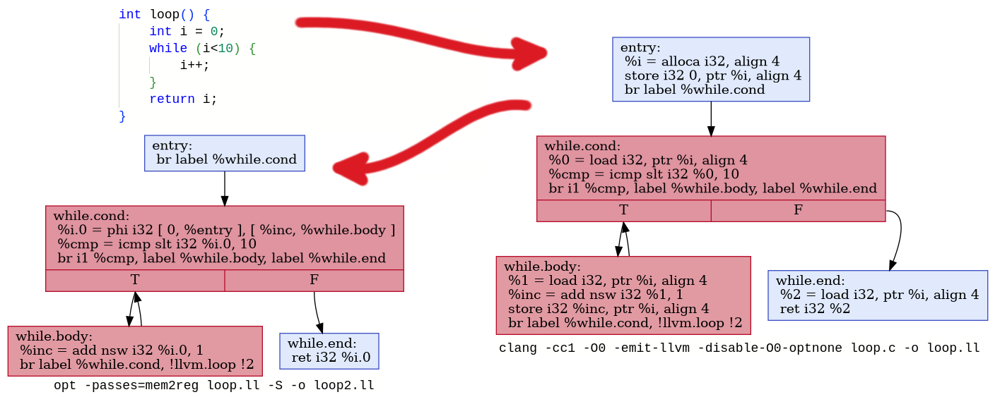
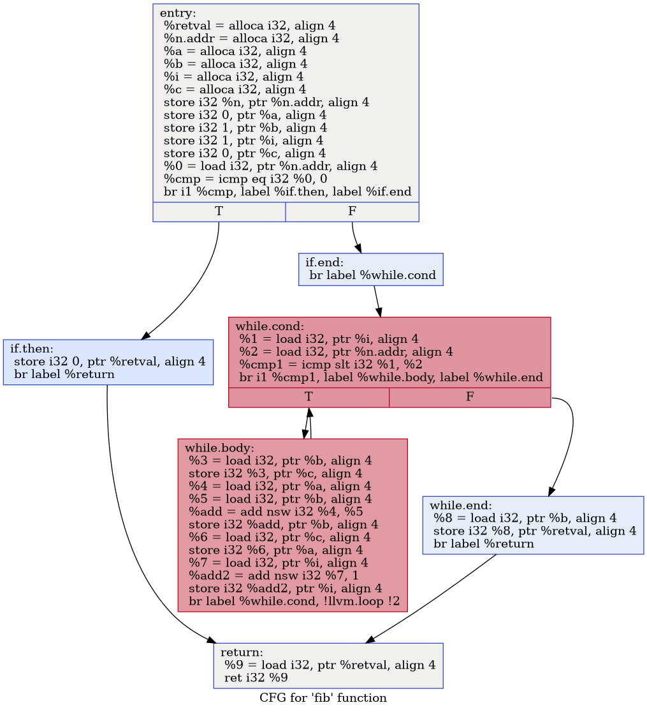
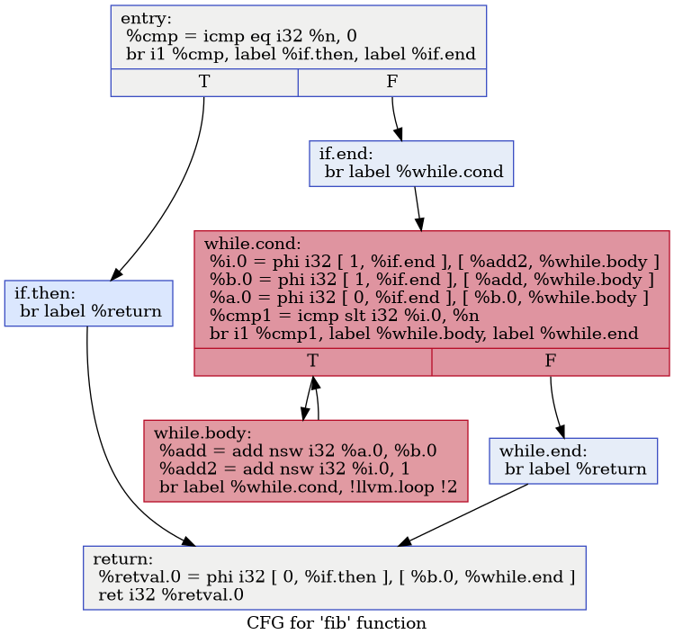

# mem2reg

## LLVM IR

Для своей работы компилятор должен иметь какую-то структуру данных, которая позволяет представлять код.
На данный момент в качестве такого промежуточного (между wend и ассемблером) представления я использую синтаксическое дерево.
В принципе, какие-то оптимизации возможны и с такой структурой, но всё же есть лучшие альтернативы.

Я решил, что LLVM IR как нельзя лучше подходит для моего компилятора.
Мой проект не имеет внешних зависимостей, и я не собираюсь полагаться на LLVM,
но при этом иметь возможность сохранить на диск моё промежуточное представление и непосредственно её запустить при помощи внешнего инструмента - это бесценно!

Давайте посмотрим, что сделает clang с вот [таким файлом](mem2reg/max.c)

```cpp linenums="1"
--8<-- "mem2reg/max.c"
```

Запускаем `clang -cc1 -O0 -emit-llvm -disable-O0-optnone max.c -o max.ll` и получаем [файл следующего содержания](mem2reg/max.ll):


??? example "max.ll"
    ```llvm linenums="1"
    --8<-- "mem2reg/max.ll"
    ```

Это и есть промежуточное представление кланга о нашей функции int `max(int, int)`.
Его можно отрисовать чуть более наглядно при помощи того же llvm.
Запускаем вот такой скрипт, который отрисует все .ll файлы в текущей папке:

??? example "draw.sh"
    ```shell
    #!/bin/bash

    for ll in `ls -1 *.ll`; do
        opt -passes=dot-cfg -disable-output -cfg-dot-filename-prefix=`basename $ll .ll` $ll
    done

    for f in `ls -1 *.dot`; do
        dot -Tpng $f -O
    done
    ```

И получаем наш `int max(int, int)`:



В принципе, это тот же самый файл с промежуточным кодом, но тут явно виден граф потока управления, который, собственно, и является структурой, представляющей код в недрах компилятора.
Промежуточный код LLVM - это своего рода ассемблерный код, который можно разбить на базовые блоки с линейным кодом.
Каждый базовый блок заканчивается инструкцией ветвления `br` (ну или обычным `ret`), и их можно нарисовать рёбрами между базовыми блоками.
Видов инструкций крайне немного, и всё действительно очень похоже на ассемблер, только для виртуальной машины, а не для настоящей.

Обратите внимание, что кланг сгенерировал максимально дубовый код, абсолютно никаких оптимизаций.
Для всех трёх переменных `a`, `b` и `result` он выделил место на стеке (инструкция `alloca`), и любое обращение к ним происходит явно при помощи инструкций `load` и `store`.
Разумеется, это страшно неэффективно, но кланг ничуть это не беспокоит, поскольку улучшение кода - это задача LLVM, а не clang.

## TinyCompiler -> TinyOptimizer

Ну и славно, tinycompiler генерирует дубовый ассемблерный код, а поскольку байткод LLVM IR от ассемблера не особо отличается, мне ничто не мешает просто сменить темплейты целевого языка с GNU assembly на LLVM IR.
Поскольку llvm позволяет запускать напрямую файлы своего промежуточного языка, то я пока что выкину ассемблер, и добавлю его в самом конце, когда закончу играть с оптимизациями.

Я не имею ни малейшего представления, куда меня заведёт эта кривая дорожка, да и я хотел бы оставить [tinycompiler](https://github.com/ssloy/tinycompiler) минималистичным,
так что я его форкнул в [tinyoptimizer](https://github.com/ssloy/tinyoptimizer).
К слову сказать, какого чёрта на гитхабе нельзя форкнуть свой собственный репозиторий? Мне пришлось создать клон, а не форк...

[Вот тут коммит](https://github.com/ssloy/tinyoptimizer/tree/da3e700a77a7d2d261e49e06c4092e7765443cfa), в котором я сменил темплейт языка.
По пути я сделал ещё небольшое изменение: поскольку ассемблер не имеет переменных, то я к ним обращался при помощи смещения на стеке, а у LLVM IR вполне себе есть нормальные идентификаторы и передача параметров функциям (посмотрите на пример, что я привёл ранее), почему бы ими не воспользоваться? Остаётся вопрос с доступом к переменным, которые были объявлены вне функции.
В tinycompiler я к ним обращался при помощи [дисплеев](../tinycompiler/display.md), но сейчас просто добавил к параметрам функций указатели на внешние переменные, и дело с концом.

Давайте приведу пример.
Среди моих тестовых программ есть вот такая:

??? example "sopfr.wend"
    ```cpp linenums="1"
    --8<-- "mem2reg/sopfr.wend"
    ```

Для этой программы на *wend* я генерирую промежуточный код LLVM, который был бы сгенерирован клангом из вот такого сишного эквивалента:

??? example "sopfr.c"
    ```cpp linenums="1"
    --8<-- "mem2reg/sopfr.c"
    ```
Я преобразовываю вложенные функции в обычные, и прокидываю указатели на необходимые переменные.
Таким образом, `sopfr_aux` автоматически получает указатель на переменную `div`, которая живёт на фрейме стека функции `sopfr`.
Разумеется, я привёл сишный эквиалент просто для читабельности, я из *wend* генерирую промежуточный код llvm напрямую.


## Тема сегодняшней статьи: mem2reg
Наконец-то мы добрались до темы этой статьи.
Сегодня мы будем разбираться с прогоном mem2reg.
Давайте снова рассмотрим функцию нахождения максума двух чисел.
Кланг её преобразует в промежуточный код, который показан справа на рисунке.
А теперь давайте отложим кланг и попросим llvm его чуточку улучшить.
Не до конца, лишь один явно указанный проход, который занимается выносом переменных из памяти в регистры.

[](mem2reg/max.png)

Запускаем `opt -passes=mem2reg max.ll -S`, и получаем преобразованный код, показанный на картинке слева.
Что любопытно, все инструкции `alloca`, `load` и `store` убраны начисто, а вместо них появилась странная инструкция `phi`.
Что же это такое?

Давайте посмотрим, [как её определяют](https://github.com/llvm/llvm-project/blob/f451d27b387cdff14f0f45f1b3314090a5008e0c/llvm/include/llvm/IR/Instructions.h#L2608) сами разработчики llvm :)


Промежуточный код LLVM основан на форме статического единственного присваивания (SSA).
Основная идея построения SSA-формы заключается в выделении **уникальных** имен всем результатам присваивания.
Практически все программы содержат ветвления и узлы слияния.
В узлах слияния необходимо добавлять специальную форму присваивания, называемую $\phi$-функцией.

$\phi$-функция всегда исполняется на входе в базовый блок, и она имеет следующий вид: $x \gets \phi(x_1, x_2, \dots, x_n)$ где $n$ — это количество предшествующих узлов в графе потока управления.
Семантика $\phi$-функций проста: выбирается значение источника $x_i$, соответствующее блоку $i$, из которого был осуществлен переход управления, и присваивается переменной $x$.
Если управление переходит в блок от его $j$-го предшественника, то $x$ получает значение $x_j$.
Ещё раз, все $\phi$-функции выполняются до выполнения обычных инструкций в этом узле.


То есть, на входе в блок `if.end` регистр `%result.0` получает значение `%b`, если поток управления проходит через блок `if.then`, и значение `%a`, если не проходит.
Получился такой своебразный тернарный условный оператор вместо интенсивной работы со стеком.

Зачем нужны $\phi$-функции?
Посмотрите на приведённые примеры и обратите внимание, что в SSA-форме каждый регистр получает значение **только один раз**.
Каждый раз, когда мы в SSA пишем инструкцию вида `%a = ...`, это как если бы на Си нам разрешали бы использовать оператор присваивания только для инициализации постоянных переменных типа `const int a = ...`.
Это не означает, что во время исполнения программы `a` не будет содержать разных значений.
Каждый базовый блок можно рассматривать как маленькую функцию, в которой мы объявляем локальную константу.
Вызывая функции с разными аргументами, мы получим разные константы `a`.
Это же означает, что мы можем работать локально с блоком и не должны беспокоиться о том, что где-то вниз по графу регистр будет переопределён.
Определение только одно, и от него мы и пляшем.

На всякий случай, как можно представить цикл, в котором счётчик явно должен изменяться? А давайте посмотрим!

[](mem2reg/loop.png)

Я запустил clang и потом оптимизационный проход mem2reg на тривиальном коде счётчика.
Кланг честно положил переменную `i` на стек, и досчитал до десяти.
LLVM же при выносе переменных из памяти в регистры убрал начисто `alloca`/`load`/`store`, и добавил одну $\phi$-функцию на входе в блок `while.cond`.
Если при исполнении программы мы заходим в этот блок из блока `entry`, тогда `%i.0` получит нулевое значение.
Если же туда зайти из блока `while.body`, то `%i.0` получит значение `%inc`.
Таким образом, все виртуальные регистры честно имеют только одну определяющую инструкцию, но их непосредственное значение зависит от того, каким путём мы до неё дошли.

Существует несколько способов для этого графа сделать вывод, что `ret` всегда возвращает 10,
и что можно вообще выкинуть всё это барахло, заинлайнив вызов функции `int loop()` константой 10, но об этом мы поговорим когда-нибудь в другой раз.

В принципе, эти рассуждения можно пытаться делать и на других промежуточных представлениях кода, но SSA-формы на данный момент обрели наибольшую популярность.
И оптимизационный проход mem2reg, который выносит переменные из памяти в регистры SSA, играет в оптимизации ключевую роль.
Разумеется, поскольку никакой ассемблер не имеет аналогов $\phi$-функций, рано или поздно нам придётся вызвать обратный проход reg2mem, заменив $\phi$-функции на `alloca`/`store`/`load`.
Но между mem2reg и reg2mem будут другие оптимизационные проходы, в том числе и вывод информации о константах, а также многое-многое другое.

## Давайте же уже писать код, или ненавидимые мной числа Фибоначчи

Я так часто встречал код вычисления чисел Фибоначчи, что у меня развилась идиосинкразия, и именно поэтому я провёл немало времени над графическими демками в качестве примеров.
Однако же сейчас мы будем руками работать с промежуточным кодом, и мне нужно, чтобы он был хоть как-то осмысленен, но при этом предельно прост.
Так что так и быть, давайте рассмотрим сишную функцию, вычисляющую числа Фибоначчи:

??? example "fib.c"
    ```cpp linenums="1"
    --8<-- "mem2reg/fib.c"
    ```

Если мы попросим кланг сгенерировать промежуточный код для неё, то получим такой граф потока управления:

[](mem2reg/fib_dot.png)

Давайте на некоторое время абстрагируемся от моего компилятора, и напишем независимый код.
Какую структуру данных мы можем использовать для представления такого графа потока управления в памяти? Я набросал вот такой файл [ir.py](mem2reg/ir.py):

??? example "ir.py"
    ```py linenums="1"
    --8<-- "mem2reg/ir.py"
    ```

Это 55 строчек, при помощи которых я буду манипулировать промежуточным кодом.
У меня есть граф потока управления `ControlFlowGraph`, в котором есть просто список базовых блоков `BasicBlock`.
Каждый базовый блок - это просто список $\phi$-функций и обычных инструкций,
а также список ссылок на предков и потомков данного блока, который изначально пуст, а потом заполняется (`compute_adjacency`), исходя из инструкций ветвления.
Каждая инструкция - это довольно-таки произвольная строка и список имён регистров и констант, в ней участвующих.

Я взял промежуточный код функции `int fib(int)`, сгенерированный клангом, и руками вколотил его в [мою программу](mem2reg/fib.py):

??? example "fib.py"
    ```py linenums="1" hl_lines="71-72"
    --8<-- "mem2reg/fib.py"
    ```

Вывод этого питоновского скрипта совпадает с промежуточным кодом, сгенерированным клангом (ну, с точностью до служебных атрибутов, которые мне не нужны),
и точно так же компилируется/отрисовывается при помощи llvm.
Обратите внимание на закомментированные строчки 71-72.
Задача сегодняшней статьи их раскомментировать ;)

## Где расстанавливать $\phi$-функции?

Мы отложили компилятор, и нарисовали 55+69 строчек питона, позволяющих манипулировать одним примером, вычисляющим числа Фибоначчи.
В нём используются только локальные переменные, и нигде нет операции взятия адреса от них, поэтому мы можем смело выкинуть вообще все `alloca`.

А затем нам нужно убрать все `store`/`load`, заменив их на $\phi$-функции в нужных местах.
А где они, нужные места?

??? hint
    В принципе, есть довольно дубовый метод: на входе в каждый блок (ну, за исключением стартового) вставить по $\phi$-функции на каждую переменную.
    Да-да, включая блоки, у которых только один предок!

    Это называется максимальной SSA-формой, и такой подход обычно критикуют за то, что он создаёт слишком много избыточных $\phi$-функций,
    что замедляет компиляцию (мне всё равно) и затрудняет оптимизацию.
    С другой стороны, я сильно подозреваю, что обычный DCE (dead code elimination) проход уберёт мусор начисто.
    Когда я дойду до DCE в tinyoptimizer, надо будет попробовать посчитать максимальную SSA форму, не исключено, что это будет проще и понятнее.

    Не забываем про "premature optimization is the root of all evil"...


Давайте начнём с довольно очевидного рассуждения (тут и далее я работаю с последним примером): вот у нас в блоке `if.then` есть инструкция store `i32 0, ptr %retval`,
записывающая значение 0 в память по адресу `%retval`.
А ещё в блоке return есть инструкция `%9 = load i32, ptr %retval`, которая очевидным образом читает память с того же адреса `%retval` в регистр `%9`.

Но ведь мы можем попасть в блок `return`, минуя блок `if.then`! Для каждой инструкции store нам понадобится вставить $\phi$-функцию в следующем случае:

1. Если существует путь из точки входа в граф, проходящий через блок со `store`, и достигает блока с `load`,
2. А также если существует другой путь из точки входа в граф, достигающий блока с тем же `load`, но при этом не проходящий через наш `store`.

Вполне очевидно, что где-то эти два пути сходятся вместе, прежде чем дойти до `load`, вот в этом месте слияния нам и понадобится  $\phi$-функция для нашей переменной `%retval`.

Тот базовый блок, в котором сходятся наши два пути через граф, является одним из элементов границы доминирования блока, содержащего инструкцию `store`.
И вот тут нам понадобится немножко технического вокабуляра.


## Границы доминирования
### Определение первое
Блок `A` доминирует над блоком `B` тогда и только тогда, когда любой путь из начала графа в блок `B` проходит через узел `A`.

Вполне очевидным образом каждый базовый блок доминирует сам над собой, и, например,
есть только два блока, которые доминируют над блоком `return`, поскольку только `entry` и сам `return` фигурируют во всех возможных путях, они и являются доминаторами для `return`.

Попробуйте нарисовать граф на бумажке, и определите множество доминирующих блоков для каждого из узлов графа.
На всякий случай, чтобы далеко не отматывать назад, повторю граф ещё раз:


Сверим часы, вот список доминаторов для каждого из блоков:

```
{
    entry:      {entry},
    if.then:    {if.then, entry},
    if.end:     {if.end, entry},
    while.cond: {if.end, while.cond, entry},
    while.body: {while.body, if.end, while.cond, entry},
    while.end:  {while.end, if.end, while.cond, entry},
    return:     {return, entry}
}
```

### Определение второе
Блок `A` строго доминирует над блоком `B`, если `A` доминирует над `B`, но при этом ему не равен.
Соответственно, вот множества строгих доминаторов для каждого из базовых блоков нашей программы:

```
{
    entry:      {},
    if.then:    {entry},
    if.end:     {entry},
    while.cond: {if.end, entry},
    while.body: {if.end, while.cond, entry},
    while.end:  {if.end, while.cond, entry},
    return:     {entry}
}
```

### Определение третье
`A` является непосредственным доминатором `B`, если `A` строго доминирует над `B`, но не доминирует строго любой другой строгий доминатор `B`.

WAIT, WHAT?

Давайте на пальцах.
У каждого узла есть набор строго его доминирующих, да? Ну, за исключением стартового узла.
Так вот, возьмём ближайший из них и назовём непосредственным доминатором.
Вот список непосредственных доминаторов для каждого из наших базовых блоков:

```
{
    entry:      None,
    if.then:    entry,
    if.end:     entry,
    while.cond: if.end,
    while.end:  while.cond,
    return:     entry,
    while.body: while.cond
}
```

Эту же информацию можно отрисовать в форме дерева, которое называют деревом доминирования:


Обратите внимания, что рёбра дерева доминирования далеко не всегда являются рёбрами исходного графа.

### Определение четвёртое

Границей (фронтиром) доминирования узла `A` называется такое множество узлов `B`, что:

1. `A` доминирует хотя бы одного из их прешественников `B`.
2. `A` не доминирует сам узел `B`.

Другими словами, граница доминирования узла `A` состоит из узлов, где доминирование `A` перестаёт доминировать: в эти узлы можно попасть как через `A`, так и альтернативными путями, не проходя через `A`.

Если узел в вашем графе потока управления имеет менее двух предшественников,
то он не будет находиться в границе доминирования какого-либо узла, так как он не может быть точкой слияния конкурирующих определений.
Концепция «границы доминирования» заключается в том, что это именно те узлы, где доминирование некоторого узла заканчивается.
Можно также сказать, что к фронтиру относятся все узлы, в которые идут рёбра из поддерева доминирования.

Граница доминирования показывает места в CFG, где разные потоки управления сходятся.
Узлы фронтира — это места, где могут встретиться разные версии одной и той же переменной, и поэтому там нужно вставлять  $\phi$-функции.

Сверим часы, вот для каждого узла набор узлов его фронтира:

```
{
    entry:      {}
    if.then:    {return}
    return:     {}
    while.body: {while.cond}
    if.end:     {return}
    while.end:  {return}
    while.cond: {return, while.cond}
}
```

Вернёмся к нашей операции store внутри блока `if.then`.
Блок `return` находится на границе доминирования `if.then`, так что в нём нужно вставить $\phi$-функцию.
Вроде всё сходится.
Кстати, обратите внимания, что `while.cond` находится в собственном фронтире.
Это совершенно нормальная ситуация, беспокоиться не нужно.
Но нужно заметить, что у нас есть `load` переменной `%i` в блоке `while.cond`, и к ней мы можем прийти как из блока `if.end`, так и из блока `while.body`.
Так что там тоже понадобятся  $\phi$-функции.

Окей, мы разобрались с определением границ доминирования, и можем их находить руками, но неплохо было бы это дело запрограммировать.
Вот 43 строчки питона, которые позволяют найти фронтиры для каждого узла CFG.

??? example "Optimizer"
    ```py linenums="1"
    --8<-- "mem2reg/optimizer.py::43"
    ```

Я тут не изобретал ничего нового, взял самые дубовые (и заодно самые медленные), которые легко можно найти в той же самой википедии.
Всё считается чётко по определениям, которые я привёл.
Сначала считаются множества доминирования, потом из них выводится дерево доминирования, а из него выводятся фронтиры.


## mem2reg
Вооружившись терминологией, мы можем наконец чётко определить алгоритм размещения $\phi$-функций в нашем графе потока управления. Трепещите же!

```
для каждой переменной v
  добавить в очередь все блоки, содержащего store v
  пока очередь непуста
    достать один блок b1
    для каждого блока b2 на фронтире доминирования b1
      если мы еще не вставляли фи-функцию для переменной v, то
        вставить её
        добавить блок b2 в очередь
```

Всё крайне просто, но есть один важный нюанс, про который нужно не забыть: вставка $\phi$-функции в какой-то мере сродни добавлению операции `store`:
добавив  $\phi$-функцию в блок b2, мы обязаны и его поставить в очередь на обработку.

Обратите внимание, что на этом этапе мы добавляем  $\phi$-функции, но не заполняем её аргументы.
Этим мы займёмся при удалении `load` и `store`.
Давайте посмотрим на [полный код](mem2reg/optimizer.py) прохода mem2reg в моём исполнении:

??? example "mem2reg"
    ```py linenums="1"
    --8<-- "mem2reg/optimizer.py:44:"
    ```

Вызывается он тривиально, нужно раскомментировать строчки 71-72 в файле [fib.py](mem2reg/fib.py).

Класс `mem2reg` наследуется от класса `Optimizer`, так что у меня есть полный доступ к функциям доминирования.
Всю работу делает конструктор.
Для начала он находит, какие переменные в `cfg` поддаются этой оптимизации при помощи.
`remove_promotable_allocas()` - удаляет `alloca` локальных переменных, от которых не берётся адрес, то есть, убирает со стека все локальные переменные, недоступные для изменения другими функциями.
Затем `place_phi()` вставляет  $\phi$-функции по вышеописанному алгоритму с фронтирами.
Остаётся заполнить их аргументы, что и делает `remove_store_load()`.

Давайте разберёмся с тем, как она работает, всё на том же примере с вычислением чисел Фибоначчи.
После удаления `alloca` (в данном случае вообще все удалены) и расстановки  $\phi$-функций, мы получаем следующий промежуточный код:

??? example "$\phi$-node placement"
    ```llvm
    define i32 @fib(i32 %n) {
    entry:
            store i32 %n, ptr %n.addr
            store i32 0, ptr %a
            store i32 1, ptr %b
            store i32 1, ptr %i
            store i32 0, ptr %c
            %0 = load i32, ptr %n.addr
            %cmp = icmp eq i32 %0, 0
            br i1 %cmp, label %if.then, label %if.end
    if.then:
            store i32 0, ptr %retval
            br label %return
    if.end:
            br label %while.cond
    while.cond:
            %a_while.cond = phi i32 [?], [?]
            %b_while.cond = phi i32 [?], [?]
            %i_while.cond = phi i32 [?], [?]
            %c_while.cond = phi i32 [?], [?]
            %1 = load i32, ptr %i
            %2 = load i32, ptr %n.addr
            %cmp1 = icmp slt i32 %1, %2
            br i1 %cmp1, label %while.body, label %while.end
    while.body:
            %3 = load i32, ptr %b
            store i32 %3, ptr %c
            %4 = load i32, ptr %a
            %5 = load i32, ptr %b
            %add = add i32 %4, %5
            store i32 %add, ptr %b
            %6 = load i32, ptr %c
            store i32 %6, ptr %a
            %7 = load i32, ptr %i
            %add2 = add i32 %7, 1
            store i32 %add2, ptr %i
            br label %while.cond
    while.end:
            %8 = load i32, ptr %b
            store i32 %8, ptr %retval
            br label %return
    return:
            %retval_return = phi i32 [?], [?]
            %a_return = phi i32 [?], [?]
            %b_return = phi i32 [?], [?]
            %i_return = phi i32 [?], [?]
            %c_return = phi i32 [?], [?]
            %9 = load i32, ptr %retval
            ret i32 %9
    }
    ```

Я не привожу рисунка, поскольку llvm отказывается его рисовать :)
Оно и понятно, код сломан: в первом же базовом блоке первый же регистр `%a` не определён, да и $\phi$-функции поставлены хоть и верно, но без аргументов не являются валидной инструкцией.

Давайте пройдём по нашему графу в глубину, начнём, очевидно, со входной точки в программу.
Итак, у нас есть блок `entry`:

```llvm
entry:
        store i32 %n, ptr %n.addr
        store i32 0, ptr %a
        store i32 1, ptr %b
        store i32 1, ptr %i
        store i32 0, ptr %c
        %0 = load i32, ptr %n.addr
        %cmp = icmp eq i32 %0, 0
        br i1 %cmp, label %if.then, label %if.end
```

Пройдёмся поочерёдно по всем инструкциям, и удалим все `store` и `load`, но при этом посмотрим на их аргументы.
Первая же инструкция сохраняет `%n` по адресу `%n.addr`, это означает, что любой `load` по этому адресу в этом блоке может быть заменён на `%n`, и в частности, `%0` тоже заменяется на `%n`.
Так же запоминаем значения для `%a`, `%b`, `%i`, `%c`, и убирем их `store`.
После обработки `entry` принимает следующий вид:

```llvm
entry:
        %cmp = icmp eq i32 %n, 0
        br i1 %cmp, label %if.then, label %if.end
```

У `entry` два потомка - `if.then` и `if.end`. Поскольку у нас обход графа в глубину, сначала идём в `if.then`. Он имеет следующий вид:

```llvm
if.then:
        store i32 0, ptr %retval
        br label %return
```

Удаляем `store`, запоминаем, что `%retval` - это `0`, идём в `return`. Он имеет следующий вид:

```llvm
return:
        %retval_return = phi i32 [?], [?]
        %a_return = phi i32 [?], [?]
        %b_return = phi i32 [?], [?]
        %i_return = phi i32 [?], [?]
        %c_return = phi i32 [?], [?]
        %9 = load i32, ptr %retval
        ret i32 %9
```
Пришло время начать заполнять  $\phi$-функции.
Мы пришли из ветки `if.then`, поэтому вспоминаем, что `%retval` в этой ветке это `0`, `%a` это `0`, `%b` это `1`, `%i` это `1`, `%c` это `0`.
Заполняем соответствующий аргумент  $\phi$-функций, удаляем `load`, заменяя `%9` на `%retval_return`.
После обработки блок принимает следующий вид:

```llvm
return:
        %retval_return = phi i32 [0, %if.then], [?]
        %a_return = phi i32 [0, %if.then], [?]
        %b_return = phi i32 [1, %if.then], [?]
        %i_return = phi i32 [1, %if.then], [?]
        %c_return = phi i32 [0, %if.then], [?]
        ret i32 %retval_return
```

Это терминальный блок, так что обход в глубину возвращается к обработке `if.end` (там нечего делать), а затем `while.cond` и так далее.

В итоге мой код сгенерирует вот такой граф потока управления:

[](mem2reg/fib3_dot.png)

Давайте его сравним с тем, что сгенерировал llvm из кланговского вывода:

[](mem2reg/fib2_dot.png)


Как видно, llvm оказался чуточку умнее: он заметил, что `a`,`b`,`i`,`c` не используются в блоке `return`, и не стал их пробрасывать,
а также понял, что `c` переписывается в `while.body`, поэтому не стал его пробрасывать через `while.cond`.
В остальном же результат просто идентичен, так что я вполне доволен моим игрушечным компилятором.

Ну что, осталось склеить это дело с компилятором.
Тесты проходят, ура!

```shell
ssloy@periwinkle:~/tinyoptimizer$ make test
Testing test-programs/nontrivial/mandelbrot.wend... ok
Testing test-programs/nontrivial/bitwise.wend... ok
Testing test-programs/nontrivial/trig-hp12c.wend... ok
Testing test-programs/nontrivial/sqrt.wend... ok
Testing test-programs/simple/fixed-point.wend... ok
Testing test-programs/simple/eight-queens.wend... ok
Testing test-programs/simple/mutual-recursion.wend... ok
Testing test-programs/simple/popcount.wend... ok
Testing test-programs/simple/collatz.wend... ok
Testing test-programs/simple/sopfr.wend... ok
Testing test-programs/elementary/helloworld.wend... ok
Testing test-programs/elementary/arithmetic.wend... ok
Testing test-programs/elementary/scope.wend... ok
Testing test-programs/elementary/overload.wend... ok
Testing test-programs/elementary/int-overflow.wend... ok
```

Код компилятора [живёт тут](https://github.com/ssloy/tinyoptimizer/tree/1fc65c278c98ec0859ffffc1d7c828ffa93fbea4),
а поиграть с mem2reg вручную, без остального компилятора, можно с файлами из этой статьи, даю ещё раз ссылки:

* [ir.py](mem2reg/ir.py)
* [optimizer.py](mem2reg/optimizer.py)
* [fib.py](mem2reg/fib.py)


--8<-- "comments.html"
