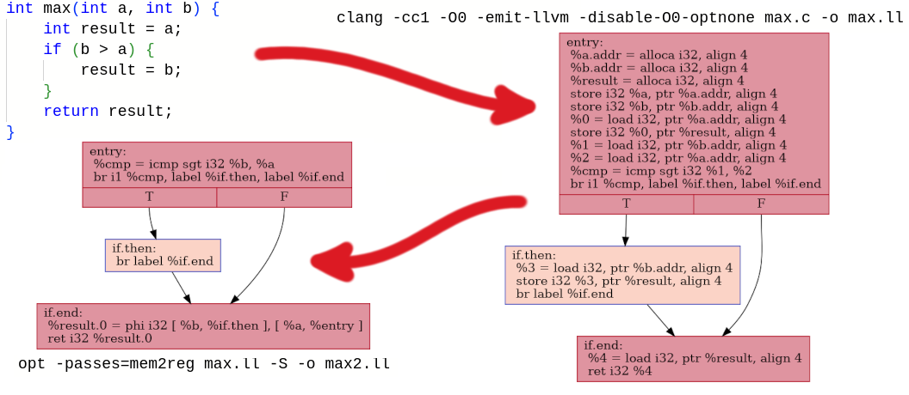
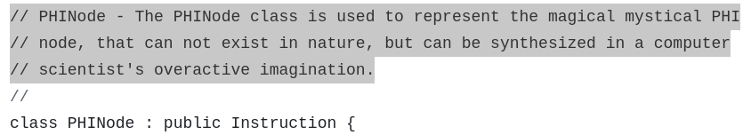
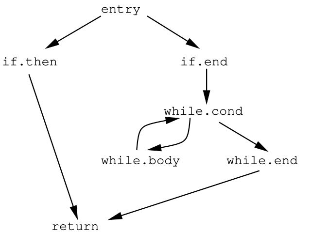

# mem2reg

## LLVM IR

Ahe compiler needs a data structure to represent code.
Currently, I use a syntax tree as an intermediate representation between *wend* and assembly.
While some optimizations are possible with this structure, there are better alternatives.

I have decided that LLVM IR is an excellent fit for my compiler.
My project has no external dependencies, and I do not intend to rely on LLVM.
However, having the ability to save my intermediate representation to disk and execute it using an external tool is invaluable!

Let's see what Clang does with the following [file](mem2reg/max.c):

```cpp linenums="1"
--8<-- "mem2reg/max.c"
```

We run `clang -cc1 -O0 -emit-llvm -disable-O0-optnone max.c -o max.ll` ant get [the following file](mem2reg/max.ll):

??? example "max.ll"
    ```llvm linenums="1"
    --8<-- "mem2reg/max.ll"
    ```

This is Clang's intermediate representation of our `int max(int, int)` function.
It can be better visualized using LLVM tools.
The following script renders all `.ll` files in the current directory:

??? example "draw.sh"
    ```shell
    #!/bin/bash

    for ll in `ls -1 *.ll`; do
        opt -passes=dot-cfg -disable-output -cfg-dot-filename-prefix=`basename $ll .ll` $ll
    done

    for f in `ls -1 *.dot`; do
        dot -Tpng $f -O
    done
    ```

And here is our `int max(int, int)`:


In essence, this is the same intermediate code file, but here the control flow graph is explicitly visible.
LLVM intermediate code is akin to assembly code, which can be broken down into basic blocks of linear code.
Each basic block ends with a `br` branching instruction (or a simple `ret`), and they can be visualized as edges connecting basic blocks.
There are very few instruction types, making it very similar to assembly, but for a virtual machine rather than real hardware.

Notice that Clang has generated a completely unoptimized version of the code.
For all three variables `a`, `b`, and `result`, it allocated space on the stack using the `alloca` instruction, and every access to them is explicitly handled via `load` and `store` instructions.
Of course, this is highly inefficient, but Clang does not care, as optimizing the code is LLVM’s responsibility, not Clang's.

## TinyCompiler -> TinyOptimizer

Well, that works fine — tinycompiler generates basic assembly-like code.
Since LLVM IR bytecode is not much different from assembly, I can simply switch the target language templates from GNU assembly to LLVM IR.
Since LLVM allows direct execution of its intermediate language files, I will temporarily discard assembly output and reintroduce it only after finishing optimization experiments.

I have no idea where this path will lead me, and I want to keep [tinycompiler](https://github.com/ssloy/tinycompiler) minimalistic.
So, I forked it into [tinyoptimizer](https://github.com/ssloy/tinyoptimizer).
By the way, why on earth doesn’t GitHub allow users to fork their own repositories?
I had to create a clone instead of a proper fork.

[Here is the commit](https://github.com/ssloy/tinyoptimizer/tree/da3e700a77a7d2d261e49e06c4092e7765443cfa) where I switched the language template.
Along the way, I made a small change: since assembly lacks variables, I previously accessed them via stack offsets.
However, LLVM IR supports proper identifiers and parameter passing (as seen in the earlier example), so why not take advantage of them?
This leaves the question of accessing variables declared outside a function.
In tinycompiler, I handled this using [displays](../tinycompiler/display.md), but now I simply added pointers to external variables as function parameters, and that’s it.

Let me provide an example.
Among my test programs, there is this one:

??? example "sopfr.wend"
    ```cpp linenums="1"
    --8<-- "mem2reg/sopfr.wend"
    ```

For this *wend* program, I generate LLVM IR, which would have been produced by Clang from the following C equivalent:

??? example "sopfr.c"
    ```cpp linenums="1"
    --8<-- "mem2reg/sopfr.c"
    ```

I convert nested functions into regular ones and pass pointers to the necessary variables.
Thus, `sopfr_aux` automatically receives a pointer to the `div` variable, which resides in the stack frame of the `sopfr` function.
Of course, I provided the C equivalent just for readability — I generate LLVM IR directly from *wend*.

## Today's topic: mem2reg

Finally, we have reached the main topic of this article.
Today, we will explore the `mem2reg` pass.
Let's revisit the function for finding the maximum of two numbers.
Clang transforms it into the intermediate code shown on the right in the image below.
Now, let's put Clang aside and ask LLVM to improve the code slightly — not fully optimize it, just perform a single explicitly specified pass that promotes memory-stored variables to registers.

[](mem2reg/max.png)

We run `opt -passes=mem2reg max.ll -S` and obtain the transformed code shown on the left in the image.
Interestingly, all `alloca`, `load`, and `store` instructions have been completely removed, replaced by a peculiar `phi` instruction.
What exactly is this?

Let's take a look at [how LLVM developers define it](https://github.com/llvm/llvm-project/blob/f451d27b387cdff14f0f45f1b3314090a5008e0c/llvm/include/llvm/IR/Instructions.h#L2608) :).



LLVM intermediate code is based on the Static Single Assignment (SSA) form.
The main idea of constructing SSA form is to assign **unique** names to all assignment results.
Virtually all programs contain branches and merge nodes.
At merge nodes, we need to add a special form of assignment called a $\phi$-function.

A $\phi$-function is always executed at the entry of a basic block, and it has the following form: $x \gets \phi(x_1, x_2, \dots, x_n)$ where $n$ is the number of predecessor nodes in the control flow graph.
The semantics of $\phi$-functions is simple: the value of the source $x_i$, corresponding to the block $i$ from which the control flow came, is selected and assigned to the variable $x$.
If control flows into the block from its $j$-th predecessor, then $x$ gets the value $x_j$.
Once again, all $\phi$-functions are executed before the regular instructions in this node.

So, at the entry to the `if.end` block, the register `%result.0` gets the value `%b` if the control flow passes through the `if.then` block, and the value `%a` if it does not.
This results in a kind of ternary conditional operator instead of intensive stack manipulation.

Why are $\phi$-functions necessary?
Look at the provided examples and note that in SSA form, each register is assigned a value **only once**.
Every time we write an instruction like `%a = ...` in SSA, it's as if in C we were only allowed to use the assignment operator for initializing constant variables like `const int a = ...`.
This does not mean that during the program execution, `a` will not hold different values.
Each basic block can be considered a small function where we declare a local constant.
By calling functions with different arguments, we get different constants `a`.
This also means that we can work locally with the block and do not have to worry about the register being redefined somewhere down the graph.
There is only one definition, and we build from it.

Just in case, how can we represent a loop where the counter must explicitly change? Let's take a look!

[](mem2reg/loop.png)

I ran clang and then the mem2reg optimization pass on trivial counter code.
Clang placed the variable `i` on the stack and counted to ten.
LLVM, when moving variables from memory to SSA registers, removed `alloca`/`load`/`store` entirely and added a $\phi$-function to `while.cond` block.
If during program execution we enter this block from the `entry` block, then `%i.0` gets the initial value.
If we enter it from the `while.body` block, then `%i.0` gets the value `%inc`.
Thus, all virtual registers have only one defining instruction, but their immediate value depends on the path taken to reach it.

There are several ways to deduce for this graph that `ret` always returns 10,
and that we can discard all this stuff by inlining the `int loop()` function call with the constant 10, but we will talk about this some other time.

In principle, these considerations can be attempted with other intermediate code representations, but SSA forms have gained the most popularity at the moment.
And the mem2reg optimization pass, which moves variables from memory to SSA registers, plays a key role in optimization.
Of course, since no assembly language has equivalents of $\phi$-functions, we will eventually have to invoke the reverse pass reg2mem, replacing $\phi$-functions with `alloca`/`store`/`load`.
But between mem2reg and reg2mem there will be other optimization passes, including constant propagation and much more.

## Let's write some code

I've encountered Fibonacci number calculation code so often that I've developed an aversion to it.
This is one of the reasons why I spent a lot of time on *wend* graphical demos.
However, now we will be working with intermediate code by hand, and I need it to be somewhat meaningful but extremely simple.
So, let's consider a C function that calculates Fibonacci numbers:

??? example "fib.c"
    ```cpp linenums="1"
    --8<-- "mem2reg/fib.c"
    ```

If we ask clang to generate intermediate code for it, we get this control flow graph:

[](mem2reg/fib_dot.png)

Let's put my compiler aside for a while and write some independent code.
What data structure can we use to represent such a control flow graph in memory? I sketched out [this file](mem2reg/ir.py):

??? example "ir.py"
    ```py linenums="1"
    --8<-- "mem2reg/ir.py"
    ```

These 55 lines allow me to manipulate intermediate code.
I have a class `ControlFlowGraph`, which is simply a list of objects `BasicBlock`.
Each basic block is just a list of $\phi$-functions and regular instructions,
as well as a list of links to the predecessors and successors of this block.
Predecessors and successors are initially empty but are filled (`compute_adjacency()`) based on branching instructions.
Each instruction is a fairly arbitrary string and a list of constants and register names involved in it.

I took the intermediate code of the `int fib(int)` function generated by clang and manually entered it into [my program](mem2reg/fib.py):

??? example "fib.py"
    ```py linenums="1" hl_lines="71-72"
    --8<-- "mem2reg/fib.py"
    ```

The output of this Python script matches the intermediate code generated by clang (well, up to some attributes that I don't need),
and it compiles/draws the same way using llvm.
Note the commented lines 71-72.
Our job for today is to uncomment them ;)

## Where to place $\phi$-functions?

We have put aside the compiler and written 55+69 lines of Python to manipulate a single Fibonacci numbers example.
It uses only local variables and nowhere takes their addresses, so we can safely discard all `alloca`.

Next, we need to remove all `store`/`load` instructions, replacing them with $\phi$-functions in the necessary places.
And where are those necessary places?

??? hint
    In principle, there is a rather brute-force method: at the entry of **each block** (well, except for the entry block), insert a **$\phi$-function for each variable**.
    Yes, even in blocks with only one predecessor!

    This is called the maximal SSA form, and this approach is usually criticized for creating too many redundant $\phi$-functions,
    slowing down compilation (I don't care) and complicates optimization.
    On the other hand, I strongly suspect that a regular DCE (dead code elimination) pass will clean up the junk completely.
    When I get to DCE in tinyoptimizer, I should try to calculate the maximal SSA form, it might be simpler.

    Remember "premature optimization is the root of all evil"...

Let's start with a fairly obvious reasoning (here and below I am working with the last example): in the `if.then` block, there is a `store` instruction `i32 0, ptr %retval`,
which writes the value 0 to the memory at the address `%retval`.
Also, in the `return` block, there is an instruction `%9 = load i32, ptr %retval`, which obviously reads memory from the same address `%retval` into the register `%9`.

But we can reach the `return` block without passing through the `if.then` block! For each `store` instruction, we need to insert a $\phi$-function in the following case:

1. If there is a path from the entry point of the graph that passes through the block with the `store` and reaches the block with the `load`,
2. And if there is another path from the entry point of the graph that reaches the block with the same `load` without passing through our `store`.

It is quite obvious that somewhere these two paths converge before reaching the `load`, and at this merge point, we need a $\phi$-function for our variable `%retval`.

The basic block where our two paths through the graph converge is one of the elements of the dominance frontier of the block containing the `store` instruction.
And here we need a bit of technical vocabulary.

## Dominance Frontiers
### Definition One
Block `A` dominates block `B` if and only if every path from the start of the graph to block `B` goes through node `A`.

It is quite obvious that every basic block dominates itself, and, for example,
there are only two blocks that dominate the `return` block, since only `entry` and `return` appear on all possible paths, they are the dominators for `return`.

Try drawing the graph on paper and determine the set of dominating blocks for each node in the graph.
Just in case, so you don't have to scroll back too far, here is the graph again:



Let's synchronize our watches, here is the list of dominators for each block:
```
{
    entry:      {entry},
    if.then:    {if.then, entry},
    if.end:     {if.end, entry},
    while.cond: {if.end, while.cond, entry},
    while.body: {while.body, if.end, while.cond, entry},
    while.end:  {while.end, if.end, while.cond, entry},
    return:     {return, entry}
}
```

### Definition Two
Block `A` strictly dominates block `B` if `A` dominates `B` but is not equal to it.
Here are the sets of strict dominators for each basic block in our program:

```
{
    entry:      {},
    if.then:    {entry},
    if.end:     {entry},
    while.cond: {if.end, entry},
    while.body: {if.end, while.cond, entry},
    while.end:  {if.end, while.cond, entry},
    return:     {entry}
}
```

### Definition Three
`A` is the immediate dominator of `B` if `A` strictly dominates `B` but no other strict dominator of `B` strictly dominates `A`.

WAIT, WHAT?

Let's break it down.
Each node has a set of strict dominators, right? Well, except for the start node.
So, we take the closest one and call it the immediate dominator.
Here is the list of immediate dominators for each of our basic blocks:

```
{
    entry:      None,
    if.then:    entry,
    if.end:     entry,
    while.cond: if.end,
    while.end:  while.cond,
    return:     entry,
    while.body: while.cond
}
```

This information can also be visualized in the form of a tree called a dominance tree:


Note that the edges of the dominance tree are not necessarily the edges of the original graph.

### Definition Four

The dominance frontier of node `A` is the set of nodes `B` such that:

1. `A` dominates at least one of their predecessors.
2. `A` does not strictly dominate the node `B` itself.

In other words, the dominance frontier of node `A` consists of nodes where the dominance of `A` ends: these nodes can be reached through both `A` and alternative paths that do not pass through `A`.

If a node in your control flow graph has fewer than two predecessors,
it will not be in the dominance frontier of any node, as it cannot be a merge point of competing definitions.
The concept of the "dominance frontier" is that these are precisely the nodes where the dominance of a node ends.
You can also say that the frontier includes all nodes that have edges coming from the dominance subtree.

The dominance frontier shows places in the CFG where different control flows converge.
Frontier nodes are places where different versions of the same variable may meet, and therefore $\phi$-functions need to be inserted there.

Let's synchronize our watches, here is the set of nodes in the dominance frontier for each node:

```
{
    entry:      {}
    if.then:    {return}
    return:     {}
    while.body: {while.cond}
    if.end:     {return}
    while.end:  {return}
    while.cond: {return, while.cond}
}
```

Let's return to our `store` operation inside the `if.then` block.
The `return` block is in the dominance frontier of `if.then`, so we need to insert a $\phi$-function there.
It all seems to match up.
By the way, note that `while.cond` is in its own frontier.
This is completely normal, no need to worry.
But it should be noted that we have a `load` of the variable `%i` in the `while.cond` block, which we can reach either from the `if.end` block or from the `while.body` block.
So we will need $\phi$-functions there as well.

Okay, we have understood the definition of dominance frontiers and can find them manually, but it would be nice to program it.
Here are 43 lines of Python that allow us to find the frontiers for each node in the CFG.

??? example "Optimizer"
    ```py linenums="1"
    --8<-- "mem2reg/optimizer.py::43"
    ```

I didn't invent anything new here, I took the simplest (and at the same time the slowest) methods, which can be easily found on Wikipedia.
Everything is calculated exactly according to the definitions I have provided.
First, the sets of dominators are calculated, then the dominance tree is derived from them, and the frontiers are derived from the tree.

## mem2reg
Armed with the terminology, we can finally clearly define the algorithm for placing $\phi$-functions in our control flow graph. Behold!

```
for each variable v
  queue all blocks containing store v
  while the queue is not empty
    pop one block b1
    for each block b2 in the dominance frontier of b1
      if we haven't placed a $\phi$-function for variable v yet
        insert it
        add b2 to the queue
```

It's all very simple, but there is one important nuance to remember: inserting a $\phi$-function is somewhat akin to adding a `store`:
by adding a $\phi$-function to block `b2`, we must also put it in the queue  for processing.

Note that at this stage we are adding $\phi$-functions, but not filling in their arguments.
We will deal with this when removing `load` and `store`.
Let's look at the [complete code](mem2reg/optimizer.py) for the mem2reg pass as I have implemented it:

??? example "mem2reg"
    ```py linenums="1"
    --8<-- "mem2reg/optimizer.py:44:"
    ```

To call it, you need to uncomment lines 71-72 in the [fib.py](mem2reg/fib.py) file.

The `mem2reg` class inherits from the `Optimizer` class, so I have full access to dominance functions.
The constructor does all the work.
First, it finds which variables in the `cfg` are subject to this optimization using `remove_promotable_allocas()`.
This function removes `alloca` of local variables from which no address is taken, i.e., it removes all local variables from the stack that are not accessible for modification by other functions.
Then `place_phi()` inserts $\phi$-functions according to the above algorithm with frontiers.
The remaining task is to fill their arguments, which is done by `remove_store_load()`.

Let's see how it works, using the same Fibonacci numbers example.
After removing `alloca` (in this case, all of them are removed) and placing $\phi$-functions, we get the following intermediate code:

??? example "$\phi$-node placement"
    ```llvm
    define i32 @fib(i32 %n) {
    entry:
            store i32 %n, ptr %n.addr
            store i32 0, ptr %a
            store i32 1, ptr %b
            store i32 1, ptr %i
            store i32 0, ptr %c
            %0 = load i32, ptr %n.addr
            %cmp = icmp eq i32 %0, 0
            br i1 %cmp, label %if.then, label %if.end
    if.then:
            store i32 0, ptr %retval
            br label %return
    if.end:
            br label %while.cond
    while.cond:
            %a_while.cond = phi i32 [?], [?]
            %b_while.cond = phi i32 [?], [?]
            %i_while.cond = phi i32 [?], [?]
            %c_while.cond = phi i32 [?], [?]
            %1 = load i32, ptr %i
            %2 = load i32, ptr %n.addr
            %cmp1 = icmp slt i32 %1, %2
            br i1 %cmp1, label %while.body, label %while.end
    while.body:
            %3 = load i32, ptr %b
            store i32 %3, ptr %c
            %4 = load i32, ptr %a
            %5 = load i32, ptr %b
            %add = add i32 %4, %5
            store i32 %add, ptr %b
            %6 = load i32, ptr %c
            store i32 %6, ptr %a
            %7 = load i32, ptr %i
            %add2 = add i32 %7, 1
            store i32 %add2, ptr %i
            br label %while.cond
    while.end:
            %8 = load i32, ptr %b
            store i32 %8, ptr %retval
            br label %return
    return:
            %retval_return = phi i32 [?], [?]
            %a_return = phi i32 [?], [?]
            %b_return = phi i32 [?], [?]
            %i_return = phi i32 [?], [?]
            %c_return = phi i32 [?], [?]
            %9 = load i32, ptr %retval
            ret i32 %9
    }
    ```

I'm not providing a picture because llvm refuses to draw it :)
It makes sense, the code is broken: in the first basic block, the register `%a` is not defined, and the $\phi$-functions, though correctly placed, are not valid instructions without arguments.

Let's do a depth-first search, starting, obviously, from the entry point of the program.
So, we have the `entry` block:

```llvm
entry:
        store i32 %n, ptr %n.addr
        store i32 0, ptr %a
        store i32 1, ptr %b
        store i32 1, ptr %i
        store i32 0, ptr %c
        %0 = load i32, ptr %n.addr
        %cmp = icmp eq i32 %0, 0
        br i1 %cmp, label %if.then, label %if.end
```

We go through all the instructions sequentially, removing all `store` and `load` instructions while examining their arguments.
The first instruction stores `%n` at the address `%n.addr`, meaning that any `load` from this address in this block can be replaced with `%n`, and in particular, `%0` is also replaced with `%n`.
Similarly, we remember the values for `%a`, `%b`, `%i`, `%c`, and remove their `store`.
After processing, `entry` looks like this:

```llvm
entry:
        %cmp = icmp eq i32 %n, 0
        br i1 %cmp, label %if.then, label %if.end
```

The `entry` block has two successors - `if.then` and `if.end`. Since we are doing a depth-first traversal, we first go to `if.then`. It looks like this:

```llvm
if.then:
        store i32 0, ptr %retval
        br label %return
```

We remove the `store`, remember that `%retval` is `0`, and go to `return`. It looks like this:

```llvm
return:
        %retval_return = phi i32 [?], [?]
        %a_return = phi i32 [?], [?]
        %b_return = phi i32 [?], [?]
        %i_return = phi i32 [?], [?]
        %c_return = phi i32 [?], [?]
        %9 = load i32, ptr %retval
        ret i32 %9
```

It's time to start filling in the $\phi$-functions.
We came from the `if.then` branch, so we remember that `%retval` in this branch is `0`, `%a` is `0`, `%b` is `1`, `%i` is `1`, and `%c` is `0`.
We fill in the corresponding argument of the $\phi$-functions, remove the `load`, replacing `%9` with `%retval_return`.
After processing, the block looks like this:

```llvm
return:
        %retval_return = phi i32 [0, %if.then], [?]
        %a_return = phi i32 [0, %if.then], [?]
        %b_return = phi i32 [1, %if.then], [?]
        %i_return = phi i32 [1, %if.then], [?]
        %c_return = phi i32 [0, %if.then], [?]
        ret i32 %retval_return
```

This is a terminal block, so the depth-first traversal returns to `if.end` (nothing to do there), then `while.cond`, and so on.

As a result, my code generates the following control flow graph:

[](mem2reg/fib3_dot.png)

Let's compare it with what llvm generated from clang's output:

[](mem2reg/fib2_dot.png)

As you can see, llvm was a bit smarter: it noticed that `a`, `b`, `i`, `c` are not used in the `return` block and did not pass them through,
and it also understood that `c` is overwritten in `while.body`, so it didn't pass it through `while.cond`.
Otherwise, the result is identical, so I am quite satisfied with my toy compiler.

Well, it's time to integrate this with the compiler.
All the tests pass, hooray!

```shell
ssloy@periwinkle:~/tinyoptimizer$ make test
Testing test-programs/nontrivial/mandelbrot.wend... ok
Testing test-programs/nontrivial/bitwise.wend... ok
Testing test-programs/nontrivial/trig-hp12c.wend... ok
Testing test-programs/nontrivial/sqrt.wend... ok
Testing test-programs/simple/fixed-point.wend... ok
Testing test-programs/simple/eight-queens.wend... ok
Testing test-programs/simple/mutual-recursion.wend... ok
Testing test-programs/simple/popcount.wend... ok
Testing test-programs/simple/collatz.wend... ok
Testing test-programs/simple/sopfr.wend... ok
Testing test-programs/elementary/helloworld.wend... ok
Testing test-programs/elementary/arithmetic.wend... ok
Testing test-programs/elementary/scope.wend... ok
Testing test-programs/elementary/overload.wend... ok
Testing test-programs/elementary/int-overflow.wend... ok
```

The compiler code [lives here](https://github.com/ssloy/tinyoptimizer/tree/1fc65c278c98ec0859ffffc1d7c828ffa93fbea4),
and you can play with mem2reg manually, without the rest of the compiler, using the files from this article. Here are the links again:

* [ir.py](mem2reg/ir.py)
* [optimizer.py](mem2reg/optimizer.py)
* [fib.py](mem2reg/fib.py)


--8<-- "comments.html"
