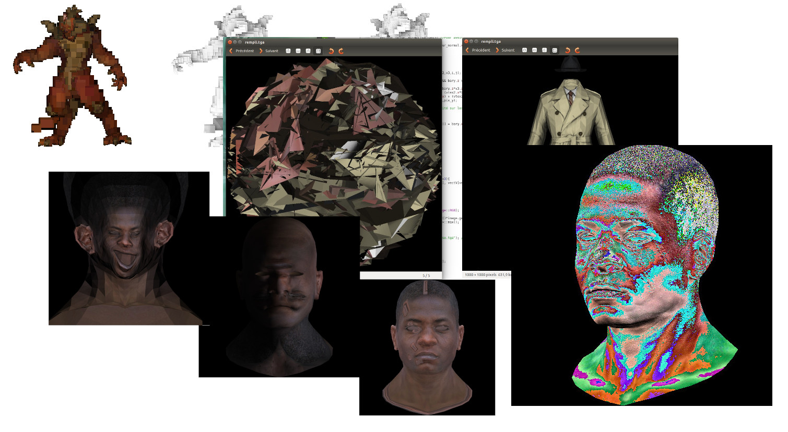

# Afterword

Computer graphics does not end with the techniques we’ve explored here, far from it.
What we covered are just a handful of tools in a vast and ever-expanding toolbox.
There are countless other tricks, variants, and styles waiting to be discovered, tweaked, or reinvented.
And perhaps the most exciting part is this: many of the most brilliant ideas in graphics have not yet been invented.
They’re out there, waiting for curious minds (maybe yours!) to stumble upon them.
So treat what you’ve learned not as a conclusion, but as a launchpad for your own experiments, accidents, and breakthroughs.

When I first published the original version of this course more than ten years ago, I had no idea what would follow.
To my surprise, it spread far and wide — across countries, classrooms, labs, and late-night coding sessions.
Along the way there were bugs across the globe (and yes, a fair number of tears too!), and my inbox filled with literally thousands of questions, suggestions, and stories.

Responding to all those messages was sometimes overwhelming, but more than anything, it was tremendously rewarding.
I had the chance to see how different people learned, struggled, and created with the material.
It reminded me that teaching is a living process: every bug fixed, every clarification added, and every diagram redrawn came out of real human interaction.

Working on this second edition has been just as much fun — perhaps even more, because I can now build on all those years of shared experience.
My hope is that this new version will continue the same spirit: practical, curious, and maybe even a little playful.

So, to everyone who has read, written, coded, cursed, or smiled along with this course: thank you.
You’ve made it a joy to write, and I can’t wait to see what you’ll do with it next.
Send me screenshots!

--8<-- "comments.html"

