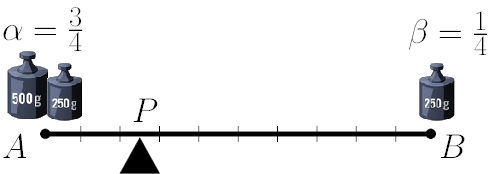
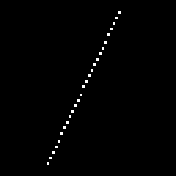
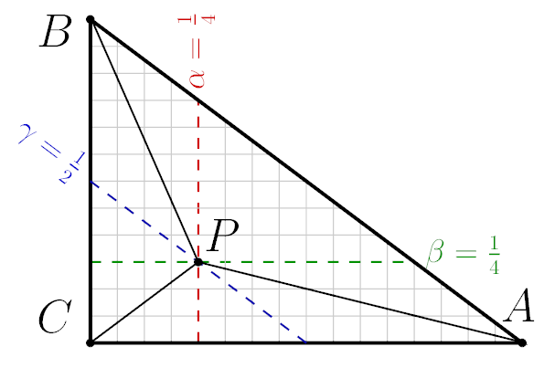
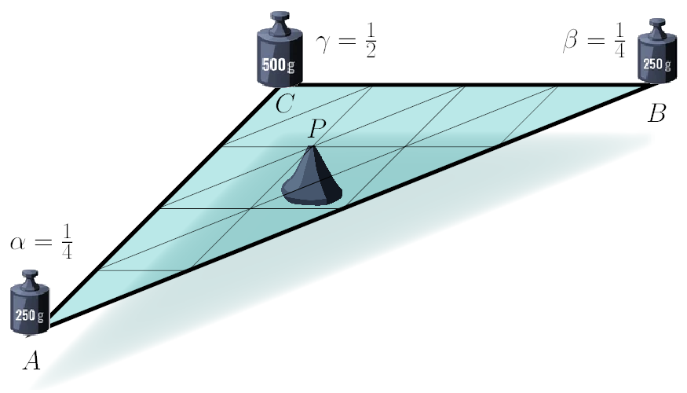
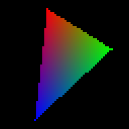

# Primer on barycentric coordinates

## 1D barycentric coordinates
### A bit of math
Now it is the time to recall the note I made on the barycentric coordinates when we rasterized segments.
Just as regular coordinates give the position of a point with respect to a chosen basis,
barycentric coordinates express a point's position relative to a given set of reference points.
Let's first consider the simplest case: a **1D segment** defined by two values \( A \in \mathbb R\) and \( B \in \mathbb R \).
Given a point \( P \) on the segment between \( A \) and \( B \), we can express its position as a weighted combination:

\[
P = \alpha A + \beta B
\]

The term "barycentric" comes from the Greek word *barys* (meaning heavy), as these coordinates originally arose in **center of mass computations**.
If we place a weight of $\alpha$ kg to the point $A$ and $\beta$ kg to the point $B$, then the barycenter of the system will be situated in the point $P$.
Note that the barycenter would not move if we put weights $13 \alpha$ and $13 \beta$ instead of $\alpha$ and $\beta$.
The usual way to eliminate this redundancy is to distribute $1$ kg in total, meaning that

\[
\alpha + \beta = 1.
\]

Under this constraint $\alpha$ and $\beta$ are unique for each choice of point $P$ and the reference segment $[A, B]$.
How do we find $\alpha$ and $\beta$ for given $P$, $A$ and $B$?
Well, we have a system of two equations with two unknowns:

$$
\left\{
\begin{array}{l}
    P = \alpha A + \beta B\\
    1~ = \alpha + \beta
\end{array}\right.
$$

Solving the system, we get following equations:

\[
\alpha = \frac{B - P}{B - A}, \quad \beta = 1-\alpha = \frac{P - A}{B - A}.
\]

### Example 1
These weights tell us how much of \( A \) and \( B \) contribute to the position of \( P \).
To take an example, let us imagine a one meter-long rod. Put 750g to the left end (point $A$), and 250g to the right end (point $B$).
To make the rod balance on a needle, we need to adapt the lengths of the levers.
In this case, the rod is balanced if $P$ is 25cm from the left endpoint, and therefore, 75cm from the right.



Note that we can have **negative weights**, meaning that they do not weigh down, but rather pull up.
Let us sum up:

- If \( P = A \), then \( \alpha = 1 \) and \( \beta = 0 \).
- If \( P = B \), then \( \alpha = 0 \) and \( \beta = 1 \).
- If both coordinates are **strictly between 0 and 1**, \( P \) is strictly inside the segment.
- If \( P \) is outside \( [A, B] \), then one coordinate is **negative**.

### Example 2

Recall our [second attempt](../bresenham/#second-attempt-different-sampling-strategy) on rasterizing line segments?
Here is the code:

```cpp linenums="1"
void line(int ax, int ay, int bx, int by, TGAImage &framebuffer, TGAColor color) {
    for (int x=ax; x<=bx; x++) {
        float t = (x-ax) / static_cast<float>(bx-ax);
        int y = std::round( (1-t) * ay + t * by );
        framebuffer.set(x, y, color);
    }
}
```

If we call `line(17, 4, 43, 59, framebuffer, white)`, we obtain the following image:



Let us take a closer look to what is happening. We iterate (line 2) through the interval $x\in[a_x, b_x]$.
For each value $x$ we determine (line 3) its barycentric coordinates $(1-t, t)$ with respect to the interval $[a_x, b_x]$.
Finally, using these barycentric coordinates with respect to **another** interval $[a_y, b_y]$, we compute interpolated value of $y$.
Therefore, in this approach $y$ is a **linear interpolation** over the segment $[a_x, b_x]$ between two samples $a_y$ and $b_y$.

The ability to interpolate various things over a given domain is an extremely powerful tool, remember it, we will make a heavy use of it.

## 2D barycentric coordinates

In 1D we used two points to compute their barycenter. In 2D we'd need a triangle.
Given a triangle with vertices \( A, B, C \), any point \( P \) inside the triangle can be written as:

\[
P = \alpha A + \beta B + \gamma C,
\]

where the barycentric coordinates \( \alpha, \beta, \gamma \) satisfy:

\[
\alpha + \beta + \gamma = 1.
\]

We can compute the weights $\alpha$, $\beta$ and $\gamma$ for given 2D points $P$, $A$, $B$ and $C$ in the same manner we did in the previous example.
We have three unknowns with three equations linking them:

$$
\left\{
\begin{array}{ll}
    \alpha A_x + \beta B_x + \gamma C_x &= P_x\\
    \alpha A_y + \beta B_y + \gamma C_y &= P_y\\
    \alpha + \beta + \gamma &= 1
\end{array}\right.
$$

How can we solve the system?

### A bit of matrix calculus (optional)
For a better readability, we can rewrite the same equation in the matrix form:

$$
\begin{pmatrix}
    A_x & B_x & C_x\\
    A_y & B_y & C_y\\
    1 & 1 & 1
\end{pmatrix}
\begin{pmatrix}\alpha \\ \beta \\ \gamma\end{pmatrix}
=
\begin{pmatrix}P_x \\ P_y \\ 1\end{pmatrix}
$$

Then we have:

$$
\begin{align*}
\begin{pmatrix}\alpha \\ \beta \\ \gamma\end{pmatrix}
&=
\begin{pmatrix}
    A_x & B_x & C_x\\
    A_y & B_y & C_y\\
    1 & 1 & 1
\end{pmatrix}^{-1}
\begin{pmatrix}P_x \\ P_y \\ 1\end{pmatrix}\\
&=
\frac{
\small
\text{adj}
\begin{pmatrix}
    A_x & B_x & C_x\\
    A_y & B_y & C_y\\
    1 & 1 & 1
\end{pmatrix}
\begin{pmatrix}P_x \\ P_y \\ 1\end{pmatrix}
}{\small
\begin{vmatrix}
    A_x & B_x & C_x\\
    A_y & B_y & C_y\\
    1 & 1 & 1
\end{vmatrix}
}
\\
&=
\frac{\small
\begin{pmatrix}
B_y - C_y & C_x - B_x &  B_x C_y - B_y C_x\\
C_y - A_y & A_x - C_x &  A_y C_x - A_x C_y\\
A_y - B_y & B_x - A_x &  A_x B_y - A_y B_x
\end{pmatrix}
\begin{pmatrix}P_x \\ P_y \\ 1\end{pmatrix}
}{\small
\begin{vmatrix}
    A_x & B_x & C_x\\
    A_y & B_y & C_y\\
    1 & 1 & 1
\end{vmatrix}
}\\
&=
\frac{\small
\begin{pmatrix}
\begin{vmatrix}
    P_x & B_x & C_x\\
    P_y & B_y & C_y\\
    1 & 1 & 1
\end{vmatrix}
&
\begin{vmatrix}
    P_x & C_x & A_x\\
    P_y & C_y & A_y\\
    1 & 1 & 1
\end{vmatrix}
&
\begin{vmatrix}
    P_x & A_x & B_x\\
    P_y & A_y & B_y\\
    1 & 1 & 1
\end{vmatrix}
\end{pmatrix}^\top
}{\small
\begin{vmatrix}
    A_x & B_x & C_x\\
    A_y & B_y & C_y\\
    1 & 1 & 1
\end{vmatrix}
}
\end{align*}
$$

It turns out that to find the weights $\alpha, \beta, \gamma$, we need to compute
determinants of four matrices that of a very particular form.
These determinants give twice the **signed area** of the triangle formed by the points in the matrices.

### Practical computation

Then the coordinate \( \alpha \) is given by the ratio of the sub-triangle \( PBC \) to the total triangle \( ABC \):

\[
\alpha = \frac{ \, \text{Area}(PBC) \, }{ \, \text{Area}(ABC) \, }.
\]

Similarly,

\[
\beta = \frac{ \, \text{Area}(PCA) \, }{ \, \text{Area}(ABC) \, }, \quad \gamma = \frac{ \, \text{Area}(PAB) \, }{ \, \text{Area}(ABC) \, }.
\]

The [shoelace formula](https://en.wikipedia.org/wiki/Shoelace_formula) allows to efficiently compute these areas:

\[
\text{Area}(ABC) = \frac{1}{2} \left( \small(B_y-A_y)(B_x+A_x) + (C_y-B_y)(C_x+B_x) + (A_y-C_y)(A_x+C_x) \right).
\]

In fact, it is just the above determinants written explicitly.
Please, do pay attention that the order of point matters, as the formula gives the **signed** area.

The interpretation of the weights is very similar to the 1D case:

- If \( \alpha, \beta, \gamma \) are all **between 0 and 1**, \( P \) is **inside** the triangle.
- If any coordinate is **negative**, \( P \) is **outside** the triangle.
- If one coordinate is exactly **zero**, \( P \) lies **on an edge**.
- If two coordinates are **zero**, \( P \) is exactly on a vertex.

### Example 1
Let me illustrate all this with the following example:



Here I took a [Pythagorean triangle](https://en.wikipedia.org/wiki/Pythagorean_triple) with sides 12:16:20.
I chose points $A, B, C$ to have coordinates $(16, 0), (0, 12), (0,0)$, respectively.
Then I took point $P = (4,3)$.

$$
\text{Area}(ABC)=
\frac12
\begin{vmatrix}
16 & 0  &0\\
0  & 12 &0\\
1  & 1  &1
\end{vmatrix} = 96,
\quad
\text{Area}(PBC)=
\frac12
\begin{vmatrix}
 4 & 0  &0\\
 3 & 12 &0\\
 1 & 1  &1
\end{vmatrix} = 24
$$

$$
\text{Area}(PCA)=
\frac12
\begin{vmatrix}
 4 & 0 & 16\\
 3 & 0 & 0 \\
 1 & 1 & 1
\end{vmatrix} = 24,
\quad
\text{Area}(PAB)=
\frac12
\begin{vmatrix}
 4 & 16 & 0\\
 3 & 0  & 12 \\
 1 & 1  &1
\end{vmatrix} = 48
$$

By dividing these areas, we obtain the barycentric coordinates:
$$
\alpha=\frac14,\quad \beta=\frac14,\quad\gamma=\frac12
$$

Note that we can compute $\text{Area}(PCA)$ more easily.
We know that the area of the triangle is half of the base (16/2) multiplied by its height (3).
Therefore, $\text{Area}(PCA)$ is constant for every position of the point $P$ that does not affect the height.
The green dashed line indicates possible positions of $P$ for $\beta=\frac14$.
The isoline $\alpha=\frac14$ is red and $\gamma=\frac12$ is blue. Naturally, they meet in the only possible point $\alpha+\beta+\gamma = 1$.

Practice makes perfect, I am not afraid of repetition: the point $P$ is the barycenter of triangle $ABC$ with weights $\alpha, \beta, \gamma$ appied to the vertices:



### Example 2

As I have already mentioned, barycentric coordinates are fundamental in rasterization because they allow efficient interpolation of attributes such as colors,
depth values, and texture coordinates across triangles in 3D rendering.
Let me a little bit modify the triangle rasterization function we made in the [previous lesson](../rasterization/).

??? example "Linear interpolation over a triangle"
    ```cpp linenums="1" hl_lines="23 37"
    --8<-- "barycentric/triangle.cpp"
    ```
In addition to the triangle vertices, I pass to the function three integers `az`, `bz`, `cz`, and I interpret them as colors of the vertices in a grayscale rasterization.
Then for each pixel with coordinates `alpha`,`beta`,`gamma`, I interpolate its color as the weighed sum `z = alpha * az + beta * bz + gamma * cz`,
obtaining the following image:


## Homework assignment

Play around with the code, for example, draw full-colored triangles instead of grayscale:



Or draw a "wireframe" triangle without using `line(...)` function:


--8<-- "comments.html"
