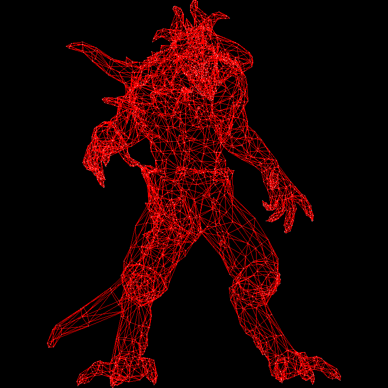
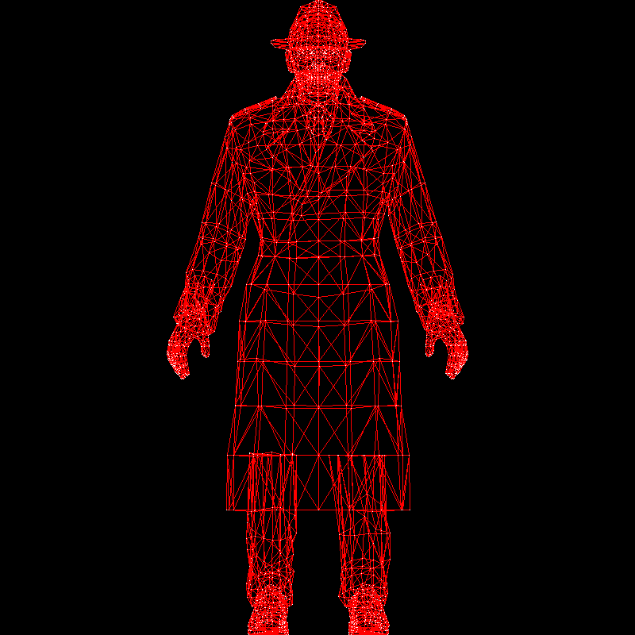

# Bresenham’s line drawing algorithm

The goal for today is to create wireframe renders.
To achieve this, we first need to learn how to draw line segments on the screen.
I provide my students with the [following code](https://github.com/ssloy/tinyrenderer/tree/706b2dfecff65daeb93de568ee2c2bd87f277860):


??? example "The starting point"
    ```cpp linenums="1"
    --8<-- "bresenham/starting.cpp"
    ```

This code generates a 64×64 image named `framebuffer.tga`.
Here’s a scaled-up version for better readability:


Our first objective is to draw three line segments forming a triangle.
At this stage, the only available functionality is setting the color of individual pixels and saving an image — there are no built-in functions for drawing lines.
We will implement it ourselves.

While Wikipedia provides an explanation of [Bresenham’s line algorithm](https://en.wikipedia.org/wiki/Bresenham%27s_line_algorithm), I find it difficult to follow.
Instead, I prefer a more gradual approach.
Given two 2D points \((a_x, a_y)\) and \((b_x, b_y)\), what is the simplest program to draw a line segment between them?


## First attempt, the simplest approach
Imagine we have a parameter \(t \in [0, 1]\).
We define the 2D point \((x(t), y(t))\) as follows:

$$
\left\{
\begin{array}{l}
    x(t)= a_x + t \cdot (b_x-a_x) \\
    y(t)= a_y + t \cdot (b_y-a_y) \\
\end{array}\right.
$$

If \(t = 0\), then \((x(t), y(t)) = (a_x, a_y)\).
If \(t = 1\), then \((x(t), y(t)) = (b_x, b_y)\).
For intermediate values of \(t\), the point moves along the segment.

??? note "Barycentric coordinates"
    An important note for the next lesson: the pair $(1-t), t$ forms the [barycentric coordinates](https://en.wikipedia.org/wiki/Barycentric_coordinate_system) of the number $x(t)$ with respect to the interval $[a_x, b_x]$
    and of the number $y(t)$ with respect to the interval $[a_y, b_y]$.
    This is a bit offtopic for today, but for the next lesson it will be a thing to remember.
    Why am I talking about the pair $(1-t), t$?

    It is because we can rewrite the parametric equation for the segment in the following form:
    $\left\{
    \begin{array}{l}
        x(t)= (1-t) \cdot a_x + t \cdot b_x \\
        y(t)= (1-t) \cdot a_y + t \cdot b_y
    \end{array}\right.$

    Imagine we have 1 kilo of balance weights $(1-t~\text{kg} + t~\text{kg} = 1~\text{kg})$. Then if we put $1-t$ kg to the point $(a_x, a_y)$ and $t$ kg to the point $(b_x, b_y)$, then the barycenter of the system will be in the point $(x(t), y(t))$,
    hence the barycentric coordinates.

Here’s the first program implementing this approach:

??? example "First attempt"
    ```cpp hl_lines="10-16" linenums="1"
    --8<-- "bresenham/bresenham1.cpp"
    ```

In lines 10-16 I have programmed exactly the parametric equation we talked about: I made the parameter $t$ vary between $0$ and $1$, and I have colored the corresponding pixel $(x(t), y(t))$.
Then I asked to draw **four** segments between the points $a$, $b$ and $c$:

* blue from $a$ to $b$
* green from $c$ to $b$
* yellow from $c$ to $a$
* red from $a$ to $c$.

Note that the last two have exactly the same endpoints, just passed to the `line(..)` function in different order.
Here is the resulting image:


What problems can you spot with my `line` function? First of all, I see that the yellow line is visible from behind the red one, and I'd expect to see exactly the same pixels colored
independently of the order of the arguments.
Second, I see gaps in the red line.
It is to be expected: `ax = 7` and `cx = 62`, so we need **at least** 62-7 = 55 pixels colored for the line to have no gaps, but the increment for `t` is only `.02`, thus we have 51 samples for each `line` call.
51 < 55, therefore gaps.
Is there a way to choose the sampling step more wisely?

## Second attempt, different sampling strategy

Let us try [the other way](https://github.com/ssloy/tinyrenderer/tree/1971e01187d32e8936cbfc780a95df6efdaa75a0):

??? example "Second attempt, round 1"
    ```cpp linenums="1" hl_lines="2-3"
    --8<-- "bresenham/bresenham2a.cpp"
    ```

Note that we defined $x$ as a function of $t$, but we can do it the other way, and define $t(x) = (x-a_x)/(b_x-a_x)$, and then compute $y(t)$ as before.
This allows me to make the loop over `x` instead of `t`, and this way the number of samples somewhat adapts to the length of the segment.
Caution! The the integer division, like `(x-ax)/(bx-ax)` may be a source of bugs. Here I cast the division to the floating point.
Here is the resulting image:


This resolves some issues but introduces others: since `x` is incremented in the loop, the green line disappears (`cx`>`bx`).
The blue line has large gaps, since we'd rather need to iterate over `y` for steep line segments: again the number of samples is insufficient.
No biggie, let us first [make the green line re-appear](https://github.com/ssloy/tinyrenderer/blob/d7662fbc12d2c5a11f59111fa978412a19ff5f7f/main.cpp):

??? example "Second attempt, round 2"
    ```cpp linenums="1" hl_lines="2-5"
    --8<-- "bresenham/bresenham2b.cpp"
    ```

I did not modify my `for` loop, but I swap the endpoints to make the segment left-to-right.
Therefore, the green line reappears. Note that the yellow line is not visible: now both calls to the yellow and red lines are identical, and therefore the red one overwrites the yellow perfectly.


Let us fix the remaining issue, namely, the insufficient sampling for steep line segments.

## Third attempt, the bulletproof one

Recall how we swapped endpoints to ensure the segment was drawn from left to right?
We can apply the same trick to address the remaining issue.
If the line is steep, meaning it is more vertical than horizontal, we transpose the image.
This transformation makes the line more horizontal in the transposed space.
Then, after drawing, we de-transpose it back — voilà!

Check the highlighted lines in the [following code](https://github.com/ssloy/tinyrenderer/blob/3998cbe5a5d31c7d3ab188ae5c634370644bf977/main.cpp):

??? example "The bulletproof method"
    ```cpp linenums="1" hl_lines="2-6 14-15"
    --8<-- "bresenham/bresenham3.cpp"
    ```

The result is flawless:


This code works pretty well.
This is exactly the level of complexity I want to see in the final version of our renderer.
While it is inefficient (due to floating-point operations, multiple divisions, and the like), it remains concise and readable.

Notably, the code lacks assertions and boundary checks, which is a drawback.
However, I avoid overloading the code in these articles to keep it accessible.
At the same time, I consistently emphasize the importance of implementing necessary checks.

## Fourth attempt: optimizations
**Warning: This section is primarily included for historical and cultural context.**

While the previous code works well, there is still room for optimization.
However, optimization must be approached with caution.
The key consideration is the target platform: optimizing for a graphics card versus a CPU are entirely different challenges.
Before and during any optimization, profiling is essential — there should be no optimization without measurement!

### Round 1

For the testing I did not modify the `line` function, but I called it 16 million times with random data so the copiler does not optimize it away.

??? example "Testing"
    ```cpp
    --8<-- "bresenham/bresenham4a.cpp"
    ```

This code creates a pretty random image like this one:


I ran the unoptimized `line` ([you can find here](https://github.com/ssloy/tinyrenderer/tree/2054b8c6e0208cc877b6ee1aaa003660e705b656)) for the baseline for the testing:

```shell
ssloy@home:~/tinyrenderer/build$ g++ ../tgaimage.cpp ../main.cpp -O3 -Wno-narrowing && time ./a.out

real    0m3.986s
user    0m3.974s
sys     0m0.009s
```

So, on my machine (Intel Xeon w3-2423 @ 3.1 Ghz) it took 3.99 seconds to draw 16 millions lines with full compiler optimization settings `-O3` turned on.

Where can we optimize the code?
I ran the profiler and I saw that the majority of time is spent in the  `framebuffer.set()` calls,
but the best we can do is to inline the function and it is out of the scope of this text.
We can, however, optimize the computation of `y`.
In fact, we saw that $y(t)= a_y + t \cdot (b_y-a_y)$, and $t(x) = (x-a_x)/(b_x-a_x)$.
Therefore, 

$$
y(x)= a_y + (x-a_x) \frac{b_y-a_y}{b_x-a_x}.
$$

Note that $x-a_x$ sweeps all the values $0,1,2\dots$ in the `for` loop.
We can therefore form the sequence $y_0 = a_y$, $y_1 = y_0 + \frac{b_y-a_y}{b_x-a_x}$, $y_2 = y_1 + \frac{b_y-a_y}{b_x-a_x}$ and so on.


In other words, at the expense of transforming `y` from integer type to floating point,
we can rewrite the previous code this way, the modifications are highlighted:

??? example "First optimization"
    ```cpp linenums="1" hl_lines="11 17"
    --8<-- "bresenham/bresenham4b.cpp"
    ```

```shell
ssloy@home:~/tinyrenderer/build$ g++ ../tgaimage.cpp ../main.cpp -O3 -Wno-narrowing && time ./a.out

real    0m2.806s
user    0m2.801s
sys     0m0.004s
```

Here we have drastic changes in performance: the running time dropped from 3.99 to 2.8 seconds.
Frankly, I was very surprized to see this improvement, as I'd expect for the optimizer to make this optimization on its own.
However, while modern optimizing compilers may be the most complex and impressive creation of humanity in the field of software engineering,
they are not magic, and they are certainly myopic.
Adding more context helps them, and this is exactly the reason why we must measure the performance.
Note that I kept `(by-ay) / static_cast<float>(bx-ax)` inside the critical loop, but the compiler is smart enough to see that this is a constant to be precomputed (I have measured it!).

### Round 2

It is a bit disappointing that we had to switch to `float y` from `int y`, especially when `framebuffer.set(...)` needs to round it anyways.
Recall that at the core loop the line is more horizontal than vertical, therefore, `y` is never incremented by more than 1.
Let us try to switch to `int y` back: we will introduce a `float error` variable that measures the error commited by `y`.
That is, for each value of `x`, `error` gives the distance from `y` to the perfect line segment.
Every time `error` exceeds half a pixel, we will increment `y` and decrement `error`.
Long story short, check [this code](https://github.com/ssloy/tinyrenderer/blob/dbd11a905a6cd3947caf551a7bda5dcbd374425c/main.cpp):

??? example "Second optimization"
    ```cpp linenums="1" hl_lines="11-12 18-22"
    --8<-- "bresenham/bresenham4c.cpp"
    ```

Once again, I highlighted the lines affected by the changes.
This time the timings are not surprizing, we are doing more work, so the time increased from 2.8 to 3.7 seconds :

```shell
ssloy@home:~/tinyrenderer/build$ g++ ../tgaimage.cpp ../main.cpp -O3 -Wno-narrowing && time ./a.out

real    0m3.717s
user    0m3.712s
sys     0m0.004s
```

### Round 3, the final one

Can we eliminate floating-point computations entirely? Let’s examine the previous listing.

We start with `error` initialized to zero, and we actually use this variable three times—in lines 18, 19, and 21.
Do we need fractional values? Surprisingly, not at all.
By introducing an integer variable `ierror`, defined as `error * 2 * (bx - ax)`, we can eliminate floating-point operations altogether.
Check the [following code](https://github.com/ssloy/tinyrenderer/blob/477b3cd686ed16cb2f5b723d51ae4d0ec728fdc5/main.cpp):

??? example "Final optimization"
    ```cpp linenums="1" hl_lines="12 18-19 21"
    --8<-- "bresenham/bresenham4d.cpp"
    ```
Once again, I have highlighted the affected lines.
It turns out we have arrived at Bresenham’s line-drawing algorithm.
Now, let’s measure the performance:


```shell
ssloy@home:~/tinyrenderer/build$ g++ ../tgaimage.cpp ../main.cpp -O3 -Wno-narrowing && time ./a.out

real    0m3.573s
user    0m3.572s
sys     0m0.000s
```

The time dropped from 3.7 seconds in the previous round (and from 3.99 seconds in the non-optimized version) to 3.57 seconds in this one.
However, it **increased** from 2.8 seconds in round 1!
I attempted optimizations such as moving `2*(bx - ax)` out of the loop, but the compiler had already performed this optimization.

In the past, floating-point operations were significantly more expensive than integer ones (or even entirely inaccessible).
This is why Jack Elton Bresenham developed his all-integer rasterization algorithm in the 1960s.
As seen in my experiments, integers can still be faster than floating-point computations (this round is more efficient than the previous one), but the performance gain is marginal.
Today, integer operations are not always more efficient than floating-point calculations — it depends on the context.

Nevertheless, mastering these techniques remains valuable.
As mentioned earlier, this section serves mainly as a historical tribute to Professor Bresenham.
His algorithm is elegant, and the discovery of all-integer rasterization was truly ingenious.

### Round 4, postscriptum

What is the real reason why the code from round 3 is slower than the code from round 1? We are performing integer computations, which are generally faster than floating-point ones.
However, we introduced an `if` condition inside the critical loop, and that negatively impacts performance.

On a typical x86 processor, instruction execution is divided into several stages.
Different hardware components handle different stages, allowing multiple instructions to be processed simultaneously.
This technique is called **pipelining**.
However, when a branch occurs, the next instruction depends on the result of the previous one, preventing efficient pipelining.
The processor either waits or predicts the outcome, potentially mispredicting and stalling the pipeline.

The `if (steep)` condition does not significantly affect performance, as modern branch predictors handle it well — especially since the same branch is consistently taken inside the critical loop.
However, `if (ierror > bx - ax)` is the performance killer.

There are techniques to rewrite computations in a branchless form, but I applied a trick so ugly, that I didn’t even commit it to the repository.
Check lines 19-20:

??? example "Ugly branchless rasterization"
    ```cpp linenums="1" hl_lines="19-20"
    --8<-- "bresenham/bresenham5.cpp"
    ```
As I said, the trick is ugly, I **always** increment `y` and `ierror`, but most of time by zero :)
Let us measure the performance:

```shell
ssloy@home:~/tinyrenderer/build$ g++ ../tgaimage.cpp ../main.cpp -O3 -Wno-narrowing && time ./a.out

real    0m2.732s
user    0m2.731s
sys     0m0.000s
```

Yay, this code is the fastest!


## Homework: wireframe rendering

Now we are ready to create wireframe renderings. What is missing?
The art!
Here is an example of an [object to render](https://github.com/ssloy/tinyrenderer/blob/5c8360eae3c3fde1264713c8f6a303a2956217f0/obj/diablo3_pose/diablo3_pose.obj).
I used the [wavefront obj](https://en.wikipedia.org/wiki/Wavefront_.obj_file) file format to store the models,
it is a simple text-based format.
At this stage, we are interested by the lines starting by `v ` and by `f `.

Lines starting with `v ` define vertices in 3D space. Each line contains three numbers representing the $x$, $y$ and $z$ coordinates of a vertex.
Example:
```
v 0.608654 -0.568839 -0.416318
```
This means there is a vertex at coordinates (0.608654,−0.568839,−0.416318).

Lines starting with `f ` define faces, which are polygons connecting the vertices from the previous array.
Example:
```
f 1193/1240/1193 1180/1227/1180 1179/1226/1179
```
Right now we are interested in the first number after each space.
It is the index of the vertex in the `v ` array that we have read before.
Thus, this line says that vertices 1193, 1180 and 1179 form a triangle.
Note that in obj files indices start from 1, so we need to decrement these indices when using C++ arrays.

Pause here for a moment and try to generate the following image.
Whether you succeed or struggle, attempting the task before reading further is essential.
Simply reading the code that follows will not be as beneficial unless you have made an effort to implement your own version first.

Once again, my source code is not what matters — I am a mediocre programmer.
The real learning happens when you compare your implementation to mine.




## My solution

[Here is](https://github.com/ssloy/tinyrenderer/tree/1e1d3392e8b4e650dd09b3345ff3d2463039675e) my solution to the homework assignment.
The data structure I am loading the file is straightforward:
??? example "model.h"
    ```cpp
    --8<-- "bresenham/model.h"
    ```

The `v ` lines are loaded as is to the `verts` array as is, and the indices of the vertices forming each triangle are loaded to the `facet_vrt` array.
It means that the size of `facet_vrt` is a multiple of 3, as it stores three integers per triangle.
Those are private members, there are more high-level functions to interface the model:
`int nverts()` and `int nfaces()` allow to query the number of vertices and the number of triangles in the model,
`vec3 vert(int)` allows to query the point cloud directly, and `vec3 vert(int, int)` allows to ask for one of three points of a specific triangle.
Finally, in the constructor of `Model(std::string filename)` there is a very basic parser for the part of .obj files we are interested in right now.

`vec3` template gives a storage container for 3D vectors, the data can be accessed through both `operator[]` and `.x`, `.y` and `.z` members.
At the moment it can look a bit overdesigned, but I need templates to implement `vec2` and `vec4`, as well as matrices and common arithmetic operations over it.

And here is the main rendering code:
??? example "main.cpp"
    ```cpp linenums="1" hl_lines="41-44 55-62"
    --8<-- "bresenham/wireframe.cpp"
    ```

The highlighted lines are of particular interest.
The loop in lines 55-62 performs actual rendering, it iterates through all triangles,
projects three vertices to the screen, and calls `line()` function we have implemented.

The projection (lines 41-44) merits a bit of attention. First of all, here I take a 3D point cloud that I am projecting to a 2D screen.
It turns out that if we simply forget the $z$ coordinate, it is an orthogonal projection of the model to the $0xy$ plane.
Then we need a small tweaking. The models in my repository are scaled so they fit the $[-1,1]^3$ cube.
Therefore, if we just drop the $z$ coordinate, they will fit only 4 pixels, and 3 of them are out of the screen.
So, the projection is made with three following steps:

* we drop the $z$ coordinate
* we add 1 to both $x$ and $y$, therefore the 2D point cloud lies in the $[0,2]^2$ square
* we scale the square so it spans all the screen by multiplying the coordinates by `size/2`, now the 2D point cloud fits the $[0,\text{size}]^2$ square.

This is called the [viewport transform](https://www.songho.ca/opengl/gl_viewport.html) that we will address a couple of lessons later.

Here are two more renderings generated with my solution:




Next, we will move on to filling triangles to create solid renders. Stay tuned!

--8<-- "comments.html"
