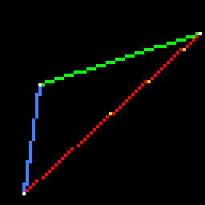
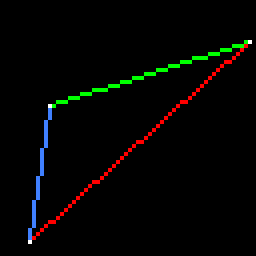

# Bresenham’s line drawing algorithm

The goal for today is to create wireframe renders.
To do this, we should learn how to draw line segments on the screen.
Recall that I give my students the [following code](https://github.com/ssloy/tinyrenderer/tree/706b2dfecff65daeb93de568ee2c2bd87f277860):

??? example "The starting point"
    ```cpp linenums="1"
    #include "tgaimage.h"

    constexpr TGAColor white   = {255, 255, 255, 255}; // attention, BGRA order
    constexpr TGAColor green   = {  0, 255,   0, 255};
    constexpr TGAColor red     = {  0,   0, 255, 255};
    constexpr TGAColor blue    = {255, 128,  64, 255};
    constexpr TGAColor yellow  = {  0, 200, 255, 255};

    int main(int argc, char** argv) {
        constexpr int width  = 64;
        constexpr int height = 64;
        TGAImage framebuffer(width, height, TGAImage::RGB);

        int ax =  7, ay =  3;
        int bx = 12, by = 37;
        int cx = 62, cy = 53;

        framebuffer.set(ax, ay, white);
        framebuffer.set(bx, by, white);
        framebuffer.set(cx, cy, white);

        framebuffer.write_tga_file("framebuffer.tga");
        return 0;
    }
    ```

It produces the 64x64 image `framebuffer.tga`, here I scaled it for better readability :


I want to draw three line segments forming the triangle.
So, the only thing we can do in the beginning is setting the color of a single pixel and saving an image.
There are no built-in functions for drawing line segments — we need to implement them.

While it is possible to open wikipedia on [Bresenham’s line algorithm](https://en.wikipedia.org/wiki/Bresenham%27s_line_algorithm), personally I find it hard to follow.
I prefer another approach.
Given two 2D points $(a_x, a_y)$ and $(b_x, b_y)$, what is the simplest program that draws the line segment between them?

## First attempt, the simplest approach
Imagine we have a parameter $t\in[0, 1]$.
Let us define the 2D point $(x(t), y(t))$ that depends on the parameter $t$ as follows:

$$
\left\{
\begin{array}{l}
    x(t)= a_x + t \cdot (b_x-a_x) \\
    y(t)= a_y + t \cdot (b_y-a_y) \\
\end{array}\right.
$$

If $t=0$, then $(x(t), y(t)) = (a_x, a_y)$. If $t=1$, then $(x(t), y(t)) = (b_x, b_y)$. For the intermediate values of $t$ the point sweeps the segment.

??? note "Barycentric coordinates"
    An important note for the next lesson: the pair $(1-t), t$ forms the [barycentric coordinates](https://en.wikipedia.org/wiki/Barycentric_coordinate_system) of the number $x(t)$ with respect to the interval $[a_x, b_x]$
    and of the number $y(t)$ with respect to the interval $[a_y, b_y]$.
    This is a bit offtopic for today, but for the next lesson it will be a thing to remember.
    Why am I talking about the pair $(1-t), t$?

    It is because we can rewrite the parametric equation for the segment in the following form:
    $\left\{
    \begin{array}{l}
        x(t)= (1-t) \cdot a_x + t \cdot b_x \\
        y(t)= (1-t) \cdot a_y + t \cdot b_y
    \end{array}\right.$

    Imagine we have 1 kilo of balance weights $(1-t~\text{kg} + t~\text{kg} = 1~\text{kg})$. Then if we put $1-t$ kg to the point $(a_x, a_y)$ and $t$ kg to the point $(b_x, b_y)$, then the barycenter of the system will be in the point $(x(t), y(t))$,
    hence the barycentric coordinates.

Let us examine the following program:

??? example "First attempt"
    ```cpp hl_lines="10-16" linenums="1"
    #include <cmath>
    #include "tgaimage.h"

    constexpr TGAColor white   = {255, 255, 255, 255}; // attention, BGRA order
    constexpr TGAColor green   = {  0, 255,   0, 255};
    constexpr TGAColor red     = {  0,   0, 255, 255};
    constexpr TGAColor blue    = {255, 128,  64, 255};
    constexpr TGAColor yellow  = {  0, 200, 255, 255};

    void line(int ax, int ay, int bx, int by, TGAImage &framebuffer, TGAColor color) {
        for (float t=0.; t<1.; t+=.02) {
            int x = std::round( ax + (bx-ax)*t );
            int y = std::round( ay + (by-ay)*t );
            framebuffer.set(x, y, color);
        }
    }

    int main(int argc, char** argv) {
        constexpr int width  = 64;
        constexpr int height = 64;
        TGAImage framebuffer(width, height, TGAImage::RGB);

        int ax =  7, ay =  3;
        int bx = 12, by = 37;
        int cx = 62, cy = 53;

        line(ax, ay, bx, by, framebuffer, blue);
        line(cx, cy, bx, by, framebuffer, green);
        line(cx, cy, ax, ay, framebuffer, yellow);
        line(ax, ay, cx, cy, framebuffer, red);

        framebuffer.set(ax, ay, white);
        framebuffer.set(bx, by, white);
        framebuffer.set(cx, cy, white);

        framebuffer.write_tga_file("framebuffer.tga");
        return 0;
    }
    ```

In lines 10-16 I have programmed exactly the parametric equation we talked about: I made the parameter $t$ vary between $0$ and $1$, and I have colored the corresponding pixel $(x(t), y(t))$.
Then I asked to draw **four** segments between the points $a$, $b$ and $c$:

* blue from $a$ to $b$
* green from $c$ to $b$
* yellow from $c$ to $a$
* red from $a$ to $c$.

Note that the last two have exactly the same endpoints, just passed to the `line(..)` function in different order.
Here is the resulting image:



What problems can you spot with my `line` function? First of all, I see that the yellow line is visible from behind the red one, and I'd expect to see exactly the same pixels colored
independently of the order of the arguments.
Second, I see gaps in the red line.
It is to be expected: `ax = 7` and `cx = 62`, so we need **at least** 62-7 = 55 pixels colored for the line to have no gaps, but the increment for `t` is only `.02`, thus we have 51 samples for each `line` call.
51 < 55, therefore gaps.
Is there a way to choose the sampling step more wisely?

## Second attempt, different sampling strategy

Let us try [the other way](https://github.com/ssloy/tinyrenderer/tree/1971e01187d32e8936cbfc780a95df6efdaa75a0):

??? example "Second attempt, round 1"
    ```cpp linenums="1" hl_lines="2-3"
    void line(int ax, int ay, int bx, int by, TGAImage &framebuffer, TGAColor color) {
        for (int x=ax; x<=bx; x++) {
            float t = (x-ax) / static_cast<float>(bx-ax);
            int y = std::round( ay + (by-ay)*t );
            framebuffer.set(x, y, color);
        }
    }
    ```
Note that we defined $x$ as a function of $t$, but we can do it the other way, and define $t(x) = (x-a_x)/(b_x-a_x)$, and then compute $y(t)$ as before.
This allows me to make the loop over `x` instead of `t`, and this way the number of samples somewhat adapts to the length of the segment.
Caution! The the integer division, like `(x-ax)/(bx-ax)` may be a source of bugs. Here I cast the division to the floating point.
Here is the resulting image:


There are no surprises: since `x` is incremented in the loop, the green line disappears (`cx`>`bx`). The blue line has large gaps, since we'd rather need to iterate over `y` for steep line segments: again the number of samples is insufficient.
No biggie, let us first [make the green line re-appear](https://github.com/ssloy/tinyrenderer/blob/d7662fbc12d2c5a11f59111fa978412a19ff5f7f/main.cpp):

??? example "Second attempt, round 2"
    ```cpp linenums="1" hl_lines="2-5"
    void line(int ax, int ay, int bx, int by, TGAImage &framebuffer, TGAColor color) {
        if (ax>bx) { // make it left−to−right
            std::swap(ax, bx);
            std::swap(ay, by);
        }
        for (int x=ax; x<=bx; x++) {
            float t = (x-ax) / static_cast<float>(bx-ax);
            int y = std::round( ay + (by-ay)*t );
            framebuffer.set(x, y, color);
        }
    }
    ```

I did not modify my `for` loop, but I swap the endpoints to make the segment left-to-right.
Therefore, the green line reappears. Note that the yellow line is not visible: now both calls to the yellow and red lines are identical, and therefore the red one overwrites the yellow perfectly.


Let us fix the remaining issue, namely, the insufficient sampling for steep line segments.

## Third attempt, the bulletproof one

Recall how we swapped endpoints to make the segment left-to-right? We can perform exactly the same trick for the remaining issue.
If the line is steep, i.e. it is more vertical than horizontal, then transpose the image.
It becomes more horizontal in the transposed image. Then de-transpose and voilà !
Check the highlighted lines in the [following code](https://github.com/ssloy/tinyrenderer/blob/3998cbe5a5d31c7d3ab188ae5c634370644bf977/main.cpp):

??? example "The bulletproof method"
    ```cpp linenums="1" hl_lines="2-6 14-15"
    void line(int ax, int ay, int bx, int by, TGAImage &framebuffer, TGAColor color) {
        bool steep = std::abs(ax-bx) < std::abs(ay-by);
        if (steep) { // if the line is steep, we transpose the image
            std::swap(ax, ay);
            std::swap(bx, by);
        }
        if (ax>bx) { // make it left−to−right
            std::swap(ax, bx);
            std::swap(ay, by);
        }
        for (int x=ax; x<=bx; x++) {
            float t = (x-ax) / static_cast<float>(bx-ax);
            int y = std::round( ay + (by-ay)*t );
            if (steep) // if transposed, de−transpose
                framebuffer.set(y, x, color);
            else
                framebuffer.set(x, y, color);
        }
    }
    ```

The result is perfect:



This code works great.
That’s exactly the kind of complexity I want to see in the final version or our renderer.
It is definitely inefficient (floating point, multiple divisions, and the like), but it is short and readable.
Note that it has no asserts and no checks on going beyond the borders, which is bad.
In these articles I try not to overload this particular code, as it gets read a lot.
At the same time, I systematically remind of the necessity to perform checks.


## Fourth attempt: optimizations
**Warning: This section is here mainly for historical/cultural reasons.**

So, the previous code works fine, but we can optimize it.
Optimization is a dangerous thing.
We should be clear about the platform the code will run on.
Optimizing the code for a graphics card or just for a CPU — are completely different things.
Before and during any optimization, **the code must be profiled**.
No optimization without measuring!
I am writing this text in 2025 on my old laptop and the results suprise me.

### Round 1

For the testing I did not modify the `line` function, but I called it 16 million times with random data so the copiler does not optimize it away.

??? example "Testing"
    ```cpp
    #include <cmath>
    #include <cstdlib>
    #include <ctime>
    #include "tgaimage.h"

    void line(int ax, int ay, int bx, int by, TGAImage &framebuffer, TGAColor color) {
        bool steep = std::abs(ax-bx) < std::abs(ay-by);
        if (steep) { // if the line is steep, we transpose the image
            std::swap(ax, ay);
            std::swap(bx, by);
        }
        if (ax>bx) { // make it left−to−right
            std::swap(ax, bx);
            std::swap(ay, by);
        }
        for (int x=ax; x<=bx; x++) {
            float t = (x-ax) / static_cast<float>(bx-ax);
            int y = std::round( ay + (by-ay)*t );
            if (steep) // if transposed, de−transpose
                framebuffer.set(y, x, color);
            else
                framebuffer.set(x, y, color);
        }
    }

    int main(int argc, char** argv) {
        constexpr int width  = 64;
        constexpr int height = 64;
        TGAImage framebuffer(width, height, TGAImage::RGB);

        std::srand(std::time({}));
        for (int i=0; i<(1<<24); i++) {
            int ax = rand()%width, ay = rand()%height;
            int bx = rand()%width, by = rand()%height;
            line(ax, ay, bx, by, framebuffer, { rand()%255, rand()%255, rand()%255, rand()%255 });
        }

        framebuffer.write_tga_file("framebuffer.tga");
        return 0;
    }
    ```

This code creates a pretty random image like this one:


I ran the unoptimized `line` ([you can find here](https://github.com/ssloy/tinyrenderer/tree/2054b8c6e0208cc877b6ee1aaa003660e705b656)) for the baseline for the testing:

```shell
ssloy@home:~/tinyrenderer/build$ g++ ../tgaimage.cpp ../main.cpp -O3 -Wno-narrowing && time ./a.out

real    0m4.904s
user    0m4.903s
sys     0m0.000s
```

So, on my machine it took 4.9 seconds to draw 16 millions of lines with full compiler optimization settings `-O3`.

Where can we optimize the code?
I ran the profiler and I saw that the majority of time is spent in the  `framebuffer.set()` calls,
but the best we can do is to inline the function and it is out of the scope.

But we can optimize the computation of `y`.
In fact, we saw that $y(t)= a_y + t \cdot (b_y-a_y)$, and $t(x) = (x-a_x)/(b_x-a_x)$.
Therefore, 

$$
y(x)= a_y + (x-a_x) \frac{b_y-a_y}{b_x-a_x}.
$$

Note that $x-a_x$ sweeps all the values $0,1,2\dots$ in the `for` loop.
We can therefore form the sequence $y_0 = a_y$, $y_1 = y_0 + \frac{b_y-a_y}{b_x-a_x}$, $y_2 = y_1 + \frac{b_y-a_y}{b_x-a_x}$ and so on.


In other words, at the expense of transforming `y` from integer type to floating point,
we can rewrite the previous code this way, the modifications are highlighted:

??? example "First optimization"
    ```cpp linenums="1" hl_lines="11 17"
    void line(int ax, int ay, int bx, int by, TGAImage &framebuffer, TGAColor color) {
        bool steep = std::abs(ax-bx) < std::abs(ay-by);
        if (steep) { // if the line is steep, we transpose the image
            std::swap(ax, ay);
            std::swap(bx, by);
        }
        if (ax>bx) { // make it left−to−right
            std::swap(ax, bx);
            std::swap(ay, by);
        }
        float y = ay;
        for (int x=ax; x<=bx; x++) {
            if (steep) // if transposed, de−transpose
                framebuffer.set(y, x, color);
            else
                framebuffer.set(x, y, color);
            y += (by-ay) / static_cast<float>(bx-ax);
        }
    }
    ```

```shell
ssloy@home:~/tinyrenderer/build$ g++ ../tgaimage.cpp ../main.cpp -O3 -Wno-narrowing && time ./a.out

real    0m3.301s
user    0m3.300s
sys     0m0.000s
```

And we have drastic changes in performance: the running time dropped from 4.9 to 3.3 seconds.
Frankly, I was very surprised to this this improvement, as I'd expect for the optimizer to make this optimization on its own.
However, while modern optimizing compilers may be the most complex and impressive creation of humanity in the field of software engineering,
they are not magic, and they are certainly myopic.
Adding more context helps them, and this is exactly the reason why we must measure the performance.
Note that I kept `(by-ay) / static_cast<float>(bx-ax)` inside the critical loop, but the compiler is smart enough to see that this is a constant to be precomputed (I have measured it!).

### Round 2

https://github.com/ssloy/tinyrenderer/blob/dbd11a905a6cd3947caf551a7bda5dcbd374425c/main.cpp


```shell
ssloy@home:~/tinyrenderer/build$ g++ ../tgaimage.cpp ../main.cpp -O3 -Wno-narrowing && time ./a.out

real    0m4.160s
user    0m4.160s
sys     0m0.000s
```

### Round 3


https://github.com/ssloy/tinyrenderer/blob/477b3cd686ed16cb2f5b723d51ae4d0ec728fdc5/main.cpp

```shell
ssloy@home:~/tinyrenderer/build$ g++ ../tgaimage.cpp ../main.cpp -O3 -Wno-narrowing && time ./a.out

real    0m3.469s
user    0m3.469s
sys     0m0.000s
```


## Wireframe rendering

https://github.com/ssloy/tinyrenderer/blob/5c8360eae3c3fde1264713c8f6a303a2956217f0/main.cpp
