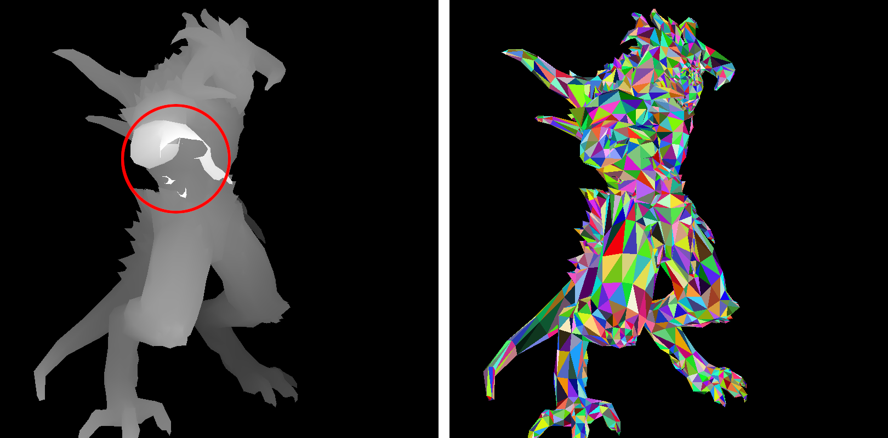

# A crude (but simple) approach to camera handling

## Rotating the camera

At this stage, our renderer has no explicit concept of a camera:
depth (the $z$-coordinate) does not influence the size or shape of objects, and is largely ignored.
We do use the $z$-coordinate in the $z$-buffer to hide occluded surfaces, but this is a minor detail.
Ignoring depth leads to orthographic projection, where objects retain their dimensions regardless of distance from the viewer.
As before, our renderer outputs two images: `zbuffer.tga` and `framebuffer.tga`.

[](camera-naive/head-front.png)

To simulate a camera, we transform the scene rather than moving the camera itself.
For example, instead of rotating the camera to the left, we rotate the scene to the right.
This keeps the camera fixed conceptually, and shifts the viewpoint via model-view transformations.
This method simplifies camera handling and offers intuitive control over the visible scene.

See [this commit](https://github.com/ssloy/tinyrenderer/commit/57760190f9f19005afe7031967c4e21dab3b9fd8):

??? example "Rotating the Object"
    ```cpp linenums="1" hl_lines="1-5 24-26"
    --8<-- "camera-naive/rot.cpp"
    ```

In this example, I apply the function `vec3 rot(vec3 v)` (lines 1–5) to each model vertex (lines 24–26) before projection.
This rotates each vertex by $30^\circ$ around the $y$-axis to the right, giving the impression of rotating the camera to the left:

[](camera-naive/head-rot.png)

Here, a constant [rotation matrix](https://en.wikipedia.org/wiki/Rotation_matrix#In_three_dimensions) is used.
Thanks to the previous homework, we now have basic vector and matrix operations available.
If you're not familiar with rotation matrices, don't worry - we'll soon explore alternative model-view transformations.
However, be sure to review basic vector math, as it will be essential.

## Central projection

Orthographic projection is useful, but central (or perspective) projection offers more realism:
closer objects appear larger than distant ones.

Consider projecting a point $P = (x, y, z)$ onto the plane $z=0$ using a camera located at $C = (0, 0, c)$ on the $z$-axis:


The projection point $P'$ lies at the intersection of line $CP$ and the screen plane $z=0$.
Given $P = (x, y, z)$ and camera parameter $c$, we want to find $P' = (x', y', 0)$.

Let’s first compute $x'$ using the plane $y = 0$:


Using the [intercept theorem](https://en.wikipedia.org/wiki/Intercept_theorem):

$$
\frac{x'}{c} = \frac{x}{c - z} \quad \Rightarrow \quad x' = \frac{x}{1 - \frac{z}{c}}.
$$

Similarly, in the plane $x = 0$:


$$
\frac{y'}{c} = \frac{y}{c - z} \quad \Rightarrow \quad y' = \frac{y}{1 - \frac{z}{c}}.
$$

As expected, both expressions are structurally similar.
So, just like rotation, we implement perspective projection by transforming vertices:
we replace each vertex $(x, y, z)$ with $(x, y, z) \cdot \frac{1}{1 - \frac{z}{c}}$.
We then apply orthographic projection as usual.
See lines 7–10 and 29–31:

??? example "Central Projection"
    ```cpp linenums="1" hl_lines="7-10 29-31"
    --8<-- "camera-naive/persp.cpp"
    ```

Here is the resulting image ([see commit](https://github.com/ssloy/tinyrenderer/commit/a34b13b6e19408e930c579641cb99da78309007d)):

[](camera-naive/head-persp.png)

If this is unclear, consider the following 2D example.
Suppose we have a polygon with vertices:
$(2,0)$, $(0,2)$, $(-2, 2)$, $(-2,-2)$, and $(2,-2)$:


The camera is at $C = (10, 0)$.
We want to project all vertices onto the green line.
Each vertex $(x, y)$ is transformed to:

$$
\frac{(x, y)}{1 - \frac{x}{10}}.
$$

New coordinates:

$$
\begin{array}{l}
\frac{(2, 0)}{1 - \frac{2}{10}} = \left(\frac{5}{2}, 0\right) \\
\frac{(0, 2)}{1 - 0} = (0, 2) \\
\frac{(-2, 2)}{1 + \frac{2}{10}} = \left(-\frac{5}{3}, \frac{5}{3}\right) \\
\frac{(-2, -2)}{1 + \frac{2}{10}} = \left(-\frac{5}{3}, -\frac{5}{3}\right) \\
\frac{(2, -2)}{1 - \frac{2}{10}} = \left(\frac{5}{2}, -\frac{5}{2}\right)
\end{array}
$$

Here is the deformed object:


We can now apply an orthographic projection to these transformed points to get the desired central projection.

## Homework assignment: find the bug

Everything works well - except with the Diablo model. The hand closest to the viewer is somewhat clipped:

[](camera-naive/diablo-bug.png)

Your task is to understand why, and how to fix it.

??? bug "Spoiler Alert!"
    The $z$-buffer is stored as an 8-bit grayscale image.
    ??? bug "Spoiler Alert #2!"
        The model was assumed to fit within the cube $[-1, 1]^3$, but this doesn't hold after rotation.
        ??? bug "Spoiler Alert #3!"
            The hand's depth exceeds 1, resulting in values >255 after viewport transformation, causing integer overflow.
            While storing the $z$-buffer as an image is helpful for debugging, it’s better to use a 2D array of floating-point values.
            To visualize it, write a few lines of code to convert the depth array into an image.

--8<-- "comments.html"


