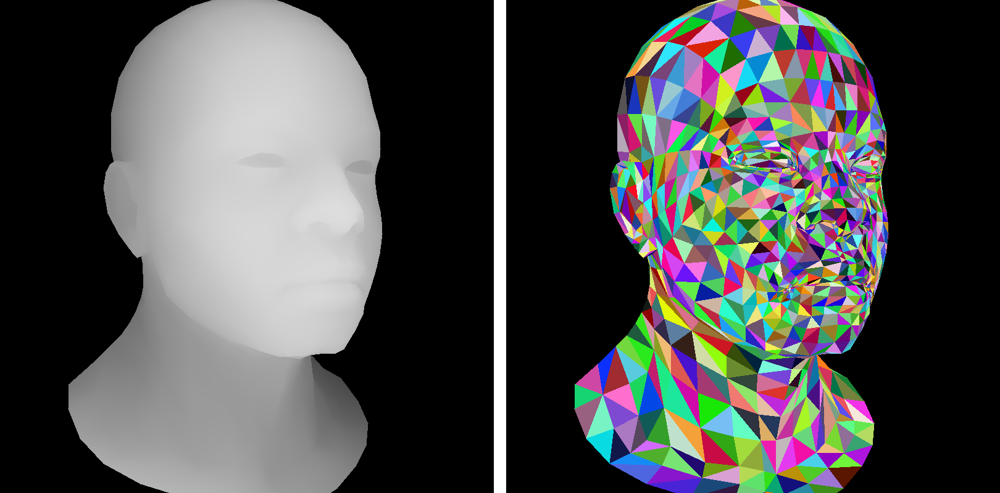

# Camera handling

## Rotating the camera

[](camera/head-front.png)

[](camera/head-rot.png)

## Central projection


[](camera/head-persp.png)

## Exercise: find the bug

[](camera/diablo-bug.png)


## Change of basis in 3D space

In Euclidean space, coordinates can be given by a point (the origin) and a basis. What does it mean that point P has coordinates (x,y,z) in the frame (O, i,j,k)? It means that the vector OP can be expressed as follows:


$$
\overrightarrow{OP} = \vec{i}x + \vec{j}y + \vec{k}z = \begin{bmatrix}\vec{i} & \vec{j} & \vec{k}\end{bmatrix}\begin{bmatrix}x \\ y \\ z\end{bmatrix}
$$

Now image that we have another frame (O', i',j',k'). How do we transform coordinates given in one frame to another? First of all let us note that since (i,j,k) and (i',j',k') are bases of 3D, there exists a (non degenerate) matrix M such that:


$$
\begin{bmatrix}\vec{i'} & \vec{j'} & \vec{k'}\end{bmatrix} =
\begin{bmatrix}\vec{i} & \vec{j} & \vec{k}\end{bmatrix} \times M
$$

Let us draw an illustration:


Then let us re-express the vector OP:

$$
\overrightarrow{OP} = \overrightarrow{OO'} + \overrightarrow{O'P} = 
\begin{bmatrix}\vec{i} & \vec{j} & \vec{k}\end{bmatrix}
\begin{bmatrix}O'_x \\ O'_y \\ O'_z\end{bmatrix} + 
\begin{bmatrix}\vec{i'} & \vec{j'} & \vec{k'}\end{bmatrix} 
\begin{bmatrix}x' \\ y' \\ z'\end{bmatrix} 
$$

Now let us substitute (i',j',k') in the right part with the change of basis matrix:


$$
\overrightarrow{OP} =
\begin{bmatrix}\vec{i} & \vec{j} & \vec{k}\end{bmatrix}\left(
\begin{bmatrix}O'_x \\ O'_y \\ O'_z\end{bmatrix} + 
 M \begin{bmatrix}x' \\ y' \\ z'\end{bmatrix} \right)
$$

And it gives us the formula to transform coordinates from one frame to another:


$$
 \begin{bmatrix}x \\ y \\ z\end{bmatrix} = 
\begin{bmatrix}O'_x \\ O'_y \\ O'_z\end{bmatrix} + 
 M \begin{bmatrix}x' \\ y' \\ z'\end{bmatrix} 
 \qquad\Rightarrow\qquad
 \begin{bmatrix}x' \\ y' \\ z'\end{bmatrix}  =
M^{-1}\left( \begin{bmatrix}x \\ y \\ z\end{bmatrix} - \begin{bmatrix}O'_x \\ O'_y \\ O'_z\end{bmatrix}\right)
$$


## Let us create our own gluLookAt

OpenGL and, as a consequence, our tiny renderer are able to draw scenes only with the camera located on the z-axis. If we want to move the camera, no problem, we can move all the scene, leaving the camera immobile.

Let us put the problem this way: we want to draw a scene with a camera situated in point e (eye), the camera should be pointed to the point c (center) in such way that a given vector u (up) is to be vertical in the final render.

Here is an illustration:


It means that we want to do the rendering in the frame (c, x',y',z'). But then our model is given in the frame (O, x,y,z)... No problem, all we need is to compute the transformation of the coordinates. Here is a C++ code computing the necessary 4x4 matrix ModelView:


```cpp
void lookat(const vec3 eye, const vec3 center, const vec3 up) {
    vec3 z = normalized(center-eye);
    vec3 x = normalized(cross(up,z));
    vec3 y = normalized(cross(z, x));
    ModelView = mat<4,4>{{{x.x,x.y,x.z,0}, {y.x,y.y,y.z,0}, {z.x,z.y,z.z,0}, {0,0,0,1}}} *
                mat<4,4>{{{1,0,0,-eye.x},  {0,1,0,-eye.y},  {0,0,1,-eye.z},  {0,0,0,1}}};
}
```

Note that z' is given by the vector ce (do not forget to normalize it, it helps later). How do we compute x'? Simply by a cross product between u and z'. Then we compute y', such that it is orthogonal to already calculated x' and z' (let me remind you that in our problem settings ce and u are not necessarily orthogonal). The very last step is a translation of the origin to the point of viewer e and our transformation matrix is ready. Now it suffices to get any point with coordinates (x,y,z,1) in the model frame, multiply it by the matrix ModelView and we get the coordinates in the camera frame! By the way, the name ModelView comes from OpenGL terminology.


## Viewport

$$
\begin{bmatrix}\frac{w}{2}&0&0&x+\frac{w}{2} \\ 0&\frac{h}{2}&0&y+\frac{h}{2}\\ 0&0&\frac{d}{2}&\frac{d}{2}\\ 0 &0 &0&1\end{bmatrix}
$$


```cpp
void viewport(const int x, const int y, const int w, const int h) {
    Viewport = {{{w/2., 0, 0, x+w/2.}, {0, h/2., 0, y+h/2.}, {0,0,1,0}, {0,0,0,1}}};
}
```

```cpp
void projection(const double f) {
    Projection = {{{1,0,0,0}, {0,-1,0,0}, {0,0,1,0}, {0,0,-1/f,0}}};
}
```


--8<-- "comments.html"

