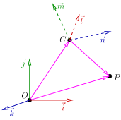

# Better camera handling

## Chain of coordinate transformations

In the [previous chapter](camera-naive.md), we chained three different transformations to the 3D object to simulate a camera:

```cpp
auto [ax, ay, az] = project(persp(rot(model.vert(i, 0))));
auto [bx, by, bz] = project(persp(rot(model.vert(i, 1))));
auto [cx, cy, cz] = project(persp(rot(model.vert(i, 2))));
```

Such a transformation chain is standard practice, and usually, it's even longer. Typically:


1. Objects (e.g., characters) are modeled in their own local frame (object coordinates).
2. They're then placed into a scene (world coordinates).
3. The scene is expressed in the camera frame (eye coordinates).
4. We [deform the scene](camera-naive.md) to apply a perspective transformation (clip coordinates).
5. Finally, to render on screen, we convert clip coordinates to screen coordinates.

In total, we use five coordinate systems connected by four transformations. When a 3D vertex `v` is read from a `.obj` file, the rendering pipeline applies this transformation chain:

```
Viewport(Perspective(View(Model(v)))).

```

In the code above, we see three transformations (with `Model` omitted) handled by different functions. Our goal is to unify and compose them. Instead of applying three separate transformations to each vertex, we aim to pre-compose them into one, allowing for faster batch processing of geometry.

Ultimately, we want to position, orient, and scale objects in a scene using composable transformations. Let’s examine two classes of transformations that support this goal.


-----------

## Linear transformations

In computer graphics, everything you see - models, characters, cameras - is made of **points and vectors**.
To animate, move, rotate, or resize them, we apply linear and affine transformations to their coordinates.

A linear transformation is a mathematical way to reshape space using just multiplication — no bending, no shifting.
In 1D, this is easy to imagine: multiplying a number by 2 stretches the space, and multiplying by -1 flips it.
For example, the transformation $x \mapsto 2x$ doubles $x$, and $x \mapsto -x$ reflects it across zero.

In 2D or 3D the same idea applies, but now we multiply a **vector** by a **matrix** instead of a single number.
This matrix controls how space is scaled, rotated, or sheared.
Formally, in $\mathbb R^n$, a linear transformation can be written as $\vec x \mapsto A\vec x$,
where $\vec x$ is a vector (or a point), and $A$ is a $n\times n$ matrix.

In 2D $A$ has for entries: $A = \begin{bmatrix}a&b\\c&d\end{bmatrix}$, so any 2D point $\begin{bmatrix}x\\y\end{bmatrix}$ is mapped to $\begin{bmatrix}ax+by\\cx+dy\end{bmatrix}$, since
$\begin{bmatrix}a&b\\c&d\end{bmatrix}\begin{bmatrix}x\\y\end{bmatrix} = \begin{bmatrix}ax+by\\cx+dy\end{bmatrix}.$

Let us see few examples.

-----------

### Identity
The simplest 2D transformation is the identity:

$$
\begin{bmatrix}1&0\\0&1\end{bmatrix}
\begin{bmatrix}x\\y\end{bmatrix} = \begin{bmatrix}x\\y\end{bmatrix}
$$

Here is an illustration: I took a colored 2D plane (an image), and applied the identity transformation to every point of the plane.
Without any surprise the image is unchanged.


-----------

### Scaling

A scaling matrix stretches objects wider or taller.
For example, $\begin{bmatrix} 2 & 0 \\ 0 & 1/2 \end{bmatrix}$ stretches the x-axis by 2 and squishes the y-axis by $1/2$.
In fact, this matrix performs simple 1D multiplication to the coordinates independently one from another.


-----------

### Rotation

A 2D rotation matrix $\begin{bmatrix} \cos\theta & -\sin\theta \\  \sin\theta & \cos\theta  \end{bmatrix}$ rotates a point counterclockwise by angle $\theta$ around the orgin.
If we take $\theta = 90°$, the matrix becomes $\begin{bmatrix} 0 & -1 \\  1 & 0 \end{bmatrix}$,
so any 2D point $\begin{bmatrix}x\\y\end{bmatrix}$ is mapped to $\begin{bmatrix}-y\\x\end{bmatrix}$, as it can be seen in this illustration:


-----------

### Shear

A shear matrix slants shapes like melting jello.
For example, $\begin{bmatrix} 1 & 1 \\ 0 & 1 \end{bmatrix}$
  slants shapes horizontally, like tilting a rectangle into a parallelogram.


-----------

These transformations are called linear because they preserve straight lines and keep the origin fixed.
Linear transformations have compact representation: a transformation like rotation or scaling in 3D can be represented with a small square matrix.
Moreover, we have the composability we were looking for. 
Suppose we have three different transformations $A_1, A_2$ and $A_3$ to be chained on every vertex $\vec x_i$ of the scene (i.e. to compute $A_3 \times A_2 \times A_1 \times \vec x_i$).
Note that the multiplication is associative, i.e. $A_3 \times (A_2 \times (A_1 \times \vec x_i)) = ((A_3 \times A_2) \times A_1) \times \vec x_i$,
therefore, we can precompute $A = A_3\times A_2 \times A_1$ and apply the matrix $A$ directly to the vertices by computing the product $A\times \vec x_i$.


-----------

## Affine transformations

Note that linear transformations always map the origin to the origin, since $A \vec 0 = \vec 0$.
But in graphics, we often need to move (translate) things - hence affine transformations are more general and more useful.


Formally, in $\mathbb R^n$, an affine transformation $T$ has form $T(\vec x)=A\vec x+\vec b$,
where $\vec x$ is a vector (or a point), $A$ is a $n\times n$ matrix representing a linear transformation (like rotation, scaling or shear),
and $\vec b$ is a translation vector.

In 2D it looks like this:

$$
\begin{bmatrix}x\\y\end{bmatrix} \quad \mapsto \quad \begin{bmatrix}a&b\\c&d\end{bmatrix}\begin{bmatrix}x\\y\end{bmatrix} + \begin{bmatrix}e\\f\end{bmatrix} = \begin{bmatrix}ax+by+e\\cx+dy+f\end{bmatrix}
$$


This expression is really cool.
We can rotate, scale, shear and translate.
However, let us recall that we are interested in composing multiple transformations. 
Here is what a composition of two transformations looks like (remember, we need to compose dozens of those):

<!--

$$
\vec x \mapsto
A_2
\left(A_1 \vec x + \vec b_1\right)
+\vec b_2
$$

-->

$$
\begin{bmatrix}x\\y\end{bmatrix} \quad \mapsto \quad \begin{bmatrix}a_2&b_2\\c_2&d_2\end{bmatrix}
\left(\begin{bmatrix}a_1&b_1\\c_1&d_1\end{bmatrix}\begin{bmatrix}x\\y\end{bmatrix} + \begin{bmatrix}e_1\\f_1\end{bmatrix}\right)
+\begin{bmatrix}e_2\\f_2\end{bmatrix}
$$

It is starting to look ugly even for a single composition, add more and things get even worse.


-----------

##  Homogeneous Coordinates
Okay, now it is the time for the black magic. Imagine that I add one column and one row to our transformation matrix (thus making it 3x3 for a 2D transformation and 4x4 for 3D) and append one coordinate always equal to 1 to our vector to be transformed:


$$
\begin{bmatrix}
T(\vec{x}) \\
1
\end{bmatrix}
=
\begin{bmatrix}
A & \vec{b} \\
\vec{0}^\top & 1
\end{bmatrix}
\begin{bmatrix}
\vec{x} \\
1
\end{bmatrix}
$$


Let us write it down explicitly for 2D:

$$
\begin{bmatrix}a&b&e\\c&d&f\\0&0&1\end{bmatrix}\begin{bmatrix}x\\y\\1\end{bmatrix} = \begin{bmatrix}ax+by+e\\cx+dy+f\\1\end{bmatrix}
$$

This matrix captures the entire transformation and is easy to store and manipulate.
If we multiply this matrix and the vector augmented by 1 we get another vector with 1 in the last component, but the other two components have exactly the shape we would like! Magic.

In fact, the idea is really simple. Translations are not linear in the 2D space. So we embed our 2D into 3D space (by simply adding 1 for the 3rd component).
It means that our 2D space is the plane $z=1$ in the 3D space. Then we perform a linear 3D transformation and project the result onto our 2D physical plane. 
How do we project 3D back onto the 2D plane? Simply by dividing by the third component:

$$
\begin{bmatrix}x\\ y\\ z\end{bmatrix} \quad \mapsto \quad \begin{bmatrix}x/z \\ y/z\end{bmatrix}
$$

In the above example the 3rd component is always 1 independently from $A$ and $\vec b$, but very soon we will meet other cases.
In fact, we have just used **homogeneous coordinates**.
They are called *homogeneous* because of the way they use ratios of coordinates that remain consistent under scaling - a key idea from projective geometry.

In the process I described, a point $(x, y)$ in Cartesian coordinates becomes $(x, y, 1)$ in homogeneous coordinates.
More generally, a 2D point $(x, y)$ is represented as:

$$
(x, y) \quad \mapsto \quad (wx, wy, w)
$$

where $w \ne 0$, and the point in Cartesian coordinates is recovered by:

$$
\left(\frac{wx}{w}, \frac{wy}{w}\right) = (x, y)
$$

So any scalar multiple of $(x, y, 1)$ — like $(2x, 2y, 2)$, or $(5x, 5y, 5)$ — represents the same point in the plane. That's the essence of homogeneity different triples represent the same point because they are all scalar multiples.

In computer graphics, we extend affine transformations into matrix form using homogeneous coordinates allowing all transformations (including translation) to be expressed as a single matrix.
This is why we often use 3×3 matrices in 2D and 4×4 matrices in 3D graphics.
While being strange at the first sight, the approach is very straightforward, and it offers two serious advantages:

1. **Translation becomes matrix multiplication.**
   Affine transformations (like translation) are not linear in Cartesian coordinates but are linear in homogeneous coordinates, thus allowing for the composability we were looking for.
2. **Enables perspective projection.**
   Homogeneous coordinates naturally handle perspective division, which is key for realistic rendering of 3D scenes (we will revisit it shortly).
   Therefore, all camera handling (rotation, scaling, translation, projection) can be done within the same consistent framework.

-----------

## Putting it all together

Recall that in the [previous chapter](camera-naive.md) we have chained three different transformations `project`, `persp` and `rot`:

```cpp
auto [ax, ay, az] = project(persp(rot(model.vert(i, 0))));
auto [bx, by, bz] = project(persp(rot(model.vert(i, 1))));
auto [cx, cy, cz] = project(persp(rot(model.vert(i, 2))));
```

Let us review them one at a time and see how we can replace it with a matrix version.
Basically, we want to compute three $4\times 4$ matrices `Viewport`, `Perspective` and `ModelView`:

```cpp
mat<4,4> ModelView, Viewport, Perspective;
```

### Viewport

The easiest one is the viewport transform that scales the scene to the size of the screen. Last time it was defined as follows:

```cpp
std::tuple<int,int,int> project(vec3 v) { // First of all, (x,y) is an orthogonal projection of the vector (x,y,z).
    return { (v.x + 1.) *  width/2,       // Second, since the input models are scaled to have fit in the [-1,1]^3 world coordinates,
             (v.y + 1.) * height/2,       // we want to shift the vector (x,y) and then scale it to span the entire screen.
             (v.z + 1.) *   255./2 };
}
```

In fact, it is a by-hand computation of the following matrix multiplication:

$$
\begin{bmatrix}\frac{\text{width}}{2}&0&0&\frac{\text{height}}{2} \\ 0&\frac{\text{height}}{2}&0&\frac{\text{height}}{2}\\ 0&0&\frac{255}{2}&\frac{255}{2}\\ 0 &0 &0&1\end{bmatrix}
\begin{bmatrix}v_x \\ v_y \\ v_z \\ 1\end{bmatrix}
$$

Once again, this function maps $[-1..1]$ range in clip coordinates (re-check the transformation chain in the beginning of this chaper) to the entire screen.
In addition to that, it maps $[-1..1]$ range of $z$ coordinates to $[0..255]$ that I used for debugging of the $z$-buffer.
For the rest of the series I'll use following viewport matrix:

$$
\begin{bmatrix}\frac{w}{2}&0&0&x+\frac{w}{2} \\ 0&\frac{h}{2}&0&y+\frac{h}{2}\\ 0&0&1&0\\ 0 &0 &0&1\end{bmatrix}
$$

I do not need anymore to re-map $z$-values to grayscale colors, so I leave it them as is.
In addition to that, $[-1..1] \times [-1..1]$ range in clip coordinates is not mapped to the entire screen anymore,
but rather to a window described by its top left corner $(x,y)$ and $(w,h)$ being the size of the window.
In my code, I setup the $4\times 4$ `Viewport` matrix with the following function:

```cpp
void viewport(const int x, const int y, const int w, const int h) {
    Viewport = {{{w/2., 0, 0, x+w/2.}, {0, h/2., 0, y+h/2.}, {0,0,1,0}, {0,0,0,1}}};
}
```

### Perspective deformation

In the last chapter we saw that we can decompose a central projection into a perspective deformation of the space followed by an orthographic projection.
For a camera with focal length $f$ located on the $z$-axis, the perspective deformation can be computed as follows:

```cpp
vec3 persp(vec3 v) {
    constexpr double f = 3.;
    return v / (1-v.z/f);
}
```

This computation may be formulated in a matrix way in homogeneous coordinates.
For a 3D point $(v_x, v_y, v_z)$, we embed it into 4D by adding 1 as the last coordinate: $(v_x, v_y, v_z, 1)$.
Next, we multiply it with the perspective matrix, getting again a 4D point.
Finally, we re-project (do not confond with the projection to the screen) the result to 3D by dividing by the last coordinate.
Here is the computation flow for the above function:

$$
\begin{bmatrix}v_x \\ v_y \\ v_z \end{bmatrix} \quad \mapsto \quad
\begin{bmatrix}1&0&0& \\ 0&1&0&0\\ 0&0&1&0\\ 0 &0 &-\frac{1}{f}&1\end{bmatrix}
\begin{bmatrix}v_x \\ v_y \\ v_z \\ 1\end{bmatrix}=
\begin{bmatrix}v_x \\ v_y \\ v_z \\ 1-\frac{v_z}{f}\end{bmatrix}
\quad \mapsto \quad \frac{1}{ 1-\frac{v_z}{f}}\begin{bmatrix}v_x \\ v_y \\ v_z \end{bmatrix}
$$

So, I setup the $4\times 4$ `Perspective` matrix located at the $z$-axis with focal distance $f$ using the following function:

```cpp
void perspective(const double f) {
    Perspective = {{{1,0,0,0}, {0,1,0,0}, {0,0,1,0}, {0,0, -1/f,1}}};
}
```

### ModelView

In the last chapter I have simply rotated the scene to simulate a camera movement.
Let us check a more handy way to describe a camera, inspired by [gluLookAt](https://registry.khronos.org/OpenGL-Refpages/gl2.1/xhtml/gluLookAt.xml) function from the OpenGL Utility Library.
GLU proposes to position the camera onto the world space by specifying three view parameters, two 3D points ($\text{eye}$ and $\text{center}$) and one 3D vector ($\overrightarrow{\text{up}}$),
all three measured in world space.

* The point $\text{eye}$  defines the location of the camera.
* The point $\text{center}$ denotes the direction where the camera is aiming at, usually at the center of the world or an object.
* The vector $\overrightarrow{\text{up}}$ denotes roughly the upward orientation of the camera.

Here is an illustration:


It means that we want to do the rendering in the frame $(\text{center}, \vec l, \vec m, \vec n)$,
where $\vec l, \vec m$ and $\vec n$ are computed from the parameters $\text{eye}, \text{center}$ and $\overrightarrow{\text{up}}$.

#### Build the camera frame

Let us see how to compute three basis vectors $(\vec l, \vec m, \vec n)$, and then we will see how to compose the transformation matrix.
First of all, our perspective deformation supposes that the eye lies on the $\vec n$ axis, therefore we can define $\vec n$ as:

$$
\vec n := \frac{\text{eye} - \text{center}}{||\text{eye} - \text{center}||}.
$$

Then, we want vector $\vec{\text{up}}$ vertical in the final projection. It means that $\vec l$ must be orthogonal to the plane spanned by $\vec{\text{up}}$ and $\vec n$.
Therefore, we can compute $\vec l$ by a cross product between $\vec{\text{up}}$ and $\vec n$:

$$
\vec l := \frac{\vec{\text{up}} \times \vec n}{||\vec{\text{up}} \times \vec n||}.
$$


And then recover $\vec m$ such that it is orthogonal to already calculated $\vec l$ and $\vec n$ (recall that in our problem settings $\text{center} - \text{eye}$ and $\vec{\text{up}}$  are not necessarily orthogonal):

$$
\vec m := \frac{\vec{n} \times \vec l}{||\vec{n} \times \vec l||}.
$$


#### Change of basis in 3D space

Now we have computed the camera frame, we need a way to transform coordinates from the world frame to the camera frame.
In Euclidean space, coordinates can be given by a point (the origin) and a basis. What does it mean that point $P$ has coordinates $(x,y,z)$ in the frame $(O, \vec i,\vec j,\vec k)$?
It means that the vector $\overrightarrow{OP}$ can be expressed as follows:

$$
\overrightarrow{OP} = \vec{i}x + \vec{j}y + \vec{k}z = \begin{bmatrix}\vec{i} & \vec{j} & \vec{k}\end{bmatrix}\begin{bmatrix}x \\ y \\ z\end{bmatrix}
$$

Now imagine that we have another frame $(C, \vec l,\vec m,\vec n)$.
How do we transform coordinates given in one frame to another?
First of all let us note that since $(\vec i,\vec j,\vec k)$ and $(\vec l, \vec m,\vec n)$ are bases of 3D, there exists a (non degenerate) matrix $M$ such that:

$$
\begin{bmatrix}\vec{l} & \vec{m} & \vec{n}\end{bmatrix} =
\begin{bmatrix}\vec{i} & \vec{j} & \vec{k}\end{bmatrix} \times M
$$

Let us draw an illustration:




Then let us re-express the vector OP:

$$
\overrightarrow{OP} = \overrightarrow{OC} + \overrightarrow{CP} = 
\begin{bmatrix}\vec{i} & \vec{j} & \vec{k}\end{bmatrix}
\begin{bmatrix}C_x \\ C_y \\ C_z\end{bmatrix} + 
\begin{bmatrix}\vec{l} & \vec{m} & \vec{n}\end{bmatrix} 
\begin{bmatrix}x' \\ y' \\ z'\end{bmatrix},
$$

where $(x', y', z')$ are the coordinates of the point $P$ in the frame $(C, \vec l,\vec m,\vec n)$,
and $(C_x, C_y, C_Z)$ are the coordinates of the point $C$ in the frame $(O, \vec i,\vec j,\vec k)$.

Now let us substitute $(\vec l,\vec m,\vec n)$ in the right part with the change of basis matrix:

$$
\overrightarrow{OP} =
\begin{bmatrix}\vec{i} & \vec{j} & \vec{k}\end{bmatrix}\left(
\begin{bmatrix}C_x \\ C_y \\ C_z\end{bmatrix} + 
 M \begin{bmatrix}x' \\ y' \\ z'\end{bmatrix} \right)
$$

And it gives us the formula to transform coordinates from one frame to another:

$$
 \begin{bmatrix}x \\ y \\ z\end{bmatrix} = 
\begin{bmatrix}C_x \\ C_y \\ C_z\end{bmatrix} + 
 M \begin{bmatrix}x' \\ y' \\ z'\end{bmatrix} 
 \qquad\Rightarrow\qquad
 \begin{bmatrix}x' \\ y' \\ z'\end{bmatrix}  =
M^{-1}\left( \begin{bmatrix}x \\ y \\ z\end{bmatrix} - \begin{bmatrix}C_x \\ C_y \\ C_z\end{bmatrix}\right)
$$


#### The matrix

So, we have two major equations to consider:

$$
\begin{bmatrix}\vec{l} & \vec{m} & \vec{n}\end{bmatrix} =
\begin{bmatrix}\vec{i} & \vec{j} & \vec{k}\end{bmatrix} \times M
$$

and

$$
 \begin{bmatrix}x' \\ y' \\ z'\end{bmatrix}  =
M^{-1}\left( \begin{bmatrix}x \\ y \\ z\end{bmatrix} - \begin{bmatrix}C_x \\ C_y \\ C_z\end{bmatrix}\right).
$$

The first one will give us a way to compute the matrix $M$, while the second one shows how to recompute coordinates in the camera frame.

In our case, the basis $(\vec i, \vec j, \vec k)$ is the global world basis, therefore $\begin{bmatrix}\vec{i} & \vec{j} & \vec{k}\end{bmatrix}$ is the $3\times 3$ identity matrix,
so the $3\times 3$ basis change matrix $M$ can be found as

$$
M = \begin{bmatrix}\vec{l}_x & \vec{m}_x & \vec{n}_x \\ \vec{l}_y & \vec{m}_y & \vec{n}_y \\ \vec{l}_z & \vec{m}_z & \vec{n}_z \end{bmatrix}.
$$

The matrix $M$ is orthonormal, therefore, to compute $M^{-1}$, it suffices to transpose it:

$$
M^{-1} = M^\top = \begin{bmatrix}\vec{l}_x & \vec{l}_y & \vec{l}_z \\ \vec{m}_x & \vec{m}_y & \vec{m}_z \\ \vec{n}_x & \vec{n}_y & \vec{n}_z \end{bmatrix}.
$$


The very last step is to handle the translation. Let us write it explicitly the transformation to the camera frame in the homogeneous coordinates:

$$
 \begin{bmatrix}x' \\ y' \\ z' \\ 1\end{bmatrix}  =
\underbrace{\begin{bmatrix}\vec{l}_x & \vec{l}_y & \vec{l}_z & 0\\ \vec{m}_x & \vec{m}_y & \vec{m}_z & 0 \\ \vec{n}_x & \vec{n}_y & \vec{n}_z & 0 \\ 0 & 0 & 0 & 1\end{bmatrix}
\begin{bmatrix}1 & 0 & 0 & -C_x\\ 0 & 1 & 0 & -C_y \\ 0 & 0 & 1 & -C_z \\ 0 & 0 & 0 & 1\end{bmatrix}}_{\text{ModelView}}
 \begin{bmatrix}x \\ y \\ z \\ 1\end{bmatrix}.
$$

Now it suffices to get any point with coordinates `(x,y,z,1)` in the model frame, multiply it by the matrix `ModelView` and we get the coordinates in the camera frame!
Long story short, here is the code that sets up the `ModelView` matrix:


```cpp linenums="1"
void lookat(const vec3 eye, const vec3 center, const vec3 up) {
    vec3 n = normalized(eye-center);
    vec3 l = normalized(cross(up,n));
    vec3 m = normalized(cross(n, l));
    ModelView = mat<4,4>{{{l.x,l.y,l.z,0}, {m.x,m.y,m.z,0}, {n.x,n.y,n.z,0}, {0,0,0,1}}} *
                mat<4,4>{{{1,0,0,-center.x}, {0,1,0,-center.y}, {0,0,1,-center.z}, {0,0,0,1}}};
}
```

Lines 3-5 compute the basis vectors, and lines 6-7 compose the change of basis matrix with the appropriate translation.

### The final code

Here is the revision handles all the chain of coordinate transformations explicitly ([check the commit](https://github.com/ssloy/tinyrenderer/tree/592ab4d89af9cb71517cdb6fc6dc882a463a4b65)):

??? example "Camera handling"
    ```cpp linenums="1" hl_lines="7 26-27 59-61 72"
    --8<-- "camera/main.cpp"
    ```

In line 7 I have declared three global $4\times 4$ matrices, they are initialized in lines 59-61.
In line 72 I compute clip coordinates for every vertex of the scene, the perspective division is performed in line 26, and finally the screen coordinates are computed in line 27.
The rest of the code follows pretty much the same pattern as in the last chapter.

Here is the image produced:


## Next time

This chapter was dense — take your time to digest it. The hardest part is behind us. Next, we’ll start discussing shading.

Stay tuned!

--8<-- "comments.html"

