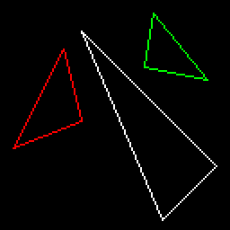
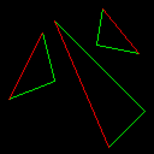
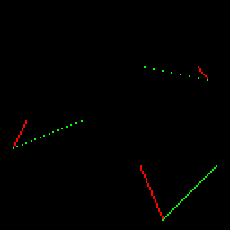
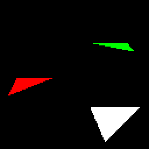
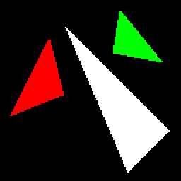
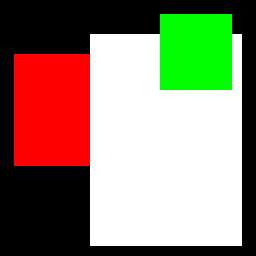
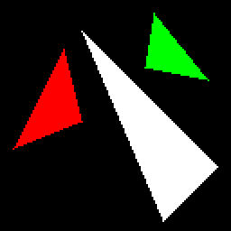
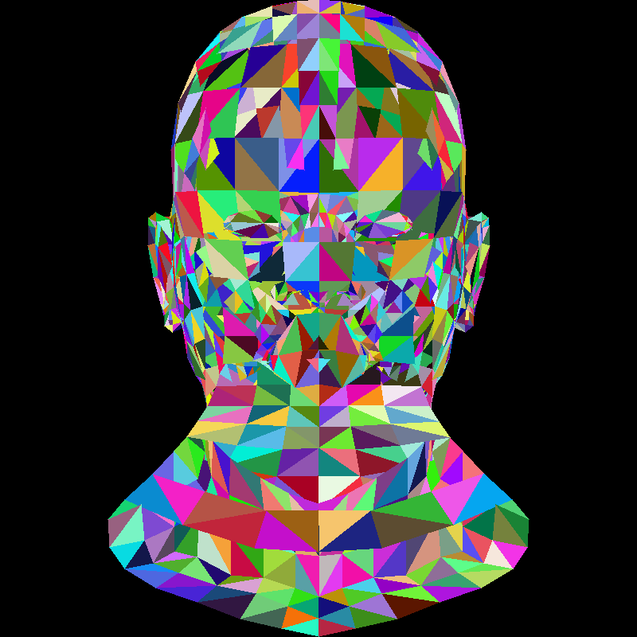
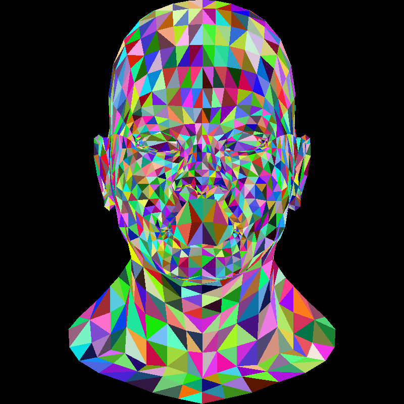

# Triangle rasterization

Let me remind you: this series of articles is designed to encourage you to write your own code from scratch.
Now is the time to do just that.
My code is provided solely for comparison with your (working) program.
I consider myself an average programmer—it’s very likely that you are a better one.
Do not simply copy and paste my code.

Any comments and questions are welcome.

## The task at hand

Today's challenge is to draw two-dimensional triangles.
For motivated students, this usually takes a couple of hours, even if they are not confident programmers.

Last time, we explored Bresenham’s line-drawing algorithm.
Now we need to draw a **filled** triangle.
Surprisingly, this is not a trivial task.
I’m not sure why, but I do know that it’s true — most of my students struggle with this seemingly simple problem.

To get started, [here is the initial commit](https://github.com/ssloy/tinyrenderer/commit/9e2dcd6fddca0eec5cbf6b75b12202dea833e622).
It builds upon the line rasterization routine that we implemented in the previous lesson.



??? example "The starting point"
    ```cpp linenums="1"
    void triangle(int ax, int ay, int bx, int by, int cx, int cy, TGAImage &framebuffer, TGAColor color) {
        line(ax, ay, bx, by, framebuffer, color);
        line(bx, by, cx, cy, framebuffer, color);
        line(cx, cy, ax, ay, framebuffer, color);
    }

    int main(int argc, char** argv) {
        TGAImage framebuffer(width, height, TGAImage::RGB);
        triangle(  7, 45, 35, 100, 45,  60, framebuffer, red);
        triangle(120, 35, 90,   5, 45, 110, framebuffer, white);
        triangle(115, 83, 80,  90, 85, 120, framebuffer, green);
        framebuffer.write_tga_file("framebuffer.tga");
        return 0;
    }
    ```

The code is straightforward: I provide three test triangles for initial debugging.
If we call `line()` inside the `triangle()` function, we get the triangle’s edges.
But how do we fill the triangle?

### Properties of a good triangle-filling algorithm

A good method for drawing a filled triangle should meet the following criteria:

- It should be **simple and fast**.
- It should be **symmetrical** — the output should not depend on the order of vertices passed to the function.
- If two triangles share two vertices, **there should be no gaps between them** due to rasterization rounding errors.

We could add more requirements, but let’s focus on these for now.

## Scanline rendering, the old-school way

A common approach for filling triangles involves [scanline rendering](https://en.wikipedia.org/wiki/Scanline_rendering):

1.  Sort the vertices of the triangle by their y-coordinates.
2.  Rasterize both the left and right edges of the triangle simultaneously.
3.  Draw horizontal line segments between the left and right boundary points.

At this stage, my students often start to lose confidence: *Which segment is the left one? Which is the right?* After all, a triangle has three sides…

Usually, after introducing this problem, I leave my students for about an hour.
Once again, reading my code is far less valuable than writing your own and comparing it with mine.
Pause here for a moment and try to draw filled triangles.

[One hour later...]

### Sorting the vertices

??? example "Bubble sort"
    ```cpp linenums="1" hl_lines="2-5"
    void triangle(int ax, int ay, int bx, int by, int cx, int cy, TGAImage &framebuffer, TGAColor color) {
        // sort the vertices, a,b,c in ascending y order (bubblesort yay!)
        if (ay>by) { std::swap(ax, bx); std::swap(ay, by); }
        if (ay>cy) { std::swap(ax, cx); std::swap(ay, cy); }
        if (by>cy) { std::swap(bx, cx); std::swap(by, cy); }
        line(ax, ay, bx, by, framebuffer, green);
        line(bx, by, cx, cy, framebuffer, green);
        line(cx, cy, ax, ay, framebuffer, red);
    }
    ```



### Rasterizing the boundary

??? example "Border rasterization"
    ```cpp linenums="1" hl_lines="6-16"
    void triangle(int ax, int ay, int bx, int by, int cx, int cy, TGAImage &framebuffer, TGAColor color) {
        // sort the vertices, a,b,c in ascending y order (bubblesort yay!)
        if (ay>by) { std::swap(ax, bx); std::swap(ay, by); }
        if (ay>cy) { std::swap(ax, cx); std::swap(ay, cy); }
        if (by>cy) { std::swap(bx, cx); std::swap(by, cy); }
        int total_height = cy-ay;

        if (ay != by) { // if the bottom half is not degenerate
            int segment_height = by - ay;
            for (int y=ay; y<=by; y++) { // sweep the horizontal line from ay to by
                int x1 = ax + ((cx - ax)*(y - ay)) / total_height;
                int x2 = ax + ((bx - ax)*(y - ay)) / segment_height;
                framebuffer.set(x1, y, red);
                framebuffer.set(x2, y, green);
            }
        }
    }
    ```


### Scanline rasterization



??? example "Scan line for the lower half"
    ```cpp linenums="1" hl_lines="6-16"
    void triangle(int ax, int ay, int bx, int by, int cx, int cy, TGAImage &framebuffer, TGAColor color) {
        // sort the vertices, a,b,c in ascending y order (bubblesort yay!)
        if (ay>by) { std::swap(ax, bx); std::swap(ay, by); }
        if (ay>cy) { std::swap(ax, cx); std::swap(ay, cy); }
        if (by>cy) { std::swap(bx, cx); std::swap(by, cy); }
        int total_height = cy-ay;

        if (ay != by) { // if the bottom half is not degenerate
            int segment_height = by - ay;
            for (int y=ay; y<=by; y++) { // sweep the horizontal line from ay to by
                int x1 = ax + ((cx - ax)*(y - ay)) / total_height;
                int x2 = ax + ((bx - ax)*(y - ay)) / segment_height;
                for (int x=std::min(x1,x2); x<std::max(x1,x2); x++)  // draw a horizontal line
                    framebuffer.set(x, y, color);
            }
        }
    }
    ```




??? example "Complete scan line"
    ```cpp linenums="1" hl_lines="17-25"
    void triangle(int ax, int ay, int bx, int by, int cx, int cy, TGAImage &framebuffer, TGAColor color) {
        // sort the vertices, a,b,c in ascending y order (bubblesort yay!)
        if (ay>by) { std::swap(ax, bx); std::swap(ay, by); }
        if (ay>cy) { std::swap(ax, cx); std::swap(ay, cy); }
        if (by>cy) { std::swap(bx, cx); std::swap(by, cy); }
        int total_height = cy-ay;

        if (ay != by) { // if the bottom half is not degenerate
            int segment_height = by - ay;
            for (int y=ay; y<=by; y++) { // sweep the horizontal line from ay to by
                int x1 = ax + ((cx - ax)*(y - ay)) / total_height;
                int x2 = ax + ((bx - ax)*(y - ay)) / segment_height;
                for (int x=std::min(x1,x2); x<std::max(x1,x2); x++)  // draw a horizontal line
                    framebuffer.set(x, y, color);
            }
        }
        if (by != cy) { // if the upper half is not degenerate
            int segment_height = cy - by;
            for (int y=by; y<=cy; y++) { // sweep the horizontal line from by to cy
                int x1 = ax + ((cx - ax)*(y - ay)) / total_height;
                int x2 = bx + ((cx - bx)*(y - by)) / segment_height;
                for (int x=std::min(x1,x2); x<std::max(x1,x2); x++)  // draw a horizontal line
                    framebuffer.set(x, y, color);
            }
        }
    }
    ```



## Modern rasterization approach




## Putting all together + back-face culling



