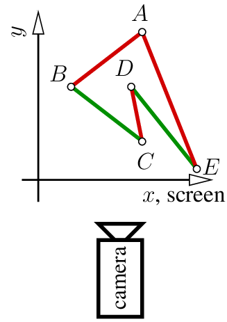

# Triangle rasterization

Let me remind you: this series of articles is designed to encourage you to write your own code from scratch.
Now is the time to do just that.
My code is provided solely for comparison with your (working) program.
I consider myself an average programmer—it’s very likely that you are a better one.
Do not simply copy and paste my code.

Any comments and questions are welcome.

## The task at hand

Today's challenge is to draw two-dimensional triangles.
For motivated students, this usually takes a couple of hours, even if they are not confident programmers.

Last time, we explored Bresenham’s line-drawing algorithm.
Now we need to draw a **filled** triangle.
Surprisingly, this is not a trivial task.
I’m not sure why, but I do know that it’s true — most of my students struggle with this seemingly simple problem.

To get started, [here is the initial commit](https://github.com/ssloy/tinyrenderer/commit/9e2dcd6fddca0eec5cbf6b75b12202dea833e622).
It builds upon the line rasterization routine that we implemented in the previous lesson.


??? example "The starting point"
    ```cpp linenums="1"
    void triangle(int ax, int ay, int bx, int by, int cx, int cy, TGAImage &framebuffer, TGAColor color) {
        line(ax, ay, bx, by, framebuffer, color);
        line(bx, by, cx, cy, framebuffer, color);
        line(cx, cy, ax, ay, framebuffer, color);
    }

    int main(int argc, char** argv) {
        TGAImage framebuffer(width, height, TGAImage::RGB);
        triangle(  7, 45, 35, 100, 45,  60, framebuffer, red);
        triangle(120, 35, 90,   5, 45, 110, framebuffer, white);
        triangle(115, 83, 80,  90, 85, 120, framebuffer, green);
        framebuffer.write_tga_file("framebuffer.tga");
        return 0;
    }
    ```

The code is straightforward: I provide three test triangles for initial debugging.
If we call `line()` inside the `triangle()` function, we get the triangle’s edges.
But how do we fill the triangle?

### Properties of a good triangle-filling algorithm

A good method for drawing a filled triangle should meet the following criteria:

- It should be **simple and fast**.
- It should be **symmetrical** — the output should not depend on the order of vertices passed to the function.
- If two triangles share two vertices, **there should be no gaps between them** due to rasterization rounding errors.

We could add more requirements, but let’s focus on these for now.

## Scanline rendering, the old-school way

A common approach for filling triangles involves [scanline rendering](https://en.wikipedia.org/wiki/Scanline_rendering):

1.  Sort the vertices of the triangle by their y-coordinates.
2.  Rasterize both the left and right edges of the triangle simultaneously.
3.  Draw horizontal line segments between the left and right boundary points.

At this stage, my students often start to lose confidence: *Which segment is the left one? Which is the right?* After all, a triangle has three sides…

Usually, after introducing this problem, I leave my students for about an hour.
Once again, reading my code is far less valuable than writing your own and comparing it with mine.
Pause here for a moment and try to draw filled triangles.

[One hour later...]

### Sorting the vertices

Let us assume that we have three points of the triangle: `a`, `b`, `c`, they are sorted in ascending order by the `y`-coordinate.
As in the line rasterization, to meet this assumption we will reorder the vertices that were passed to the function.
To sort three elements, [bubble sort](https://en.wikipedia.org/wiki/Bubble_sort) is the ultimate method:

??? example "Bubble sort"
    ```cpp linenums="1" hl_lines="2-5"
    void triangle(int ax, int ay, int bx, int by, int cx, int cy, TGAImage &framebuffer, TGAColor color) {
        // sort the vertices, a,b,c in ascending y order (bubblesort yay!)
        if (ay>by) { std::swap(ax, bx); std::swap(ay, by); }
        if (ay>cy) { std::swap(ax, cx); std::swap(ay, cy); }
        if (by>cy) { std::swap(bx, cx); std::swap(by, cy); }
        line(ax, ay, bx, by, framebuffer, green);
        line(bx, by, cx, cy, framebuffer, green);
        line(cx, cy, ax, ay, framebuffer, red);
    }
    ```
Then, the boundary `A` is between `a` and `c`, boundary `B` is between `a` and `b`, and then between `b` and `c`.
Here the boundary `A` is red, and the boundary `B` is green:


### Rasterizing the boundary

Unfortunately, boundary `B` is made of two parts. Let us draw the bottom half of the triangle by cutting it horizontally at the point `b`:

??? example "Border rasterization"
    ```cpp linenums="1" hl_lines="6-16"
    void triangle(int ax, int ay, int bx, int by, int cx, int cy, TGAImage &framebuffer, TGAColor color) {
        // sort the vertices, a,b,c in ascending y order (bubblesort yay!)
        if (ay>by) { std::swap(ax, bx); std::swap(ay, by); }
        if (ay>cy) { std::swap(ax, cx); std::swap(ay, cy); }
        if (by>cy) { std::swap(bx, cx); std::swap(by, cy); }
        int total_height = cy-ay;

        if (ay != by) { // if the bottom half is not degenerate
            int segment_height = by - ay;
            for (int y=ay; y<=by; y++) { // sweep the horizontal line from ay to by
                int x1 = ax + ((cx - ax)*(y - ay)) / total_height;
                int x2 = ax + ((bx - ax)*(y - ay)) / segment_height;
                framebuffer.set(x1, y, red);
                framebuffer.set(x2, y, green);
            }
        }
    }
    ```

Since we are looping over `y` coordinates (line 10), it is to be expected for the segments to have gaps if the segment is rather horizontal.
Last time when we drew straight lines we struggled to get continuous segments and here I did not bother with rotating the image (remember the xy swapping?).
Why? We fill the triangles aftewards, that's why.


### Scanline rasterization

So, at each iteration of the lopp we have two points with the same `y` coordinate, namely, `(x1, y)` and `(x2, y)`.
To fill the triangle it suffices to iterate from `x1` to `x2` (lines 13-14):

??? example "Scan line for the lower half"
    ```cpp linenums="1" hl_lines="6-16"
    void triangle(int ax, int ay, int bx, int by, int cx, int cy, TGAImage &framebuffer, TGAColor color) {
        // sort the vertices, a,b,c in ascending y order (bubblesort yay!)
        if (ay>by) { std::swap(ax, bx); std::swap(ay, by); }
        if (ay>cy) { std::swap(ax, cx); std::swap(ay, cy); }
        if (by>cy) { std::swap(bx, cx); std::swap(by, cy); }
        int total_height = cy-ay;

        if (ay != by) { // if the bottom half is not degenerate
            int segment_height = by - ay;
            for (int y=ay; y<=by; y++) { // sweep the horizontal line from ay to by
                int x1 = ax + ((cx - ax)*(y - ay)) / total_height;
                int x2 = ax + ((bx - ax)*(y - ay)) / segment_height;
                for (int x=std::min(x1,x2); x<std::max(x1,x2); x++)  // draw a horizontal line
                    framebuffer.set(x, y, color);
            }
        }
    }
    ```


Now, let us draw the second (upper) half of the triangle. We can do this by adding a second loop:

??? example "Complete scan line"
    ```cpp linenums="1" hl_lines="17-25"
    void triangle(int ax, int ay, int bx, int by, int cx, int cy, TGAImage &framebuffer, TGAColor color) {
        // sort the vertices, a,b,c in ascending y order (bubblesort yay!)
        if (ay>by) { std::swap(ax, bx); std::swap(ay, by); }
        if (ay>cy) { std::swap(ax, cx); std::swap(ay, cy); }
        if (by>cy) { std::swap(bx, cx); std::swap(by, cy); }
        int total_height = cy-ay;

        if (ay != by) { // if the bottom half is not degenerate
            int segment_height = by - ay;
            for (int y=ay; y<=by; y++) { // sweep the horizontal line from ay to by
                int x1 = ax + ((cx - ax)*(y - ay)) / total_height;
                int x2 = ax + ((bx - ax)*(y - ay)) / segment_height;
                for (int x=std::min(x1,x2); x<std::max(x1,x2); x++)  // draw a horizontal line
                    framebuffer.set(x, y, color);
            }
        }
        if (by != cy) { // if the upper half is not degenerate
            int segment_height = cy - by;
            for (int y=by; y<=cy; y++) { // sweep the horizontal line from by to cy
                int x1 = ax + ((cx - ax)*(y - ay)) / total_height;
                int x2 = bx + ((cx - bx)*(y - by)) / segment_height;
                for (int x=std::min(x1,x2); x<std::max(x1,x2); x++)  // draw a horizontal line
                    framebuffer.set(x, y, color);
            }
        }
    }
    ```


[Here’s the commit](https://github.com/ssloy/tinyrenderer/tree/ad5bb950c6dcd0dd48bedea1cf814f795bc3c0b2) for drawing 2D triangles.

## Modern rasterization approach

While not particularly complicated, the source code for line sweeping can be somewhat messy.
Moreover, it is an old-school approach designed for single-threaded CPU programming.
Let’s take a look at the following pseudo-code:

```C++
triangle(vec2 points[3]) {
    vec2 bbox[2] = find_bounding_box(points);
    for (each pixel in the bounding box) {
        if (inside(points, pixel)) {
            put_pixel(pixel);
        }
    }
}
```

Do you like it? I do.
Finding a bounding box is straightforward, and checking whether a point belongs to a 2D triangle (or any convex polygon) is certainly manageable.

<!--
_Off Topic: If I ever have to implement a point-in-polygon check for an aircraft control system, I would refuse to board that plane.
It turns out that solving this problem **reliably** with limited precision floated point is surprisingly difficult.
However, since we are merely painting pixels here, I’m okay with that._
-->

There’s one aspect I appreciate about this pseudocode: a novice programmer finds it intuitive, while more experienced developers might chuckle and ask,
“Who wrote this nonsense? So much overhead!” But an expert in computer graphics will simply shrug and say, “Well, that’s how it works in real life.”
Massively parallel computations running in thousands of threads, even on regular consumer hardware, fundamentally change the way we approach problems.

First, we need to compute an axis-aligned bounding box for our three points. The bounding box is defined by two points: the bottom-left and upper-right corners.
To determine these corners, we iterate through the vertices of the triangle and select the minimum and maximum coordinates.
Here’s how we can draw a filled bounding box for each of the three triangles in our image:

??? example "Bounding box rasterization"
    ```cpp linenums="1" hl_lines="6"
    void triangle(int ax, int ay, int bx, int by, int cx, int cy, TGAImage &framebuffer, TGAColor color) {
        int bbminx = std::min(std::min(ax, bx), cx); // bounding box for the triangle
        int bbminy = std::min(std::min(ay, by), cy); // defined by its top left and bottom right corners
        int bbmaxx = std::max(std::max(ax, bx), cx);
        int bbmaxy = std::max(std::max(ay, by), cy);
    #pragma omp parallel for
        for (int x=bbminx; x<=bbmaxx; x++) {
            for (int y=bbminy; y<=bbmaxy; y++) {
                framebuffer.set(x, y, color);
            }
        }
    }
    ```

Note the line 6. Once we have determined the bounding box, this line tells to run the loop **in parallel**.
As opposed to the scanline method, here each pixel is treated separately,
and thus this is an [embarrassingly parallel](https://en.wikipedia.org/wiki/Embarrassingly_parallel#:~:text=In%20parallel%20computing%2C%20an%20embarrassingly,a%20number%20of%20parallel%20tasks) method.


All we need to do now is to eliminate the pixels that do not belong to the triangle.
There are plenty of ways to check if a point $P$ belongs to a triangle defined by vertices $A$,$B$,$C$.
Here I chose to compute the [barycentric coordinates](https://en.wikipedia.org/wiki/Barycentric_coordinate_system) of $P$ with respect to $ABC$.
We can express $P$ as a combination of the triangle's vertices: $P=\alpha A + \beta B + \gamma C$.
While being a bit frightening at the first glance, it is really simple: imagine that we put three weights $\alpha,\beta,\gamma$  at the vertices $A$, $B$ and $C$, respectively.
Then the barycenter of the system is exactly in the point $P$.

Barycentric coordinates $\alpha,\beta,\gamma$ are proportional to sub-triangle areas $\text{Area}(PBC)$, $\text{Area}(PCA)$ and $\text{Area}(PAB)$.
If all three coordinates are positive, $P$ lies within the triangle.
If any barycentric coordinate is negative, $P$ lies outside the triangle.

So, let us program our new rasterization routine: we iterate through all pixels of a bounding box for a given triangle.
For each pixel we compute its barycentric coordinates.
If it has at least one negative component, then the pixel is outside of the triangle.
Probably it is more clear to see the program directly:

??? example "Triangle rasterization, modern apporach"
    ```cpp linenums="1" hl_lines="18"
    double signed_triangle_area(int ax, int ay, int bx, int by, int cx, int cy) {
        return .5*((by-ay)*(bx+ax) + (cy-by)*(cx+bx) + (ay-cy)*(ax+cx));
    }

    void triangle(int ax, int ay, int bx, int by, int cx, int cy, TGAImage &framebuffer, TGAColor color) {
        int bbminx = std::min(std::min(ax, bx), cx); // bounding box for the triangle
        int bbminy = std::min(std::min(ay, by), cy); // defined by its top left and bottom right corners
        int bbmaxx = std::max(std::max(ax, bx), cx);
        int bbmaxy = std::max(std::max(ay, by), cy);
        double total_area = signed_triangle_area(ax, ay, bx, by, cx, cy);

    #pragma omp parallel for
        for (int x=bbminx; x<=bbmaxx; x++) {
            for (int y=bbminy; y<=bbmaxy; y++) {
                double alpha = signed_triangle_area(x, y, bx, by, cx, cy) / total_area;
                double beta  = signed_triangle_area(x, y, cx, cy, ax, ay) / total_area;
                double gamma = signed_triangle_area(x, y, ax, ay, bx, by) / total_area;
                if (alpha<0 || beta<0 || gamma<0) continue; // negative barycentric coordinate => the pixel is outside the triangle
                framebuffer.set(x, y, color);
            }
        }
    }
    ```

It is the line 18 that discards the pixels outside of the triangle.


As always, I follow closely the one-commit-per-tutorial-image rule, so you can find the [code snapshot here](https://github.com/ssloy/tinyrenderer/tree/fc3eae6122c3f1ae33064db58ca81beaff952638).

## Putting all together + back-face culling

Let us recall the wireframe [rendering we made](bresenham.md#my-solution) last time.
We looped over the triangles, projected the triangles to the screen and made 3 calls to the `line()` function.
We can replace the the 3 calls by a single call to our brand new `triangle()`:

??? example "Straightforward rasterization of all triangles"
    ```cpp linenums="1" hl_lines="14-16"
    int main(int argc, char** argv) {
        if (argc != 2) {
            std::cerr << "Usage: " << argv[0] << " obj/model.obj" << std::endl;
            return 1;
        }

        Model model(argv[1]);
        TGAImage framebuffer(width, height, TGAImage::RGB);

        for (int i=0; i<model.nfaces(); i++) { // iterate through all triangles
            auto [ax, ay] = project(model.vert(i, 0));
            auto [bx, by] = project(model.vert(i, 1));
            auto [cx, cy] = project(model.vert(i, 2));
            TGAColor rnd;
            for (int c=0; c<3; c++) rnd[c] = std::rand()%255;
            triangle(ax, ay, bx, by, cx, cy, framebuffer, rnd);
        }

        framebuffer.write_tga_file("framebuffer.tga");
        return 0;
    }
    ```

You can find the commit here [here](https://github.com/ssloy/tinyrenderer/tree/e25bb49be00a43ab777e511baa4b72e8ab16d6b1).
The changes are highlighted, lines 14-16. I generate a random color and draw a filled triangle.
Here is the result:


Well, it is certainly something, but I'd like to see a face rather than a complete mess. What happened?
It happened that we did zero removal of hiden faces, and being drawn in disorder, the "back" triangles may be shown ontop of the "front".
We will fully address the issue next time, but let us do a simple hack right now. Let us add one single line 7
(you can [check the diff](https://github.com/ssloy/tinyrenderer/commit/ab559b1325df38266b420c6236a33794bd7e4c65) with the previous version):

??? example "Back-face culling"
    ```cpp linenums="1" hl_lines="7"
    void triangle(int ax, int ay, int bx, int by, int cx, int cy, TGAImage &framebuffer, TGAColor color) {
        int bbminx = std::min(std::min(ax, bx), cx); // bounding box for the triangle
        int bbminy = std::min(std::min(ay, by), cy); // defined by its top left and bottom right corners
        int bbmaxx = std::max(std::max(ax, bx), cx);
        int bbmaxy = std::max(std::max(ay, by), cy);
        double total_area = signed_triangle_area(ax, ay, bx, by, cx, cy);
        if (total_area<1) return; // backface culling + discarding triangles that cover less than a pixel

    #pragma omp parallel for
        for (int x=bbminx; x<=bbmaxx; x++) {
            for (int y=bbminy; y<=bbmaxy; y++) {
                double alpha = signed_triangle_area(x, y, bx, by, cx, cy) / total_area;
                double beta  = signed_triangle_area(x, y, cx, cy, ax, ay) / total_area;
                double gamma = signed_triangle_area(x, y, ax, ay, bx, by) / total_area;
                if (alpha<0 || beta<0 || gamma<0) continue; // negative barycentric coordinate => the pixel is outside the triangle
                framebuffer.set(x, y, color);
            }
        }
    }
    ```

And while not being perfect, the result improves drastically:


What happened? Let us reduce the number of dimensions and make a 1D rendering of a 2D scene.
Imagine that we have a 2D polygon $ABCDE$ that we want to draw on a 1D line defined by the $x$-axis of our coordinate system:



We need to draw 5 segments, namely, $AB$, $BC$, $CD$, $DE$, and $EA$.
However, we can be quite certain that we can safely discard segments $AB$, $CD$ and $EA$ since they are facing back and not front.

The order in which segments are stored in memory can be arbitrary, but an important aspect is that there is consistency in how the endpoints are stored for each segment.
To decide whether a segment is facing front or back, we can simply compute the sign of its length once projected onto the screen.
For now, our projection is orthogonal (we are ignoring the $y$ coordinate), so the problem reduces to comparing the $x$ coordinates of the segment’s endpoints.

If a segment extends from point $A$ to point $B$, its projected length on the screen is given by:

\[ L_{AB} = B_x - A_x \]

- If $L_{AB} > 0$, the segment is front-facing and should be drawn.
- If $L_{AB} < 0$, the segment is back-facing and can be culled.

For example, in the case of segment $AB$:

\[ B_x < A_x \Rightarrow L_{AB} < 0 \]

Since the projected length is negative, we can discard segment $AB$.
By applying this simple test to each segment, we can efficiently determine which edges should be drawn and which can be ignored,
optimizing the rendering process and avoiding unnecessary computations for back-facing segments.

Back to our 3D rendering of the head, the line of code we have added checks the signed area of the triangle to be drawn.
If it is negative, the triangle can be discarded.
Note that this is a conservative test that does not prevent all rendering errors.
In our 2D example, nothing prevents segment $DE$ from being drawn over $BC$, since they are both front-facing.
This is exactly why the rendering of the head is not perfect: we have eliminated all back-facing triangles,
but some front-facing triangles inside the mouth were drawn over the lips. We will correct this artefact later.


## Next time
Next time, I propose spending a little more time on [barycentric coordinates](barycentric.md), as I will make heavy use of them later on.
Then, we can tackle the [removal of hidden faces](z-buffer.md).

--8<-- "comments.html"


