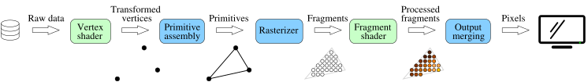
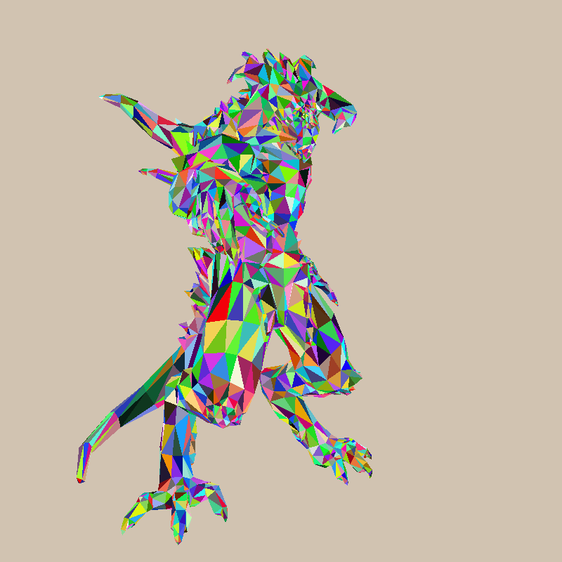
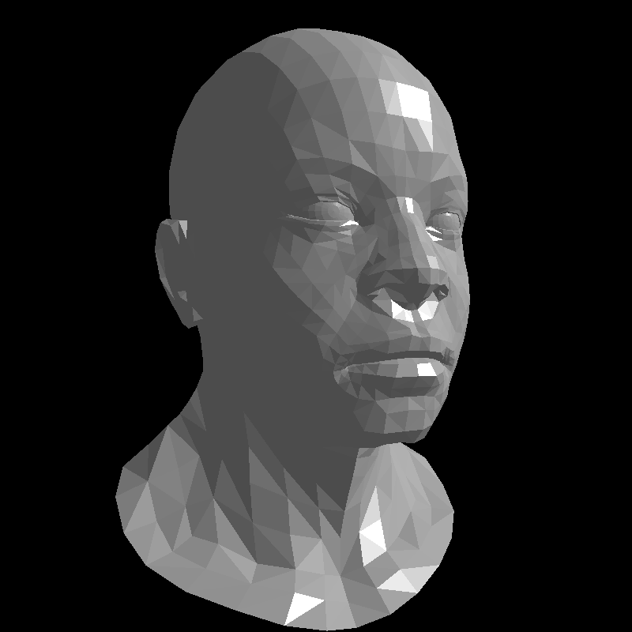
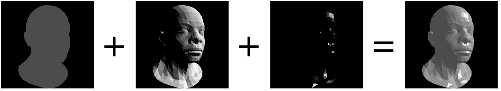
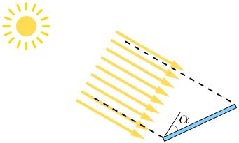
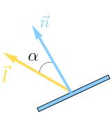
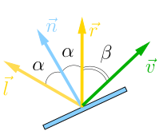
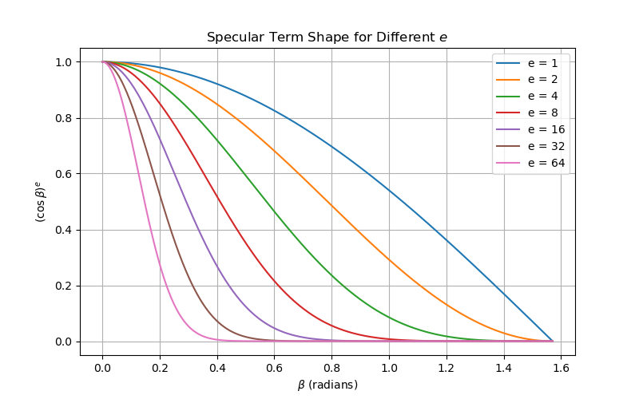

# Shading

## The rendering pipeline

[The modern rendering pipeline](https://www.khronos.org/opengl/wiki/Rendering_Pipeline_Overview) can be represented as follows:

[](shading/pipeline.svg)

It consists of the following main stages:

* Vertex processing: processes individual vertices.
* Primitive assembly: connects vertices to form primitives.
* Rasterization: converts each primitive into a set of fragments.
* Fragment processing: processes individual fragments.
* Output merging: combines the fragments of all primitives (in 3D space) into a 2D color pixel for the display.

Note the distinction between fragments and pixels.
Pixels are the dots on the display. A pixel is 2-dimensional, with a (x, y) position and a color value.
A fragment is 3-dimensional, with a (x, y, z) position. The (x, y) are aligned with the 2D pixel-grid. The z-value (not grid-aligned) denotes its depth.
In addition to that, fragment processing stage assigns other attributes to the fragments such as color and alpha, that are to be combined in the output merging stage.

Vertex processing and fragment processing are programmable whereas the rest of the pipeline is hardwired in the GPU.

## Refactoring

The time has come for a small refactoring ([check the commit](https://github.com/ssloy/tinyrenderer/commit/637223c98ae9610f7d9ff2c200e29aa837a162d5)), here I split `main.cpp` in two.
The idea is to mimic the rendering pipeline, I have extracted the parts of the code that the programmer cannot modify.
Roughly speaking, it corresponds to the binary of the OpenGL library and the hardwired GPU rasterization.

Here are the files that we will no longer modify:

??? example "our_gl.h"
    ```cpp linenums="1" hl_lines="9-11"
    --8<-- "shading/our_gl.h"
    ```

??? example "our_gl.cpp"
    ```cpp linenums="1"
    --8<-- "shading/our_gl.cpp"
    ```

I have isolated three state matrices `ModelView`, `Viewport` and `Perspective` (and helper functions to initialize them), as well as the `zbuffer` and triangle rasterization routine.
Note the abstract class `IShader`.
Each time the rasterizer draws a pixel in the framebuffer, it calls the virtual function `fragment` to decide the color of the pixel.
Therefore, the programmer must define a shader object and pass it to the `rasterize` function.

Here is what is left of `main.cpp`:

??? example "main.cpp"
    ```cpp linenums="1" hl_lines="8-26 48"
    --8<-- "shading/main-random.cpp"
    ```

In fact, our `main()` function follows closely the rendering pipeline, let us check it:

* We declare few global constants: screen dimensions, camera position etc (lines 34-38).
* Then all the state variables are initialized (lines 40-44)
* and, finally, we loop over all triangles rasterizing them (lines 49-55).

Let's focus on the last part. The primitive assembly (lines 51-53) calls the vertex shader to position vertices in the space.
Then the primitive is passed to the rasterizer (line 54), who calls the fragment shader to decide color of individual fragments.

Here, the fragment shader is quite rudimentary
and the final result is the same as in the previous chapter (after all, we did nothing but refactor the code!):



## Phong reflection model

Now, let's talk about actual shading, i.e. lights and shadows. After all, programmable stages of the rendering pipeline are called shaders because approximation of the illumination is their main purpose.
For the moment I ignore colors, let us say that the scene is painted gray, but I am very interested in illumination intensity.
I want you to produce such an image by the end of this chapter:



In computer graphics, we often "cheat" for efficiency: computing global illumination is very expensive (we will see it a bit later), and we want to do cheap tricks that achieve the most visually plausible effects.
The Phong reflection model is one such trick, a simple but effective way to approximate how light interacts with a surface in computer graphics.
It assumes that the perceived brightness at a point on a surface is the sum of three components: **ambient**, **diffuse**, and **specular** reflection, each scaled by a weighting factor to control its influence.

* The **ambient term** models indirect light — the constant background illumination present even in shadowed areas.
* The **diffuse term** represents light scattered equally in all directions from rough surfaces.
* The **specular term** simulates bright highlights on shiny surfaces caused by mirror-like reflection.

If we store each term in its own image, we can obtain the final result as a simple (weighted) sum:

[](shading/phong-reflectance.png)

By adjusting these weights, artists can control how "matte" or "shiny" a surface appears.

### The practical recipe

Here's a nuts-and-bolts walkthrough of computing Phong lighting on a triangulated surface.
For the moment we consider surfaces made of flat triangles, so the illumination is constant per triangle.

As mentioned earlier, the ambient term is a constant fill light, it doesn't depend on geometry.
Let's focus on the diffuse (Lambert) term.
It models matte scattering, i.e. received energy depends on how much the surface faces the light.

Imagine a solar panel. The sun is very distant, so all the light rays can be considered parallel.
See this image:



The energy output of the panel depends on how many sun rays enter in the corridor between the dashed lines.
For a 1D unit length panel, the width of the corridor can be computed as $\cos \alpha$: it is 1 meter when the panel is orthogonal to the sun rays and it is zero when the panel is aligned with the sun rays.

Here's a quick question for you: cosine function gives values between -1 and 1. What do we do with negative length?

??? question "Spoiler Alert!"
    Imagine a solar panel perfectly orthogonal to the sun rays, but with solar cells facing the ground and not the sky. In this case it won't produce any energy at all, right?
    And it is exactly the case of negative $\cos \alpha$. So the diffuse term is to be computed as $|\cos \alpha|$ for two-sided facets or $\max (0, \cos \alpha)$ for one-sided facets.

One question remains for the diffuse lighting: how to compute $\cos \alpha$?
Imagine we have a 3D triangle described by three points $A$, $B$ and $C$.
Then its normal $\vec n$ (the unit length vector orthogonal to the triangle) can be computed as the cross product between the edges:

$$
\vec n=\frac{\overrightarrow{AB} \times \overrightarrow{AC} }{||\overrightarrow{AB} \times \overrightarrow{AC}||}.
$$

If $\vec l$ is the (unit length) direction towards the sun, then $\cos \alpha = \vec n \cdot \vec l$ and the diffuse term can be found as $\max(0, \vec n \cdot \vec l).$
Here is an illustration:



The last step is to find out how to compute the specular term.
Recall: this term simulates bright highlights on shiny surfaces caused by mirror-like reflection.
Its intensity depends on the angle between the viewer's direction and the reflection direction of the light.
Here is an illustration:



Here are the vector $\vec v$ is the direction from the fragment to the camera, and the $\vec r$ is the reflection of the sun light.
Quick exercise: given vectors $\vec n$ and $\vec l$, find vector $\vec r$.

??? question "Spoiler Alert!"
    If $\vec n$ and $\vec l$ are normalized, then $\vec r = 2\vec n (\vec n \cdot \vec l ) - \vec l$.


A perfect mirror appears brightest if the viewer direction $\vec v$ exactly matched $\vec r$.
For non-perfectly-polished materials, the highlight should fade away as $\vec v$ moves away from $\vec r$.

The dot product $\vec r \cdot \vec v$ is $\cos \beta$, where $\beta$ is the angle between the viewing direction and the perfect reflection direction.
To compute the specular term, we can simply raise this cosine to a shininess exponent $e$, i.e. the specular term can be found as $(\max(0, \cos \beta))^e$.
Recall that all numbers inferior to 1 will decrease when we raise them into power.
Let's plot $\cos^e \beta$ for different values of $e$:



This power-law falloff is a mathematical hack giving narrow, tight highlight (polished metal, glossy plastic) for large exponents $e$.
For smaller $e$, it corresponds to broad, soft highlight (matte or worn surfaces).

## Homework assignment

You have all the tools you need to implement Phong reflection model, try to do so, play with the coefficients. Can you replicate my results?
Normally you need to tweak the fragment shader only.
For reference, [here is my attempt](https://github.com/ssloy/tinyrenderer/commit/27f4fd811aa3a62e478910e195abb9c6c6318f97).

Next time we will talk about textures and normal mapping. Stay tuned!

--8<-- "comments.html"


