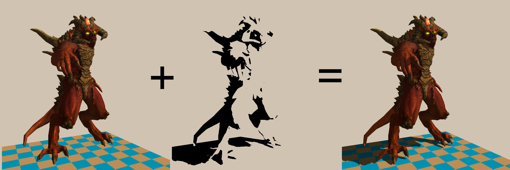

# Shadow mapping

## Introduction

Let us continue talking about lights and shadows.
In real-time rendering, the Phong reflection model provides a simple yet effective way to simulate how light interacts with surfaces.
Its strength lies in being entirely local: the color at a point depends only on the material properties, the light direction, and the viewing direction.
This locality makes the model extremely cheap to compute, which is why it has been the workhorse of interactive graphics for decades.

However, this same locality is also a limitation.
The Phong model cannot account for global effects such as one object blocking light from reaching another.
As a result, casted shadows — essential for realism and spatial perception — are completely absent.
To address this, additional techniques are needed.
One of the most widely used approaches in real-time graphics is shadow mapping, which extends local shading with a global visibility test to determine whether a point lies in light or shadow.

In this chapter, we want to go from the image on the left to the one on the right:

## A practical recipe

Shadow mapping is built on the idea of using the **depth buffer twice**, in two separate rendering passes:

1. **First pass (from the light’s perspective):**
   The scene is rendered from the light’s point of view. The depth buffer stores the distance of the closest surfaces to the light.
   This buffer (the shadow map) encodes which parts of the scene are visible to the light source.

2. **Second pass (from the camera’s perspective):**
   The scene is rendered normally from the viewer’s position, but for each fragment we perform an extra check: we test whether the fragment is visible to the light or hidden in shadow.

Here is a schematic view of the two spaces involved:

To link the two passes, we keep track of both `Viewport * Perspective * ModelView` products. This allows us to transform any fragment seen from the camera back into the light’s screen space.

Let us say we have a fragment $f = (i, j, z, 1)$ in the camera’s screen-space coordinates.
We can transform it back to object coordinates using $M^{-1} f$, and then into the light’s screen-space coordinates using $N M^{-1} f$, where $M$ is the camera transform and $N$ is the light transform.
Let us say that $N M^{-1} f = (w i', w j', w z', w)$.
This gives us the coordinates of the fragment as the light “sees” it. 
We then compare the fragment’s depth $z'$ in that space with the value stored in the shadow map at the coordinates $(i', j')$:

- If the fragment’s depth **matches** the stored depth, the fragment is visible to the light and should be lit.
- If the fragment’s depth is **greater**, it means another surface was closer to the light, and the fragment lies in shadow.

By doing this for every fragment, we obtain a binary mask of hard shadows. In this way, shadow mapping introduces a **global visibility test** into the otherwise purely local Phong shading model.

## Homework

Implement the shadow mapping technique.
A few things to note:

- One of the shaders can be minimal or even blank: in the first pass we only need the depth buffer, so colors can be discarded.
- Shadows can either be applied as a post-processing pass over the framebuffer, or computed directly inside the main shader — both approaches are valid.
- **Z-fighting caveat:**
    When comparing the fragment’s depth with the value stored in the shadow map, numerical precision issues can occur. Two depths that are mathematically equal may differ slightly due to floating-point rounding and rasterization rules. As a result, some pixels that should be lit may be incorrectly classified as shadowed, producing flickering or dark streaks along shadow edges.

    This is known as [z-fighting](https://en.wikipedia.org/wiki/Z-fighting). The usual solution is to **apply a small depth bias** when storing or comparing depths. In practice, this means slightly offsetting the depth values in the shadow map so that the surface being lit is not considered to block itself. Graphics APIs often provide built-in options such as *polygon offset* (OpenGL) or *depth bias* (DirectX) for this purpose.

As usual, my code [is available](https://github.com/ssloy/tinyrenderer/tree/shadowmap) for reference.

Next time we will talk about ambient occlusion.

--8<-- "comments.html"

