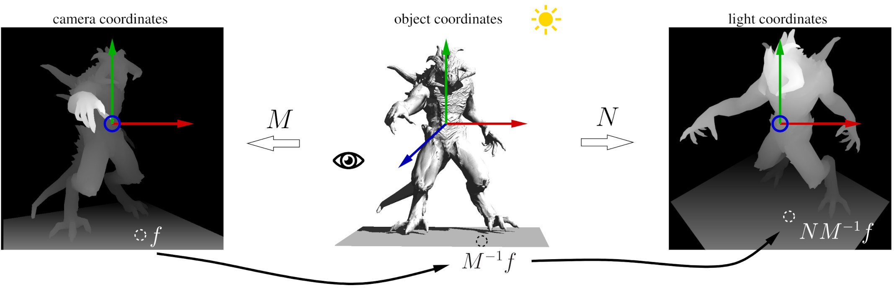

#  (Attention, work in progress) Shadow mapping

## Introduction

Let us continue talking about lights and shadows.
In real-time rendering, the Phong reflection model provides a simple yet effective way to simulate how light interacts with surfaces.
Its strength lies in being entirely local: the color at a point depends only on the material properties, the light direction, and the viewing direction. This locality makes the model extremely cheap to compute, which is why it has been the workhorse of interactive graphics for decades.

However, this same locality is also a limitation. The Phong model cannot account for global effects such as one object blocking light from reaching another.
As a result, casted shadows — essential for realism and spatial perception — are completely absent.
To address this, additional techniques are needed.
One of the most widely used approaches in real-time graphics is shadow mapping, which extends local shading with a global visibility test to determine whether a point lies in light or shadow.
In this chapter, I want to go from the image on the left to the right one.

## A practical recipe

---

Next time we will talk about ambient occlusion.

--8<-- "comments.html"

