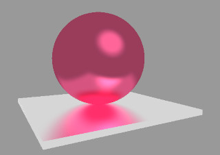

# Indirect lighting

## Introduction

When light interacts with a scene, not all of it travels directly from a light source to a surface.
Some of it bounces off other surfaces before arriving at the point we observe.
This bounced light is called indirect lighting.

For example, if you place a red ball on a white floor, the floor will pick up a faint reddish tint. That happens because light first hits the red ball, reflects off it, and then illuminates the floor:

Another example is a room lit by the sun through a window: even corners not directly exposed to the sunlight are visible. They receive light indirectly from the walls, floor, and ceiling.

Indirect lighting is essential for realism because it accounts for how surfaces exchange light with each other. Without it, images look flat and artificial: shadows are completely black, and there’s no color bleeding between objects.

## Ambient occlusion

In the classical Phong reflection model, the ambient term is often represented as a simple **constant** added to the shading equation.
This constant acts as a crude approximation of indirect lighting: it prevents regions not directly lit by any source from appearing completely black.
While effective for real-time rendering, this approach lacks realism because it does not account for the actual geometry of the scene and how much of the surrounding light can reach a given point.

A more physically motivated idea is to consider **global illumination**, where light is allowed to bounce and scatter between surfaces.
This approach is computationally expensive, though. One practical approximation of this idea is **ambient occlusion (AO)**.

Instead of assuming a uniform ambient term everywhere, we can approximate indirect lighting by extending the concept of shadow mapping.
In standard shadow mapping, we determine whether a point is visible from a light source, producing a binary "in shadow" or "lit" decision.

For ambient occlusion, we could imagine rendering many such shadow maps from different directions across the hemisphere around the object, each one giving us a hard shadow.
By averaging the results of many such "virtual shadow tests," we obtain a continuous measure of how occluded a point is by its surroundings.
Here I show 1000 camera positions I have used to obtain the image:

This technique transforms the idea of a constant ambient term into a geometry-aware shading effect, bridging the gap between Phong’s local model and global illumination.
Points in narrow crevices or under overhangs appear darker, while exposed points on open surfaces remain brighter.
This creates the perception of depth and realism, even without fully simulating indirect light transport.

## Homework 1

Implement this brute-force approach of ambient occlusion computation.
If you have already implemented shadow mapping, this one should be straightforward.

As always, my implementation [is available here](https://github.com/ssloy/tinyrenderer/tree/974424b09ee46fe50a89b9dadaa743942f2b4adc).

## Screen-space ambient occlusion

The idea of computing ambient occlusion with many shadow maps is conceptually straightforward: render the scene from many different directions, check which points are visible and which are blocked, and then average the results.
This captures how much of the surrounding hemisphere is occluded by geometry.

While this method can produce very realistic results, it requires a large number of shadow map renders per frame, which makes it far too expensive for real-time applications such as games.
To overcome this, graphics researchers developed Screen-Space Ambient Occlusion (SSAO).
Instead of sampling the entire 3D scene from many directions, SSAO estimates occlusion using only the information already available in the **screen space**, namely the **depth buffer** (distance from the camera for each pixel) and sometimes the **normal buffer** (surface orientation).

The basic idea is:

- For each fragment, randomly sample a few points around it.
- Compare the sampled points’ depths with the depth buffer.
  If a sample point is behind existing geometry (occluded), it contributes to the ambient shadowing of that pixel.
- Average over the samples to estimate how occluded the fragment is.

Here is an illustration:

In this example, I consider the fragment shown in red, and generate 128 samples around it.
Those in blue are occluded by the surface; the ratio of green points to 128 is my estimate of indirect lighting :)

This approach is much faster than averaging over many shadow maps, because it reuses data that is already computed for rendering.
In my example we only use the z-buffer to compute the indirect lighting, so the speed does not depend on the complexity of the geometry, it only depends on the screen resolution.

SSAO is only an approximation, as it cannot “see” geometry that is off-screen, and may introduce artifacts.
Nevertheless, it provides a convincing sense of contact shadows and depth perception at interactive frame rates.
That’s why SSAO and its refinements are widely used in modern real-time rendering pipelines.

## Homework 2

Implement a SSAO technique.
There are many possible variants.

For example, for each fragment, we can consider the hemisphere oriented around the surface normal, and generate sample points within or on this hemisphere.
Different kinds of artifacts can appear: for instance, in the image above, fragments near the screen boundary are somewhat lighter than those farther from the boundary.
The image is also noisy — how could we improve it?

There is no single "right" answer. Invent an approach, implement it, improve it. Rinse, repeat.

My implementation is [available here](https://github.com/ssloy/tinyrenderer/tree/ssao).

--8<-- "comments.html"

