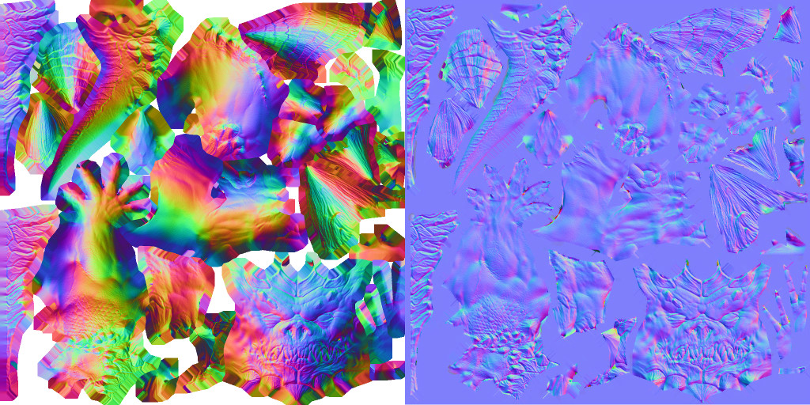

# Tangent space normal mapping

## Global vs tangent space

Let us talk more about normal mapping.
It is a technique in computer graphics where a texture (the normal map) stores per-pixel normals, allowing fine surface detail to be simulated without increasing mesh complexity.
Last time we have used files with `_nm.tga` suffix, whereas my repository also containes textures with `_nm_tangent.tga` suffix.
The first one is the global space normal map, and the latter is the tangent space normal map.
Here they are side-by-side for the Diablo model:

Last time we have used the texture on the left, its RGB values directly encode world-space normals.
There is a problem though.
If  an artist reuses UVs (rotates/mirrors/overlaps flattened mesh so multiple surface parts sample the same texels), those different 3D patches generally require different global normals at the same texel.
One color cannot be “two different vectors at once,” so the result is wrong unless you forbid overlaps/rotations and keep a unique, non-mirrored unwrap — very restrictive and memory-heavy.

We have this problem with the Diablo model. For example, its arms, its legs and even both halves of the tail are superposed in the texture map.
Here is an illustration:

Check the left image. The light comes from the right, so the right Diablo's hip is badly shaded, we need to fix that.
The solution would be to use the tangent-space normal map.
Here, each texel encodes a normal relative to the **local basis** that moves on the surface.

To illustrate what I mean by the local basis, I mapped a regular grid to the model:

In addition to that, I have shown in green smooth normals.
At each point of the surface, we can define a local, per-fragment basis made from the vectors parallel to the red, blue and green lines.
Because normals stored in tangent-space texture are **relative** to the moving frame, the same texel works well for superposed patches.

In short, global-space normal maps tie each texel to a single fixed direction, which breaks when UVs are reused.
Tangent-space maps are expressed in local frame that lives on the surface, so the same texture region can drive multiple differently oriented surface parts correctly.

Here's a quick question for you: why tangent-space normal textures are dominantly blue?

??? question "Spoiler Alert!"
    Imagine a normal map for a sphere.
    If it is expressed in the global space, normals will span every possible orientation, so a rainbow texture is to be expected.
    On the other hand, if we express it in the tangent space, one single $(0,0,1)$ vector corresponding to the blue color,
    since the orientation is already captured by the moving frame.

## Computing the tangent frame

As I said, for each fragment, we need to compute a basis made whose vectors are aligned with the red and blue lines of the regular grid.
Let us see how to do that.

Let us consider a triangle with 3D vertices $P_0, P_1, P_2$ in the global space and corresponding 2D vertices $U_0, U_1, U_2$ in the UV-space.
Let us define edge vectors of the triangles:

$$
\begin{array}{ll}
\vec{e_0} & := P_1 - P_0 \\ %\begin{pmatrix}P_{1x} - P_{0x} \\P_{1y} - P_{0y} \\P_{1z} - P_{0z} \\ \end{pmatrix}
\vec{e_1} & := P_2 - P_0 \\
\vec{u_0} & := U_1 - U_0 \\
\vec{u_1} & := U_2 - U_0
\end{array}
$$

Then the UV-map can be represented by a $2\times 3$ matrix $M$:

$$
M \times \underbrace{\begin{pmatrix} \vec{e_0} & \vec{e_1} \end{pmatrix}}_{3\times 2~\text{matrix}} = \underbrace{\begin{pmatrix} \vec{u_0} & \vec{u_1} \end{pmatrix}}_{2\times 2~\text{matrix}}
$$

Here is an illustration:

Let us call the $3\times 2$ matrix $E$ and the $2\times 2$ matrix $U$:

$$
\begin{array}{ll}
E &:= \begin{pmatrix} \vec{e_0} & \vec{e_1} \end{pmatrix}\\
U &:= \begin{pmatrix} \vec{u_0} & \vec{u_1} \end{pmatrix}
\end{array}
$$

So we have $M \times E = U$. We need to find the tangent vector $\vec t$ and the bitangent vector $\vec b$ such they are transformed to $(1,0)$ and $(0,1)$ vectors under the action of $M$:

$$
\begin{array}{ll}
M \vec t & = \begin{pmatrix}1 \\ 0 \end{pmatrix}\\
M \vec b & = \begin{pmatrix}0 \\ 1 \end{pmatrix}
\end{array}
$$

Or, equivalently, $M \times \begin{pmatrix}\vec t & \vec b\end{pmatrix} = \begin{pmatrix}1 & 0 \\ 0 & 1 \end{pmatrix}$.
Recall that $M\times E = U$, therefore, $M\times E \times U^{-1} =  \begin{pmatrix}1 & 0 \\ 0 & 1 \end{pmatrix}$.
Do you where is it going?

We can find $\vec t$ and $\vec b$ as simply as follows:

$$
\begin{array}{ll}
\begin{pmatrix}\vec t & \vec b\end{pmatrix}  =  E \times U^{-1}.
\end{array}
$$

Add the interpolated normal $\vec n$ and you are done, you have the tangent space basis.

## Homework

Implement tangent space normal mapping.
As usual, I provide [my code](https://github.com/ssloy/tinyrenderer/commit/32a4faac0a56498e78808a14840a9114440cb194) for reference.

--8<-- "comments.html"

