# More data!

Let us continue our discussion about shading. How can we add more realism to our renders?
At this stage, I don’t want to introduce additional mathematics — instead, I want us to stop ignoring the data that is already available to us. We will continue to use the Phong reflection model that we [implemented earlier](textures.md).

Our goal today is to gradually improve the realism of our renderings without making major changes to the shader itself:

[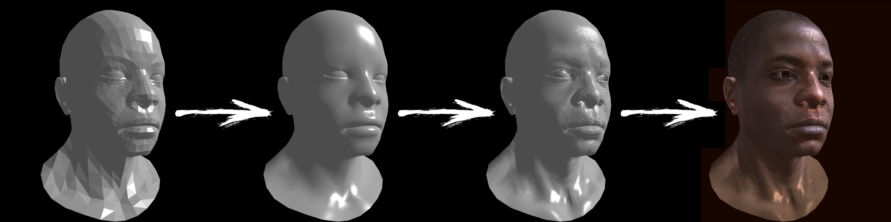](textures/teaser.jpg)

## Smooth shading

### Curved geometry

In the Phong reflection model, if the light direction and camera are fixed, the estimated light intensity depends only on the normal vector at the surface. In our previous implementation, the surface was composed of flat triangles, meaning each triangle had a single constant normal vector. The result was a very faceted look.

So, how can we achieve smoother renderings? The answer: provide more data.

One naïve approach would be to define an extremely fine mesh, so fine that each triangle is smaller than a pixel on screen. While this would produce smooth results, it is computationally very expensive. A cheaper, smarter method is preferable.

Do you recall the exercise on [drawing straight line segments](bresenham.md)? Given two points $P_0$ and $P_1$, we can interpolate between them:


$$
P(t)= (1-t)\ P_0 + t\ P_1
$$

We vary the parameter $t$ between 0 and 1, thus sweeping the segment.
Here is a small Python implementation for those who want to experiment again:

??? example "straight.py"
    ```py linenums="1" hl_lines="5"
    --8<-- "textures/straight.py"
    ```

Expected output:

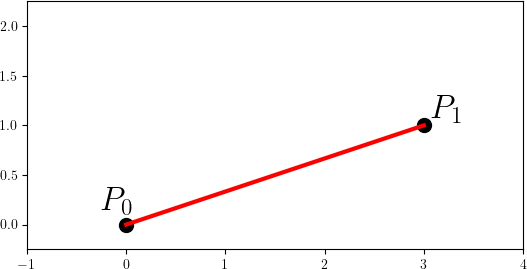


This process is simply [linear interpolation](https://en.wikipedia.org/wiki/Linear_interpolation) between $P_0$ and $P_1$. “Linear” means that $P(t)$ is a polynomial of order 1.

But what if we use a higher-order polynomial? 
For example, we can redefine $P(t)$ as follows:

$$
P(t)= (1-t)^3\ P_0 + 3(1-t)^2 t\ P_1 + 3(1-t) t^2\ P_2 + t^3\ P_3
$$

Here we have four control points $P_0, P_1, P_2, P_3$. Now $P(t)$ is a cubic function of $t$. As $t$ varies from 0 to 1, the point sweeps out a curve, not a straight line. This is the principle of [Bézier curves](https://en.wikipedia.org/wiki/B%C3%A9zier_curve), widely used in [computer-aided design](https://en.wikipedia.org/wiki/Computer-aided_design).

Python implementation and visualization:

??? example "bezier.py"
    ```py linenums="1" hl_lines="8"
    --8<-- "textures/bezier.py"
    ```

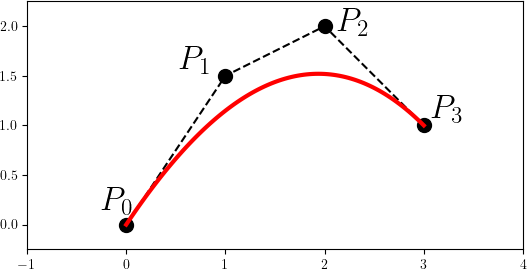

Another way to define the same curve is by specifying endpoint normal vectors instead of adding extra control points:


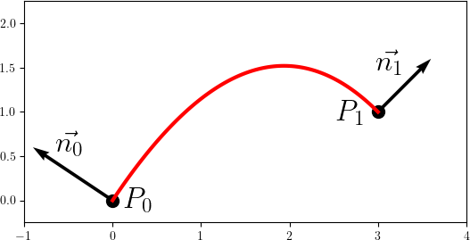

This is known as a [cubic Hermite spline](https://en.wikipedia.org/wiki/Cubic_Hermite_spline) (1). Here is a python code:
{ .annotate }

1. Traditional Hermite interpolation uses tangent vectors instead of normals, but the idea is similar.


??? example "hermite.py"
    ```py linenums="1" hl_lines="8"
    --8<-- "textures/hermite.py"
    ```

Back to our task: it is possible to define curved triangles if, in addition to vertex positions, we specify normal vectors at each vertex:


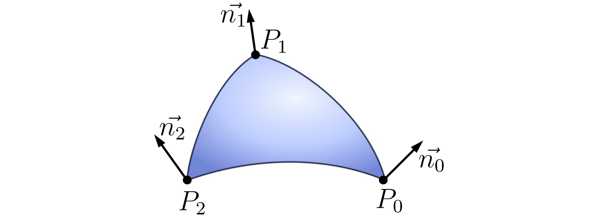


Fortunately, artists already provide this data. Until now, we only considered lines starting with `v ` and `f ` in the [Wavefront OBJ format](https://en.wikipedia.org/wiki/Wavefront_.obj_file). Now, we must also consider `vn ` lines, which define 3D normal vectors:
```
vn 0 1 0
```
This represents a vector aligned with the $y$-axis.
`f ` lines (faces) now include references to both vertex and normal indices:

```
f 6/4/1 3/5/3 7/6/5
```
Here, the first and last numbers of each slash-separated triplet correspond to vertex indices (from `v `) and normal indices (from `vn `). For example, this face uses vertices 6, 3, and 7, with normals 1, 3, and 5. Remember: OBJ indices start from 1, so you must subtract 1 when working with C++ arrays.

We’ll handle the remaining `vt ` texture coordinate lines later.

Parsing `v`, `vn`, and `f` gives us data like this:


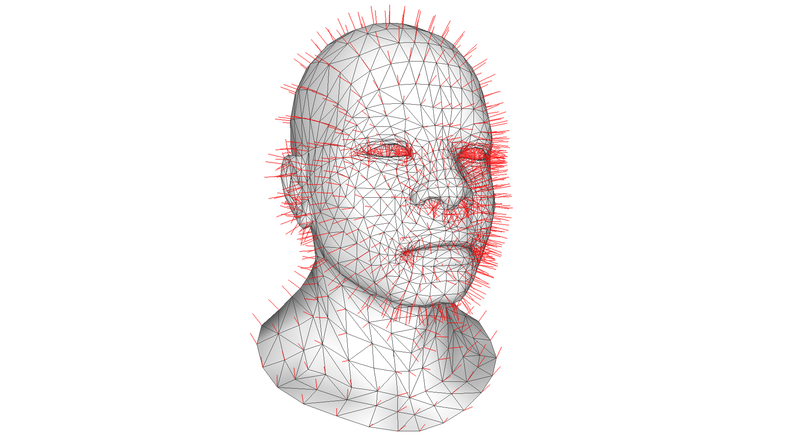

There are vertices connected into triangles, and there are vectors specified per vertex.

### A practical shortcut

While defining true curved geometry is possible, it’s expensive. Instead, let’s “cheat.” During rasterization, each fragment $P$ is already computed as a barycentric interpolation of triangle vertices:

$$
P = \alpha_0 P_0 + \alpha_1 P_1 + \alpha_2 P_2.
$$

Instead of computing the normal as $\vec{n} = \overrightarrow{P_0P_1} \times \overrightarrow{P_0P_2}$, we interpolate the vertex normals:

$$
\vec{n} = \alpha_0 \vec{n_0} + \alpha_1 \vec{n_1} + \alpha_2 \vec{n_2}.
$$

This gives varying shading across the triangle surface:


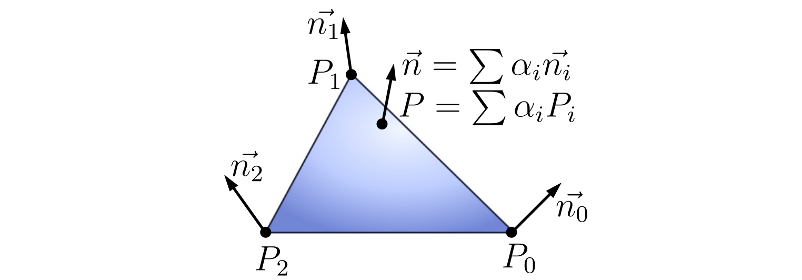

The geometry remains flat, but the varying shading tricks the eye into perceiving smoothness.
Since usually the curvature of the triangles is pretty low, this simple computational hack is enough to produce visually plausible results.

### Homework 1: smooth shading

Parse per-vertex normals and update your shader to use them. The faceted look will disappear, and you’ll obtain smooth surfaces:

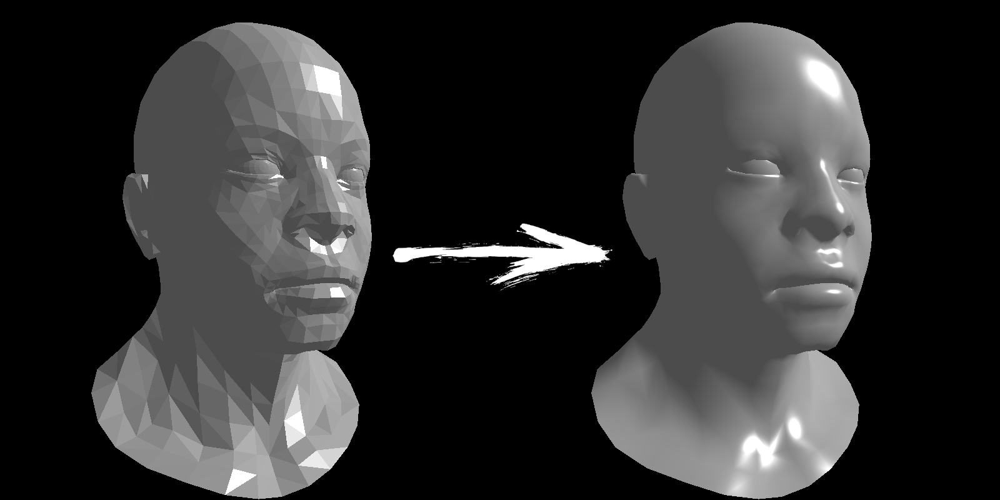


Although the triangles are still flat (noticeable at the silhouette), the shading convinces the eye otherwise. [Here is my implementation](https://github.com/ssloy/tinyrenderer/commit/e42447a9bf2a64f4a33bcb755f9ff54d8787420b) for reference, but try implementing it yourself first.


??? bug "Normal vector transformation caveat"
    If you have implemented the [camera model](camera.md), then the vertices are transformed by the `ModelView` matrix.
    Since normal vectors are also given in the model space, and the shading is done in camera space, we need to transform the normals along with the vertices.
    It is tempting to apply `ModelView` matrix to the normals as well, and it will work most of the time. There is a caveat though.

    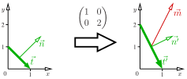

    Imagine we have a 2D scene made of one segment with endpoints (0, 1) and (1, 0).
    Then the tangent vector $\vec t$ can be found as the difference between them:

    $$
        \vec{t} := (1\ 0)^\top - (0\ 1)^\top = (1\ -1)^\top.
    $$
    Vector $\vec{n} := (1\ 1)^\top$ is normal to the segment, since $\vec t \perp \vec n$:

    $$
    \vec{t} \cdot \vec{n} = 1\cdot 1 + (-1)\cdot 1 = 0.
    $$

    I want to transform the geometry by the matrix $M$ defined as follows:

    $$
    M := \begin{pmatrix}1 & 0 \\ 0 & 2\end{pmatrix}.
    $$

    The transformed tangent $\vec{t'}$ is easy to compute:

    $$
    \vec{t'} = M\ \vec t = (1\ -2)^\top.
    $$

    Now let us check the vector $\vec m$ that was obtained as the direct transformation of $\vec n$ by $M$:

    $$
    \vec{m} := M\ \vec n = (1\ 2)^\top.
    $$

    It turns out that $\vec m$ is **not** orthogonal to $\vec{t'}$:

    $$
    \vec{t'}\cdot\vec{m} = 1\cdot 1 + (-2)\cdot 2 \neq 0.
    $$

    In other words, **we do not need to transform normals, we need to compute normals to the transformed geometry.**
    It is easy to do, let us define another vector $\vec{n'}$ as follows:

    $$
    \vec{n'} := (M^{-1})^{\top} \vec{n}
    $$

    We can easily verify that $\vec{n'} \perp \vec{t'}$:

    $$
    \vec{n'} \cdot \vec{t'} = ((M^{-1})^\top \vec{n}) \cdot (M \vec{t}) =  \vec{n} \cdot (M^{-1} M \vec{t}) = \vec n \cdot \vec t = 0.
    $$

    In this line I have used the property of the dot product $(B^\top \vec{a}) \cdot \vec{b} = \vec{a} \cdot (B\vec{b})$.

    Let us verify the reasoning on our example:

    $$
    (M^{-1})^\top = \begin{pmatrix}1 & 0 \\ 0 & \frac12\end{pmatrix},
    $$

    and since the vector $\vec{n'}$ is defined as $\vec{n'} := (M^{-1})^{\top} \vec{n}$, 

    $$
    \vec{n'} = \begin{pmatrix}1 & 0 \\ 0 & \frac12\end{pmatrix} \begin{pmatrix}1 \\ 1\end{pmatrix} = \begin{pmatrix}1 \\ \frac12 \end{pmatrix}.
    $$

    Let us check that $\vec{n'}\perp \vec{t'}$:

    $$
        \vec{n'}\cdot \vec{t'} = 1 \cdot 1 + \frac12 \cdot (-2) = 0.
    $$

    It all check out. To sum up, if a model is transformed by a matrix $M$, we can convert its normal vectors by the matrix $M^{-\top}$.
    You can check [this line of code](https://github.com/ssloy/tinyrenderer/blob/e42447a9bf2a64f4a33bcb755f9ff54d8787420b/main.cpp#L20).

    As I have said, pretty often all this is not necessary, and we can simply transform normals by $M$. If $M$ is orthogonal (for example, it is a simple rotation),
    then $M^{-1} = M^\top$, and therefore $M = M^{-\top}$.
    However, if your `ModelView` matrix contains some shearing or uneven scaling, then you need to correctly transform your normals.


## Textures

By introducing per-vertex normals, we improved shading realism. But can we add even more detail? Yes: by storing additional information in textures.

OBJ files also contain `vt ` lines, which define 2D coordinates (the *UV space*). Each face (`f ` line) links 3D vertices with 2D texture coordinates. Thus, for every triangle, we now have both its 3D geometry and a 2D mapping:

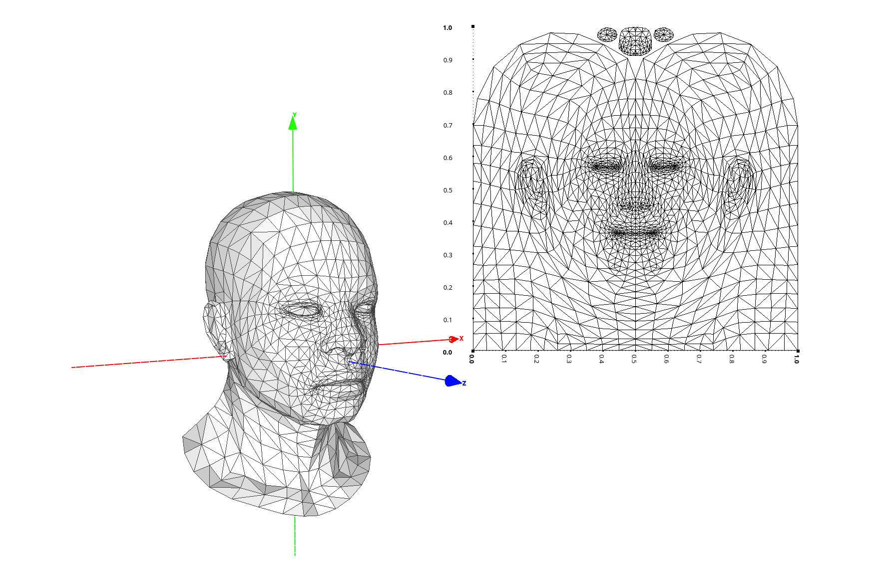

The 2D space is commonly called [the UV space](https://en.wikipedia.org/wiki/UV_mapping).
The idea is to superpose the flattened 2D mesh onto an image.
When we rasterize a triangle with vertices $P_0, P_1, P_2$, for every fragment $P$ we find its barycentric coordinates $\alpha_0, \alpha_1, \alpha_2$ so that
$P = \sum \alpha_i P_i$.
We know that the same triangle has coordinates $U_0, U_1, U_2$ in the UV space, we can therefore compute the UV counterpart $U$ of the fragement $P$:

$$
    U := \alpha_0 U_0 + \alpha_1 U_1 + \alpha_2 U_2.
$$

This process is called [UV mapping](https://en.wikipedia.org/wiki/UV_mapping). Traditionally, it is used to assign fragment colors by sampling an image at $U$:

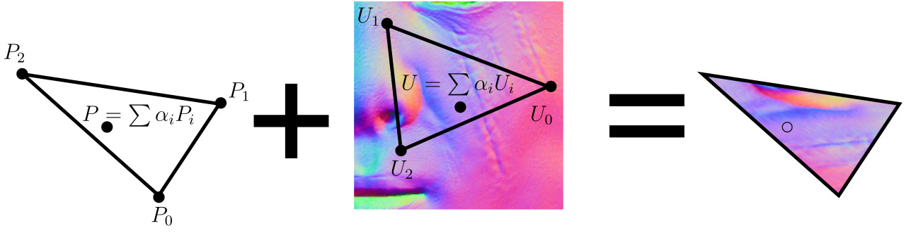

Originally, textures stored only colors. Nowadays, they are used much more generally. For example, since a 3D normal vector has three components and a texture has three channels, we can encode normals inside images — a technique known as normal mapping.

To do this, we remap color channels from  $[0\dots 255]$ into $[-1,1]$ vector components.


<!-- 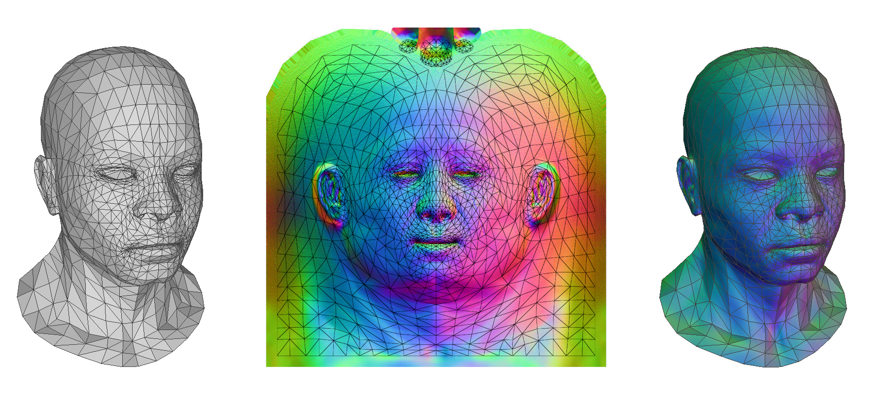 -->

### Homework 2: normal mapping

For each model, I have prepared files with `_nm.tga` suffix (ignore `_nm_tangent.tga` files for a moment).
Sample normals from these maps and use them in shading to create highly detailed surfaces:

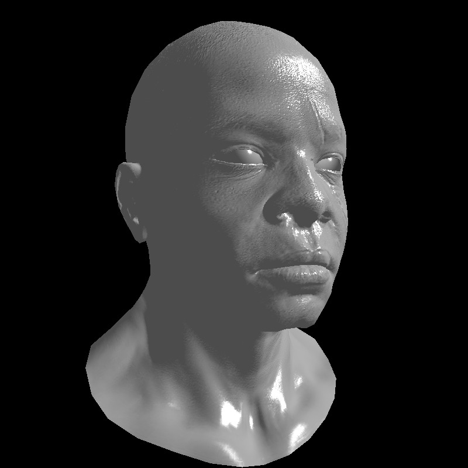

Note that with this approach, we entirely throw away the vertex normals coming from the `vn ` lines in the .obj.
Do not worry, they will be useful for tangent space normal mapping.

!!! bug "Color channel caveat"
    We need to map RGB channels is mapped to $xyz$ coordinates, but recall that `TGAColor` structure encodes the channels in the BGRA order.

For reference, [here is my commit](https://github.com/ssloy/tinyrenderer/commit/f68629a190055e702493bcfa7d7f91427b2be722).

### Homework 3: more textures!

I have ignored colors for as long as I could, but this time it would be unreasonable to avoid them.
You can load colors from the textures with `_diff.tga` suffix.
But there are much more kinds of textures: there are specular textures (`_spec.tga` suffix) that provide the specular intensity weight in the Phong reflection model,
there are incadecence textures (`_glow.tga` suffix), there are [subsurface scattering](https://en.wikipedia.org/wiki/Subsurface_scattering) textures and many, many others that I won't cover in this tutorial.
Here I used diffuse color + specular textures, try to reproduce the image:

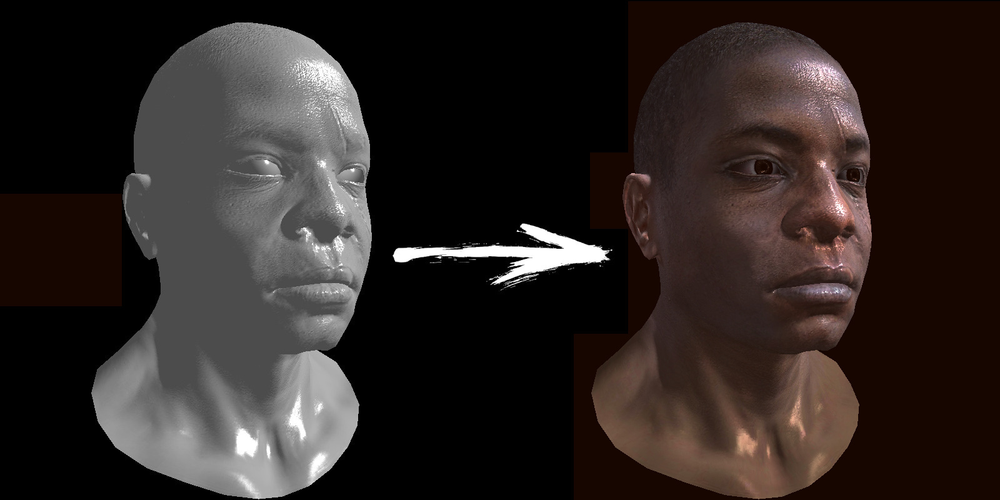

---

That concludes this chapter. With just a bit of additional data (per-vertex normals and few textures) we can dramatically increase realism without fundamentally changing our rendering pipeline.

--8<-- "comments.html"

