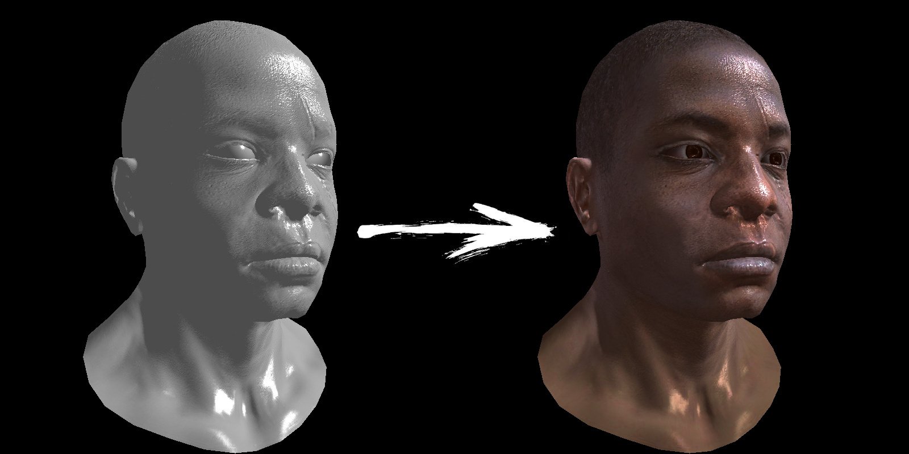

# More data!

Let us continue talking about shading. How can we add more realism to our renders?
I do not want yet to do any additional math, I just want to stop ignoring the data we already have.
So, I stick with the Phong reflection model we [have implemented](textures.md) in the previous chapter.
The goal for today is to make the following progression without really modifying the shader:

[](textures/teaser.jpg)

## Smooth shading

### Curved geometry

In Phong reflection model, if we fix the light direction and the camera, the estimate of light intensity depends only on the normal vector to the surface.
Since last time we have drawn a collection of (flat) triangles, the normal vector is constant per triangle, thus producing a very faceted look.
How can we produce smoother renderings?
The answer is to get more data.
Naively, we could define a really fine mesh, where each triangle would be smaller than a pixel on the screen,
but it is very costly, it would be better to find a cheaper way.

Do you recall the exercise of [drawing straight line segments](bresenham.md)?
Given two points $P_0$ and $P_1$, we can define the point $P(t)$ as follows:

$$
P(t)= (1-t)\ P_0 + t\ P_1
$$

Then we can vary the parameter $t$ between 0 and 1, thus sweeping the segment.
Here is a python implementation for those who want to re-test it:

??? example "straight.py"
    ```py linenums="1" hl_lines="5"
    --8<-- "textures/straight.py"
    ```

And the expected output:


In fact, this approach is nothing else as the [linear interpolation](https://en.wikipedia.org/wiki/Linear_interpolation) between two known points $P_0$ and $P_1$.
The word "linear" means that $P(t)$ is a linear function of $t$, i.e. it is a polynomial of order 1.
But what happens if we increase the order of the interpolating polynomial?
For example, we can redefine $P(t)$ as follows:

$$
P(t)= (1-t)^3\ P_0 + 3(1-t)^2 t\ P_1 + 3(1-t) t^2\ P_2 + t^3\ P_3
$$

Here I have fixed four control points $P_0$, $P_1$, $P_2$ and $P_3$. The point $P(t)$ is a cubic function of the parameter $t$.
Just as before, we can vary the parameter $t$ between 0 and 1, and evaluate $P(t)$ for every $t$.
Here is a python implementation and the corresponding illustration:


??? example "bezier.py"
    ```py linenums="1" hl_lines="8"
    --8<-- "textures/bezier.py"
    ```


Since it is a cubic function, naturally $P(t)$ sweeps a curve and not a straight line segment anymore.
This interpolation approach is known as [Bézier curves](https://en.wikipedia.org/wiki/B%C3%A9zier_curve),
it is a traditional way to define curved geometry, widely used in [computer-aided design](https://en.wikipedia.org/wiki/Computer-aided_design).

Let us check another way to define exactly the same curve.
Instead of adding two more control points, we can specify normal vectors at the endpoints:


Forumated this way, this curve is called [cubic Hermite spline](https://en.wikipedia.org/wiki/Cubic_Hermite_spline) (1).
The exact formulas are not that important for this course, but here you can find the python snippet drawing the curve:
{ .annotate }

1. Traditional Hermite interpolation uses tangent vectors instead of normals, but you get the idea.

??? example "hermite.py"
    ```py linenums="1" hl_lines="8"
    --8<-- "textures/hermite.py"
    ```

Back to the task at hand, it is possible to define curved triangles if in addition to the vertices we specify normal vectors to each vertex:


Fortunately, artists give us the data.
Up until now, we were interested by the lines starting by `v ` and by `f ` in the [wavefront obj](https://en.wikipedia.org/wiki/Wavefront_.obj_file) file format.
Now we will also read lines starting with `vn `.
Lines starting with `vn ` define vectors in 3D space.
Each line contains three numbers representing the $x$, $y$ and $z$ components of a vector.
Example:
```
vn 0 1 0
```
This means there is a vector aligned with $y$ coordinate.

Lines starting with `f ` define faces, which are polygons connecting the vertices and vectors.
Example:
```
f 6/4/1 3/5/3 7/6/5
```
Now we are interested in the first and the last number after each space.
Those are indices of the vertex in the `v ` array that we have read before and of the vector from the `vn ` array.
Thus, this line says that vertices 6, 3 and 7 form a triangle.
The normal vectors at these vertices are given by vectors 1, 3 and 5.
Recall that in .obj files indices start from 1, so we need to decrement these indices when using C++ arrays.
I'll cover the resting `vt ` lines and the correponding index in the `f ` lines a bit later.

If you parse `v `, `vn ` and `f ` lines, the data you get can be visualized as follows:


There are vertices connected into triangles, and there are vectors specified per vertex.

### Cheating

We have all in hand to render curved geometry, but I have promised that we won't do any additional math, and drawing Bézier (Hermite) triangles is not that cheap.
It is doable, but definitely expensive. Let us cheat!
We will leave the rasterization as is, i.e. each fragment $P$ will be a linear interpolation between vertices $P_0, P_1, P_2$ of a triangle:

$$
P = \alpha_0 P_0 + \alpha_1 P_1 + \alpha_2 P_2,
$$

where $\alpha_i$ are the barycentric coordinates of $P$ w.r.t. $P_0, P_1, P_2$.
Now, instead of computing the normal vector as $\vec n:=\overrightarrow{P_0P_1}\times\overrightarrow{P_0P_2}$, we can define it as $\vec n := \alpha_0 \vec{n_0} + \alpha_1 \vec{n_1} + \alpha_2 \vec{n_2}$,
and use this vector to compute the shading:


The triangle won't be curved, but the shading will vary across the triangle. Since usually the curvature of the triangles is pretty low, this simple computational hack is enough to produce visually plausible results.

## Homework 1: smooth shading

I want you to do exactly this. Parse normal vectors, and modify a couple lines in the shader to use those.
Normally, very faceted look will disappear producing nice and smooth surfaces:


Once again, the triangles are still flat (you can see it in the outline), but the shading tricks the eye to believe that the surface is smooth.
[Here is my implementation](https://github.com/ssloy/tinyrenderer/commit/e42447a9bf2a64f4a33bcb755f9ff54d8787420b) for reference, but once again, do not rely on it.
Check it after you have tried to implement yours.

??? bug "Normal vector transformation caveat"
    If you have implemented the [camera model](camera.md), then the vertices are transformed by the `ModelView` matrix.
    Since normal vectors are also given in the model space, and the shading is done in camera space, we need to transform the normals along with the vertices.
    It is tempting to apply `ModelView` matrix to the normals as well, and it will work most of the time. There is a caveat though.

    

    Imagine we have a 2D scene made of one segment with endpoints (0, 1) and (1, 0).
    Then the tangent vector $\vec t$ can be found as the difference between them:

    $$
        \vec{t} := (1\ 0)^\top - (0\ 1)^\top = (1\ -1)^\top.
    $$
    Vector $\vec{n} := (1\ 1)^\top$ is normal to the segment, since $\vec t \perp \vec n$:

    $$
    \vec{t} \cdot \vec{n} = 1\cdot 1 + (-1)\cdot 1 = 0.
    $$

    I want to transform the geometry by the matrix $M$ defined as follows:

    $$
    M := \begin{pmatrix}1 & 0 \\ 0 & 2\end{pmatrix}.
    $$

    The transformed tangent $\vec{t'}$ is easy to compute:

    $$
    \vec{t'} = M\ \vec t = (1\ -2)^\top.
    $$

    Now let us check the vector $\vec m$ that was obtained as the direct transformation of $\vec n$ by $M$:

    $$
    \vec{m} := M\ \vec n = (1\ 2)^\top.
    $$

    It turns out that $\vec m$ is **not** orthogonal to $\vec{t'}$:

    $$
    \vec{t'}\cdot\vec{m} = 1\cdot 1 + (-2)\cdot 2 \neq 0.
    $$

    In other words, **we do not need to transform normals, we need to compute normals to the transformed geometry.**
    It is easy to do, let us define another vector $\vec{n'}$ as follows:

    $$
    \vec{n'} := (M^{-1})^{\top} \vec{n}
    $$

    We can easily verify that $\vec{n'} \perp \vec{t'}$:

    $$
    \vec{n'} \cdot \vec{t'} = ((M^{-1})^\top \vec{n}) \cdot (M \vec{t}) =  \vec{n} \cdot (M^{-1} M \vec{t}) = \vec n \cdot \vec t = 0.
    $$

    In this line I have used the property of the dot product $(B^\top \vec{a}) \cdot \vec{b} = \vec{a} \cdot (B\vec{b})$.

    Let us verify the reasoning on our example:

    $$
    (M^{-1})^\top = \begin{pmatrix}1 & 0 \\ 0 & \frac12\end{pmatrix},
    $$

    and since the vector $\vec{n'}$ is defined as $\vec{n'} := (M^{-1})^{\top} \vec{n}$, 

    $$
    \vec{n'} = \begin{pmatrix}1 & 0 \\ 0 & \frac12\end{pmatrix} \begin{pmatrix}1 \\ 1\end{pmatrix} = \begin{pmatrix}1 \\ \frac12 \end{pmatrix}.
    $$

    Let us check that $\vec{n'}\perp \vec{t'}$:

    $$
        \vec{n'}\cdot \vec{t'} = 1 \cdot 1 + \frac12 \cdot (-2) = 0.
    $$

    It all check out. To sum up, if a model is transformed by a matrix $M$, we can convert its normal vectors by the matrix $M^{-\top}$.
    You can check [this line of code](https://github.com/ssloy/tinyrenderer/blob/e42447a9bf2a64f4a33bcb755f9ff54d8787420b/main.cpp#L20).

    As I have said, pretty often all this is not necessary, and we can simply transform normals by $M$. If $M$ is orthogonal (for example, it is a simple rotation),
    then $M^{-1} = M^top$, and therefore $M = M^{-\top}$.
    However, if your `ModelView` matrix contains some shearing or uneven scaling, then you need to correctly transform your normals.


## Textures

So, by specifying additional data (normal vector per vertex), we were able to improve our renderings.
We can add more details if we find a way to specify more normal vectors.
Fortunately, there is a way to do so.
The idea is to store data in images and not just ASCII files.

Let us attack the last thing we did not parse in the [.obj files](https://en.wikipedia.org/wiki/Wavefront_.obj_file): namely, `vt ` lines.
Just as `v ` lines give us a number of 3D points, `vt ` lines provide a number of 2D points.
Then `f ` lines allow to assemble these 2D and 3D vertices to form triangles.
Therefore, for each triangle we will have its 3D geometry **and** its 2D geometry.
They live in completely separate spaces, but one thing we know for sure: we have a 3D mesh consisting of the same number of triangles as a 2D mesh:


The 2D space is commonly called [the UV space](https://en.wikipedia.org/wiki/UV_mapping).
The idea is to superpose the flattened 2D mesh onto an image.
When we rasterize a triangle with vertices $P_0, P_1, P_2$, for every fragment $P$ we find its barycentric coordinates $\alpha_0, \alpha_1, \alpha_2$ so that
$P = \sum \alpha_i P_i$.
We know that the same triangle has coordinates $U_0, U_1, U_2$ in the UV space, we can therefore compute the UV counterpart $U$ of the fragement $P$:

$$
    U := \alpha_0 U_0 + \alpha_1 U_1 + \alpha_2 U_2.
$$

This techique is called UV mapping.
Traditionally it is used to decide the color of the fragment $P$ by quering the color from some texture at the coordinate $U$:


Once upon a time we used textures to store color information, but nowadays it is much more general.
Normal vectors in 3D space have 3 components, right? A texture in general has three color channels...
We can encode vectors as colors!
It suffices to make a transformation between $[-1, 1]$ and $[0\dots 255]$.


<!--  -->

## Homework 2: normal mapping

For each model, I have prepared files with `_nm.tga` suffix (ignore `_nm_tangent.tga` files for a moment).
Interpret these textures as normal maps, and use these normals to add a lot more details to the renders:


!!! bug "Color channel caveat"
    Recall that `TGAColor` structure encodes the channels in the BGRA order.

For reference, [here is my commit](https://github.com/ssloy/tinyrenderer/commit/f68629a190055e702493bcfa7d7f91427b2be722).

## Homework 3: more textures!

I have ignored colors for as long as I could, but this time it would be unreasonable to avoid them.
You can load colors from the textures with `_diff.tga` suffix.
But there are much more kinds of textures: there are specular textures (`_spec.tga` suffix) that provide the specular intensity weight in the Phong reflection model,
there are incadecence textures (`_glow.tga` suffix), there are [subsurface scattering](https://en.wikipedia.org/wiki/Subsurface_scattering) textures and many, many others that I won't cover in this tutorial.
Here I used diffuse color + specular textures, try to reproduce the image:



--8<-- "comments.html"

