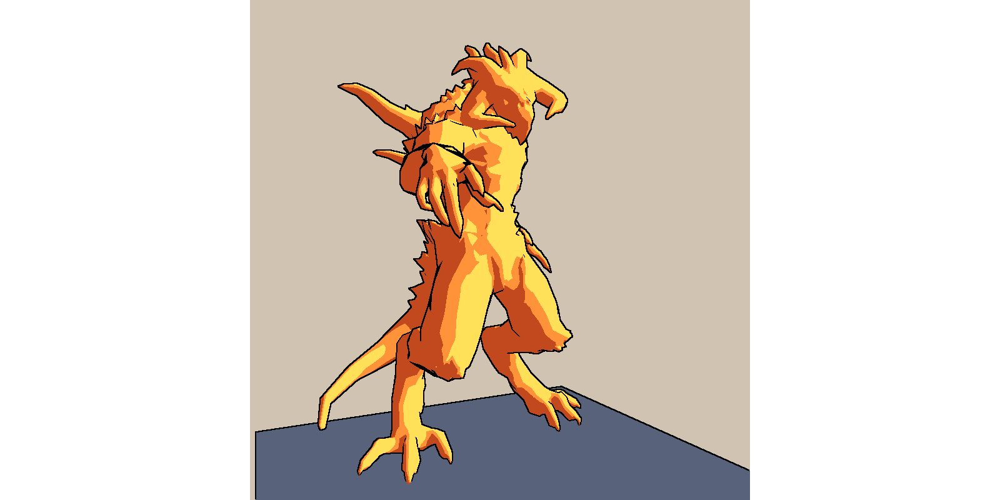
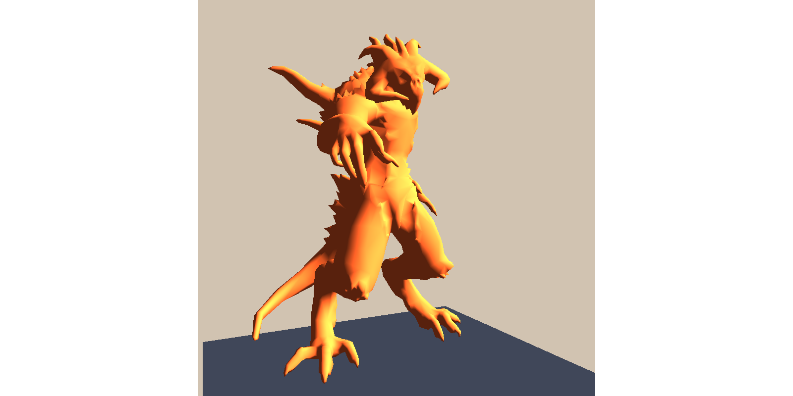
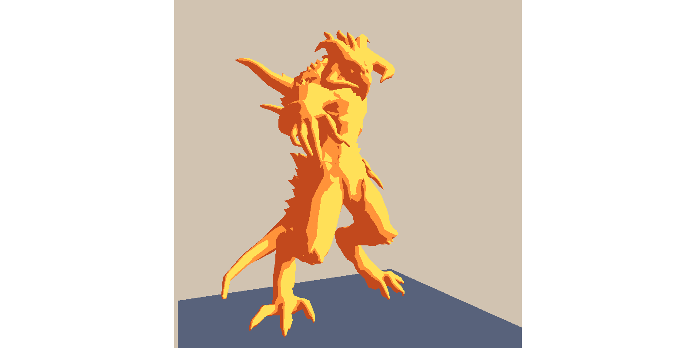
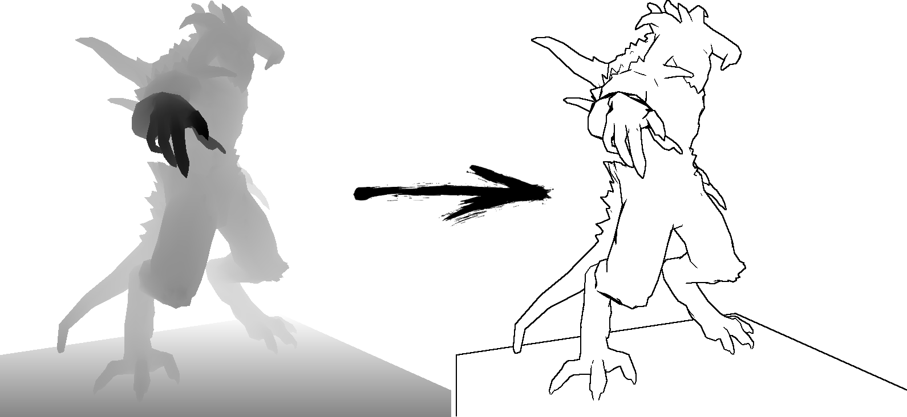
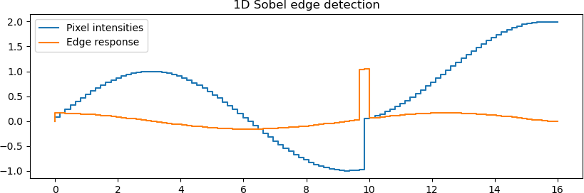
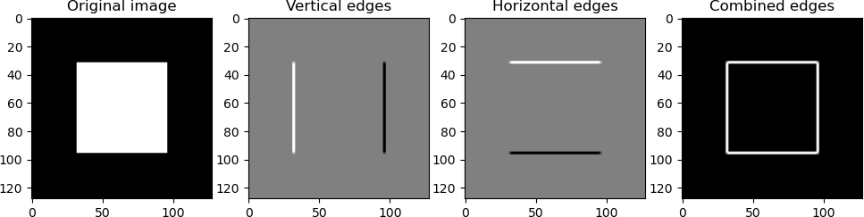

# Bonus: toon shading

## Introduction

In most of computer graphics, the ultimate goal is realism: simulating light and materials in a way that makes synthetic images indistinguishable from photographs.
This pursuit has given us advanced rendering techniques, global illumination models, and physically based shading pipelines.

But realism is not always the end of the story.
Sometimes we want our images to be more expressive, more stylized, or simply more fun.
This is where non-photorealistic rendering (NPR) comes in.
Instead of imitating the real world, NPR techniques borrow inspiration from art, comics, or illustration, emphasizing certain visual qualities while ignoring others.

Toon shading (sometimes called cel shading) is one of the most iconic NPR methods.
It gives 3D models a flat, cartoon-like look, replacing smooth gradients with sharp color regions and emphasizing contours with bold outlines.
The result is an aesthetic closer to hand-drawn animation than to photographic realism.

[](toon/edges.png)


## The idea

The essence of toon shading is to take the familiar tools of smooth shading and deliberately reduce their precision. Instead of aiming for subtle gradients and continuous variations of light, we quantize the result into a handful of discrete tones.

A simple approach works like this:

- **Start with standard lighting.**
    Compute the diffuse lighting just as you would in a traditional Phong or Lambert shading model. At this stage, each point on the surface has a smoothly varying brightness.

    

- **Quantize the intensities.**
    Instead of displaying the raw lighting value, clamp it into a few distinct levels — say three or four. This replaces the soft gradient of light with sharp “bands” of brightness, giving the object its characteristic flat, cartoon-like look.

    

    In my example the quantization is as simple as that:

    ```cpp
        if (intensity>.66) intensity = 1;
        else if (intensity>.33) intensity = .66;
        else intensity = .33;
    ```

- **Add outlines.**
    To reinforce the drawing-like style, we can render black edges around the object.
    A simple technique is to detect silhouettes in the z-buffer: wherever the depth changes abruptly, we draw a dark contour line.
    This gives the impression of inked outlines, similar to what you see in traditional animation or comics.

    

The combination of banded shading and dark silhouettes already produces a convincing toon effect. More advanced variants exist (e.g., controlling band placement, adding hatching textures, or stylizing colors), but this threshold-plus-outline approach captures the core idea in a way that is simple, effective, and fun to implement.

##  Sobel edge detection

This is the final chapter of the course. By now you are fully prepared to compute lighting, but you may still need a bit of help when it comes to detecting edges.
Let us start with a simple 1D example.

### 1D edge detection

Think of a row of pixel intensities taken from a z-buffer image.
In 1D, edge detection is about finding abrupt changes in intensity values. The simplest idea is:


```
    for every pixel in the row:
        look at the left neighbor and the right neighbor
        subtract them
        if the result exceeds some threshold → mark as an edge
```

Here is a small example:

??? example "1D Sobel edge detection"
    ```py linenums="1"
        --8<-- "toon/sobel1d.py"
    ```


In blue, you see a row of 16 pixels sampled from a “z-buffer.” For illustration, it is just a sine wave with a sudden step in the middle.

For each pixel we do the following:

- Multiply the left neighbor by –1
- Ignore the pixel itself
- Multiply the right neighbor by +1
- Add them up → a large value means a jump, a small value means flat

This operation is called a [convolution](https://en.wikipedia.org/wiki/Convolution), applied here with the [Sobel kernel](https://en.wikipedia.org/wiki/Sobel_operator) $[-1, 0, +1]$.
The orange curve shows the edge response: it clearly highlights an edge around pixel 10.


### 2D example

In 2D images the idea is the same, except we now care about changes in both the $x$ and $y$ directions: edges can be horizontal, vertical, or diagonal.

[Irwin Sobel](https://en.wikipedia.org/wiki/Irwin_Sobel) proposed two small $3 \times 3$ convolution kernels.

One emphasizes **horizontal changes** in intensity (detecting vertical edges):

$$
K_x =
\begin{bmatrix}
-1& 0 &+1\\
-2& 0 &+2\\
-1& 0 &+1
\end{bmatrix}
$$

The other emphasizes **vertical changes** (detecting horizontal edges):

$$
K_y =
\begin{bmatrix}
-1& -2 &-1\\
0& 0 &0\\
+1& +2 &+1
\end{bmatrix}
$$

We compute two intermediate edge images by convolving the original image $I$ with these kernels:

$$
\begin{array}{ll}
G_x &= K_x * I\\
G_y &= K_y * I,
\end{array}
$$

where $*$ denotes 2D convolution.
Then, we combine both results to obtain the final edge strength:

$$
    \text{Edge strength} = \sqrt{G_x^2 + G_y^2}.
$$

If this description feels too mathematical, here is a concrete example:

??? example "2D Sobel edge detection"
    ```py linenums="1"
        --8<-- "toon/sobel2d.py"
    ```


The input is a simple $128 \times 128$ image of a solid white square on a black background. The Sobel filter perfectly outlines the square, demonstrating how edges are extracted.

## Homework

Experiment with non-photorealistic rendering (NPR).
By stepping away from strict realism, we gain a deeper understanding of the visual pipeline and discover how even small changes in shading rules can produce strikingly different effects.
My implementation of a toon shader is [available here](https://github.com/ssloy/tinyrenderer/tree/toon).

Exploring NPR is not only enjoyable, it also broadens our perspective as graphics practitioners, and it leaves plenty of room for creativity and invention.

--8<-- "comments.html"

