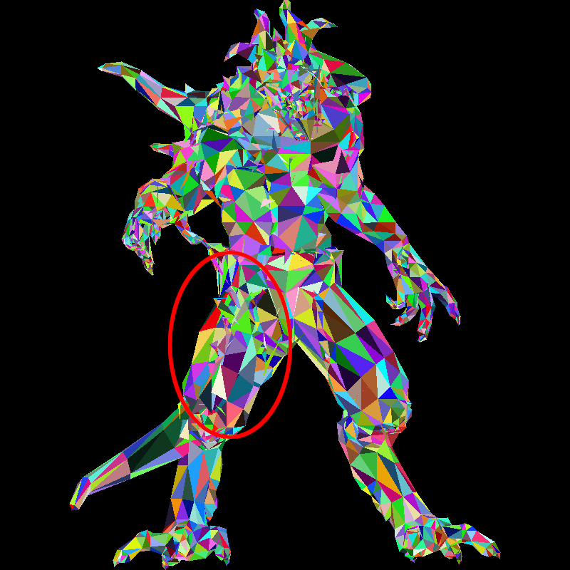
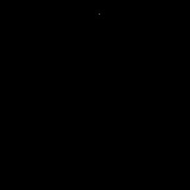
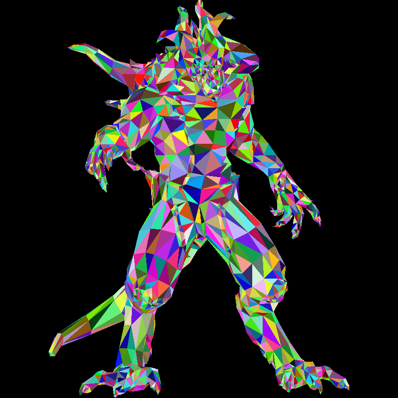
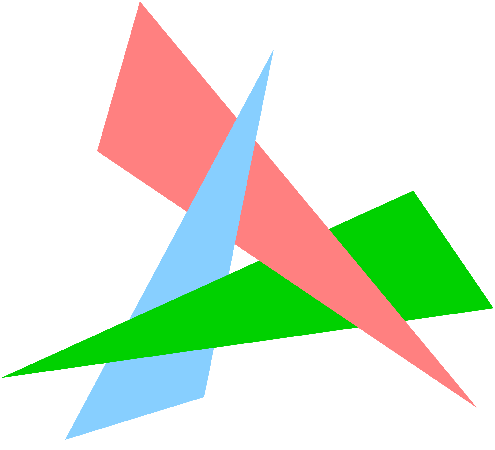
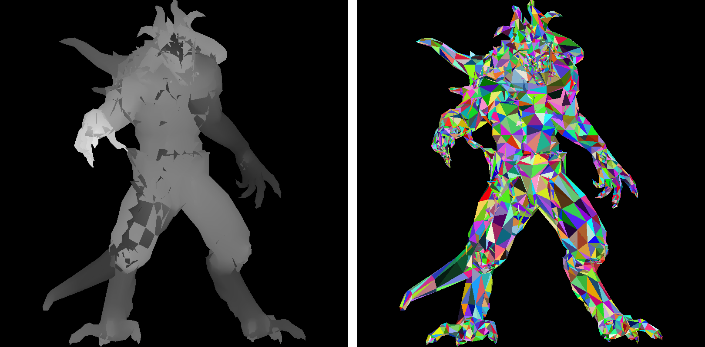
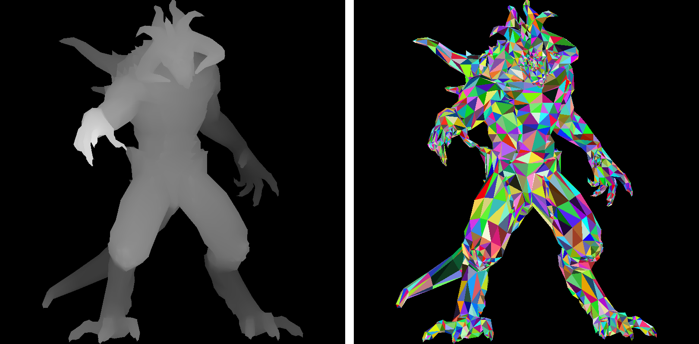

# Hidden faces removal

## Revisit the back-face culling

Let us put aside barycentric coordinates for a moment and return to the [rasterization with back-face culling](rasterization.md#putting-all-together-back-face-culling). Recall that the idea is to loop through all the triangles in the input model and discard the back-facing ones. Check line 2 in the following pseudocode:

```linenums="1" hl_lines="2"
for each triangle t:
    if t is not back-facing:
        for each pixel p that t covers:
            paint the pixel
```

[This commit](https://github.com/ssloy/tinyrenderer/tree/ab559b1325df38266b420c6236a33794bd7e4c65) from the rasterization lesson was used to draw the following image. Unfortunately, the image has some artifacts - check, for example, the right hip of the demon. Clearly, it is a mess:



How can we eliminate all the hidden surfaces?

## Painter's algorithm

In theory, we could simply draw all the triangles without discarding any. If we do it properly in rear-to-front order, the front facets will overwrite the back ones. This technique is called the [painter's algorithm](http://en.wikipedia.org/wiki/Painter%27s_algorithm). Here is the pseudocode:

```linenums="1" hl_lines="1"
sort triangles by depth
for each triangle t:
    for each pixel p that t covers:
        paint the pixel
```

Here is an animation of the process. Note that no triangle was actually discarded; I simply painted them all in the rear-to-front order:



And here is the final render:



To produce this image, I did not modify the rendering part. At the moment, I use an orthogonal projection to the screen, so I simply sorted the triangles by their maximum z-coordinate during the loading of the model. Check lines 35–55 of the [following listing](https://github.com/ssloy/tinyrenderer/commit/52c7f8898e1a71c412f89240d83e4b354a3e76bc).

> **Warning**: Do not spend too much time trying to understand the code. You can just trust that it reorders the triangles by their max z-coordinate. Anyway, this code will eventually end up in the trash bin.

??? example "Sort triangles by maximum depth"
    ```cpp linenums="1" hl_lines="35-55"
    --8<-- "z-buffer/model.cpp"
    ```

Unfortunately, this approach comes with a high computational cost: for each camera movement, we need to re-sort the entire scene. And then there are dynamic scenes... But that is not even the main problem. The key issue is that it is not always possible to determine the correct order. Consider, for example, this scene:



There are ways to circumvent these drawbacks. The problem lies in the fact that triangles are not ideal primitives for global ordering. Instead of handling visibility in a per-triangle manner, it would be better to handle it per pixel.

## Depth interpolation

But first, let us throw away this sorting approach and return to our starting point. We simply iterate through all triangles and paint all the pixels in each triangle. Since the triangles are not correctly sorted, visual artifacts will appear.

In addition to painting pixels in the frame buffer, I propose creating a second grayscale image of the same dimensions. In this image, we will paint the depth of the triangles, just as we did in the [last listing of the barycentric coordinates lesson](barycentric.md#example-2_1). Black pixels will represent distant triangles, and white pixels will represent the closest ones.

Here is the pseudocode:

```linenums="1" hl_lines="3 4"
for each triangle t:
    for each pixel p that t covers:
        compute its depth z
        update the depth buffer with z
        paint the pixel
```

You can find the [complete code here](https://github.com/ssloy/tinyrenderer/commit/af1c138fd86cd9d46813ee492e97127d434a9242). Note that I have removed back-face culling from the pseudocode. However, for consistency in the tutorial's images, I kept it in the code. In the approach we are developing, back-face culling is not mandatory; it can be seen as an optimization.

??? example "Depth interpolation"
    ```cpp linenums="1" hl_lines="29 30 39 50 62"
    --8<-- "z-buffer/main-depth.cpp"
    ```

Check the highlighted lines. This code produces two images, namely `framebuffer.tga` and `zbuffer.tga`. Note line 39: the `project` function now produces a triplet. The depth values are mapped to the range $[0, 255]$ (recall that my input models are normalized to fit in the $[-1, 1]^3$ cube).

Here are the resulting images. Note the discontinuities on the demon’s right hip, matching the mess in the framebuffer:

[](z-buffer/diablo-zbuffer-bad.png)

## Per-pixel painter's algorithm (a.k.a. z-buffer)

Now that we have a depth buffer, a single line will suffice to eliminate all the artifacts - check line 4:

```linenums="1" hl_lines="4"
for each triangle t:
    for each pixel p that t covers:
        compute its depth z
        if depth buffer at p > z:
            update the depth buffer with z
            paint the pixel
```

Our depth buffer allows us to track the depth of each pixel we paint. If, for some triangle `t`, the depth of some pixel `p` is greater than the one we have already painted, we can safely discard it. Otherwise, we paint the pixel and update the depth buffer. So, at the expense of keeping a rather small buffer, we can keep the track of the frontmost surface being drawn.

Here is the update to the previous code - check line 30:

??? example "Z-buffer hidden surfaces removal"
    ```cpp linenums="1" hl_lines="30"
    --8<-- "z-buffer/main-z-buffer.cpp"
    ```

And here is the result. You can see that the demon’s right paw is lighter than the left one, it appears darker since it is behind the demon:

[](z-buffer/diablo-zbuffer.png)

As usual, you can find the complete code [here](https://github.com/ssloy/tinyrenderer/commit/f1dd24ec9418922fcfa3d6e7ab13ffc8c1c18577).
In this second edition of the tutorial, I’ll postpone the shading of the model a bit. First, we will dive into some mathematics necessary for camera handling.

## Homework assignment

Right now there is a very rudimentrary implementation of `vec3` class in the repository:

??? example "Rudimentary vec3 class"
    ```cpp linenums="1"
    --8<-- "z-buffer/geometry.h"
    ```

For the moment `vec3` is only used to store triplets of `double`, but very soon we will need to add and subtract vectors, compute dot products and so on.
So, here is a homework assignment: implement `vec2`, `vec3` and `vec4` classes with basic vector operations.
Moreover, we will need small matrices (up to 4x4 maximum) and basic operations (mainly, multiplication, transposition and inversion).
It is handy to be able to invert any square matrix, but 3x3 inversion may suffice if you do not wish implement a generic inversion.

--8<-- "comments.html"

